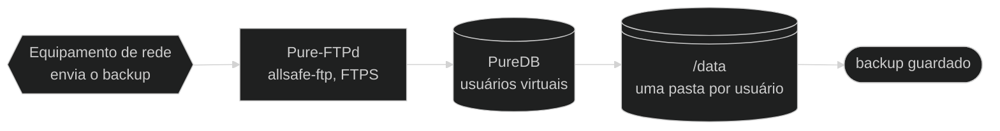
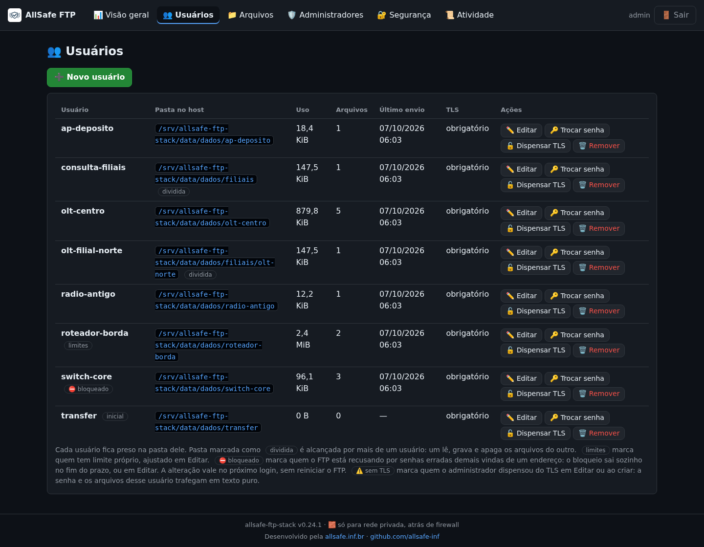
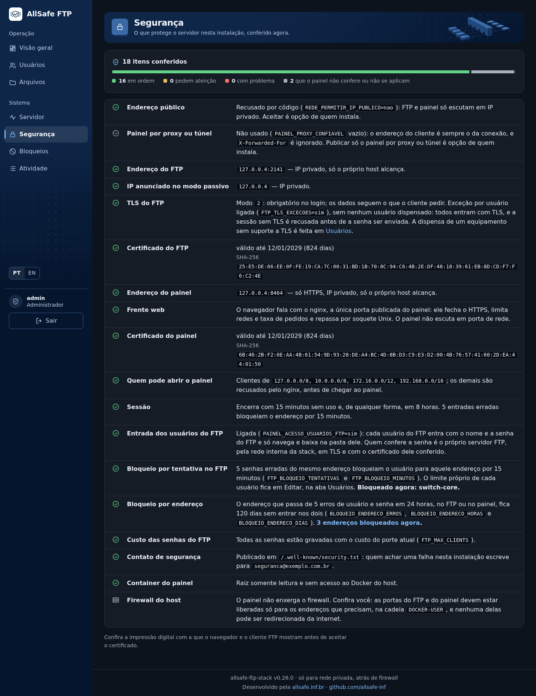
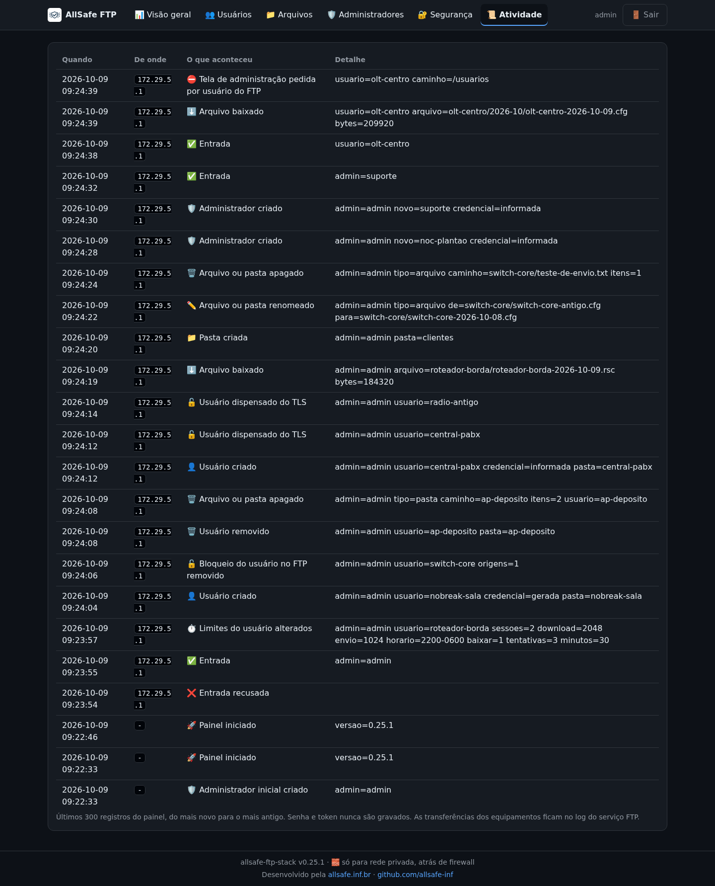

<div align="center">

# 📁 allsafe-ftp-stack

**Servidor FTP dedicado (Pure-FTPd) com FTPS obrigatório por padrão, usuários virtuais, chroot e painel web seguro atrás do nginx, para backup de equipamentos em rede privada.**


<a href="doc/imagens/painel-principal.png"></a>

<sub><b>v0.8.0</b> · painel web, aba Visão geral · captura de 2026-10-04</sub>

<!-- diagrama: doc/diagramas/visao-geral-diagrama.mmd -->


<sub>Nível 1 · Diagrama · [fonte](doc/diagramas/)</sub>

<sub><b>v0.8.2</b> · visão geral da stack · 2026-10-04</sub>

</div>

**Sequência:** Equipamento de rede ➜ Pure-FTPd (`allsafe-ftp`) ➜ PureDB ➜ `/data` ➜ backup guardado

> 🧱 **Uso só em rede privada.** Esta stack é para rede interna: escuta **apenas em IP privado** (`10.0.0.0/8`, `172.16.0.0/12`, `192.168.0.0/16` ou `127.0.0.1`), **atrás de firewall**, e **nunca** deve ser publicada na internet nem receber redirecionamento de porta da borda. Detalhes em [doc/seguranca.md](doc/seguranca.md#rede-privada).

---

<details>
<summary>Sumário — clique para expandir</summary>

[O que é](#o-que-e) · [Destaques](#destaques) · [Imagens](#imagens) · [Instalação rápida](#instalacao) · [Como funciona](#como-funciona) · [Arquitetura](#arquitetura) · [Tecnologias](#tecnologias) · [Portas e binds](#portas) · [Configuração](#configuracao) · [Segurança](#seguranca) · [Testes](#testes) · [Estrutura de arquivos](#arquivos) · [Documentação](#documentacao) · [Plano](#plano) · [Versão](#versao) · [Projetos relacionados](#relacionados) · [Créditos](#creditos)

</details>

---

<a name="o-que-e"></a>

## 💡 O que é

Um servidor de arquivos para onde roteadores, switches, OLTs e outros equipamentos de rede mandam a cópia de segurança da própria configuração. Cada equipamento entra com usuário e senha, só enxerga a própria pasta e, no padrão, só consegue entrar por conexão criptografada. As contas dos equipamentos são criadas pelo navegador, em um **painel web seguro**, ou pela linha de comando.

São **três containers**: o servidor FTP, o painel e o **nginx**, a única porta de entrada do painel. O FTP usa o banco local **PureDB** em vez de PostgreSQL: menos memória, menos superfície de ataque e autenticação sem latência de rede. O painel é pequeno de propósito: uma senha, sem JavaScript, sem acesso ao Docker e sem porta de rede própria; quem fala HTTPS com o navegador é o nginx, que confere a rede de origem e o volume de pedidos antes de repassar. Nos três, o sistema de arquivos raiz é somente leitura, as `capabilities` são mínimas e os segredos ficam fora da imagem e do Git.

| | |
|---|---|
| **Para quê** | Receber por FTPS o backup de configuração de equipamentos de rede |
| **Tecnologias** | Docker Compose · Debian 13 · Pure-FTPd · PureDB · OpenSSL · nginx · Bash · Python |
| **Acesso** | Cliente FTP com **TLS explícito** (`AUTH TLS`) na porta `21/tcp`, modo passivo na faixa do perfil (`30000-30049/tcp` no `small`) · painel em `https://<IP privado>:8443`, pelo nginx |
| **Requisitos** | Docker Engine com Docker Compose v2 ou mais novo · CPU e memória do perfil escolhido (2 vCPU e 2 GB no `small`) · um IP **privado** dedicado · firewall no host liberando só a rede interna |

> **Painel web:** só em rede interna, atrás de firewall, como o resto da stack. Ele recusa por código o endereço que não for privado. Como usar: [doc/painel.md](doc/painel.md).

> ⚠️ **Equipamento antigo sem TLS:** para o equipamento que não tem suporte a TLS existe a opção `FTP_TLS_MODE=0` (ou `1`). Com ela, **senha e arquivos trafegam em texto puro**: use só em rede interna isolada, e a stack avisa disso no `deploy.sh`, no registro do container e no painel. Veja [doc/seguranca.md](doc/seguranca.md#ftp-sem-tls).

---

<a name="destaques"></a>

## ✨ Destaques

| Destaque | Na prática |
|---|---|
| **FTPS explícito obrigatório por padrão** | Sem `AUTH TLS` não há login: usuário e senha não passam em texto puro. O modo sem TLS, para equipamento antigo, é uma escolha explícita e avisada |
| **Usuários virtuais em PureDB** | Não são contas do sistema; cada um fica preso (`chroot`) na própria pasta |
| **Bind local por padrão** | Sobe em `127.0.0.1`; você abre só um IP **privado** dedicado, com firewall no host |
| **Só rede privada** | Feita para rede interna, atrás de firewall; nunca publicada na internet |
| **Painel web seguro** | Cria, troca a senha e remove usuários pelo navegador: só HTTPS, sessão de 15 minutos, bloqueio depois de cinco senhas erradas e registro de cada ação |
| **nginx na frente do painel** | Só o nginx publica a porta do painel: TLS 1.2 e 1.3, lista de redes permitidas, limite de pedidos e de conexões por endereço; o painel fica sem porta de rede |
| **Containers endurecidos** | `read_only`, `cap_drop: ALL`, `no-new-privileges`, limites de CPU, memória e PIDs; o nginx roda sem `root` e sem nenhuma `capability` |
| **Segredos em arquivo** | As senhas ficam em `.secrets/`, nunca na imagem nem no `compose.yaml`; a do painel, só como hash |
| **Logs no `stdout`** | Formato CLF, rotacionados pelo Docker (10 MB × 3) |
| **Cinco perfis de capacidade** | `--size small`, `medium`, `large`, `xlarge` ou `extended` ajusta sessões, faixa passiva e recursos; o `deploy.sh` confere se o servidor tem a CPU e a memória do perfil |

---

<a name="imagens"></a>

## 📸 Imagens

O painel web, aba por aba. A aba Visão geral é a imagem do topo desta página.

| | |
|---|---|
| <a href="doc/imagens/aba-usuarios.png"></a> | <a href="doc/imagens/aba-seguranca.png"></a> |
| **Usuários** — cria, troca a senha e remove a conta de cada equipamento | **Segurança** — confere rede privada, TLS e a impressão digital dos certificados |
| <a href="doc/imagens/aba-atividade.png"></a> | |
| **Atividade** — quem entrou, de onde, e o que foi alterado | |

Todas as telas, menu por menu, com a explicação de cada uma: [fotos da aplicação](doc/aplicacao/README.md).

---

<a name="instalacao"></a>

## 🚀 Instalação rápida

```bash
git clone https://github.com/CarlosSuporteISP/allsafe-ftp-stack.git
cd allsafe-ftp-stack
./deploy.sh        # cria o .env, gera as senhas, sobe o FTP, o painel e o nginx e espera ficarem healthy
```

**Um comando, sem perguntas.** Sem `.env`, o `deploy.sh` cria um a partir do exemplo, com tudo em `127.0.0.1`: só o próprio servidor acessa. Antes de agir ele confere o Docker, o Compose, se o servidor tem a CPU e a memória do perfil e se as portas estão livres. Pode ser rodado quantas vezes for preciso: o que já existe (senhas, dados, containers iguais) fica como está.

<details>
<summary>Senhas geradas e ajuste para a rede interna — clique para expandir</summary>

O `deploy.sh` **gera uma senha forte** em `.secrets/ftp_password.txt` (`0600`) se o arquivo estiver vazio: guarde-a para o cliente FTP. Para usar uma senha própria, grave-a nesse arquivo antes de rodar.

No fim, o script mostra os endereços do FTP e do painel (`Painel: https://<IP>:8443`) e **em que arquivo** está cada senha, sem mostrá-las. A senha inicial do painel está em `.secrets/painel_password.txt`; troque-a depois do primeiro acesso.

Para atender a rede interna, ajuste no `.env` (modelo em [`.env.example`](.env.example)) e rode `./deploy.sh` de novo:

| Variável | Troque para |
|---|---|
| `FTP_BIND_IP` | o IP **privado** do servidor na rede interna (nunca `0.0.0.0` nem IP público) |
| `FTP_PUBLIC_IP` | o IP privado que o equipamento enxerga (normalmente o mesmo) |
| `FTP_CERT_CN` | o hostname (ou IP) que vai no certificado |
| `PAINEL_BIND_IP` | o IP **privado** por onde o painel será aberto; com `127.0.0.1` ele só abre no próprio servidor |

</details>

| Quero | Comando |
|---|---|
| Subir com outro porte | `./deploy.sh --size medium` (ou `large`, `xlarge`, `extended`); o porte fica gravado no `.env` |
| Só validar, sem subir nada | `./deploy.sh --check-only` |
| Atualizar os pacotes das imagens | `./deploy.sh --atualizar` |
| Abrir o painel | `https://<PAINEL_BIND_IP>:8443` no navegador, com a senha de `.secrets/painel_password.txt` |
| Trocar a senha do painel | `./scripts/painel-senha.sh` |
| Criar um usuário | pelo painel, aba `👥 Usuários`, ou `./manage-user.sh add backup-olt` |
| Guardar uma cópia de segurança | `./scripts/backup.sh`; para voltar a ela, `./scripts/restaurar.sh <cópia>` |
| Ver o estado | `docker compose ps` |
| Remover, mantendo os dados | `./deploy.sh --remover` |
| Remover e apagar os dados | `./deploy.sh --remover --apagar-dados` (pede para digitar `apagar`) |

Passo a passo comentado em [doc/instalacao.md](doc/instalacao.md).

---

<a name="como-funciona"></a>

## 🔄 Como funciona

O equipamento conecta na porta `21/tcp`, pede TLS, entra com usuário e senha, fica preso na própria pasta e envia o arquivo pelo modo passivo. O desenho da abertura mostra esse caminho; o fluxograma completo, com as recusas, e o do painel estão nos menus abaixo.

<details>
<summary>Fluxograma completo do FTP, com a sequência escrita — clique para expandir</summary>

<!-- diagrama: doc/diagramas/funcionamento-fluxograma.mmd -->


<sub>Nível 2 · Fluxograma · [fonte](doc/diagramas/)</sub>

| Nº | De ➜ Para | O que acontece |
|---|---|---|
| 1 | Equipamento de rede ➜ Pure-FTPd | O equipamento abre a conexão de controle na porta `21/tcp` do host, entregue ao container em `2121/tcp` |
| 2 | Pure-FTPd ➜ pediu TLS? | No padrão (`FTP_TLS_MODE=2`), o servidor só aceita seguir se o cliente pedir `AUTH TLS`; o certificado `pure-ftpd.pem` é apresentado |
| 3a | pediu TLS? ➜ usuário e senha conferem? | Sim: o cliente envia usuário e senha, já criptografados |
| 3b | pediu TLS? ➜ conexão recusada | Não: no padrão, sessão em texto puro é recusada. Só entra sem TLS quem estiver em uma instalação com `FTP_TLS_MODE=0` ou `1`, opção para [equipamento antigo](doc/seguranca.md#ftp-sem-tls) |
| 4 | usuário e senha conferem? ➜ PureDB | A conta é procurada no banco de usuários virtuais (`/auth/pureftpd.pdb`) |
| 5a | usuário e senha conferem? ➜ sessão em chroot | Sim: a sessão abre presa na pasta do usuário |
| 5b | usuário e senha conferem? ➜ conexão recusada | Não: `530 Login authentication failed` |
| 6 | sessão em chroot ➜ `/data` | O arquivo sobe pelo canal de dados em modo passivo, na faixa do perfil (`30000-30049/tcp` no `small`) |
| 7 | `/data` ➜ backup guardado | O arquivo fica gravado na pasta do usuário, dentro do volume |

**Apoio**

| Quem | Usa | Como |
|---|---|---|
| Pure-FTPd | certificado `pure-ftpd.pem` | apresenta ao cliente na negociação TLS |
| Pure-FTPd | log CLF | grava cada transferência no `stdout` do container |

</details>

### Painel web

Como o nginx e o painel decidem se atendem um pedido, da abertura da página até o usuário pronto no FTP.

<details>
<summary>Fluxograma do painel web, com a sequência escrita — clique para expandir</summary>

<!-- diagrama: doc/diagramas/painel-fluxograma.mmd -->
```mermaid
%%{init: {"theme": "dark"}}%%
flowchart LR
    subgraph QUEM["Quem usa"]
        usuario@{ shape: person, label: "Usuário<br>navegador na rede interna" }
    end
    subgraph FRENTE["Frente web"]
        nginx@{ shape: rect, label: "nginx<br>allsafe-ftp-nginx, HTTPS" }
        rede@{ shape: diam, label: "rede permitida<br>e dentro do limite?" }
    end
    subgraph ENTRADA["Entrada"]
        painel@{ shape: rect, label: "Painel web<br>allsafe-ftp-painel, soquete Unix" }
        senha@{ shape: diam, label: "senha<br>confere?" }
        hash@{ shape: doc, label: "hash da senha<br>painel_password_hash" }
    end
    subgraph SESSAO["Sessão"]
        sessao@{ shape: rect, label: "sessão de 15 min<br>cookie e token CSRF" }
        pedido@{ shape: diam, label: "pedido<br>legítimo?" }
    end
    subgraph USUARIOS["Usuários do FTP"]
        cmd@{ shape: rect, label: "allsafe-ftp-user<br>pure-pw" }
        puredb@{ shape: cyl, label: "PureDB<br>DATA_DIR/auth" }
        auditoria@{ shape: docs, label: "auditoria.log<br>DATA_DIR/painel" }
    end
    subgraph RESULTADO["Resultado"]
        fim@{ shape: stadium, label: "usuário pronto no FTP" }
        recusa@{ shape: stadium, label: "pedido recusado" }
    end

    usuario -- "1 · abre https, TCP 8443" --> nginx
    nginx -- "2 · confere a origem e a taxa de pedidos" --> rede
    rede -- "3a · sim: repassa pelo soquete Unix" --> painel
    rede -- "3b · não: 403 ou 429" --> recusa
    painel -- "4 · pede a senha" --> senha
    senha -. "5 · compara com o hash" .-> hash
    senha -- "6a · sim: abre a sessão" --> sessao
    senha -- "6b · não: 5 erros bloqueiam o endereço" --> recusa
    sessao -- "7 · envia o formulário" --> pedido
    pedido -- "8a · sim: executa" --> cmd
    pedido -- "8b · não: sem token CSRF ou de outra origem" --> recusa
    cmd -- "9 · grava o usuário" --> puredb
    puredb -- "10 · vale no próximo login, sem reiniciar o FTP" --> fim
    painel -. "registra cada ação" .-> auditoria
```

<sub>Nível 2 · Fluxograma · [fonte](doc/diagramas/)</sub>

| Nº | De ➜ Para | O que acontece |
|---|---|---|
| 1 | Usuário ➜ nginx | O navegador abre `https://<endereço>:8443`; só HTTPS, com TLS 1.2 ou 1.3 |
| 2 | nginx ➜ rede permitida e dentro do limite? | O endereço de origem é comparado com `PAINEL_REDES_PERMITIDAS`, e o pedido, com os limites de taxa, de conexões e de tamanho |
| 3a | rede permitida e dentro do limite? ➜ Painel web | Sim: o nginx repassa o pedido pelo soquete Unix, com o endereço do cliente |
| 3b | rede permitida e dentro do limite? ➜ pedido recusado | Não: `403` para rede de fora, `429` para pedidos demais; o painel nem recebe o pedido |
| 4 | Painel web ➜ senha confere? | O painel confere de novo a rede e o nome de host e mostra a tela de entrada |
| 5 | senha confere? ➜ hash da senha | A senha digitada é comparada com o hash `scrypt` de `/run/secrets/painel_password_hash` |
| 6a | senha confere? ➜ sessão | Sim: abre a sessão, com cookie e token CSRF |
| 6b | senha confere? ➜ pedido recusado | Não: `401`; cinco erros em 15 minutos bloqueiam o endereço (`429`) |
| 7 | sessão ➜ pedido legítimo? | Cada formulário enviado traz o token CSRF da sessão e a origem do próprio painel |
| 8a | pedido legítimo? ➜ `allsafe-ftp-user` | Sim: o painel chama o comando, com a senha pela entrada padrão |
| 8b | pedido legítimo? ➜ pedido recusado | Não: `403`, sem alterar nada |
| 9 | `allsafe-ftp-user` ➜ PureDB | A conta é gravada em `DATA_DIR/auth`, com trava para uma alteração por vez |
| 10 | PureDB ➜ usuário pronto no FTP | O FTP lê o banco a cada login: vale na hora, sem reiniciar |

**Apoio**

| Quem | Usa | Como |
|---|---|---|
| senha confere? | hash da senha (`painel_password_hash`) | lê a cada entrada, somente leitura |
| Painel web | `auditoria.log` | registra cada entrada, recusa e alteração |

</details>

---

<a name="arquitetura"></a>

## 🏗️ Arquitetura

Três containers em uma rede própria: `ftp` (Pure-FTPd), `painel` (Python) e `nginx`, a única porta de entrada do painel. Os dados ficam no host, em `DATA_DIR`, e as senhas em `.secrets/`.

<!-- diagrama: doc/diagramas/arquitetura-mapa.mmd -->
```mermaid
%%{init: {"theme": "dark"}}%%
flowchart LR
    subgraph USO["Quem usa"]
        operador@{ shape: person, label: "Usuário<br>opera a stack" }
        equip@{ shape: hex, label: "Equipamento de rede<br>cliente FTP" }
    end
    subgraph HOST["Host"]
        scripts@{ shape: console, label: "deploy.sh<br>manage-user.sh" }
        env@{ shape: doc, label: ".env<br>configuração e limites" }
        segredo@{ shape: doc, label: ".secrets<br>senha do FTP, hash do painel" }
    end
    subgraph CONTAINERS["Containers · rede allsafe-ftp-network"]
        nginx@{ shape: rect, label: "nginx<br>allsafe-ftp-nginx, 8443/tcp" }
        painel@{ shape: rect, label: "Painel web<br>allsafe-ftp-painel, soquete Unix" }
        ftp@{ shape: rect, label: "Pure-FTPd<br>allsafe-ftp, 2121/tcp" }
        logs@{ shape: docs, label: "log CLF<br>stdout" }
    end
    subgraph VOLUMES["Volumes"]
        vnginx@{ shape: lin-cyl, label: "DATA_DIR/nginx<br>/nginx, soquete e cópia do certificado" }
        vpainel@{ shape: lin-cyl, label: "DATA_DIR/painel<br>/painel, certificado e auditoria" }
        vauth@{ shape: cyl, label: "DATA_DIR/auth<br>/auth, PureDB" }
        vcerts@{ shape: lin-cyl, label: "DATA_DIR/certs<br>/etc/ssl/private" }
        vdata@{ shape: lin-cyl, label: "DATA_DIR/dados<br>/data" }
    end
    subgraph RESULTADO["Resultado"]
        fim@{ shape: stadium, label: "backup guardado" }
    end

    operador -- "1 · ./deploy.sh" --> scripts
    scripts -- "2 · docker compose build e up -d --wait" --> ftp
    operador -- "3 · HTTPS, TCP 8443" --> nginx
    nginx -- "4 · repassa pelo soquete Unix" --> painel
    painel -- "5 · cria, troca a senha ou remove o usuário" --> vauth
    equip -- "6 · FTPS, TCP 21 para 2121" --> ftp
    ftp -- "7 · grava o arquivo, faixa passiva do perfil" --> vdata
    vdata -- "8 · arquivo no volume" --> fim
    scripts -. "cria, lê e grava o perfil" .-> env
    ftp -. "lê a senha na subida, só leitura" .-> segredo
    painel -. "lê o hash a cada entrada, só leitura" .-> segredo
    ftp -. "consulta os usuários" .-> vauth
    ftp -. "lê o certificado" .-> vcerts
    painel -. "grava certificado e auditoria" .-> vpainel
    painel -. "cria o soquete e copia o certificado" .-> vnginx
    nginx -. "lê, só leitura" .-> vnginx
    painel -. "cria a pasta do usuário" .-> vdata
    ftp -. "grava cada transferência" .-> logs
```

<sub>Nível 2 · Mapa · [fonte](doc/diagramas/)</sub>

| Nº | De ➜ Para | O que acontece |
|---|---|---|
| 1 | Usuário ➜ `deploy.sh` | O usuário executa `./deploy.sh` no host |
| 2 | `deploy.sh` ➜ Pure-FTPd | O script valida a configuração, constrói as imagens (`docker compose build`), sobe os três containers (`up -d --wait`) e espera ficarem `healthy` |
| 3 | Usuário ➜ nginx | O usuário abre o painel por HTTPS em `8443/tcp`: quem atende é o nginx, que confere a rede de origem e a taxa de pedidos |
| 4 | nginx ➜ Painel web | O pedido aceito é repassado ao painel pelo soquete Unix, com o endereço do cliente |
| 5 | Painel web ➜ `DATA_DIR/auth` | O painel cria, troca a senha ou remove o usuário no PureDB |
| 6 | Equipamento de rede ➜ Pure-FTPd | O cliente conecta por FTPS em `21/tcp`, mapeada para `2121/tcp` |
| 7 | Pure-FTPd ➜ `DATA_DIR/dados` | O arquivo é gravado pelo canal passivo, na faixa do perfil (`30000-30049/tcp` no `small`) |
| 8 | `DATA_DIR/dados` ➜ backup guardado | O arquivo fica na pasta do usuário, no host |

**Apoio**

| Quem | Usa | Como |
|---|---|---|
| `deploy.sh` e `manage-user.sh` | `.env` | cria, lê e grava o perfil |
| Pure-FTPd | `.secrets` (`ftp_password.txt`) | lê a senha na subida, somente leitura |
| Painel web | `.secrets` (`painel_password_hash.txt`) | lê o hash a cada entrada, somente leitura |
| Pure-FTPd | `DATA_DIR/auth` (PureDB) | consulta os usuários |
| Pure-FTPd | `DATA_DIR/certs` | lê o certificado |
| Painel web | `DATA_DIR/painel` | grava o certificado e a auditoria |
| Painel web | `DATA_DIR/nginx` | cria o soquete e copia o certificado, a cada subida |
| nginx | `DATA_DIR/nginx` | lê o soquete e o certificado, somente leitura |
| Painel web | `DATA_DIR/dados` | cria a pasta do usuário |
| Pure-FTPd | log CLF (`stdout`) | grava cada transferência |

<details>
<summary>Peças, portas, pastas, imagens e entrypoints — clique para expandir</summary>

| Peça | Papel | Porta | Dados em |
|---|---|---|---|
| Container `allsafe-ftp` (serviço `ftp`) | Pure-FTPd com FTPS, `chroot` e limites | `21/tcp` ➜ `2121/tcp` e a faixa passiva do perfil (`30000-30049/tcp` no `small`) | — |
| Container `allsafe-ftp-painel` (serviço `painel`) | Painel web que administra os usuários do FTP; atende só o nginx, por soquete Unix | nenhuma | — |
| Container `allsafe-ftp-nginx` (serviço `nginx`) | Frente web do painel: HTTPS, redes permitidas, limite de pedidos e arquivos estáticos | `8443/tcp` ➜ `8443/tcp` | — |
| Pasta `DATA_DIR/auth` | Banco PureDB dos usuários virtuais, dividido pelo FTP e pelo painel | — | `/auth` |
| Pasta `DATA_DIR/dados` | Arquivos enviados, uma pasta por usuário | — | `/data` |
| Pasta `DATA_DIR/certs` | Chave e certificado TLS do FTP (`pure-ftpd.pem`) | — | `/etc/ssl/private` |
| Pasta `DATA_DIR/painel` | Certificado do painel e `auditoria.log` | — | `/painel` |
| Pasta `DATA_DIR/nginx` | Soquete do painel e cópia do certificado, refeitos a cada subida; o nginx só lê | — | `/nginx` |
| Segredo `ftp_password` | Senha do usuário inicial (`.secrets/ftp_password.txt`), somente leitura | — | `/run/secrets/ftp_password` |
| Segredo `painel_password_hash` | Hash da senha do painel (`.secrets/painel_password_hash.txt`), somente leitura | — | `/run/secrets/painel_password_hash` |
| Rede `allsafe-ftp-network` | Bridge dedicada, sub-rede `172.29.1.0/29` | — | — |

- **Imagens:** [`Dockerfile`](Dockerfile) com três alvos sobre o mesmo `debian:trixie-slim` (Debian 13), fixado por digest: `ftp` (`pure-ftpd` e o usuário `ftpdata`, uid e gid **10000**), `painel` (o mesmo, com `python3`) e `nginx` (só `nginx` e `openssl`, com o usuário `frente`, uid e gid **10001**).
- **Entrypoint do FTP:** [`ftp/entrypoint.sh`](ftp/entrypoint.sh) cria ou atualiza o usuário inicial, gera o certificado autoassinado na primeira subida e executa o `pure-ftpd`.
- **Entrypoint do painel:** [`painel/entrypoint.sh`](painel/entrypoint.sh) confere a rede privada, gera o certificado do painel, prepara a pasta do nginx e executa o [`painel/servidor.py`](painel/servidor.py).
- **Entrypoint do nginx:** [`nginx/entrypoint.sh`](nginx/entrypoint.sh) recusa rodar como `root`, confere a rede privada, monta a configuração a partir de [`nginx/nginx.conf.modelo`](nginx/nginx.conf.modelo) e executa o `nginx`, que também entrega os arquivos estáticos de [`web/`](web/).

</details>

Detalhe completo, com o modelo da subida, em [doc/arquitetura.md](doc/arquitetura.md).

---

<a name="tecnologias"></a>

## 🛠️ Tecnologias

Docker Compose, Debian 13, Pure-FTPd, OpenSSL, nginx, Python e Bash, com a versão real conferida no host onde a stack foi validada.

<details>
<summary>Tecnologias, com nome e versão — clique para expandir</summary>

| Tecnologia | Versão | Papel |
|---|---|---|
| Docker Engine | 29.8.2 | Executa os containers (versão do host onde a stack foi validada) |
| Docker Compose | 5.5.1 | Sobe os serviços, os volumes e a rede a partir do [`compose.yaml`](compose.yaml) |
| Debian | 13 (trixie-slim, fixada por digest) | Imagem base |
| Pure-FTPd | 1.0.50 (pacote Debian `1.0.50-2.2`) | Servidor FTP com TLS, `chroot` e usuários virtuais |
| PureDB | embutido no Pure-FTPd 1.0.50 | Banco local dos usuários virtuais |
| OpenSSL | 3.5.7 (série 3.5 do Debian 13) | Gera os certificados autoassinados e fornece o TLS |
| nginx | 1.26.3 (pacote Debian `nginx`) | Frente web do painel: HTTPS, redes permitidas, limite de pedidos e arquivos estáticos |
| Python | 3.13.5 (pacote Debian `python3`) | Painel web, só com a biblioteca padrão |
| tini | 0.19.0 (`docker-init` do Docker Engine) | Processo 1 de cada container (`init: true`) |
| Bash | 5.2 | Scripts do host e dos containers |

</details>

---

<a name="portas"></a>

## 🔌 Portas e binds

FTP em `21/tcp` mais a faixa passiva do perfil; painel em `8443/tcp`, pelo nginx. Tudo em `127.0.0.1` até o `.env` indicar um IP privado.

<details>
<summary>Tabela de portas e binds — clique para expandir</summary>

| Porta (host) | Protocolo | Bind padrão | Para que serve |
|---|---|---|---|
| `${FTP_PORT:-21}` | TCP | `${FTP_BIND_IP:-127.0.0.1}` | canal de controle FTP (mapeada para `:2121` no container) |
| `30000-30049` | TCP | `${FTP_BIND_IP:-127.0.0.1}` | canal de dados em **modo passivo**; faixa do perfil `small` (50 portas = 50 clientes), até `30000-31599` no `extended` |
| `${PAINEL_PORT:-8443}` | TCP | `${PAINEL_BIND_IP:-127.0.0.1}` | painel web, HTTPS; quem publica é o nginx (mapeada para `:8443` no container `allsafe-ftp-nginx`) |

A faixa passiva é 1:1 entre host e container. Ao mudar `FTP_PASSIVE_PORT_*`, alinhe a quantidade de portas ao `FTP_MAX_CLIENTS`. O container do painel não publica porta: fala só com o nginx, por um soquete Unix.

</details>

---

<a name="configuracao"></a>

## ⚙️ Configuração

Toda a configuração vem do `.env`, criado a partir do [`.env.example`](.env.example). O `./deploy.sh --size <perfil>` **grava no `.env`** os valores de `profiles/<perfil>.env` e o nome do perfil em `FTP_PROFILE`, trocando só o dimensionamento (limites de sessão, faixa passiva, CPU, memória, PIDs e `nofile`).

<details>
<summary>Os cinco perfis de capacidade — clique para expandir</summary>

| Perfil | Host de referência | Sessões simultâneas | Quando usar |
|---|---|---|---|
| [`small`](profiles/small.env) | 2 vCPU · 2 GB | ~50 | padrão: cobre a maioria dos provedores |
| [`medium`](profiles/medium.env) | 4 vCPU · 4 GB | ~120 | coleta noturna em lote (~50 a 200 equipamentos) |
| [`large`](profiles/large.env) | 8 vCPU · 8 GB | ~300 | mais de 200 equipamentos ou vários coletores concorrentes |
| [`xlarge`](profiles/xlarge.env) | 16 vCPU · 16 GB | ~600 | operação grande, com várias regiões ou vários coletores no mesmo servidor |
| [`extended`](profiles/extended.env) | 32 vCPU · 32 GB | ~1200 | o maior porte: servidor dedicado, milhares de equipamentos em janelas curtas |

</details>

Cada perfil amplia a faixa passiva junto com `FTP_MAX_CLIENTS`: ajuste o firewall do host ao trocar. O `deploy.sh` recusa o perfil que pede mais CPU ou memória do que o servidor tem. Todas as variáveis em [doc/configuracao.md](doc/configuracao.md); a tabela completa dos perfis em [doc/perfis.md](doc/perfis.md).

---

<a name="seguranca"></a>

## 🔐 Segurança

- **Só rede privada:** IP privado, atrás de firewall, sem redirecionamento de porta da internet. Veja [rede privada e firewall](doc/seguranca.md#rede-privada).
<details>
<summary>Proteções aplicadas, uma a uma — clique para expandir</summary>

- Bind em `127.0.0.1` por padrão: abra só um IP privado dedicado e libere no firewall do host apenas as redes que enviam backup.
- TLS **obrigatório** para entrar no padrão (`FTP_TLS_MODE=2`), `chroot` em todos, sem usuário anônimo, sem DNS reverso.
- **Sem TLS só por escolha:** `FTP_TLS_MODE=0` ou `1` existe para equipamento antigo que não fala TLS. Senha e arquivos passam em texto puro, e a stack avisa disso no `deploy.sh`, no registro do container e no painel. Só em rede interna isolada. Veja [equipamento sem TLS](doc/seguranca.md#ftp-sem-tls).
- `read_only` no sistema de arquivos raiz, `cap_drop: ALL` (só as estritamente necessárias voltam), `no-new-privileges`, limites de CPU, memória, PIDs e `nofile`.
- Senha em `.secrets/ftp_password.txt` (mínimo de 12 caracteres, `0600`), fora da imagem e ignorada pelo Git. Veja [doc/segredos.md](doc/segredos.md).
- nginx na frente do painel: é a única porta publicada, roda sem `root` e sem `capability`, aceita só as redes de `PAINEL_REDES_PERMITIDAS` e limita pedidos e conexões por endereço.
- Painel só por HTTPS e só de rede privada: senha guardada como hash `scrypt`, sessão de 15 minutos, bloqueio depois de cinco senhas erradas, proteção contra CSRF, sem JavaScript, sem acesso ao Docker e com registro de cada ação. Veja [doc/painel.md](doc/painel.md#protecoes).
- Logs rotacionados (`max-size: 10m`, `max-file: 3`).

</details>

Modelo de ameaça e o endurecimento linha a linha em [doc/seguranca.md](doc/seguranca.md).

---

<a name="testes"></a>

## 🧪 Testes

| Quero | Comando | Resultado esperado |
|---|---|---|
| Conferir sintaxe e Compose, sem subir nada | `./scripts/validate.sh` | `painel/servidor.py OK`, `compose OK com <perfil>.env` para os cinco perfis e `Validacao FTP concluida.` |
| Conferir a instalação no ar | `./scripts/validate.sh --runtime` | o mesmo, mais `servico ftp: running, healthy`, igual para `painel` e `nginx`, e o usuário inicial no PureDB |
| Rodar a bateria completa: funcional, segurança e rede | `./tests/testar.sh` | uma linha por caso e, no fim, `Bateria aprovada: nenhum desvio.` |

A bateria sobe uma instância de teste separada, em `127.0.0.2`, e a remove ao terminar: a instalação em uso não é tocada. Os detalhes estão em [Scripts](doc/scripts.md#testar).

---

<a name="arquivos"></a>

## 🗂️ Estrutura de arquivos

Na raiz ficam o `compose.yaml`, o `Dockerfile` e os comandos do dia a dia (`deploy.sh`, `manage-user.sh`). Cada serviço tem a pasta dele, com o que vai dentro da imagem: `ftp/`, `painel/` e `nginx/`; `web/` guarda os arquivos estáticos que o nginx entrega; `scripts/` tem só o que roda no servidor; `tests/` tem a bateria de testes.

<details>
<summary>Arquivo por arquivo — clique para expandir</summary>

| Caminho | O que é |
|---|---|
| [`compose.yaml`](compose.yaml) | Definição dos serviços `ftp`, `painel` e `nginx`, volumes, rede, limites e healthchecks |
| [`Dockerfile`](Dockerfile) | Imagens sobre o Debian 13 slim: alvos `ftp` e `painel`, com Pure-FTPd e o usuário `ftpdata`, e alvo `nginx` |
| [`deploy.sh`](deploy.sh) | Instala, reaplica, atualiza ou remove a stack em um comando |
| [`manage-user.sh`](manage-user.sh) | Atalho do host para `add`, `passwd`, `del` e `list` de usuários |
| [`ftp/entrypoint.sh`](ftp/entrypoint.sh) | Prepara o usuário inicial e o certificado e executa o `pure-ftpd` |
| [`ftp/saude.sh`](ftp/saude.sh) | Healthcheck do FTP: abre a porta de controle e espera a saudação do servidor |
| [`ftp/usuario.sh`](ftp/usuario.sh) | Gestão de usuários **dentro** dos containers (chamado pelo `manage-user.sh` e pelo painel) |
| [`painel/servidor.py`](painel/servidor.py) | Painel web: servidor em Python, só com a biblioteca padrão, atrás do nginx |
| [`painel/entrypoint.sh`](painel/entrypoint.sh) | Confere a rede privada, gera o certificado do painel e executa o servidor |
| [`nginx/nginx.conf.modelo`](nginx/nginx.conf.modelo) | Modelo da configuração do nginx: HTTPS, redes permitidas, limites e repasse ao painel |
| [`nginx/cabecalhos.conf`](nginx/cabecalhos.conf) | Cabeçalhos de segurança das respostas que o próprio nginx dá (páginas de erro e arquivos estáticos) |
| [`nginx/erro/`](nginx/erro/) | Páginas de erro do nginx, em texto |
| [`nginx/entrypoint.sh`](nginx/entrypoint.sh) | Confere a rede privada, monta a configuração e executa o nginx |
| [`nginx/saude.sh`](nginx/saude.sh) | Healthcheck do nginx: pede `/saude` por HTTPS, de ponta a ponta |
| [`web/estilo.css`](web/estilo.css) | Aparência do painel, entregue direto pelo nginx |
| [`scripts/painel-senha.sh`](scripts/painel-senha.sh) | Troca a senha do painel, gravando só o hash |
| [`scripts/rede-privada.sh`](scripts/rede-privada.sh) | Funções que recusam IP e rede que não sejam privados |
| [`scripts/ambiente.sh`](scripts/ambiente.sh) | Função que lê uma chave do `.env` sem executar o arquivo |
| [`scripts/backup.sh`](scripts/backup.sh) | Grava a cópia de segurança dos dados, dos usuários, dos certificados e da auditoria em `BACKUP_DIR` |
| [`scripts/restaurar.sh`](scripts/restaurar.sh) | Devolve a stack ao estado de uma cópia, guardando antes o estado atual |
| [`scripts/validate.sh`](scripts/validate.sh) | Checagem de sintaxe e Compose de todos os perfis e, com `--runtime`, dos três serviços no ar |
| [`tests/testar.sh`](tests/testar.sh) | Bateria de testes funcional, de segurança e de rede, em instância de teste própria |
| [`tests/comum.sh`](tests/comum.sh) | Funções da bateria: registro dos casos, auxiliares de FTP e do painel e gravação dos resultados |
| [`tests/etapas/`](tests/etapas/) | Os casos da bateria, um arquivo por etapa, na ordem do nome |
| [`profiles/`](profiles/) | Perfis de capacidade (`--size small\|medium\|large\|xlarge\|extended`) |
| [`.env.example`](.env.example) | Modelo de configuração, copiado para `.env` |
| `.secrets/` | Senha do usuário inicial e senha do painel (arquivos `.txt` ignorados pelo Git) |
| [`VERSION`](VERSION) | Versão atual, em um lugar só |
| [`CHANGELOG.md`](CHANGELOG.md) | Histórico de mudanças por versão |
| [`doc/`](doc/README.md) | Documentação, diagramas e fotos da aplicação |

</details>

---

<a name="documentacao"></a>

## 📚 Documentação

Índice: [doc/README.md](doc/README.md).

| Guia | Assunto |
|---|---|
| [Instalação](doc/instalacao.md) | Pré-requisitos e passo a passo comentado |
| [Configuração](doc/configuracao.md) | Todas as variáveis do `.env` |
| [Perfis](doc/perfis.md) | Perfis `small`, `medium`, `large`, `xlarge` e `extended`: dimensionamento e faixa passiva |
| [Arquitetura](doc/arquitetura.md) | Containers, entrypoints, volumes e opções do Pure-FTPd |
| [Segurança](doc/seguranca.md) | Rede privada, modo sem TLS para equipamento antigo, modelo de ameaça e endurecimento aplicado |
| [Segredos](doc/segredos.md) | O que fica em `.secrets/` e como trocar |
| [Scripts](doc/scripts.md) | O que cada script faz, parâmetros e saída esperada |
| [Operação](doc/operacao.md) | Usuários, certificado real, logs e atualização |
| [Backup e restauração](doc/backup.md) | Cópia de segurança em um comando, restauração e o que guardar à parte |
| [Painel web](doc/painel.md) | Abrir o painel, abas, usuários, senha, certificado, auditoria e proteções |
| [Fotos da aplicação](doc/aplicacao/README.md) | Todas as telas do painel, menu por menu, com a explicação de cada uma |
| [Solução de problemas](doc/solucao-de-problemas.md) | Erros comuns e como diagnosticar |

---

<a name="plano"></a>

## 🗺️ Plano

O plano de criação e mudança da stack (fases, testes, evidências e progresso) **não é publicado neste repositório**: fica na pasta local `doc/planos/` e em um repositório privado próprio, só do plano.

---

<a name="versao"></a>

## 🏷️ Versão

**0.8.2**, registrada em [`VERSION`](VERSION). Mudanças por versão em [`CHANGELOG.md`](CHANGELOG.md). Cada versão publicada tem uma tag `vX.Y.Z` e uma Release no repositório.

A versão avança a cada publicação: `0.x` é a fase de construção, uma versão por fase do plano; **`1.0.0` é a primeira versão pronta para produção** e abre a linha de longo prazo `1.x`. O que mudou em cada versão está no [`CHANGELOG.md`](CHANGELOG.md).

---

<a name="relacionados"></a>

## 🔗 Projetos relacionados

| Projeto | Relação |
|---|---|
| `allsafe-sftp-stack` · `allsafe-scp-stack` · `allsafe-tftp-stack` | Outros servidores de transferência para backup de equipamentos |
| `allsafe-zabbix-isp-stack` | Monitora os containers desta stack |
| `allsafe-ntp-nts-stack` | Mantém o relógio do host correto, do qual o certificado TLS depende |

---

<a name="creditos"></a>

## 🤝 Créditos

| Quem | Pelo quê | Link |
|---|---|---|
| **Carlos** (@CarlosSuporteISP) | Idealização e direção · projeto inicial, código e Docker (imagem, Compose, scripts e endurecimento), feitos à mão, sem IA | [github.com/CarlosSuporteISP](https://github.com/CarlosSuporteISP) |
| **Claude** (Claude Code, Anthropic) | Evolução do projeto: melhorias, novas funcionalidades, documentação e plano | [claude.com/claude-code](https://claude.com/claude-code) |

<details>
<summary>Projetos oficiais usados — clique para expandir</summary>

| Projeto | Uso aqui | Licença | Origem | Fonte |
|---|---|---|---|---|
| Pure-FTPd | Servidor FTP e banco PureDB | ISC, permissiva no estilo BSD | [pureftpd.org](https://www.pureftpd.org) | [github.com/jedisct1/pure-ftpd](https://github.com/jedisct1/pure-ftpd) |
| Debian | Imagem base `debian:trixie-slim` | Software livre conforme a DFSG; cada pacote mantém a própria licença | [debian.org](https://www.debian.org) | [hub.docker.com/_/debian](https://hub.docker.com/_/debian) |
| OpenSSL | TLS e geração do certificado | Apache-2.0 | [openssl.org](https://www.openssl.org) | [github.com/openssl/openssl](https://github.com/openssl/openssl) |
| Docker Engine | Execução do container | Apache-2.0 | [docs.docker.com/engine](https://docs.docker.com/engine/) | [github.com/moby/moby](https://github.com/moby/moby) |
| Docker Compose | Orquestração do serviço | Apache-2.0 | [docs.docker.com/compose](https://docs.docker.com/compose/) | [github.com/docker/compose](https://github.com/docker/compose) |

</details>

