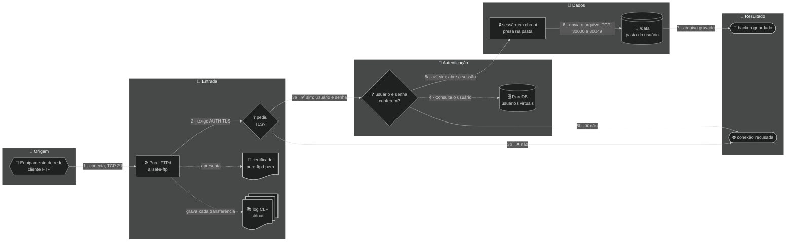

<div align="center">

# 📁 allsafe-ftp-stack

**Servidor FTP dedicado (Pure-FTPd) com FTPS obrigatório, usuários virtuais, chroot e painel web seguro, para backup de equipamentos em rede privada.**


<!-- diagrama: doc/diagramas/visao-geral-diagrama.mmd -->


<sub>📐 Nível 1 · Diagrama · 🔍 aproximar e mover: controles no canto do diagrama · 📁 [fonte](doc/diagramas/)</sub>

<sub><b>v0.4.0</b> · visão geral da stack · 2026-10-04</sub>

</div>

**🧭 Sequência:** 📡 Equipamento de rede ➜ ⚙️ Pure-FTPd (`allsafe-ftp`) ➜ 🗄️ PureDB ➜ 💽 `/data` ➜ 🏁 backup guardado

> 🧱 **Uso só em rede privada.** Esta stack é para rede interna: escuta **apenas em IP privado** (`10.0.0.0/8`, `172.16.0.0/12`, `192.168.0.0/16` ou `127.0.0.1`), **atrás de firewall**, e **nunca** deve ser publicada na internet nem receber redirecionamento de porta da borda. Detalhes em [🔐 doc/seguranca.md](doc/seguranca.md#rede-privada).

---

<details>
<summary>🧭 Sumário — clique para expandir</summary>

[💡 O que é](#o-que-e) · [✨ Destaques](#destaques) · [🚀 Instalação rápida](#instalacao) · [🔄 Como funciona](#como-funciona) · [🏗️ Arquitetura](#arquitetura) · [🛠️ Tecnologias](#tecnologias) · [🔌 Portas e binds](#portas) · [⚙️ Configuração](#configuracao) · [🔐 Segurança](#seguranca) · [🧪 Testes](#testes) · [🗂️ Estrutura de arquivos](#arquivos) · [📚 Documentação](#documentacao) · [🗺️ Plano](#plano) · [🏷️ Versão](#versao) · [🔗 Projetos relacionados](#relacionados) · [🤝 Créditos](#creditos) · [📄 Licença](#licenca)

</details>

---

<a name="o-que-e"></a>

## 💡 O que é

Um servidor de arquivos para onde roteadores, switches, OLTs e outros equipamentos de rede mandam a cópia de segurança da própria configuração. Cada equipamento entra com usuário e senha, só enxerga a própria pasta e só consegue entrar por conexão criptografada. As contas dos equipamentos são criadas pelo navegador, em um **painel web seguro**, ou pela linha de comando.

São **dois containers**: o servidor FTP e o painel. O FTP usa o banco local **PureDB** em vez de PostgreSQL: menos memória, menos superfície de ataque e autenticação sem latência de rede. O painel é pequeno de propósito: só HTTPS, uma senha, sem JavaScript e sem acesso ao Docker. Nos dois, o sistema de arquivos raiz é somente leitura, as `capabilities` são mínimas e os segredos ficam fora da imagem e do Git.

| | |
|---|---|
| 🎯 **Para quê** | Receber por FTPS o backup de configuração de equipamentos de rede |
| 🛠️ **Tecnologias** | Docker Compose · Debian 12 · Pure-FTPd · PureDB · OpenSSL · Bash · Python |
| 🔑 **Acesso** | Cliente FTP com **TLS explícito** (`AUTH TLS`) na porta `21/tcp`, modo passivo `30000-30049/tcp` · painel em `https://<IP privado>:8443` |
| ✅ **Requisitos** | Docker Engine com Docker Compose v2 ou mais novo · um IP **privado** dedicado · firewall no host liberando só a rede interna |

> 🖥️ **Painel web:** só em rede interna, atrás de firewall, como o resto da stack. Ele recusa por código o endereço que não for privado. Como usar: [🖥️ doc/painel.md](doc/painel.md).

> 📸 PENDENTE: capturas reais das telas do painel (uma por aba), a gerar com a instalação definitiva no ar.

---

<a name="destaques"></a>

## ✨ Destaques

| | Destaque | Na prática |
|---|---|---|
| 🔒 | **FTPS explícito obrigatório** | Sem `AUTH TLS` não há login: usuário e senha nunca passam em texto puro |
| 🧍 | **Usuários virtuais em PureDB** | Não são contas do sistema; cada um fica preso (`chroot`) na própria pasta |
| 🚪 | **Bind local por padrão** | Sobe em `127.0.0.1`; você abre só um IP **privado** dedicado, com firewall no host |
| 🧱 | **Só rede privada** | Feita para rede interna, atrás de firewall; nunca publicada na internet |
| 🖥️ | **Painel web seguro** | Cria, troca a senha e remove usuários pelo navegador: só HTTPS, sessão de 15 minutos, bloqueio depois de cinco senhas erradas e registro de cada ação |
| 🛡️ | **Container endurecido** | `read_only`, `cap_drop: ALL`, `no-new-privileges`, limites de CPU, memória e PIDs |
| 🔑 | **Segredos em arquivo** | As senhas ficam em `.secrets/`, nunca na imagem nem no `compose.yaml`; a do painel, só como hash |
| 📜 | **Logs no `stdout`** | Formato CLF, rotacionados pelo Docker (10 MB × 3) |
| 🎚️ | **Perfis de capacidade** | `--size small`, `medium` ou `large` ajusta sessões, faixa passiva e recursos |

---

<a name="instalacao"></a>

## 🚀 Instalação rápida

```bash
git clone https://github.com/CarlosSuporteISP/allsafe-ftp-stack.git
cd allsafe-ftp-stack
./deploy.sh        # cria o .env, gera as senhas, sobe o FTP e o painel e espera ficarem healthy
```

**Um comando, sem perguntas.** Sem `.env`, o `deploy.sh` cria um a partir do exemplo, com tudo em `127.0.0.1`: só o próprio servidor acessa. Antes de agir ele confere o Docker, o Compose e se as portas estão livres. Pode ser rodado quantas vezes for preciso: o que já existe (senhas, dados, containers iguais) fica como está.

O `deploy.sh` **gera uma senha forte** em `.secrets/ftp_password.txt` (`0600`) se o arquivo estiver vazio: guarde-a para o cliente FTP. Para usar uma senha própria, grave-a nesse arquivo antes de rodar.

No fim, o script mostra os endereços do FTP e do painel (`Painel: https://<IP>:8443`) e **em que arquivo** está cada senha, sem mostrá-las. A senha inicial do painel está em `.secrets/painel_password.txt`; troque-a depois do primeiro acesso.

Para atender a rede interna, ajuste no `.env` (modelo em [`.env.example`](.env.example)) e rode `./deploy.sh` de novo:

| Variável | Troque para |
|---|---|
| `FTP_BIND_IP` | o IP **privado** do servidor na rede interna (nunca `0.0.0.0` nem IP público) |
| `FTP_PUBLIC_IP` | o IP privado que o equipamento enxerga (normalmente o mesmo) |
| `FTP_CERT_CN` | o hostname (ou IP) que vai no certificado |
| `PAINEL_BIND_IP` | o IP **privado** por onde o painel será aberto; com `127.0.0.1` ele só abre no próprio servidor |

| Quero | Comando |
|---|---|
| Subir com outro porte | `./deploy.sh --size medium` (ou `large`); o porte fica gravado no `.env` |
| Só validar, sem subir nada | `./deploy.sh --check-only` |
| Atualizar os pacotes das imagens | `./deploy.sh --atualizar` |
| Abrir o painel | `https://<PAINEL_BIND_IP>:8443` no navegador, com a senha de `.secrets/painel_password.txt` |
| Trocar a senha do painel | `./scripts/painel-senha.sh` |
| Criar um usuário | pelo painel, aba `👥 Usuários`, ou `./manage-user.sh add backup-olt` |
| Ver o estado | `docker compose ps` |
| Remover, mantendo os dados | `./deploy.sh --remover` |
| Remover e apagar os dados | `./deploy.sh --remover --apagar-dados` (pede para digitar `apagar`) |

Passo a passo comentado em [🚀 doc/instalacao.md](doc/instalacao.md).

---

<a name="como-funciona"></a>

## 🔄 Como funciona

<!-- diagrama: doc/diagramas/funcionamento-fluxograma.mmd -->


<sub>📐 Nível 2 · Fluxograma · 🔍 aproximar e mover: controles no canto do diagrama · 📁 [fonte](doc/diagramas/)</sub>

| Nº | De ➜ Para | O que acontece |
|---|---|---|
| 1 | 📡 Equipamento de rede ➜ ⚙️ Pure-FTPd | O equipamento abre a conexão de controle na porta `21/tcp` do host, entregue ao container em `2121/tcp` |
| 2 | ⚙️ Pure-FTPd ➜ ❓ pediu TLS? | O servidor só aceita seguir se o cliente pedir `AUTH TLS`; o certificado `pure-ftpd.pem` é apresentado |
| 3a | ❓ pediu TLS? ➜ ❓ usuário e senha conferem? | ✅ Sim: o cliente envia usuário e senha, já criptografados |
| 3b | ❓ pediu TLS? ➜ ⛔ conexão recusada | ❌ Não: sessão em texto puro é recusada |
| 4 | ❓ usuário e senha conferem? ➜ 🗄️ PureDB | A conta é procurada no banco de usuários virtuais (`/auth/pureftpd.pdb`) |
| 5a | ❓ usuário e senha conferem? ➜ 🔒 sessão em chroot | ✅ Sim: a sessão abre presa na pasta do usuário |
| 5b | ❓ usuário e senha conferem? ➜ ⛔ conexão recusada | ❌ Não: `530 Login authentication failed` |
| 6 | 🔒 sessão em chroot ➜ 💽 `/data` | O arquivo sobe pelo canal de dados em modo passivo, portas `30000-30049/tcp` |
| 7 | 💽 `/data` ➜ 🏁 backup guardado | O arquivo fica gravado na pasta do usuário, dentro do volume |

**🧷 Apoio**

| Quem | Usa | Como |
|---|---|---|
| ⚙️ Pure-FTPd | 📄 certificado `pure-ftpd.pem` | apresenta ao cliente na negociação TLS |
| ⚙️ Pure-FTPd | 📚 log CLF | grava cada transferência no `stdout` do container |

### 🖥️ Painel web

Como o painel decide se atende um pedido, da abertura da página até o usuário pronto no FTP.

<!-- diagrama: doc/diagramas/painel-fluxograma.mmd -->
```mermaid
%%{init: {"theme": "dark"}}%%
flowchart LR
    subgraph QUEM["👤 Quem usa"]
        usuario@{ shape: person, label: "👤 Usuário<br>navegador na rede interna" }
    end
    subgraph ENTRADA["🚪 Entrada"]
        painel@{ shape: rect, label: "🖥️ Painel web<br>allsafe-ftp-painel, HTTPS" }
        rede@{ shape: diam, label: "❓ rede<br>permitida?" }
        senha@{ shape: diam, label: "❓ senha<br>confere?" }
        hash@{ shape: doc, label: "🔑 hash da senha<br>painel_password_hash" }
    end
    subgraph SESSAO["🔒 Sessão"]
        sessao@{ shape: rect, label: "🔒 sessão de 15 min<br>cookie e token CSRF" }
        pedido@{ shape: diam, label: "❓ pedido<br>legítimo?" }
    end
    subgraph USUARIOS["👥 Usuários do FTP"]
        cmd@{ shape: rect, label: "⚙️ allsafe-ftp-user<br>pure-pw" }
        puredb@{ shape: cyl, label: "🗄️ PureDB<br>DATA_DIR/auth" }
        auditoria@{ shape: docs, label: "📚 auditoria.log<br>DATA_DIR/painel" }
    end
    subgraph RESULTADO["🏁 Resultado"]
        fim@{ shape: stadium, label: "🏁 usuário pronto no FTP" }
        recusa@{ shape: stadium, label: "⛔ pedido recusado" }
    end

    usuario -- "1 · abre https, TCP 8443" --> painel
    painel -- "2 · confere o endereço de origem" --> rede
    rede -- "3a · ✅ sim: pede a senha" --> senha
    rede -- "3b · ❌ não" --> recusa
    senha -. "4 · compara com o hash" .-> hash
    senha -- "5a · ✅ sim: abre a sessão" --> sessao
    senha -- "5b · ❌ não: 5 erros bloqueiam o endereço" --> recusa
    sessao -- "6 · envia o formulário" --> pedido
    pedido -- "7a · ✅ sim: executa" --> cmd
    pedido -- "7b · ❌ não: sem token CSRF ou de outra origem" --> recusa
    cmd -- "8 · grava o usuário" --> puredb
    puredb -- "9 · vale no próximo login, sem reiniciar o FTP" --> fim
    painel -. "registra cada ação" .-> auditoria
```

<sub>📐 Nível 2 · Fluxograma · 🔍 aproximar e mover: controles no canto do diagrama · 📁 [fonte](doc/diagramas/)</sub>

| Nº | De ➜ Para | O que acontece |
|---|---|---|
| 1 | 👤 Usuário ➜ 🖥️ Painel web | O navegador abre `https://<endereço>:8443`; só HTTPS, com TLS 1.2 ou mais novo |
| 2 | 🖥️ Painel web ➜ ❓ rede permitida? | O endereço de origem é comparado com `PAINEL_REDES_PERMITIDAS` |
| 3a | ❓ rede permitida? ➜ ❓ senha confere? | ✅ Sim: aparece a tela de entrada |
| 3b | ❓ rede permitida? ➜ ⛔ pedido recusado | ❌ Não: `403`, sem mostrar tela nenhuma |
| 4 | ❓ senha confere? ➜ 🔑 hash da senha | A senha digitada é comparada com o hash `scrypt` de `/run/secrets/painel_password_hash` |
| 5a | ❓ senha confere? ➜ 🔒 sessão | ✅ Sim: abre a sessão, com cookie e token CSRF |
| 5b | ❓ senha confere? ➜ ⛔ pedido recusado | ❌ Não: `401`; cinco erros em 15 minutos bloqueiam o endereço (`429`) |
| 6 | 🔒 sessão ➜ ❓ pedido legítimo? | Cada formulário enviado traz o token CSRF da sessão e a origem do próprio painel |
| 7a | ❓ pedido legítimo? ➜ ⚙️ `allsafe-ftp-user` | ✅ Sim: o painel chama o comando, com a senha pela entrada padrão |
| 7b | ❓ pedido legítimo? ➜ ⛔ pedido recusado | ❌ Não: `403`, sem alterar nada |
| 8 | ⚙️ `allsafe-ftp-user` ➜ 🗄️ PureDB | A conta é gravada em `DATA_DIR/auth`, com trava para uma alteração por vez |
| 9 | 🗄️ PureDB ➜ 🏁 usuário pronto no FTP | O FTP lê o banco a cada login: vale na hora, sem reiniciar |

**🧷 Apoio**

| Quem | Usa | Como |
|---|---|---|
| ❓ senha confere? | 🔑 hash da senha (`painel_password_hash`) | lê a cada entrada, somente leitura |
| 🖥️ Painel web | 📚 `auditoria.log` | registra cada entrada, recusa e alteração |

---

<a name="arquitetura"></a>

## 🏗️ Arquitetura

<!-- diagrama: doc/diagramas/arquitetura-mapa.mmd -->
```mermaid
%%{init: {"theme": "dark"}}%%
flowchart LR
    subgraph USO["👤 Quem usa"]
        operador@{ shape: person, label: "👤 Usuário<br>opera a stack" }
        equip@{ shape: hex, label: "📡 Equipamento de rede<br>cliente FTP" }
    end
    subgraph HOST["🖥️ Host"]
        scripts@{ shape: console, label: "⌨️ deploy.sh<br>manage-user.sh" }
        env@{ shape: doc, label: "📄 .env<br>configuração e limites" }
        segredo@{ shape: doc, label: "🔑 .secrets<br>senha do FTP, hash do painel" }
    end
    subgraph CONTAINERS["🐳 Containers · rede allsafe-ftp-network"]
        painel@{ shape: rect, label: "🖥️ Painel web<br>allsafe-ftp-painel, 8443/tcp" }
        ftp@{ shape: rect, label: "⚙️ Pure-FTPd<br>allsafe-ftp, 2121/tcp" }
        logs@{ shape: docs, label: "📚 log CLF<br>stdout" }
    end
    subgraph VOLUMES["💽 Volumes"]
        vpainel@{ shape: lin-cyl, label: "💽 DATA_DIR/painel<br>/painel, certificado e auditoria" }
        vauth@{ shape: cyl, label: "🗄️ DATA_DIR/auth<br>/auth, PureDB" }
        vcerts@{ shape: lin-cyl, label: "💽 DATA_DIR/certs<br>/etc/ssl/private" }
        vdata@{ shape: lin-cyl, label: "💽 DATA_DIR/dados<br>/data" }
    end
    subgraph RESULTADO["🏁 Resultado"]
        fim@{ shape: stadium, label: "🏁 backup guardado" }
    end

    operador -- "1 · ./deploy.sh" --> scripts
    scripts -- "2 · docker compose build e up -d --wait" --> ftp
    operador -- "3 · HTTPS, TCP 8443" --> painel
    painel -- "4 · cria, troca a senha ou remove o usuário" --> vauth
    equip -- "5 · FTPS, TCP 21 para 2121" --> ftp
    ftp -- "6 · grava o arquivo, passivo 30000 a 30049" --> vdata
    vdata -- "7 · arquivo no volume" --> fim
    scripts -. "cria, lê e grava o perfil" .-> env
    ftp -. "lê a senha na subida, só leitura" .-> segredo
    painel -. "lê o hash a cada entrada, só leitura" .-> segredo
    ftp -. "consulta os usuários" .-> vauth
    ftp -. "lê o certificado" .-> vcerts
    painel -. "grava certificado e auditoria" .-> vpainel
    painel -. "cria a pasta do usuário" .-> vdata
    ftp -. "grava cada transferência" .-> logs
```

<sub>📐 Nível 2 · Mapa · 🔍 aproximar e mover: controles no canto do diagrama · 📁 [fonte](doc/diagramas/)</sub>

| Nº | De ➜ Para | O que acontece |
|---|---|---|
| 1 | 👤 Usuário ➜ ⌨️ `deploy.sh` | O usuário executa `./deploy.sh` no host |
| 2 | ⌨️ `deploy.sh` ➜ ⚙️ Pure-FTPd | O script valida a configuração, constrói as imagens (`docker compose build`), sobe os dois containers (`up -d --wait`) e espera ficarem `healthy` |
| 3 | 👤 Usuário ➜ 🖥️ Painel web | O usuário abre o painel por HTTPS em `8443/tcp` |
| 4 | 🖥️ Painel web ➜ 🗄️ `DATA_DIR/auth` | O painel cria, troca a senha ou remove o usuário no PureDB |
| 5 | 📡 Equipamento de rede ➜ ⚙️ Pure-FTPd | O cliente conecta por FTPS em `21/tcp`, mapeada para `2121/tcp` |
| 6 | ⚙️ Pure-FTPd ➜ 💽 `DATA_DIR/dados` | O arquivo é gravado pelo canal passivo `30000-30049/tcp` |
| 7 | 💽 `DATA_DIR/dados` ➜ 🏁 backup guardado | O arquivo fica na pasta do usuário, no host |

**🧷 Apoio**

| Quem | Usa | Como |
|---|---|---|
| ⌨️ `deploy.sh` e `manage-user.sh` | 📄 `.env` | cria, lê e grava o perfil |
| ⚙️ Pure-FTPd | 🔑 `.secrets` (`ftp_password.txt`) | lê a senha na subida, somente leitura |
| 🖥️ Painel web | 🔑 `.secrets` (`painel_password_hash.txt`) | lê o hash a cada entrada, somente leitura |
| ⚙️ Pure-FTPd | 🗄️ `DATA_DIR/auth` (PureDB) | consulta os usuários |
| ⚙️ Pure-FTPd | 💽 `DATA_DIR/certs` | lê o certificado |
| 🖥️ Painel web | 💽 `DATA_DIR/painel` | grava o certificado e a auditoria |
| 🖥️ Painel web | 💽 `DATA_DIR/dados` | cria a pasta do usuário |
| ⚙️ Pure-FTPd | 📚 log CLF (`stdout`) | grava cada transferência |

| Peça | Papel | Porta | Dados em |
|---|---|---|---|
| ⚙️ Container `allsafe-ftp` (serviço `ftp`) | Pure-FTPd com FTPS, `chroot` e limites | `21/tcp` ➜ `2121/tcp` e `30000-30049/tcp` | — |
| 🖥️ Container `allsafe-ftp-painel` (serviço `painel`) | Painel web em HTTPS que administra os usuários do FTP | `8443/tcp` ➜ `8443/tcp` | — |
| 🗄️ Pasta `DATA_DIR/auth` | Banco PureDB dos usuários virtuais, dividido pelos dois containers | — | `/auth` |
| 💽 Pasta `DATA_DIR/dados` | Arquivos enviados, uma pasta por usuário | — | `/data` |
| 💽 Pasta `DATA_DIR/certs` | Chave e certificado TLS do FTP (`pure-ftpd.pem`) | — | `/etc/ssl/private` |
| 💽 Pasta `DATA_DIR/painel` | Certificado do painel e `auditoria.log` | — | `/painel` |
| 🔑 Segredo `ftp_password` | Senha do usuário inicial (`.secrets/ftp_password.txt`), somente leitura | — | `/run/secrets/ftp_password` |
| 🔑 Segredo `painel_password_hash` | Hash da senha do painel (`.secrets/painel_password_hash.txt`), somente leitura | — | `/run/secrets/painel_password_hash` |
| 🌐 Rede `allsafe-ftp-network` | Bridge dedicada, sub-rede `172.29.1.0/29` | — | — |

- **Imagens:** [`Dockerfile`](Dockerfile) com uma base (`debian:bookworm-slim` fixada por digest, `pure-ftpd` e o usuário `ftpdata`, uid e gid **10000**) e dois alvos: `ftp` e `painel`, este com `python3`.
- **Entrypoint do FTP:** [`scripts/entrypoint.sh`](scripts/entrypoint.sh) cria ou atualiza o usuário inicial, gera o certificado autoassinado na primeira subida e executa o `pure-ftpd`.
- **Entrypoint do painel:** [`scripts/painel-entrypoint.sh`](scripts/painel-entrypoint.sh) confere a rede privada, gera o certificado do painel e executa o [`painel/servidor.py`](painel/servidor.py).

Detalhe completo, com o modelo da subida, em [🏗️ doc/arquitetura.md](doc/arquitetura.md).

---

<a name="tecnologias"></a>

## 🛠️ Tecnologias

| Tecnologia | Versão | Papel |
|---|---|---|
| Docker Engine | 29.8.2 | Executa os containers (versão do host onde a stack foi validada) |
| Docker Compose | 5.5.1 | Sobe os serviços, os volumes e a rede a partir do [`compose.yaml`](compose.yaml) |
| Debian | 12 (bookworm-slim, fixada por digest) | Imagem base |
| Pure-FTPd | 1.0.50 (pacote Debian `1.0.50-2.1`) | Servidor FTP com TLS, `chroot` e usuários virtuais |
| PureDB | embutido no Pure-FTPd 1.0.50 | Banco local dos usuários virtuais |
| OpenSSL | 3.0 (série do Debian 12) | Gera os certificados autoassinados e fornece o TLS |
| Python | 3.11.2 (pacote Debian `python3`) | Painel web, só com a biblioteca padrão |
| tini | 0.19.0 (`docker-init` do Docker Engine) | Processo 1 de cada container (`init: true`) |
| Bash | 5.2 | Scripts do host e dos containers |

---

<a name="portas"></a>

## 🔌 Portas e binds

| Porta (host) | Protocolo | Bind padrão | Para que serve |
|---|---|---|---|
| `${FTP_PORT:-21}` | TCP | `${FTP_BIND_IP:-127.0.0.1}` | canal de controle FTP (mapeada para `:2121` no container) |
| `30000-30049` | TCP | `${FTP_BIND_IP:-127.0.0.1}` | canal de dados em **modo passivo** (50 portas = 50 clientes) |
| `${PAINEL_PORT:-8443}` | TCP | `${PAINEL_BIND_IP:-127.0.0.1}` | painel web, HTTPS (mapeada para `:8443` no container) |

A faixa passiva é 1:1 entre host e container. Ao mudar `FTP_PASSIVE_PORT_*`, alinhe a quantidade de portas ao `FTP_MAX_CLIENTS`.

---

<a name="configuracao"></a>

## ⚙️ Configuração

Toda a configuração vem do `.env`, criado a partir do [`.env.example`](.env.example). O `./deploy.sh --size <perfil>` **grava no `.env`** os valores de `profiles/<perfil>.env` e o nome do perfil em `FTP_PROFILE`, trocando só o dimensionamento (limites de sessão, faixa passiva, CPU, memória, PIDs e `nofile`).

| Perfil | Host de referência | Sessões simultâneas | Quando usar |
|---|---|---|---|
| [`small`](profiles/small.env) | 2 vCPU · 2 GB | ~50 | padrão: cobre a maioria dos provedores |
| [`medium`](profiles/medium.env) | 4 vCPU · 4 GB | ~120 | coleta noturna em lote (~50 a 200 equipamentos) |
| [`large`](profiles/large.env) | 8 vCPU · 8 GB | ~300 | mais de 200 equipamentos ou vários coletores concorrentes |

Cada perfil amplia a faixa passiva junto com `FTP_MAX_CLIENTS`: ajuste o firewall do host ao trocar. Todas as variáveis em [⚙️ doc/configuracao.md](doc/configuracao.md); a tabela completa dos perfis em [🎚️ doc/perfis.md](doc/perfis.md).

---

<a name="seguranca"></a>

## 🔐 Segurança

- 🧱 **Só rede privada:** IP privado, atrás de firewall, sem redirecionamento de porta da internet. Veja [🧱 rede privada e firewall](doc/seguranca.md#rede-privada).
- 🚪 Bind em `127.0.0.1` por padrão: abra só um IP privado dedicado e libere no firewall do host apenas as redes que enviam backup.
- 🔒 TLS **obrigatório** para entrar (`FTP_TLS_MODE=2`), `chroot` em todos, sem usuário anônimo, sem DNS reverso.
- 🧱 `read_only` no sistema de arquivos raiz, `cap_drop: ALL` (só as estritamente necessárias voltam), `no-new-privileges`, limites de CPU, memória, PIDs e `nofile`.
- 🔑 Senha em `.secrets/ftp_password.txt` (mínimo de 12 caracteres, `0600`), fora da imagem e ignorada pelo Git. Veja [🔑 doc/segredos.md](doc/segredos.md).
- 🖥️ Painel só por HTTPS e só de rede privada: senha guardada como hash `scrypt`, sessão de 15 minutos, bloqueio depois de cinco senhas erradas, proteção contra CSRF, sem JavaScript, sem acesso ao Docker e com registro de cada ação. Veja [🖥️ doc/painel.md](doc/painel.md#protecoes).
- 📜 Logs rotacionados (`max-size: 10m`, `max-file: 3`).

Modelo de ameaça e o endurecimento linha a linha em [🔐 doc/seguranca.md](doc/seguranca.md).

---

<a name="testes"></a>

## 🧪 Testes

| Quero | Comando | Resultado esperado |
|---|---|---|
| Conferir sintaxe e Compose, sem subir nada | `./scripts/validate.sh` | `painel/servidor.py OK`, `compose OK com <perfil>.env` para os três perfis e `Validacao FTP concluida.` |
| Conferir o container no ar | `./scripts/validate.sh --runtime` | o mesmo, exigindo o serviço `running`, `healthy` e o usuário inicial no PureDB |

Os testes automatizados de envio, download, `chroot` e recusa sem TLS ainda não existem: estão previstos no [plano](#plano), onde ficam também os resultados datados.

---

<a name="arquivos"></a>

## 🗂️ Estrutura de arquivos

| Caminho | O que é |
|---|---|
| [`compose.yaml`](compose.yaml) | Definição dos serviços `ftp` e `painel`, volumes, rede, limites e healthchecks |
| [`Dockerfile`](Dockerfile) | Imagens: base Debian slim com Pure-FTPd e o usuário `ftpdata`; alvos `ftp` e `painel` |
| [`deploy.sh`](deploy.sh) | Instala, reaplica, atualiza ou remove a stack em um comando |
| [`manage-user.sh`](manage-user.sh) | Atalho do host para `add`, `passwd`, `del` e `list` de usuários |
| [`scripts/entrypoint.sh`](scripts/entrypoint.sh) | Prepara o usuário inicial e o certificado e executa o `pure-ftpd` |
| [`scripts/ftp-user.sh`](scripts/ftp-user.sh) | Gestão de usuários **dentro** dos containers (chamado pelo `manage-user.sh` e pelo painel) |
| [`painel/servidor.py`](painel/servidor.py) | Painel web: servidor HTTPS em Python, só com a biblioteca padrão |
| [`painel/estilo.css`](painel/estilo.css) | Aparência do painel |
| [`scripts/painel-entrypoint.sh`](scripts/painel-entrypoint.sh) | Confere a rede privada, gera o certificado do painel e executa o servidor |
| [`scripts/painel-senha.sh`](scripts/painel-senha.sh) | Troca a senha do painel, gravando só o hash |
| [`scripts/rede-privada.sh`](scripts/rede-privada.sh) | Funções que recusam IP e rede que não sejam privados |
| [`scripts/ambiente.sh`](scripts/ambiente.sh) | Função que lê uma chave do `.env` sem executar o arquivo |
| [`scripts/validate.sh`](scripts/validate.sh) | Checagem de sintaxe e Compose de todos os perfis e, com `--runtime`, do container no ar |
| [`profiles/`](profiles/) | Perfis de capacidade (`--size small\|medium\|large`) |
| [`.env.example`](.env.example) | Modelo de configuração, copiado para `.env` |
| `.secrets/` | Senha do usuário inicial e senha do painel (arquivos `.txt` ignorados pelo Git) |
| [`VERSION`](VERSION) | Versão atual, em um lugar só |
| [`CHANGELOG.md`](CHANGELOG.md) | Histórico de mudanças por versão |
| [`doc/`](doc/README.md) | Documentação e diagramas |

---

<a name="documentacao"></a>

## 📚 Documentação

Índice: [📚 doc/README.md](doc/README.md).

| Guia | Assunto |
|---|---|
| [🚀 Instalação](doc/instalacao.md) | Pré-requisitos e passo a passo comentado |
| [⚙️ Configuração](doc/configuracao.md) | Todas as variáveis do `.env` |
| [🎚️ Perfis](doc/perfis.md) | Perfis `small`, `medium` e `large`: dimensionamento e faixa passiva |
| [🏗️ Arquitetura](doc/arquitetura.md) | Containers, entrypoints, volumes e opções do Pure-FTPd |
| [🔐 Segurança](doc/seguranca.md) | Modelo de ameaça e endurecimento aplicado |
| [🔑 Segredos](doc/segredos.md) | O que fica em `.secrets/` e como trocar |
| [⌨️ Scripts](doc/scripts.md) | O que cada script faz, parâmetros e saída esperada |
| [🧰 Operação](doc/operacao.md) | Usuários, certificado real, backup, logs e atualização |
| [🖥️ Painel web](doc/painel.md) | Abrir o painel, abas, usuários, senha, certificado, auditoria e proteções |
| [🚨 Solução de problemas](doc/solucao-de-problemas.md) | Erros comuns e como diagnosticar |

---

<a name="plano"></a>

## 🗺️ Plano

O plano de criação e mudança da stack (fases, testes, evidências e progresso) **não é publicado neste repositório**: fica na pasta local `doc/planos/` e em um repositório privado próprio, só do plano.

**Status:** fases 01 a 06 ✅ concluídas, a última com a instalação em um comando · fases seguintes 🔄 em execução: nginx na frente do painel, testes automatizados, backup e restauração, documentação final.

---

<a name="versao"></a>

## 🏷️ Versão

**0.4.0**, registrada em [`VERSION`](VERSION). Mudanças por versão em [`CHANGELOG.md`](CHANGELOG.md). Cada versão publicada tem uma tag `vX.Y.Z` e uma Release no repositório.

A versão avança a cada publicação: `0.x` é a fase de construção, uma versão por fase do plano; **`1.0.0` é a primeira versão pronta para produção** e abre a linha de longo prazo `1.x`. O que mudou em cada versão está no [`CHANGELOG.md`](CHANGELOG.md).

---

<a name="relacionados"></a>

## 🔗 Projetos relacionados

| Projeto | Relação |
|---|---|
| `allsafe-sftp-stack` · `allsafe-scp-stack` · `allsafe-tftp-stack` | Outros servidores de transferência para backup de equipamentos |
| `allsafe-zabbix-isp-stack` | Monitora os containers desta stack |
| `allsafe-ntp-nts-stack` | Mantém o relógio do host correto, do qual o certificado TLS depende |

---

<a name="creditos"></a>

## 🤝 Créditos

| Quem | Pelo quê | Link |
|---|---|---|
| **Carlos** (@CarlosSuporteISP) | Idealização e direção · projeto inicial, código e Docker (imagem, Compose, scripts e endurecimento), feitos à mão, sem IA | [github.com/CarlosSuporteISP](https://github.com/CarlosSuporteISP) |
| **Claude** (Claude Code, Anthropic) | Evolução do projeto: melhorias, novas funcionalidades, documentação e plano | [claude.com/claude-code](https://claude.com/claude-code) |

### Projetos oficiais usados

| Projeto | Uso aqui | Licença | Origem | Fonte |
|---|---|---|---|---|
| Pure-FTPd | Servidor FTP e banco PureDB | ISC, permissiva no estilo BSD | [pureftpd.org](https://www.pureftpd.org) | [github.com/jedisct1/pure-ftpd](https://github.com/jedisct1/pure-ftpd) |
| Debian | Imagem base `debian:bookworm-slim` | Software livre conforme a DFSG; cada pacote mantém a própria licença | [debian.org](https://www.debian.org) | [hub.docker.com/_/debian](https://hub.docker.com/_/debian) |
| OpenSSL | TLS e geração do certificado | Apache-2.0 | [openssl.org](https://www.openssl.org) | [github.com/openssl/openssl](https://github.com/openssl/openssl) |
| Docker Engine | Execução do container | Apache-2.0 | [docs.docker.com/engine](https://docs.docker.com/engine/) | [github.com/moby/moby](https://github.com/moby/moby) |
| Docker Compose | Orquestração do serviço | Apache-2.0 | [docs.docker.com/compose](https://docs.docker.com/compose/) | [github.com/docker/compose](https://github.com/docker/compose) |

---

<a name="licenca"></a>

## 📄 Licença

Este repositório **ainda não tem arquivo de licença definido**. Os projetos de terceiros citados mantêm as licenças originais.
