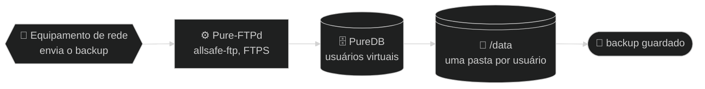

<div align="center">

# 📁 allsafe-ftp-stack

**Servidor FTP dedicado (Pure-FTPd) com usuários virtuais, chroot e FTPS obrigatório para backup de equipamentos.**


<!-- diagrama: doc/diagramas/visao-geral-diagrama.mmd -->


<sub>📐 Nível 1 · Diagrama · 🔍 aproximar e mover: controles no canto do diagrama · 📁 [fonte e SVG](doc/diagramas/)</sub>

<sub><b>v0.1.1</b> · visão geral da stack · 2026-10-04</sub>

</div>

**🧭 Sequência:** 📡 Equipamento de rede ➜ ⚙️ Pure-FTPd (`allsafe-ftp`) ➜ 🗄️ PureDB ➜ 💽 `/data` ➜ 🏁 backup guardado

> 🧱 **Uso só em rede privada.** Esta stack é para rede interna: escuta **apenas em IP privado** (`10.0.0.0/8`, `172.16.0.0/12`, `192.168.0.0/16` ou `127.0.0.1`), **atrás de firewall**, e **nunca** deve ser publicada na internet nem receber redirecionamento de porta da borda. Detalhes em [🔐 doc/seguranca.md](doc/seguranca.md#rede-privada).

---

<details>
<summary>🧭 Sumário — clique para expandir</summary>

[💡 O que é](#o-que-e) · [✨ Destaques](#destaques) · [🚀 Instalação rápida](#instalacao) · [🔄 Como funciona](#como-funciona) · [🏗️ Arquitetura](#arquitetura) · [🛠️ Tecnologias](#tecnologias) · [🔌 Portas e binds](#portas) · [⚙️ Configuração](#configuracao) · [🔐 Segurança](#seguranca) · [🧪 Testes](#testes) · [🗂️ Estrutura de arquivos](#arquivos) · [📚 Documentação](#documentacao) · [🗺️ Plano](#plano) · [🏷️ Versão](#versao) · [🔗 Projetos relacionados](#relacionados) · [🤝 Créditos](#creditos) · [📄 Licença](#licenca)

</details>

---

<a name="o-que-e"></a>

## 💡 O que é

Um servidor de arquivos para onde roteadores, switches, OLTs e outros equipamentos de rede mandam a cópia de segurança da própria configuração. Cada equipamento entra com usuário e senha, só enxerga a própria pasta e só consegue entrar por conexão criptografada.

É uma stack de **um container só**. Usa o banco local **PureDB** em vez de PostgreSQL: menos memória, menos superfície de ataque e autenticação sem latência de rede. O sistema de arquivos raiz do container é somente leitura, as `capabilities` são mínimas e os segredos ficam fora da imagem e do Git.

| | |
|---|---|
| 🎯 **Para quê** | Receber por FTPS o backup de configuração de equipamentos de rede |
| 🛠️ **Tecnologias** | Docker Compose · Debian 12 · Pure-FTPd · PureDB · OpenSSL · Bash |
| 🔑 **Acesso** | Cliente FTP com **TLS explícito** (`AUTH TLS`) na porta `21/tcp`, modo passivo `30000-30049/tcp` |
| ✅ **Requisitos** | Docker Engine com Docker Compose v2 ou mais novo · um IP **privado** dedicado · firewall no host liberando só a rede interna |

> 🖥️ Um **painel web seguro** para administrar os usuários pelo navegador está em construção: veja o [plano](#plano).

---

<a name="destaques"></a>

## ✨ Destaques

| | Destaque | Na prática |
|---|---|---|
| 🔒 | **FTPS explícito obrigatório** | Sem `AUTH TLS` não há login: usuário e senha nunca passam em texto puro |
| 🧍 | **Usuários virtuais em PureDB** | Não são contas do sistema; cada um fica preso (`chroot`) na própria pasta |
| 🚪 | **Bind local por padrão** | Sobe em `127.0.0.1`; você abre só um IP **privado** dedicado, com firewall no host |
| 🧱 | **Só rede privada** | Feita para rede interna, atrás de firewall; nunca publicada na internet |
| 🛡️ | **Container endurecido** | `read_only`, `cap_drop: ALL`, `no-new-privileges`, limites de CPU, memória e PIDs |
| 🔑 | **Segredos em arquivo** | A senha fica em `.secrets/`, nunca na imagem nem no `compose.yaml` |
| 📜 | **Logs no `stdout`** | Formato CLF, rotacionados pelo Docker (10 MB × 3) |
| 🎚️ | **Perfis de capacidade** | `--size small`, `medium` ou `large` ajusta sessões, faixa passiva e recursos |

---

<a name="instalacao"></a>

## 🚀 Instalação rápida

```bash
git clone https://github.com/CarlosSuporteISP/allsafe-ftp-stack.git
cd allsafe-ftp-stack
./deploy.sh --size small              # 1ª execução: cria o .env a partir do exemplo e para
$EDITOR .env                          # ajuste os três campos da tabela abaixo
./deploy.sh --size small              # valida, gera a senha e sobe a stack
./scripts/validate.sh --runtime       # confere o container no ar
```

> ⚠️ Hoje a instalação pede **duas execuções** do `deploy.sh`: a primeira só cria o `.env`. A instalação em um único comando está prevista no [plano](#plano).

O `deploy.sh` **gera uma senha forte** em `.secrets/ftp_password.txt` (`0600`) se o arquivo estiver vazio: guarde-a para o cliente FTP. Para usar uma senha própria, grave-a nesse arquivo antes de rodar.

Ajuste no `.env` (modelo em [`.env.example`](.env.example)) antes da segunda execução:

| Variável | Troque para |
|---|---|
| `FTP_BIND_IP` | o IP **privado** do servidor na rede interna (nunca `0.0.0.0` nem IP público) |
| `FTP_PUBLIC_IP` | o IP privado que o equipamento enxerga (normalmente o mesmo) |
| `FTP_CERT_CN` | o hostname (ou IP) que vai no certificado |

| Quero | Comando |
|---|---|
| Subir com outro porte | `./deploy.sh --size medium` (ou `large`) |
| Só validar, sem subir nada | `./deploy.sh --size small --check-only` |
| Criar um usuário | `./manage-user.sh add backup-olt` |
| Ver o estado | `docker compose ps` |
| Parar, mantendo os dados | `docker compose down` |
| Remover tudo, **apagando os dados** | `docker compose down -v` |

Passo a passo comentado em [🚀 doc/instalacao.md](doc/instalacao.md).

---

<a name="como-funciona"></a>

## 🔄 Como funciona

<!-- diagrama: doc/diagramas/funcionamento-fluxograma.mmd -->


<sub>📐 Nível 2 · Fluxograma · 🔍 aproximar e mover: controles no canto do diagrama · 📁 [fonte e SVG](doc/diagramas/)</sub>

| Nº | De ➜ Para | O que acontece |
|---|---|---|
| 1 | 📡 Equipamento de rede ➜ ⚙️ Pure-FTPd | O equipamento abre a conexão de controle na porta `21/tcp` do host, entregue ao container em `2121/tcp` |
| 2 | ⚙️ Pure-FTPd ➜ ❓ pediu TLS? | O servidor só aceita seguir se o cliente pedir `AUTH TLS`; o certificado `pure-ftpd.pem` é apresentado |
| 3a | ❓ pediu TLS? ➜ ❓ usuário e senha conferem? | ✅ Sim: o cliente envia usuário e senha, já criptografados |
| 3b | ❓ pediu TLS? ➜ ⛔ conexão recusada | ❌ Não: sessão em texto puro é recusada |
| 4 | ❓ usuário e senha conferem? ➜ 🗄️ PureDB | A conta é procurada no banco de usuários virtuais (`/auth/pureftpd.pdb`) |
| 5a | ❓ usuário e senha conferem? ➜ 🔒 sessão em chroot | ✅ Sim: a sessão abre presa na pasta do usuário |
| 5b | ❓ usuário e senha conferem? ➜ ⛔ conexão recusada | ❌ Não: `530 Login authentication failed` |
| 6 | 🔒 sessão em chroot ➜ 💽 `/data` | O arquivo sobe pelo canal de dados em modo passivo, portas `30000-30049/tcp` |
| 7 | 💽 `/data` ➜ 🏁 backup guardado | O arquivo fica gravado na pasta do usuário, dentro do volume |

**🧷 Apoio**

| Quem | Usa | Como |
|---|---|---|
| ⚙️ Pure-FTPd | 📄 certificado `pure-ftpd.pem` | apresenta ao cliente na negociação TLS |
| ⚙️ Pure-FTPd | 📚 log CLF | grava cada transferência no `stdout` do container |

---

<a name="arquitetura"></a>

## 🏗️ Arquitetura

<!-- diagrama: doc/diagramas/arquitetura-mapa.mmd -->
```mermaid
%%{init: {"theme": "dark"}}%%
flowchart LR
    subgraph USO["👤 Quem usa"]
        operador@{ shape: person, label: "👤 Usuário<br>opera a stack" }
        equip@{ shape: hex, label: "📡 Equipamento de rede<br>cliente FTP" }
    end
    subgraph HOST["🖥️ Host"]
        scripts@{ shape: console, label: "⌨️ deploy.sh<br>manage-user.sh" }
        env@{ shape: doc, label: "📄 .env<br>e perfil" }
        segredo@{ shape: doc, label: "🔑 .secrets<br>ftp_password.txt" }
    end
    subgraph CONTAINER["🐳 Container allsafe-ftp · rede allsafe-ftp-network"]
        ftp@{ shape: rect, label: "⚙️ Pure-FTPd<br>2121/tcp" }
        logs@{ shape: docs, label: "📚 log CLF<br>stdout" }
    end
    subgraph VOLUMES["💽 Volumes"]
        vcerts@{ shape: lin-cyl, label: "💽 allsafe-ftp-certs<br>/etc/ssl/private" }
        vauth@{ shape: cyl, label: "🗄️ allsafe-ftp-auth<br>/auth, PureDB" }
        vdata@{ shape: lin-cyl, label: "💽 allsafe-ftp-data<br>/data" }
    end
    subgraph RESULTADO["🏁 Resultado"]
        fim@{ shape: stadium, label: "🏁 backup guardado" }
    end

    operador -- "1 · ./deploy.sh --size small" --> scripts
    scripts -- "2 · docker compose up -d --build" --> ftp
    equip -- "3 · FTPS, TCP 21 para 2121" --> ftp
    ftp -- "4 · grava o arquivo, passivo 30000 a 30049" --> vdata
    vdata -- "5 · arquivo no volume" --> fim
    scripts -. "lê" .-> env
    ftp -. "lê na subida, só leitura" .-> segredo
    ftp -. "consulta os usuários" .-> vauth
    ftp -. "lê o certificado" .-> vcerts
    ftp -. "grava cada transferência" .-> logs
```

<sub>📐 Nível 2 · Mapa · 🔍 aproximar e mover: controles no canto do diagrama · 📁 [fonte e SVG](doc/diagramas/)</sub>

| Nº | De ➜ Para | O que acontece |
|---|---|---|
| 1 | 👤 Usuário ➜ ⌨️ `deploy.sh` | O usuário executa `./deploy.sh --size small` no host |
| 2 | ⌨️ `deploy.sh` ➜ ⚙️ Pure-FTPd | O script valida o Compose e roda `docker compose up -d --build` |
| 3 | 📡 Equipamento de rede ➜ ⚙️ Pure-FTPd | O cliente conecta por FTPS em `21/tcp`, mapeada para `2121/tcp` |
| 4 | ⚙️ Pure-FTPd ➜ 💽 `allsafe-ftp-data` | O arquivo é gravado pelo canal passivo `30000-30049/tcp` |
| 5 | 💽 `allsafe-ftp-data` ➜ 🏁 backup guardado | O arquivo fica no volume, na pasta do usuário |

| Peça | Papel | Porta | Dados em |
|---|---|---|---|
| ⚙️ Container `allsafe-ftp` (serviço `ftp`) | Pure-FTPd com FTPS, `chroot` e limites | `21/tcp` ➜ `2121/tcp` e `30000-30049/tcp` | — |
| 🗄️ Volume `allsafe-ftp-auth` | Banco PureDB dos usuários virtuais | — | `/auth` |
| 💽 Volume `allsafe-ftp-data` | Arquivos enviados, uma pasta por usuário | — | `/data` |
| 💽 Volume `allsafe-ftp-certs` | Chave e certificado TLS (`pure-ftpd.pem`) | — | `/etc/ssl/private` |
| 🔑 Bind `./.secrets` | Senha do usuário inicial, somente leitura | — | `/run/.secrets` |
| 🌐 Rede `allsafe-ftp-network` | Bridge dedicada, sub-rede `172.29.1.0/29` | — | — |

- **Imagem:** [`Dockerfile`](Dockerfile) com `debian:bookworm-slim` fixada por digest, `pure-ftpd` e o usuário `ftpdata` (uid e gid **10000**).
- **Entrypoint:** [`scripts/entrypoint.sh`](scripts/entrypoint.sh) cria ou atualiza o usuário inicial, gera o certificado autoassinado na primeira subida e executa o `pure-ftpd`.

Detalhe completo, com o modelo da subida, em [🏗️ doc/arquitetura.md](doc/arquitetura.md).

---

<a name="tecnologias"></a>

## 🛠️ Tecnologias

| Tecnologia | Versão | Papel |
|---|---|---|
| Docker Engine | 29.8.2 | Executa o container (versão do host onde a stack foi validada) |
| Docker Compose | 5.5.1 | Sobe o serviço, os volumes e a rede a partir do [`compose.yaml`](compose.yaml) |
| Debian | 12 (bookworm-slim, fixada por digest) | Imagem base |
| Pure-FTPd | 1.0.50 (pacote Debian `1.0.50-2.1`) | Servidor FTP com TLS, `chroot` e usuários virtuais |
| PureDB | embutido no Pure-FTPd 1.0.50 | Banco local dos usuários virtuais |
| OpenSSL | 3.0 (série do Debian 12) | Gera o certificado autoassinado e fornece o TLS |
| tini | 0.19.0 (`docker-init` do Docker Engine) | Processo 1 do container (`init: true`) |
| Bash | 5.2 | Scripts do host e do container |

---

<a name="portas"></a>

## 🔌 Portas e binds

| Porta (host) | Protocolo | Bind padrão | Para que serve |
|---|---|---|---|
| `${FTP_PORT:-21}` | TCP | `${FTP_BIND_IP:-127.0.0.1}` | canal de controle FTP (mapeada para `:2121` no container) |
| `30000-30049` | TCP | `${FTP_BIND_IP:-127.0.0.1}` | canal de dados em **modo passivo** (50 portas = 50 clientes) |

A faixa passiva é 1:1 entre host e container. Ao mudar `FTP_PASSIVE_PORT_*`, alinhe a quantidade de portas ao `FTP_MAX_CLIENTS`.

---

<a name="configuracao"></a>

## ⚙️ Configuração

Toda a configuração vem do `.env`, copiado de [`.env.example`](.env.example). O `./deploy.sh --size <perfil>` carrega `profiles/<perfil>.env` **depois** do `.env`, sobrescrevendo só o dimensionamento (limites de sessão, faixa passiva, CPU, memória, PIDs e `nofile`).

| Perfil | Host de referência | Sessões simultâneas | Quando usar |
|---|---|---|---|
| [`small`](profiles/small.env) | 2 vCPU · 2 GB | ~50 | padrão: cobre a maioria dos provedores |
| [`medium`](profiles/medium.env) | 4 vCPU · 4 GB | ~120 | coleta noturna em lote (~50 a 200 equipamentos) |
| [`large`](profiles/large.env) | 8 vCPU · 8 GB | ~300 | mais de 200 equipamentos ou vários coletores concorrentes |

Cada perfil amplia a faixa passiva junto com `FTP_MAX_CLIENTS`: ajuste o firewall do host ao trocar. Todas as variáveis em [⚙️ doc/configuracao.md](doc/configuracao.md); a tabela completa dos perfis em [🎚️ doc/perfis.md](doc/perfis.md).

---

<a name="seguranca"></a>

## 🔐 Segurança

- 🧱 **Só rede privada:** IP privado, atrás de firewall, sem redirecionamento de porta da internet. Veja [🧱 rede privada e firewall](doc/seguranca.md#rede-privada).
- 🚪 Bind em `127.0.0.1` por padrão: abra só um IP privado dedicado e libere no firewall do host apenas as redes que enviam backup.
- 🔒 TLS **obrigatório** para entrar (`FTP_TLS_MODE=2`), `chroot` em todos, sem usuário anônimo, sem DNS reverso.
- 🧱 `read_only` no sistema de arquivos raiz, `cap_drop: ALL` (só as estritamente necessárias voltam), `no-new-privileges`, limites de CPU, memória, PIDs e `nofile`.
- 🔑 Senha em `.secrets/ftp_password.txt` (mínimo de 12 caracteres, `0600`), fora da imagem e ignorada pelo Git. Veja [🔑 doc/segredos.md](doc/segredos.md).
- 📜 Logs rotacionados (`max-size: 10m`, `max-file: 3`).

Modelo de ameaça e o endurecimento linha a linha em [🔐 doc/seguranca.md](doc/seguranca.md).

---

<a name="testes"></a>

## 🧪 Testes

| Quero | Comando | Resultado esperado |
|---|---|---|
| Conferir sintaxe e Compose, sem subir nada | `./scripts/validate.sh` | `compose OK com <perfil>.env` para os três perfis e `Validacao FTP concluida.` |
| Conferir o container no ar | `./scripts/validate.sh --runtime` | o mesmo, exigindo o serviço `running`, `healthy` e o usuário inicial no PureDB |

Os testes automatizados de envio, download, `chroot` e recusa sem TLS ainda não existem: estão previstos no [plano](#plano), onde ficam também os resultados datados.

---

<a name="arquivos"></a>

## 🗂️ Estrutura de arquivos

| Caminho | O que é |
|---|---|
| [`compose.yaml`](compose.yaml) | Definição do serviço, volumes, rede, limites e healthcheck |
| [`Dockerfile`](Dockerfile) | Imagem: Debian slim, Pure-FTPd e o usuário `ftpdata` |
| [`deploy.sh`](deploy.sh) | Valida o Compose e sobe a stack (`up -d --build`) |
| [`manage-user.sh`](manage-user.sh) | Atalho do host para `add`, `passwd`, `del` e `list` de usuários |
| [`scripts/entrypoint.sh`](scripts/entrypoint.sh) | Prepara o usuário inicial e o certificado e executa o `pure-ftpd` |
| [`scripts/ftp-user.sh`](scripts/ftp-user.sh) | Gestão de usuários **dentro** do container (chamado pelo `manage-user.sh`) |
| [`scripts/validate.sh`](scripts/validate.sh) | Checagem de sintaxe e Compose de todos os perfis e, com `--runtime`, do container no ar |
| [`profiles/`](profiles/) | Perfis de capacidade (`--size small\|medium\|large`) |
| [`.env.example`](.env.example) | Modelo de configuração, copiado para `.env` |
| `.secrets/` | Senha do usuário inicial (arquivos `.txt` ignorados pelo Git) |
| [`VERSION`](VERSION) | Versão atual, em um lugar só |
| [`CHANGELOG.md`](CHANGELOG.md) | Histórico de mudanças por versão |
| [`doc/`](doc/README.md) | Documentação, diagramas e plano |

---

<a name="documentacao"></a>

## 📚 Documentação

Índice: [📚 doc/README.md](doc/README.md).

| Guia | Assunto |
|---|---|
| [🚀 Instalação](doc/instalacao.md) | Pré-requisitos e passo a passo comentado |
| [⚙️ Configuração](doc/configuracao.md) | Todas as variáveis do `.env` |
| [🎚️ Perfis](doc/perfis.md) | Perfis `small`, `medium` e `large`: dimensionamento e faixa passiva |
| [🏗️ Arquitetura](doc/arquitetura.md) | Container, entrypoint, volumes e opções do Pure-FTPd |
| [🔐 Segurança](doc/seguranca.md) | Modelo de ameaça e endurecimento aplicado |
| [🔑 Segredos](doc/segredos.md) | O que fica em `.secrets/` e como trocar |
| [⌨️ Scripts](doc/scripts.md) | O que cada script faz, parâmetros e saída esperada |
| [🧰 Operação](doc/operacao.md) | Usuários, certificado real, backup, logs e atualização |
| [🚨 Solução de problemas](doc/solucao-de-problemas.md) | Erros comuns e como diagnosticar |

---

<a name="plano"></a>

## 🗺️ Plano

O que já foi feito e o que falta fazer está em [🗺️ doc/planos/README.md](doc/planos/README.md).

**Status:** fases 01 a 03 ✅ concluídas · fases 04 a 09 🔄 em execução: pastas fixas, segredos e rede privada, painel web seguro, instalação em um comando, testes automatizados, backup e restauração, documentação final.

---

<a name="versao"></a>

## 🏷️ Versão

**0.1.1**, registrada em [`VERSION`](VERSION). Mudanças por versão em [`CHANGELOG.md`](CHANGELOG.md). Cada versão publicada tem uma tag `vX.Y.Z` no repositório.

A versão avança a cada publicação: `0.x` é a fase de construção, uma versão por fase do plano; **`1.0.0` é a primeira versão pronta para produção** e abre a linha de longo prazo `1.x`. A sequência completa está no [🗺️ plano mestre](doc/planos/README.md#versoes).

---

<a name="relacionados"></a>

## 🔗 Projetos relacionados

| Projeto | Relação |
|---|---|
| `allsafe-sftp-stack` · `allsafe-scp-stack` · `allsafe-tftp-stack` | Outros servidores de transferência para backup de equipamentos |
| `allsafe-zabbix-isp-stack` | Monitora o container desta stack |
| `allsafe-ntp-nts-stack` | Mantém o relógio do host correto, do qual o certificado TLS depende |

---

<a name="creditos"></a>

## 🤝 Créditos

| Quem | Pelo quê | Link |
|---|---|---|
| **Carlos** (@CarlosSuporteISP) | Idealização e direção · projeto inicial, código e Docker (imagem, Compose, scripts e endurecimento), feitos à mão, sem IA | [github.com/CarlosSuporteISP](https://github.com/CarlosSuporteISP) |
| **Claude** (Claude Code, Anthropic) | Evolução do projeto: melhorias, novas funcionalidades, documentação e plano | [claude.com/claude-code](https://claude.com/claude-code) |

### Projetos oficiais usados

| Projeto | Uso aqui | Licença | Origem | Fonte |
|---|---|---|---|---|
| Pure-FTPd | Servidor FTP e banco PureDB | ISC, permissiva no estilo BSD | [pureftpd.org](https://www.pureftpd.org) | [github.com/jedisct1/pure-ftpd](https://github.com/jedisct1/pure-ftpd) |
| Debian | Imagem base `debian:bookworm-slim` | Software livre conforme a DFSG; cada pacote mantém a própria licença | [debian.org](https://www.debian.org) | [hub.docker.com/_/debian](https://hub.docker.com/_/debian) |
| OpenSSL | TLS e geração do certificado | Apache-2.0 | [openssl.org](https://www.openssl.org) | [github.com/openssl/openssl](https://github.com/openssl/openssl) |
| Docker Engine | Execução do container | Apache-2.0 | [docs.docker.com/engine](https://docs.docker.com/engine/) | [github.com/moby/moby](https://github.com/moby/moby) |
| Docker Compose | Orquestração do serviço | Apache-2.0 | [docs.docker.com/compose](https://docs.docker.com/compose/) | [github.com/docker/compose](https://github.com/docker/compose) |

---

<a name="licenca"></a>

## 📄 Licença

Este repositório **ainda não tem arquivo de licença definido**. Os projetos de terceiros citados mantêm as licenças originais.
