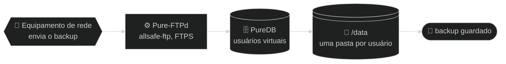

# 📚 Documentação — allsafe-ftp-stack

↩ [README do projeto](../README.md)

## 💡 Em poucas palavras

Esta pasta explica a stack **como ela é hoje**: como instalar, configurar, operar e consertar o servidor FTP que recebe o backup dos equipamentos de rede, o painel web que administra os usuários dele e o nginx, que fica na frente do painel. Cada guia começa com um resumo para quem nunca viu o projeto e guarda o detalhe técnico em menus recolhidos. O que ainda vai mudar fica no plano, não aqui.

<!-- diagrama: diagramas/visao-geral-diagrama.mmd -->


<sub>📐 Nível 1 · Diagrama · 🔍 aproximar e mover: controles no canto do diagrama · 📁 [fonte](diagramas/)</sub>

**🧭 Sequência:** 📡 Equipamento de rede ➜ ⚙️ Pure-FTPd (`allsafe-ftp`) ➜ 🗄️ PureDB ➜ 💽 `/data` ➜ 🏁 backup guardado

> 🧱 **Uso só em rede privada:** IP privado, atrás de firewall, nunca na internet. Veja [🔐 Segurança](seguranca.md#rede-privada).

---

<details>
<summary>🧭 Sumário — clique para expandir</summary>

[📖 Guias](#guias) · [🧭 Por onde começar](#por-onde-comecar) · [💽 Onde ficam os dados](#onde-ficam-os-dados) · [📐 Diagramas](#diagramas) · [🗺️ Plano](#plano)

</details>

---

<a name="guias"></a>

## 📖 Guias

| Nº | Guia | Assunto |
|---|---|---|
| 1 | [🚀 Instalação](instalacao.md) | Pré-requisitos, passo a passo comentado, primeira validação e como desfazer |
| 2 | [⚙️ Configuração](configuracao.md) | Todas as variáveis do `.env`: nome, para que serve, valores válidos e padrão |
| 3 | [🎚️ Perfis](perfis.md) | Perfis `small`, `medium`, `large`, `xlarge` e `extended`: dimensionamento por porte, o que o servidor precisa ter e o impacto na faixa passiva |
| 4 | [🏗️ Arquitetura](arquitetura.md) | Containers, imagens, entrypoints, volumes, rede e as opções do `pure-ftpd` |
| 5 | [🔐 Segurança](seguranca.md) | Rede privada e firewall, o modo sem TLS para equipamento antigo, modelo de ameaça, superfície exposta, proteções do painel e do nginx e o endurecimento do Compose linha a linha |
| 6 | [🔑 Segredos](segredos.md) | O que fica em `.secrets/`, quem gera cada arquivo e como trocar as senhas do FTP e do painel |
| 7 | [⌨️ Scripts](scripts.md) | O que cada script faz, parâmetros e saída esperada |
| 8 | [🧰 Operação](operacao.md) | Usuários, certificado real, backup dos volumes, logs e atualização da imagem |
| 9 | [🖥️ Painel web](painel.md) | Abrir o painel, o que há em cada aba, usuários pelo navegador, senha, certificado, auditoria e proteções |
| 10 | [🚨 Solução de problemas](solucao-de-problemas.md) | Sintoma, causa, como verificar e correção |

---

<a name="por-onde-comecar"></a>

## 🧭 Por onde começar

| Situação | Leia, nesta ordem |
|---|---|
| Primeira vez | [🚀 Instalação](instalacao.md) ➜ [🖥️ Painel web](painel.md) ➜ [⚙️ Configuração](configuracao.md) ➜ [🎚️ Perfis](perfis.md) |
| Criar a conta de um equipamento | [🖥️ Painel web](painel.md#usuarios) ou [🧰 Operação](operacao.md#usuarios) |
| Antes de produção | [🧱 Rede privada e firewall](seguranca.md#rede-privada) ➜ [🔐 Segurança](seguranca.md) ➜ [🧰 Operação](operacao.md#certificado-real-de-producao) |
| Equipamento antigo que não fala TLS | [📟 Equipamento sem TLS](seguranca.md#ftp-sem-tls) ➜ [⚙️ Configuração](configuracao.md#tls) ➜ [🚨 Solução de problemas](solucao-de-problemas.md#ftp-sem-tls) |
| Algo quebrou | [🚨 Solução de problemas](solucao-de-problemas.md) |

---

<a name="onde-ficam-os-dados"></a>

## 💽 Onde ficam os dados

| O quê | Onde fica no host | Dentro do container |
|---|---|---|
| Arquivos enviados pelos equipamentos | `DATA_DIR/dados` | `/data` |
| Usuários virtuais (PureDB) | `DATA_DIR/auth` | `/auth` |
| Chave e certificado TLS do FTP | `DATA_DIR/certs` | `/etc/ssl/private` |
| Certificado e auditoria do painel | `DATA_DIR/painel` | `/painel` |
| Soquete do painel e cópia do certificado, para o nginx (refeitos a cada subida) | `DATA_DIR/nginx` | `/nginx` |
| Senha do usuário inicial | `.secrets/ftp_password.txt`, na pasta do projeto | `/run/secrets/ftp_password` (somente leitura) |
| Senha do painel, só o hash | `.secrets/painel_password_hash.txt`, na pasta do projeto | `/run/secrets/painel_password_hash` (somente leitura) |
| Configuração | `.env`, na pasta do projeto | variáveis de ambiente |
| Logs | driver `local` do Docker, 10 MB × 3 | `stdout` |

`DATA_DIR` é uma pasta do host definida no `.env` (padrão `/home/carlos/code/data/allsafe-ftp-stack`). As cópias vão para `BACKUP_DIR` e os temporários para `TEMP_DIR`: veja [⚙️ Configuração](configuracao.md#pastas-e-nomes). A stack não cria volume nomeado.

---

<a name="diagramas"></a>

## 📐 Diagramas

Todo diagrama aparece nos guias direto do fonte `.mmd`, com fundo escuro e com os **controles de aproximar e mover** no canto do próprio diagrama. Na pasta [`diagramas/`](diagramas/) fica o fonte de cada um e o [`visualizador.html`](diagramas/visualizador.html). As imagens SVG (escura, `<nome>.svg`, e de fundo branco, `<nome>-claro.svg`) **não vão para o repositório**: são geradas no computador, ficam só na pasta local e o visualizador abre qualquer uma delas, também com zoom e movimento. Para gerar depois de clonar ou de editar uma fonte:

```bash
/home/carlos/code/padrao-diagramas/renderizar.sh doc/diagramas
```

| Diagrama | Nível | Onde aparece |
|---|---|---|
| [visao-geral-diagrama.mmd](diagramas/visao-geral-diagrama.mmd) | 1 | [README do projeto](../README.md) e este índice |
| [funcionamento-fluxograma.mmd](diagramas/funcionamento-fluxograma.mmd) | 2 | [README do projeto](../README.md#como-funciona) |
| [arquitetura-mapa.mmd](diagramas/arquitetura-mapa.mmd) | 2 | [README do projeto](../README.md#arquitetura) e [🏗️ Arquitetura](arquitetura.md) |
| [subida-modelo.mmd](diagramas/subida-modelo.mmd) | 3 | [🏗️ Arquitetura](arquitetura.md#subida) |
| [instalacao-diagrama.mmd](diagramas/instalacao-diagrama.mmd) | 1 | [🚀 Instalação](instalacao.md) |
| [configuracao-diagrama.mmd](diagramas/configuracao-diagrama.mmd) | 1 | [⚙️ Configuração](configuracao.md) e [🎚️ Perfis](perfis.md) |
| [seguranca-diagrama.mmd](diagramas/seguranca-diagrama.mmd) | 1 | [🔐 Segurança](seguranca.md) |
| [segredos-diagrama.mmd](diagramas/segredos-diagrama.mmd) | 1 | [🔑 Segredos](segredos.md) |
| [scripts-diagrama.mmd](diagramas/scripts-diagrama.mmd) | 1 | [⌨️ Scripts](scripts.md) |
| [usuarios-diagrama.mmd](diagramas/usuarios-diagrama.mmd) | 1 | [🧰 Operação](operacao.md) |
| [painel-diagrama.mmd](diagramas/painel-diagrama.mmd) | 1 | [🖥️ Painel web](painel.md) |
| [painel-fluxograma.mmd](diagramas/painel-fluxograma.mmd) | 2 | [README do projeto](../README.md#como-funciona) e [🖥️ Painel web](painel.md#como-decide) |
| [diagnostico-diagrama.mmd](diagramas/diagnostico-diagrama.mmd) | 1 | [🚨 Solução de problemas](solucao-de-problemas.md) |

---

<a name="plano"></a>

## 🗺️ Plano

O plano de criação e mudança da stack (fases, testes, evidências e progresso) **não é publicado neste repositório**: fica na pasta local `doc/planos/` e em um repositório privado próprio, só do plano.

---

⬅️ [README do projeto](../README.md) · 🏠 [Documentação](README.md) · ➡️ [🚀 Instalação](instalacao.md)
