# 📸 Fotos da aplicação — allsafe-ftp-stack

↩ [README do projeto](../../README.md) · [Índice da documentação](../README.md)

## 💡 Em poucas palavras

Todas as telas do painel web, menu por menu, com a foto de cada uma e a explicação do que dá para fazer nela. As fotos são capturas reais da versão **0.18.4**, em tema escuro (o único do painel), com usuários de exemplo, como `olt-centro`, `switch-core` e `roteador-borda`. Clique em qualquer foto para abri-la em tamanho real.

O painel tem uma tela de entrada, seis abas para quem administra (Visão geral, Usuários, Arquivos, Administradores, Segurança e Atividade) e uma tela para o usuário do FTP baixar os próprios backups (Meus arquivos). Como abrir, criar administradores e o que protege o painel está em [Painel web](../painel.md).

> 🧱 **Uso só em rede privada:** por padrão, o painel abre apenas em IP privado, atrás de firewall, fora da internet. Veja [Segurança](../seguranca.md#rede-privada).

Sumário — clique para expandir

[Entrar](#entrar) · [Visão geral](#visao-geral) · [Usuários](#usuarios) · [Arquivos](#arquivos) · [Meus arquivos](#meus-arquivos) · [Administradores](#administradores) · [Segurança](#seguranca) · [Atividade](#atividade) · [Como as fotos foram feitas](#como-foram-feitas)

---

## 🚪 Entrar

<a href="imagens/entrar.png">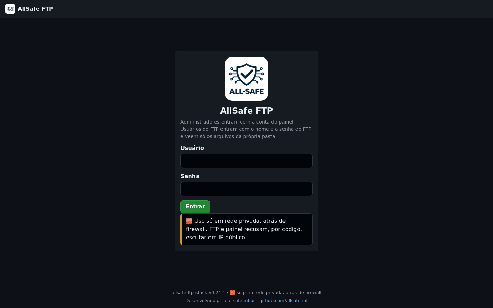</a>

<b>v0.18.4</b> · tela de entrada · captura de 2026-10-05

**Para que serve:** conferir o usuário e a senha antes de mostrar qualquer dado da stack. É a mesma tela para quem administra e para o usuário do FTP.

**Como chegar:** abra `https://<endereço do painel>:8443` no navegador. Sem sessão, qualquer endereço do painel leva a esta tela.

| Item da tela | O que faz |
|---|---|
| **Usuário** | Recebe o nome do administrador ou o nome do usuário do FTP. Na primeira instalação, o administrador é o de `PAINEL_ADMIN_USER` (`admin`, se não foi trocado) |
| **Senha** | Recebe a senha da conta. A do primeiro administrador está em `.secrets/painel-admin-inicial-senha.txt`; a do usuário do FTP é a mesma que o equipamento usa |
| **Entrar** | Confere a conta: o administrador vai para a aba Visão geral e o usuário do FTP, para a tela Meus arquivos |
| Texto abaixo do título | Diz quem entra por esta tela. Com `PAINEL_ACESSO_USUARIOS_FTP=nao`, passa a ser `Painel de administração da stack.` |
| Aviso de rede privada | Lembra que o painel é só para rede interna, atrás de firewall; com `REDE_PERMITIR_IP_PUBLICO=sim`, vira o alerta de endereço público aceito |

Entrar ➜ Entrada recusada — clique para expandir

### Entrar ➜ Entrada recusada

<a href="imagens/entrar-recusada.png">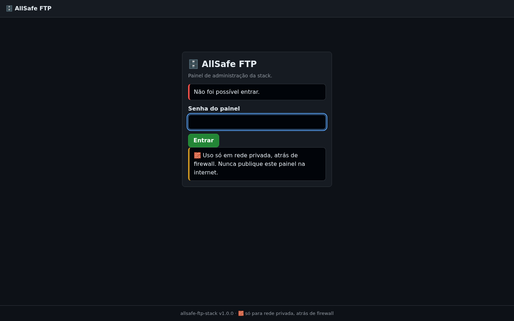</a>

<b>v0.18.4</b> · tela de entrada, entrada recusada · captura de 2026-10-05

| Mensagem | Quando aparece | O que fazer |
|---|---|---|
| Não foi possível entrar. | O usuário ou a senha estão errados; a tela não diz qual dos dois | Conferir os dois campos e tentar de novo |
| Muitas tentativas. Aguarde alguns minutos e tente de novo. | Cinco entradas erradas do mesmo endereço em 15 minutos | Esperar o bloqueio passar; a conta certa também é recusada enquanto ele dura |
| A página expirou. Tente de novo. | A tela ficou aberta tempo demais antes do envio | Enviar de novo |

Detalhe técnico — entrada e sessão

- Rota `GET /entrar` mostra o formulário; `POST /entrar` confere primeiro a conta de administrador, pelo hash `scrypt` de `DATA_DIR/painel/administradores`, e depois, se a entrada dos usuários do FTP estiver ligada, a conta do FTP, por um login no próprio servidor FTP.
- Resposta `401` para usuário ou senha errados, `429` para endereço bloqueado e `400` para formulário expirado. Cada caso grava `entrada_falha` ou `entrada_bloqueada` na [auditoria](../painel.md#auditoria), sem o nome digitado.
- A entrada com a conta do FTP leva alguns segundos: é o tempo que o servidor FTP gasta para conferir a senha. Veja [Usuário do FTP no painel](../painel.md#usuario-ftp).
- A sessão fica no cookie `__Host-sessao` (`Secure`, `HttpOnly`, `SameSite=Strict`) e encerra com 15 minutos sem uso ou em 8 horas.
- O envio só é aceito quando parte do próprio painel: o cabeçalho `Origin` tem de ser o endereço do painel. Detalhes em [Painel web](../painel.md#protecoes).

---

## 📊 Visão geral

<a href="imagens/visao-geral.png">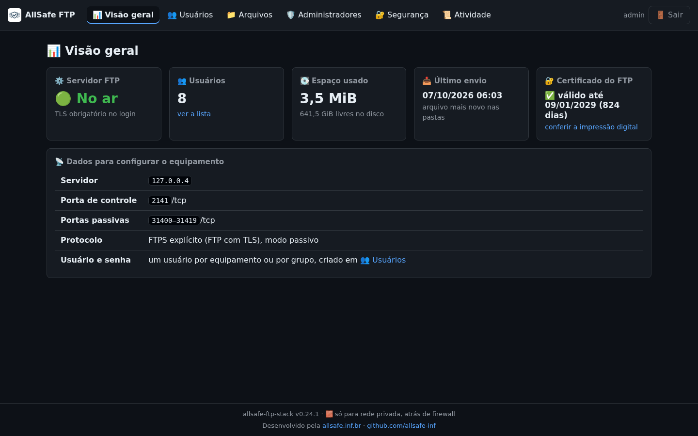</a>

<b>v0.18.4</b> · menu Visão geral · captura de 2026-10-05

**Para que serve:** ver de uma vez se o FTP está no ar e quais dados digitar no equipamento que vai mandar o backup.

**Como chegar:** é a primeira tela do administrador depois da entrada; menu do topo ➜ **Visão geral**.

| Item da tela | O que mostra |
|---|---|
| **Servidor FTP** | `No ar` ou `Fora do ar`, e o modo de TLS em uso |
| **Usuários** | Quantidade de usuários do FTP, com atalho para a lista |
| **Espaço usado** | Soma das pastas dos usuários e o espaço livre no disco |
| **Último envio** | Data do arquivo mais novo entre todas as pastas |
| **Certificado do FTP** | Validade do certificado, com atalho para a impressão digital |
| **Dados para configurar o equipamento** | Servidor, porta de controle, portas passivas, protocolo e de onde vem o usuário: o que preencher no equipamento |
| Topo de todas as telas | As seis abas, o nome do administrador da sessão e o botão **Sair** |
| Rodapé de todas as telas | A versão da stack, o lembrete de rede privada e a autoria |

Nada é alterado por esta aba.

Visão geral ➜ Alerta de usuário sem TLS — clique para expandir

### Visão geral ➜ Alerta de usuário sem TLS

<a href="imagens/visao-geral-alerta-tls.png">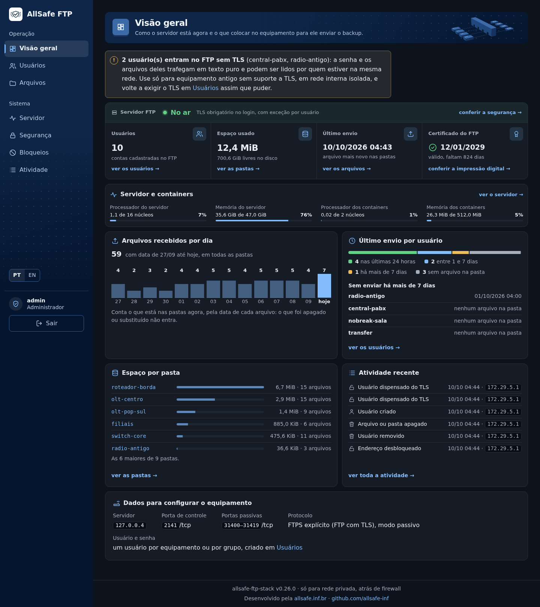</a>

<b>v0.18.4</b> · menu Visão geral, alerta de usuário sem TLS · captura de 2026-10-05

| Alerta no topo | Quando aparece | Como some |
|---|---|---|
| Quantos e quais usuários entram no FTP sem TLS | Com `FTP_TLS_EXCECOES=sim` e pelo menos um usuário dispensado | Quando o último volta a ser obrigado a usar TLS, em [Usuários ➜ Exigir TLS](#usuarios) |
| O FTP aceita senha e arquivo em texto puro | Com `FTP_TLS_MODE` em `0` ou `1` | Quando a variável volta para `2` ou `3` |

O mesmo alerta abre a aba Segurança. As condições para dispensar um usuário estão em [TLS por usuário](../seguranca.md#tls-por-usuario) e as do FTP sem TLS, em [Equipamento sem TLS](../seguranca.md#ftp-sem-tls).

Detalhe técnico — de onde vem cada número

- Rota `GET /`.
- `No ar` é a resposta da porta de controle do serviço `ftp`, pela rede interna da stack (`ftp:2121`).
- Usuários vêm do cadastro do FTP (`DATA_DIR/auth`); espaço, quantidade de arquivos e último envio são lidos de `DATA_DIR/dados`.
- Servidor, porta e faixa passiva são os valores de `FTP_PASSIVE_IP`, `FTP_PORT` e `FTP_PASSIVE_PORT_*` do `.env`: veja [Configuração](../configuracao.md#rede-e-portas).

---

## 👥 Usuários

<b>v0.18.4</b> · menu Usuários · captura de 2026-10-05

**Para que serve:** criar a conta de cada equipamento, escolher a pasta em que ela fica presa, trocar a senha e remover a conta, sem linha de comando.

**Como chegar:** menu do topo ➜ **Usuários**.

| Item da tela | O que faz |
|---|---|
| **Novo usuário** | Abre o formulário de cadastro |
| Usuário | Nome da conta. A etiqueta `inicial` marca o usuário criado na instalação (`FTP_USER`) |
| Pasta no host | Onde os arquivos desse usuário ficam no servidor. O endereço abre a pasta na aba Arquivos |
| Etiqueta `dividida` | A pasta é alcançada por mais de um usuário: um lê, grava e apaga os arquivos do outro |
| Uso · Arquivos · Último envio | Espaço ocupado, quantidade de arquivos e data do envio mais recente |
| **Trocar senha** | Abre o formulário de troca de senha daquele usuário |
| **Remover** | Abre a confirmação de remoção daquele usuário |

O usuário inicial não tem ações: a senha dele vem de `.secrets/ftp-usuario-inicial-senha.txt`. Veja [Segredos](../segredos.md#trocar-a-senha).

Usuários ➜ Novo usuário — clique para expandir

### Usuários ➜ Novo usuário

<a href="imagens/usuarios-novo.png">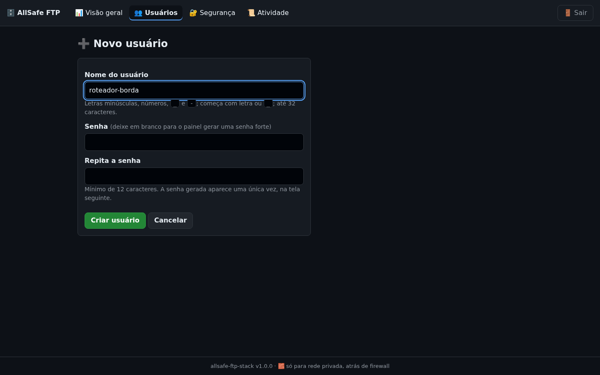</a>

<b>v0.18.4</b> · menu Usuários, formulário Novo usuário · captura de 2026-10-05

| Campo | Obrigatório | O que preencher |
|---|---|---|
| Nome do usuário | Sim | Letras minúsculas, números, `_` e `-`; começa com letra ou `_`; até 32 caracteres |
| Pasta | Não | Em branco, é o nome do usuário. Escolhida, fica dentro de `DATA_DIR/dados`, com até 4 níveis separados por `/`, e é criada se não existir. O campo sugere as pastas que já existem |
| Senha | Não | 12 caracteres ou mais. Em branco, o painel gera uma senha forte |
| Repita a senha | Só com a senha preenchida | A mesma senha |

**Resultado esperado:** a lista volta com a mensagem `Usuário criado.` e o usuário já entra por FTPS, sem reiniciar o FTP, preso na pasta escolhida.

> ⚠️ **Pasta dividida:** dois usuários com a mesma pasta, ou com uma dentro da outra, leem, gravam e apagam os arquivos um do outro. Na foto, `filiais/olt-norte` fica dentro de `filiais`, a pasta de uma conta de consulta. Para um equipamento não alcançar o backup de outro, dê a cada um a própria pasta.

Usuários ➜ Novo usuário recusado — clique para expandir

### Usuários ➜ Novo usuário recusado

<a href="imagens/usuarios-novo-recusado.png">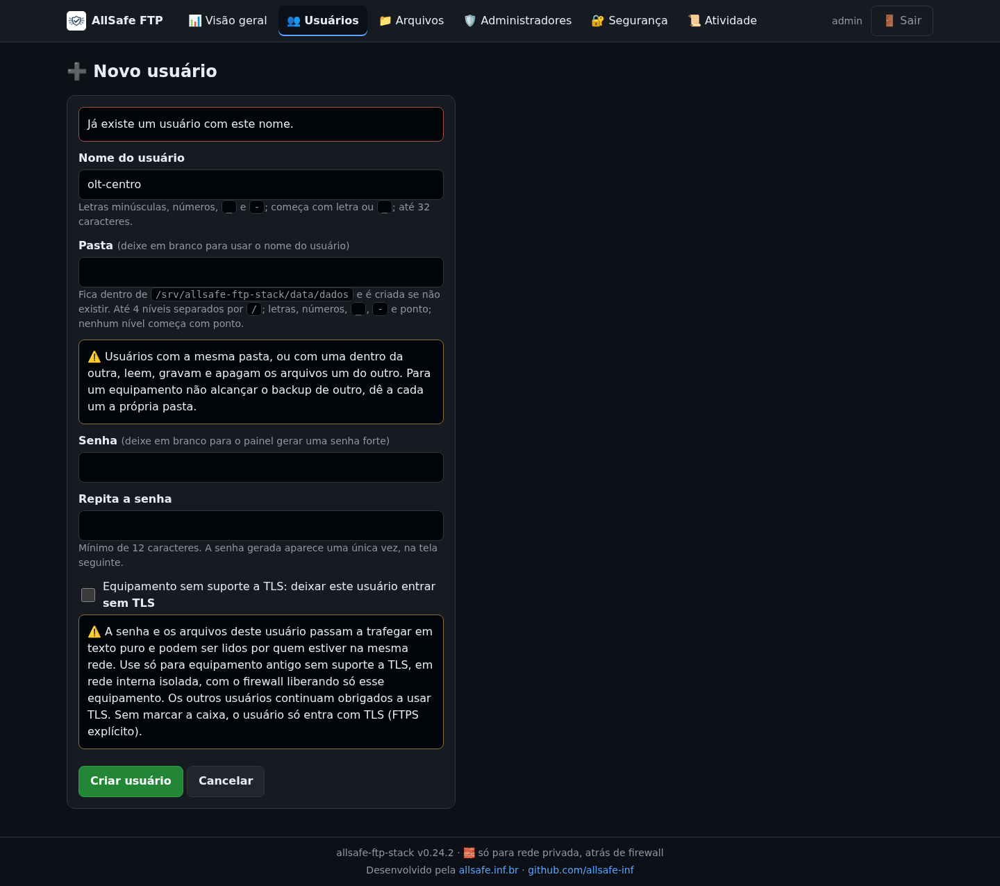</a>

<b>v0.18.4</b> · menu Usuários, cadastro recusado · captura de 2026-10-05

O painel devolve o formulário com o motivo no topo e nada é criado.

| Mensagem | Motivo |
|---|---|
| Nome inválido. Veja a regra abaixo do campo. | O nome foge da regra de letras, números, `_` e `-` |
| Já existe um usuário com este nome. | O nome já está em uso |
| Pasta inválida. Veja a regra abaixo do campo. | A pasta foge da regra, tem mais de 4 níveis ou um nível começa com ponto |
| As duas senhas não são iguais. | Os dois campos de senha diferem |
| A senha deve ter de 12 a 128 caracteres. | Senha curta ou longa demais |

Pasta que passa por link simbólico, ou por um nome que já é de um arquivo, também é recusada, com o motivo na mesma faixa.

Usuários ➜ Senha gerada pelo painel — clique para expandir

### Usuários ➜ Senha gerada pelo painel

<a href="imagens/usuarios-senha-gerada.png">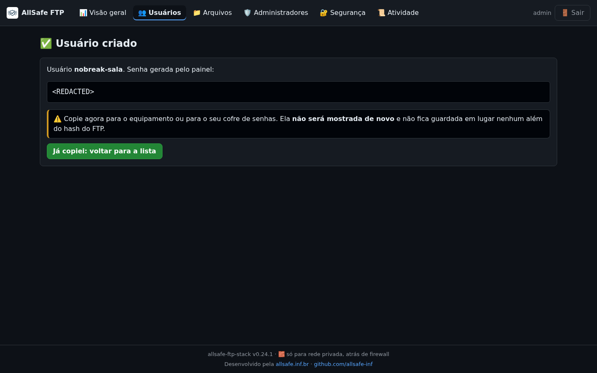</a>

<b>v0.18.4</b> · menu Usuários, senha gerada · captura de 2026-10-05

Aparece quando os dois campos de senha ficam em branco, no cadastro ou na troca de senha. A senha é mostrada **uma única vez**: copie para o equipamento ou para o cofre de senhas antes de sair da tela. Na foto, o valor foi trocado por `<REDACTED>`.

Usuários ➜ Trocar senha — clique para expandir

### Usuários ➜ Trocar senha

<a href="imagens/usuarios-trocar-senha.png">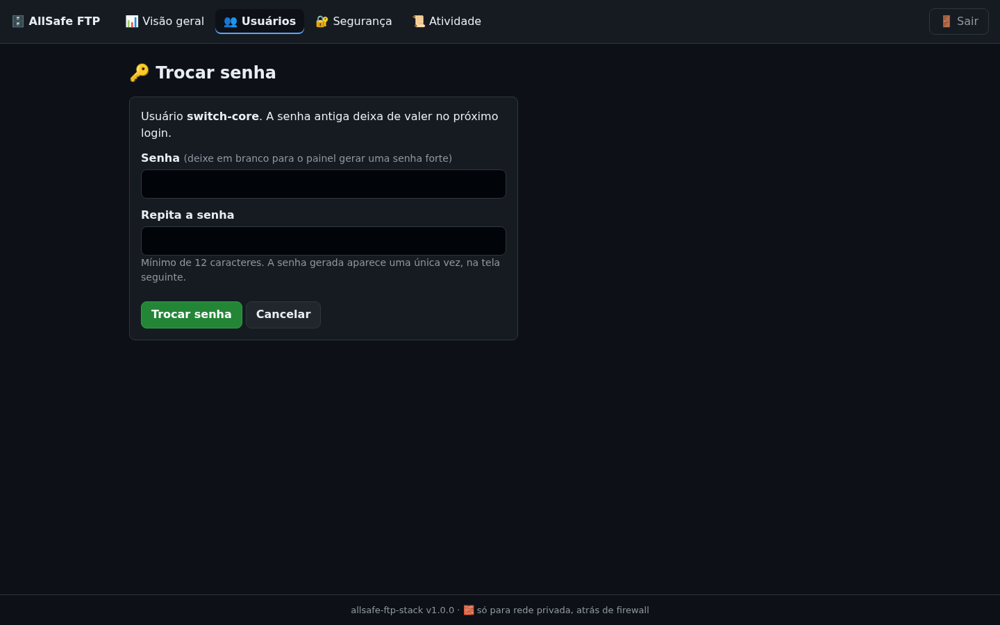</a>

<b>v0.18.4</b> · menu Usuários, formulário Trocar senha · captura de 2026-10-05

| Campo | Obrigatório | O que preencher |
|---|---|---|
| Senha | Não | 12 caracteres ou mais. Em branco, o painel gera uma senha forte |
| Repita a senha | Só com a senha preenchida | A mesma senha |

**Resultado esperado:** a lista volta com a mensagem `Senha trocada.`, a senha antiga deixa de valer no próximo login do equipamento e a sessão desse usuário no painel, se houver, é encerrada.

Usuários ➜ Remover — clique para expandir

### Usuários ➜ Remover

<a href="imagens/usuarios-remover.png">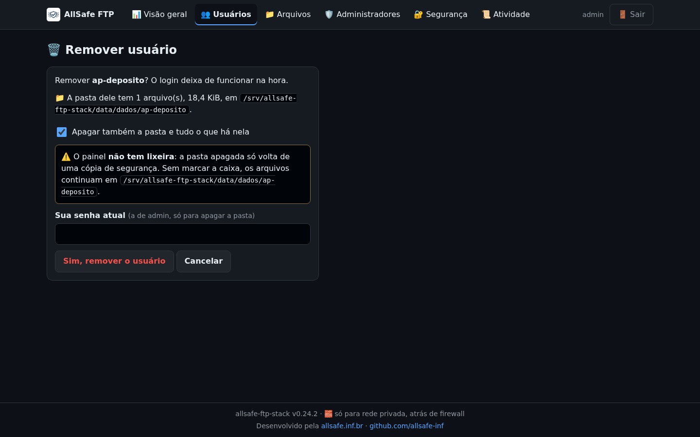</a>

<b>v0.18.4</b> · menu Usuários, confirmação de remoção · captura de 2026-10-05

| Item da tela | O que faz |
|---|---|
| Aviso dos arquivos | Mostra quantos arquivos o usuário tem, quanto ocupam e em que pasta eles continuam; em pasta dividida, diz quem mais a alcança |
| **Sim, remover o usuário** | Apaga a conta: o login deixa de funcionar na hora |
| **Cancelar** | Volta para a lista sem alterar nada |

<a href="imagens/usuarios-removido.png">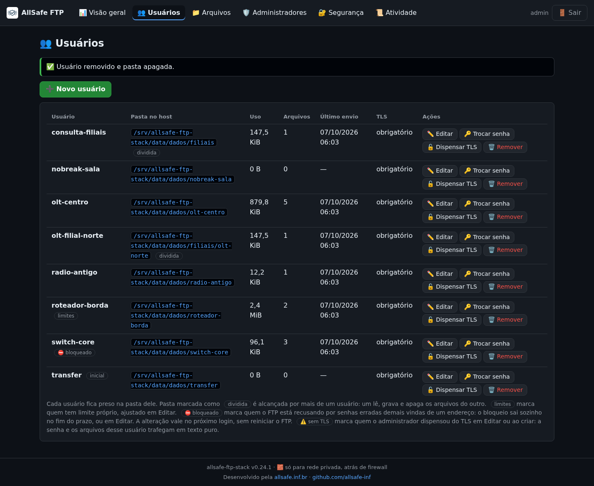</a>

<b>v0.18.4</b> · menu Usuários, depois da remoção · captura de 2026-10-05

**Resultado esperado:** a lista volta com a mensagem `Usuário removido. Os arquivos continuam na pasta.` A pasta fica em `DATA_DIR/dados` até alguém apagá-la no servidor e continua visível na aba Arquivos.

Usuários ➜ TLS por usuário — clique para expandir

### Usuários ➜ TLS por usuário

<a href="imagens/usuarios-tls.png">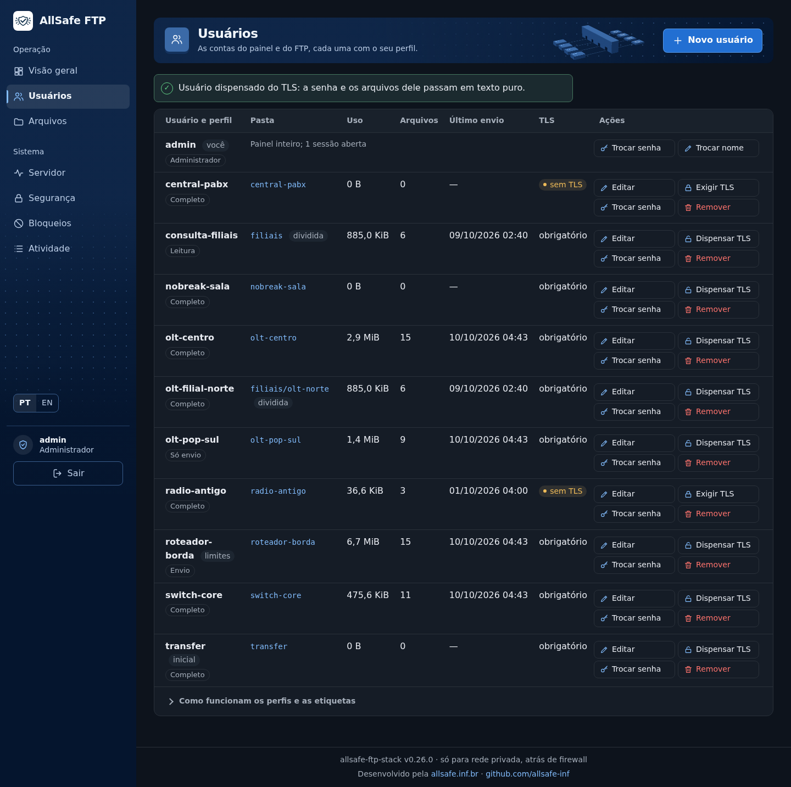</a>

<b>v0.18.4</b> · menu Usuários, coluna TLS · captura de 2026-10-05

A coluna e os dois botões só existem com `FTP_TLS_EXCECOES=sim` no `.env`. Servem para o equipamento antigo que não fala TLS: ele é dispensado sozinho, e os demais continuam obrigados.

| Item da tela | O que faz |
|---|---|
| Coluna TLS | `obrigatório` para quem só entra com TLS e `sem TLS` para quem foi dispensado |
| **Dispensar TLS** | Abre a confirmação para deixar aquele usuário entrar sem TLS |
| **Exigir TLS** | Abre a confirmação para voltar a exigir o TLS de quem está dispensado |

<a href="imagens/usuarios-tls-dispensar.png">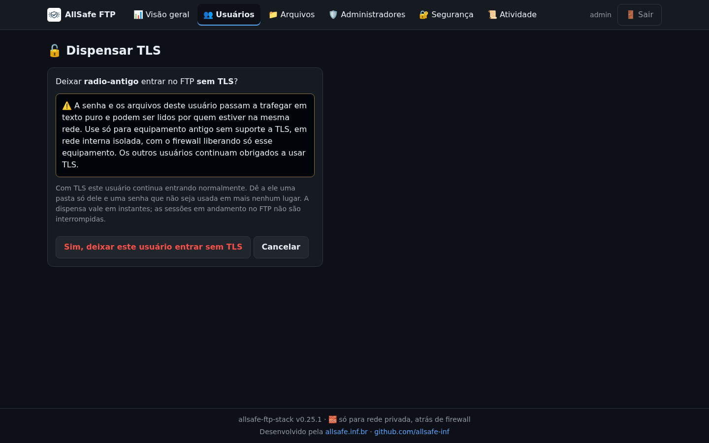</a>

<b>v0.18.4</b> · menu Usuários, confirmação da dispensa do TLS · captura de 2026-10-05

**Resultado esperado:** a lista volta com a mensagem `Usuário dispensado do TLS: a senha e os arquivos dele passam em texto puro.`, a linha dele mostra `sem TLS` e as abas Visão geral e Segurança abrem com o alerta. A dispensa vale na entrada seguinte do usuário. Ao voltar a exigir, a mensagem é `O usuário volta a ser obrigado a usar TLS.`

> ⚠️ **Dispensa do TLS:** o usuário dispensado manda senha e arquivo em texto puro. Use só para o equipamento antigo que não fala TLS, em rede interna isolada, com pasta e senha só dele, e troque a senha quando voltar a exigir. As condições estão em [TLS por usuário](../seguranca.md#tls-por-usuario).

Detalhe técnico — rotas e comando usado

- Rotas: `GET /usuarios`, `/usuarios/novo`, `/usuarios/senha?usuario=<nome>`, `/usuarios/remover?usuario=<nome>` e `/usuarios/tls?usuario=<nome>`; o envio de cada formulário é um `POST` na mesma rota, com o token CSRF da sessão.
- Com `FTP_TLS_EXCECOES=nao`, a rota `/usuarios/tls` responde `404` e a lista dos dispensados fica guardada, sem valer.
- O painel chama o mesmo `allsafe-ftp-user` do [`manage-user.sh`](../../manage-user.sh): painel e linha de comando alteram as mesmas contas. Veja [Operação](../operacao.md#usuarios).
- Cada alteração grava `usuario_criado`, `senha_trocada`, `usuario_removido`, `tls_dispensado` ou `tls_exigido` na [auditoria](../painel.md#auditoria), com o administrador que fez e sem a senha.
- A senha gerada tem 32 caracteres aleatórios e não fica guardada: só o hash vai para o cadastro do FTP.
- As regras da pasta e o que a marca `dividida` confere estão em [Usuários pelo painel](../painel.md#usuarios).

---

## 📁 Arquivos

<a href="imagens/arquivos.png">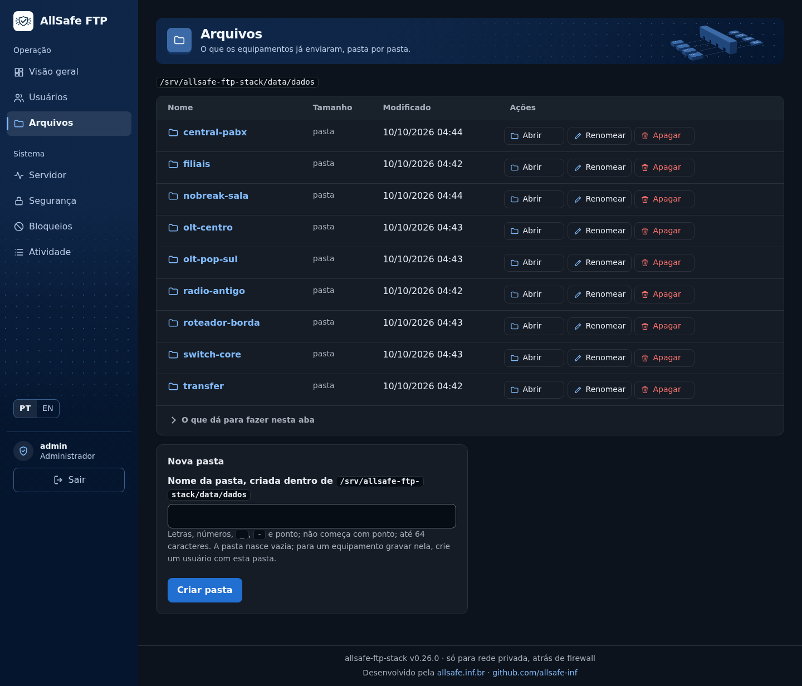</a>

<b>v0.18.4</b> · menu Arquivos · captura de 2026-10-05

**Para que serve:** ver o que cada equipamento enviou, baixar um backup pelo navegador e criar a pasta de um usuário novo, sem cliente de FTP.

**Como chegar:** menu do topo ➜ **Arquivos**. Na aba Usuários, o endereço da coluna **Pasta no host** abre direto a pasta daquele usuário.

| Item da tela | O que faz |
|---|---|
| Caminho no alto da lista | Mostra a pasta aberta e volta a qualquer nível |
| Nome de uma pasta | Entra na pasta |
| Tamanho · Modificado | Tamanho do arquivo e data da última alteração |
| **Baixar** | Entrega o arquivo ao navegador, com o nome original |
| **Nova pasta** | Cria uma pasta vazia dentro da que está aberta |
| **Novo usuário nesta pasta** | Dentro de uma pasta, abre o cadastro de usuário com o campo Pasta preenchido |

O painel navega, baixa e cria pasta: enviar, renomear e apagar continuam sendo feitos por FTP.

Arquivos ➜ Pasta de um usuário e download — clique para expandir

### Arquivos ➜ Pasta de um usuário e download

<a href="imagens/arquivos-pasta.png">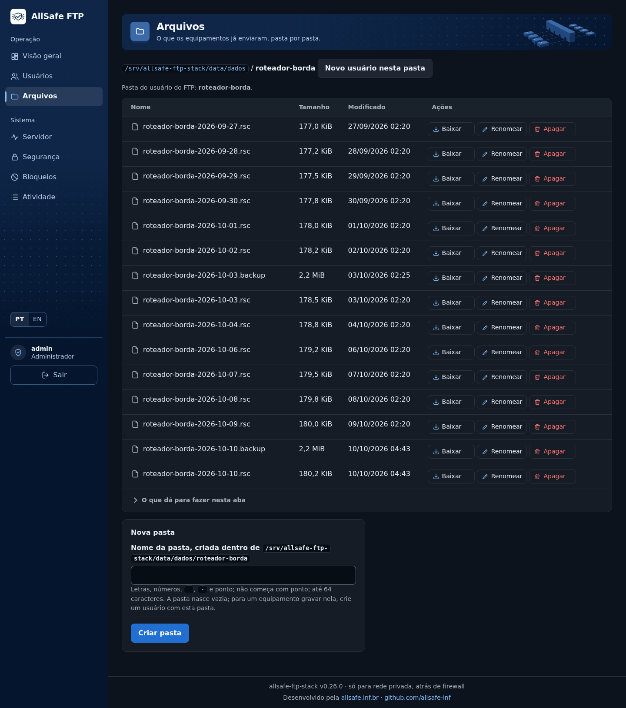</a>

<b>v0.18.4</b> · menu Arquivos, pasta de um usuário · captura de 2026-10-05

1. Clique no nome da pasta para entrar.
2. Confira, na linha `Pasta do usuário do FTP`, de quem é a pasta.
3. Clique em **Baixar** na linha do arquivo.

**Resultado esperado:** o navegador salva o arquivo com o nome original, idêntico ao que o equipamento enviou, e a aba Atividade ganha a linha `Arquivo baixado`, com o administrador, o caminho e o tamanho.

| Limite | Valor |
|---|---|
| Downloads ao mesmo tempo | 8, somando administradores e usuários do FTP; o seguinte recebe a tela `Muitos downloads ao mesmo tempo` |
| Itens mostrados por pasta | 2000, com um aviso quando há mais |
| Retomada | Não há: se a conexão cair, o download começa de novo |

Arquivos ➜ Nova pasta — clique para expandir

### Arquivos ➜ Nova pasta

<a href="imagens/arquivos-pasta-criada.png">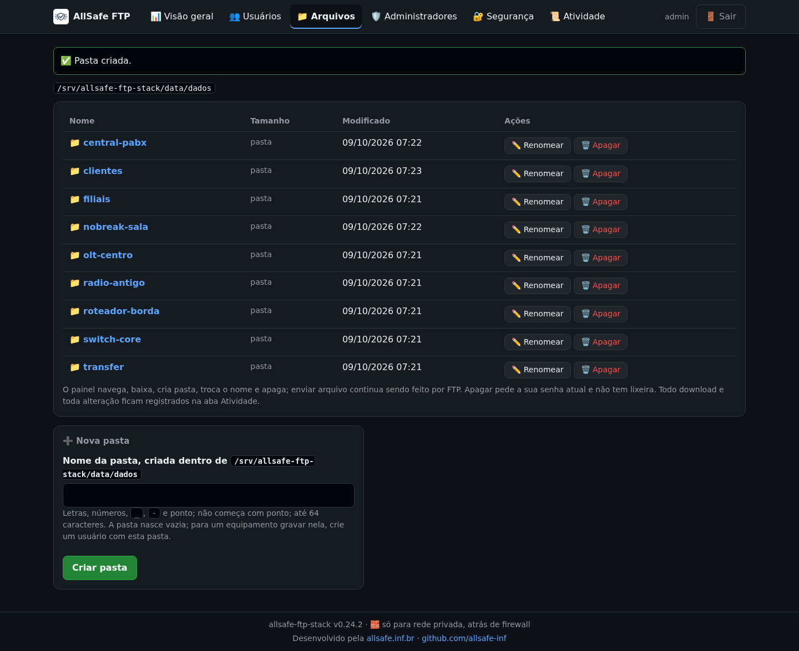</a>

<b>v0.18.4</b> · menu Arquivos, pasta criada · captura de 2026-10-05

| Campo | Obrigatório | O que preencher |
|---|---|---|
| Nome da pasta | Sim | Letras, números, `_`, `-` e ponto; não começa com ponto; até 64 caracteres. Uma pasta por vez: para criar `clientes/olt-01`, crie `clientes`, entre nela e crie `olt-01` |

**Resultado esperado:** a lista volta com a mensagem `Pasta criada.` e a pasta nova, vazia, já com o dono e a permissão que o FTP usa. Para um equipamento gravar nela, entre na pasta e clique em **Novo usuário nesta pasta**.

| Mensagem | Motivo |
|---|---|
| Caminho não aceito. | O nome foge da regra ou tenta sair da pasta dos dados |
| Já existe uma pasta ou um arquivo com este nome. | O nome já está em uso naquela pasta |
| Link simbólico não é seguido pelo painel. | O destino passa por um link simbólico |
| Pasta ou arquivo não encontrado. | A pasta de destino deixou de existir |

Detalhe técnico — rotas e proteções

- Rotas: `GET /arquivos?pasta=<caminho>` lista, `GET /arquivos/baixar?arquivo=<caminho>` entrega e `POST /arquivos/pasta` cria a pasta, com o token CSRF. Não existe rota de envio, de troca de nome nem de remoção.
- O caminho é sempre relativo a `DATA_DIR/dados`, aberto parte por parte, só para leitura e sem seguir link simbólico. Caminho com `..` recebe `400` e link simbólico, `403`, os dois com o evento `recusa_caminho`.
- O arquivo sai como anexo (`Content-Disposition: attachment`, RFC 6266 e RFC 8187), em blocos de 64 KiB, sem ser carregado na memória: o navegador salva e nunca abre.
- A pasta nova nasce com o dono `ftpdata` e o modo `0750`, os mesmos das pastas criadas pelo FTP.
- Os eventos `arquivo_baixado`, `arquivo_interrompido` e `pasta_criada` ficam na [auditoria](../painel.md#auditoria); o conteúdo do arquivo nunca é registrado.
- O funcionamento completo está em [Arquivos e download](../painel.md#arquivos).

---

## 📥 Meus arquivos

<a href="imagens/meus-arquivos.png">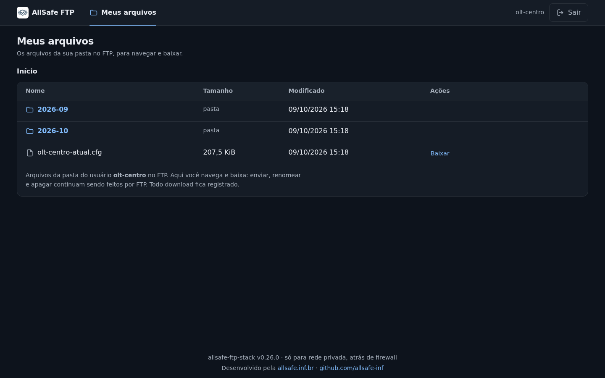</a>

<b>v0.18.4</b> · tela Meus arquivos, do usuário do FTP · captura de 2026-10-05

**Para que serve:** o dono dos arquivos baixa os próprios backups pelo navegador, sem depender de quem administra e sem conta nova.

**Como chegar:** abra o endereço do painel e entre com **o nome e a senha do FTP**, os mesmos que o equipamento usa. É a única tela que o usuário do FTP vê.

| Item da tela | O que faz |
|---|---|
| Caminho no alto da lista | Mostra a pasta aberta, a partir de **Início**, e volta a qualquer nível |
| Nome de uma pasta | Entra na pasta |
| Tamanho · Modificado | Tamanho do arquivo e data da última alteração |
| **Baixar** | Entrega o arquivo ao navegador, com o nome original |
| **Sair** | Encerra a sessão na hora |

O usuário vê só a pasta do cadastro dele e o que há dentro dela. O caminho da pasta no servidor não aparece, e não há menu de administração.

Meus arquivos ➜ Dentro de uma pasta — clique para expandir

### Meus arquivos ➜ Dentro de uma pasta

<a href="imagens/meus-arquivos-pasta.png">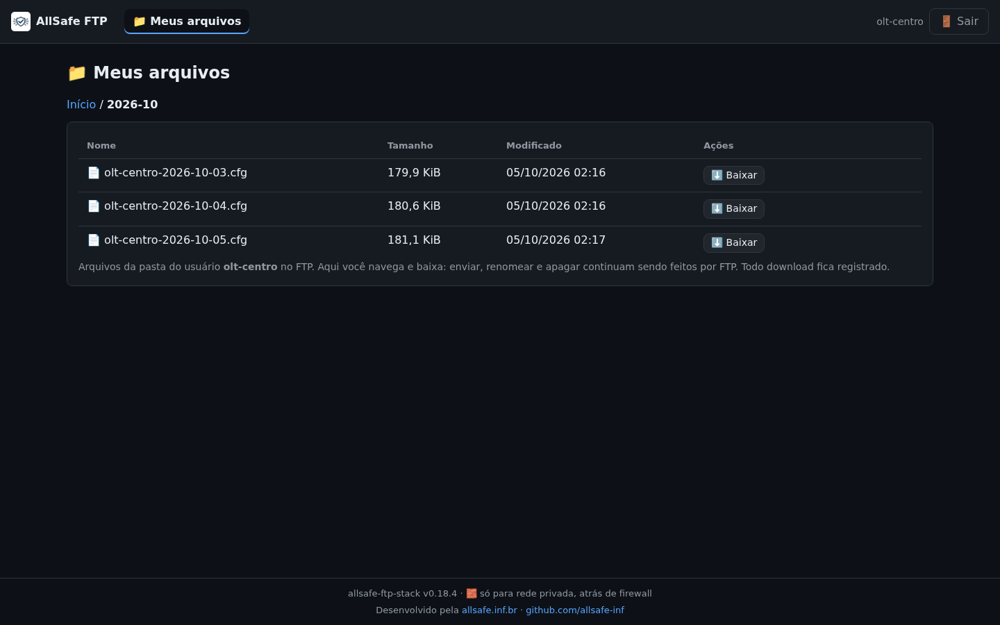</a>

<b>v0.18.4</b> · tela Meus arquivos, dentro de uma pasta · captura de 2026-10-05

1. Clique no nome da pasta para entrar.
2. Clique em **Baixar** na linha do arquivo.
3. Clique em **Início**, no caminho do alto, para voltar à pasta do usuário.

**Resultado esperado:** o arquivo salvo é idêntico ao que o equipamento enviou, e a aba Atividade, que só o administrador vê, ganha a linha `Arquivo baixado`, com o nome do usuário do FTP, o caminho e o tamanho.

| Limite | Valor |
|---|---|
| Sessões por usuário do FTP | 3; a quarta entrada encerra a mais antiga |
| Downloads ao mesmo tempo por usuário | 2; o terceiro recebe a tela `Muitos downloads ao mesmo tempo` |
| Depois de trocar a senha ou remover o usuário | A sessão dele é encerrada no pedido seguinte |

Detalhe técnico — o que a conta do FTP alcança

- Rotas da sessão do usuário do FTP: `GET /` (leva a `/meus-arquivos`), `GET /meus-arquivos?pasta=<caminho>`, `GET /meus-arquivos/baixar?arquivo=<caminho>` e `POST /sair`. Qualquer outra responde `404`; quando é uma rota de administração, fica o evento `recusa_papel`.
- Quem confere a senha é o `pure-ftpd`, por um login na rede interna da stack; o painel não lê o hash do cadastro.
- O caminho é sempre relativo à pasta do cadastro, que é a raiz dele, com as mesmas conferências da [aba Arquivos](#arquivos).
- `PAINEL_ACESSO_USUARIOS_FTP=nao` desliga esta entrada: o painel passa a aceitar só administradores.
- O funcionamento completo está em [Usuário do FTP no painel](../painel.md#usuario-ftp).

---

## 🛡️ Administradores

<a href="imagens/administradores.png">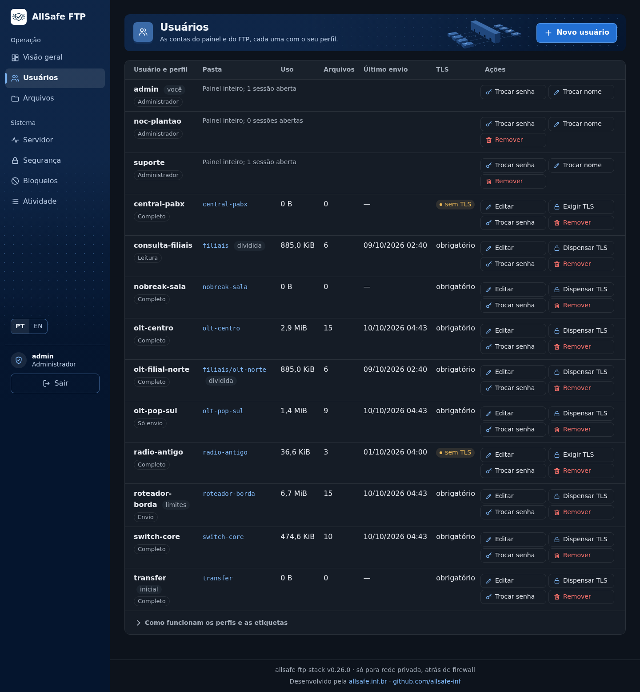</a>

<b>v0.18.4</b> · menu Administradores · captura de 2026-10-05

**Para que serve:** dar a cada pessoa que administra o painel o próprio usuário e a própria senha, e trocar o usuário e a senha do primeiro administrador depois da instalação.

**Como chegar:** menu do topo ➜ **Administradores**.

| Item da tela | O que faz |
|---|---|
| **Novo administrador** | Abre o formulário de cadastro |
| Administrador | Nome da conta. A etiqueta `você` marca a conta de quem está usando o painel |
| Sessões abertas | Quantos navegadores estão com aquela conta dentro do painel agora |
| **Trocar senha** | Abre a troca de senha, a própria ou a de outro |
| **Trocar nome** | Abre a troca do nome de entrada, o próprio ou o de outro |
| **Remover** | Abre a confirmação de remoção. Não aparece na própria conta: assim sempre sobra um administrador |

Todos têm o mesmo acesso, e o que cada um faz fica na aba Atividade com o nome de quem fez. O painel aceita até 20 administradores.

Administradores ➜ Novo administrador — clique para expandir

### Administradores ➜ Novo administrador

<a href="imagens/administradores-novo.png">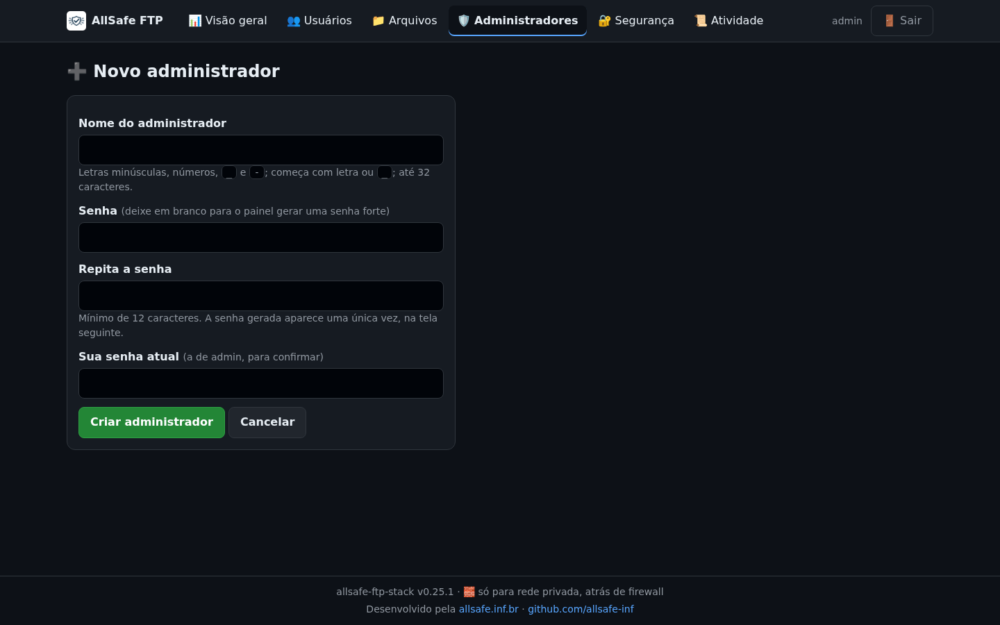</a>

<b>v0.18.4</b> · menu Administradores, formulário Novo administrador · captura de 2026-10-05

| Campo | Obrigatório | O que preencher |
|---|---|---|
| Nome do administrador | Sim | Letras minúsculas, números, `_` e `-`; começa com letra ou `_`; até 32 caracteres |
| Senha | Não | 12 caracteres ou mais. Em branco, o painel gera uma senha forte e a mostra uma única vez |
| Repita a senha | Só com a senha preenchida | A mesma senha |
| Sua senha atual | Sim | A senha de quem está usando o painel, para confirmar |

**Resultado esperado:** a lista volta com a mensagem `Administrador criado.` e o administrador novo entra logo em seguida, sem reiniciar nada.

Administradores ➜ Trocar senha — clique para expandir

### Administradores ➜ Trocar senha

<a href="imagens/administradores-trocar-senha.png">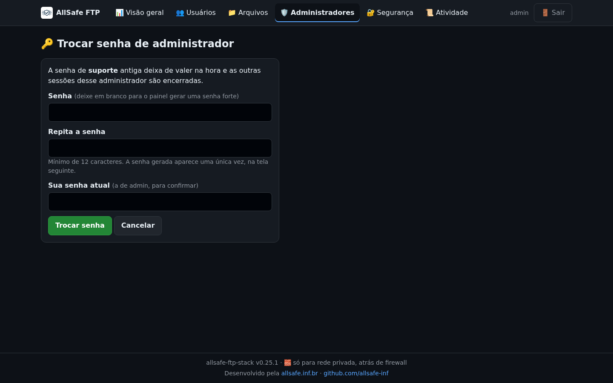</a>

<b>v0.18.4</b> · menu Administradores, formulário Trocar senha · captura de 2026-10-05

| Campo | Obrigatório | O que preencher |
|---|---|---|
| Senha | Não | A senha nova, com 12 caracteres ou mais. Em branco, o painel gera uma |
| Repita a senha | Só com a senha preenchida | A mesma senha |
| Sua senha atual | Sim | A senha de quem está usando o painel, para confirmar |

**Resultado esperado:** a lista volta com a mensagem `Senha trocada. As outras sessões desse administrador foram encerradas.` e a senha antiga deixa de valer na hora.

É por aqui que a senha inicial da instalação é trocada depois do primeiro acesso. Sem nenhum administrador que consiga entrar, a senha é redefinida pelo servidor: [Recuperar o acesso](../painel.md#senha).

Administradores ➜ Trocar nome — clique para expandir

### Administradores ➜ Trocar nome

<a href="imagens/administradores-trocar-nome.png">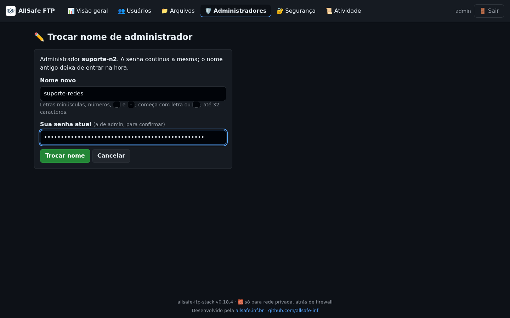</a>

<b>v0.18.4</b> · menu Administradores, formulário Trocar nome · captura de 2026-10-05

| Campo | Obrigatório | O que preencher |
|---|---|---|
| Nome novo | Sim | A mesma regra do nome do administrador; diferente do atual e de todos os outros |
| Sua senha atual | Sim | A senha de quem está usando o painel, para confirmar |

**Resultado esperado:** a lista volta com a mensagem `Nome trocado. As outras sessões desse administrador foram encerradas.` A entrada passa a ser pelo nome novo, com a mesma senha.

Trocar o nome do primeiro administrador pelo painel não mexe no `.env`: o `PAINEL_ADMIN_USER` só é usado enquanto não existe nenhum administrador.

Administradores ➜ Remover — clique para expandir

### Administradores ➜ Remover

<a href="imagens/administradores-remover.png">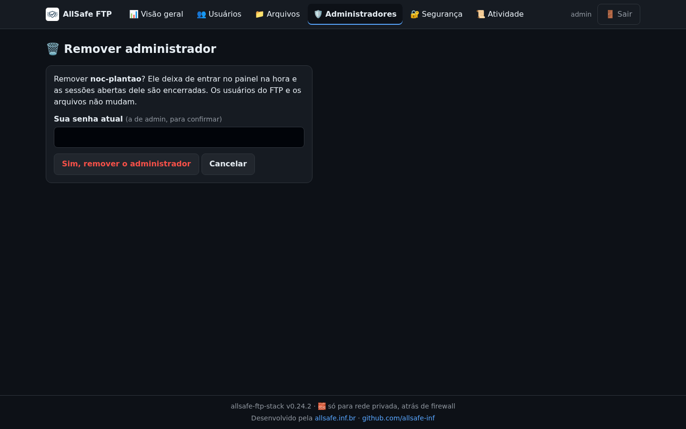</a>

<b>v0.18.4</b> · menu Administradores, confirmação de remoção · captura de 2026-10-05

| Item da tela | O que faz |
|---|---|
| Sua senha atual | Confirma que quem pede a remoção é o dono da sessão |
| **Sim, remover o administrador** | Apaga a conta: ela deixa de entrar na hora e as sessões abertas dela são encerradas |
| **Cancelar** | Volta para a lista sem alterar nada |

**Resultado esperado:** a lista volta com a mensagem `Administrador removido. As sessões dele foram encerradas.` Os usuários do FTP e os arquivos não mudam.

Detalhe técnico — mensagens de recusa, rotas e arquivo

| Mensagem | Motivo |
|---|---|
| A sua senha atual não confere. Nada foi alterado. | O campo Sua senha atual está errado; cinco recusas em 15 minutos bloqueiam o endereço |
| Já existe um administrador com este nome. | O nome já está em uso |
| O nome novo é igual ao atual. | A troca de nome não mudou nada |
| Limite de 20 administradores atingido: remova um antes de criar outro. | O painel já tem 20 administradores |

- Rotas: `GET /administradores`, `/administradores/novo`, `/administradores/senha?admin=<nome>`, `/administradores/nome?admin=<nome>` e `/administradores/remover?admin=<nome>`; o envio de cada formulário é um `POST` na mesma rota, com o token CSRF da sessão.
- Os administradores ficam em `DATA_DIR/painel/administradores` (`0600`, do `root`), uma linha `nome:hash` por conta. Só o hash `scrypt` é gravado.
- Cada alteração grava `admin_criado`, `admin_senha_trocada`, `admin_renomeado` ou `admin_removido` na [auditoria](../painel.md#auditoria), com quem fez e quem foi alterado; a senha atual errada grava `admin_senha_atual_recusada`.
- As regras completas estão em [Administradores do painel](../painel.md#administradores).

---

## 🔐 Segurança

<b>v0.18.4</b> · menu Segurança · captura de 2026-10-05

**Para que serve:** conferir, em uma tela, se a instalação está dentro do que a stack exige: rede privada, TLS, certificados válidos, painel isolado e contato de segurança publicado.

**Como chegar:** menu do topo ➜ **Segurança**.

| Item da tela | O que mostra |
|---|---|
| Endereço público | Se a stack recusa endereço público (o padrão) ou se ele foi aceito com `REDE_PERMITIR_IP_PUBLICO=sim` |
| Endereço do FTP · IP anunciado no modo passivo | Onde o FTP escuta e o IP que ele informa ao cliente, com a indicação de privado ou público |
| TLS do FTP | O modo em uso (`FTP_TLS_MODE`), se a exceção por usuário está ligada e quem está dispensado |
| Certificado do FTP · Certificado do painel | Validade e impressão digital SHA-256, para comparar com a que o cliente FTP e o navegador mostram |
| Endereço do painel · Frente web | Onde o nginx publica o painel e como ele repassa os pedidos |
| Quem pode abrir o painel | As redes de `PAINEL_REDES_PERMITIDAS`; rede pública na lista aparece destacada |
| Sessão | Tempo sem uso, tempo máximo e bloqueio por entrada errada |
| Entrada dos usuários do FTP | Se os usuários do FTP entram no painel (`PAINEL_ACESSO_USUARIOS_FTP`) e como a senha deles é conferida |
| Custo das senhas do FTP | Se todas as senhas estão gravadas com o custo do porte atual, ou quais usuários ainda estão com o anterior |
| Contato de segurança | O e-mail publicado em `/.well-known/security.txt` (`SEGURANCA_CONTATO_EMAIL`), ou o aviso de que não há contato |
| Container do painel | Raiz somente leitura e sem acesso ao Docker do host |
| Firewall do host | Lembrete: o painel não enxerga o firewall; a conferência é de quem administra o servidor |

Nada é alterado por esta aba. As regras de firewall de exemplo estão em [Segurança](../seguranca.md#rede-privada).

Segurança ➜ Alerta de usuário sem TLS — clique para expandir

### Segurança ➜ Alerta de usuário sem TLS

<a href="imagens/seguranca-tls-por-usuario.png">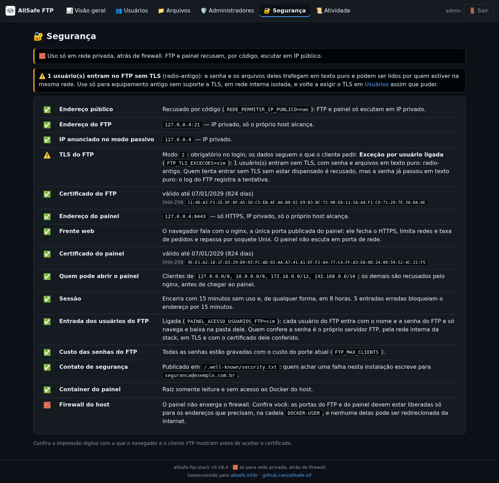</a>

<b>v0.18.4</b> · menu Segurança, alerta de usuário sem TLS · captura de 2026-10-05

Com `FTP_TLS_EXCECOES=sim` e pelo menos um usuário dispensado, a aba abre com o alerta e a linha **TLS do FTP** troca a marca de conferido pela de atenção, com a quantidade e os nomes de quem entra sem TLS.

**Resultado esperado:** depois de **Usuários ➜ Exigir TLS** no último usuário dispensado, o alerta some e a linha volta a dizer que todos entram com TLS.

Detalhe técnico — o que cada linha lê

- Rota `GET /seguranca`.
- As impressões digitais são calculadas dos arquivos `DATA_DIR/certs` (FTP) e `DATA_DIR/painel/tls` (painel), os mesmos que os serviços usam.
- As linhas com endereço e rede vêm do `.env`. Por padrão a stack recusa subir com valor que não seja privado; com `REDE_PERMITIR_IP_PUBLICO=sim`, o endereço e a rede públicos aparecem com a marca de atenção: [Segurança](../seguranca.md#ip-publico).
- O custo das senhas compara a memória gravada na senha de cada usuário com a do usuário inicial, que o serviço `ftp` regrava a cada subida; o hash não sai do cadastro: [Custo das senhas](../seguranca.md#custo-das-senhas).
- O contato é o valor de `SEGURANCA_CONTATO_EMAIL`; o arquivo `/.well-known/security.txt` segue a RFC 9116: [Contato de segurança](../seguranca.md#contato-de-seguranca).
- A última linha não tem marca de conferido de propósito: nenhum container da stack lê as regras de firewall do host.

---

## 📜 Atividade

<b>v0.18.4</b> · menu Atividade · captura de 2026-10-05

**Para que serve:** saber quem entrou no painel, de onde, o que foi alterado e quem baixou cada arquivo.

**Como chegar:** menu do topo ➜ **Atividade**.

| Coluna | O que mostra |
|---|---|
| Quando | Data e hora do registro, do mais novo para o mais antigo |
| De onde | Endereço de quem fez o pedido |
| O que aconteceu | O evento, em uma frase: a tabela abaixo lista os principais |
| Detalhe | Quem fez (`admin=` ou `usuario=`), quem ou o que foi alterado, o caminho e o tamanho do arquivo. Senha e token nunca aparecem |

| O que aconteceu | Quando aparece |
|---|---|
| Entrada · Entrada recusada · Entrada bloqueada pelo limite de tentativas · Saída | Alguém entrou, errou o usuário ou a senha, teve o endereço bloqueado ou saiu |
| Usuário criado · Senha trocada · Usuário removido | Alteração de usuário do FTP, com o administrador que fez |
| Usuário dispensado do TLS · Usuário volta a exigir TLS | Alteração do TLS de um usuário |
| Arquivo baixado · Download interrompido | Download pela aba Arquivos ou pela tela Meus arquivos, completo ou cortado antes do fim |
| Pasta criada | Pasta criada pela aba Arquivos |
| Administrador criado · Senha de administrador trocada · Administrador renomeado · Administrador removido | Alteração de administrador, com quem fez e quem foi alterado |
| Senha atual recusada | Alteração de administrador recusada pela senha de confirmação |
| Tela de administração pedida por usuário do FTP | Um usuário do FTP tentou abrir uma aba de administração e recebeu `404` |
| Sessão de usuário do FTP encerrada | A senha ou a pasta do usuário mudou, ou ele foi removido |
| Caminho de arquivo recusado | Pedido que tenta sair da pasta dos dados ou que passa por link simbólico |

A aba mostra os últimos 300 registros. As transferências dos equipamentos não ficam aqui: estão no log do FTP, em [Operação](../operacao.md#logs).

Detalhe técnico — arquivo e eventos

- Rota `GET /atividade`.
- Os registros vêm de `DATA_DIR/painel/auditoria.log` (`0600`, do `root`). A lista completa de eventos, com o nome de cada um no arquivo, está em [Painel web](../painel.md#auditoria).
- O nome digitado em uma entrada recusada não é gravado: é comum a senha cair nesse campo por engano.
- Na foto, `172.29.5.1` é o endereço do host visto pela rede interna da stack fotografada: o acesso partiu do próprio servidor.

---

## 🎞️ Como as fotos foram feitas

Capturas reais do painel no ar, feitas com Playwright no Google Chrome, em 1440×900 e tema escuro. A stack fotografada foi uma instalação de demonstração, separada da instalação em uso: subiu em `127.0.0.4`, com nomes de container, rede, pasta de dados e segredos próprios, recebeu usuários e arquivos de exemplo por FTPS e foi removida depois das fotos. Por isso a coluna **Pasta no host** mostra uma pasta temporária.

Nenhuma senha aparece nas imagens: os campos de senha são mascarados pelo navegador e a senha gerada foi trocada por `<REDACTED>` antes da captura. As impressões digitais são dos certificados autoassinados da instalação fotografada; cada instalação gera os seus. O e-mail do contato de segurança é um endereço de exemplo.

Para abrir as imagens fora do GitHub, com aproximar e mover: [`imagens/visualizador.html`](imagens/visualizador.html).

---

⬅️ [Painel web](../painel.md) · 🏠 [Documentação](../README.md) · ➡️ [Solução de problemas](../solucao-de-problemas.md)
