# 🏗️ Arquitetura — allsafe-ftp-stack

↩ [README do projeto](../README.md) · [📚 Índice da documentação](README.md)

## 💡 Em poucas palavras

A stack é um servidor FTP dentro de um único container. Ele tem três "gavetas" que sobrevivem a reinícios: uma para os arquivos enviados, uma para a lista de usuários e uma para o certificado de segurança. O usuário opera pelo host com dois scripts; os equipamentos de rede conectam pela porta do FTP e enviam o backup.

<a href="diagramas/visao-geral-diagrama.mmd"><picture>
  <source media="(prefers-color-scheme: dark)" srcset="diagramas/visao-geral-diagrama-escuro.svg">
  
</picture></a>

<sub>📐 Nível 1 · Diagrama · 🔍 abrir com zoom e movimento: [no GitHub](diagramas/visao-geral-diagrama.mmd) · [no computador](diagramas/visualizador.html#visao-geral-diagrama)</sub>

**🧭 Sequência:** 📡 Equipamento de rede ➜ ⚙️ Pure-FTPd (`allsafe-ftp`) ➜ 🗄️ PureDB ➜ 💽 `/data` ➜ 🏁 backup guardado

---

<details>
<summary>🧭 Sumário — clique para expandir</summary>

[🗺️ Mapa da arquitetura](#mapa) · [🧩 Componentes](#componentes) · [💽 Volumes](#volumes) · [🌐 Rede](#rede) · [🔄 Modelo da subida](#subida) · [🚩 Opções do `pure-ftpd`](#flags-do-pure-ftpd) · [🩺 Healthcheck](#healthcheck) · [🧱 Endurecimento](#endurecimento-resumo)

</details>

---

<a name="mapa"></a>

## 🗺️ Mapa da arquitetura

<a href="diagramas/arquitetura-mapa.mmd"><picture>
  <source media="(prefers-color-scheme: dark)" srcset="diagramas/arquitetura-mapa-escuro.svg">
  
</picture></a>

<sub>📐 Nível 2 · Mapa · 🔍 abrir com zoom e movimento: [no GitHub](diagramas/arquitetura-mapa.mmd) · [no computador](diagramas/visualizador.html#arquitetura-mapa)</sub>

| Nº | De ➜ Para | O que acontece |
|---|---|---|
| 1 | 👤 Usuário ➜ ⌨️ `deploy.sh` | O usuário executa `./deploy.sh --size small` no host |
| 2 | ⌨️ `deploy.sh` ➜ ⚙️ Pure-FTPd | O script valida o Compose e roda `docker compose up -d --build` |
| 3 | 📡 Equipamento de rede ➜ ⚙️ Pure-FTPd | O cliente conecta por FTPS em `21/tcp`, mapeada para `2121/tcp` |
| 4 | ⚙️ Pure-FTPd ➜ 💽 `allsafe-ftp-data` | O arquivo é gravado pelo canal passivo `30000-30049/tcp` |
| 5 | 💽 `allsafe-ftp-data` ➜ 🏁 backup guardado | O arquivo fica no volume, na pasta do usuário |

**🧷 Apoio**

| Quem | Usa | Como |
|---|---|---|
| ⌨️ `deploy.sh` e `manage-user.sh` | 📄 `.env` e perfil | lê |
| ⚙️ Pure-FTPd | 🔑 `.secrets/ftp_password.txt` | lê na subida, somente leitura |
| ⚙️ Pure-FTPd | 🗄️ `allsafe-ftp-auth` (PureDB) | consulta os usuários |
| ⚙️ Pure-FTPd | 💽 `allsafe-ftp-certs` | lê o certificado |
| ⚙️ Pure-FTPd | 📚 log CLF (`stdout`) | grava cada transferência |

---

<a name="componentes"></a>

## 🧩 Componentes

| Peça | Onde | Papel |
|---|---|---|
| Serviço `ftp` | [`compose.yaml`](../compose.yaml) | Único container da stack (`allsafe-ftp`) |
| Imagem | [`Dockerfile`](../Dockerfile) | `debian:bookworm-slim` fixada por digest, com `pure-ftpd`, `pure-ftpd-common`, `openssl`, `procps` e `ca-certificates` |
| Usuário do processo de dados | [`Dockerfile`](../Dockerfile) | `ftpdata`, uid e gid **10000**, shell `nologin`, sem home |
| Entrypoint | [`scripts/entrypoint.sh`](../scripts/entrypoint.sh), instalado como `/usr/local/sbin/allsafe-ftp-entrypoint` | Provisiona usuário e certificado e faz `exec` do `pure-ftpd` |
| Gestão de usuários | [`scripts/ftp-user.sh`](../scripts/ftp-user.sh), instalado como `/usr/local/sbin/allsafe-ftp-user` | `add`, `passwd`, `del` e `list` no PureDB, chamado de fora por [`manage-user.sh`](../manage-user.sh) |

O que cada script faz, com parâmetros e saída: [⌨️ Scripts](scripts.md).

---

<a name="volumes"></a>

## 💽 Volumes

| Volume (nome) | Monta em | Guarda |
|---|---|---|
| `allsafe-ftp-data` | `/data` | Arquivos dos usuários: um diretório `chroot` por usuário (`/data/<usuario>`) |
| `allsafe-ftp-auth` | `/auth` | Base **PureDB**: `pureftpd.passwd` (texto, com o hash das senhas) e `pureftpd.pdb` (compilada), ambos `0600` |
| `allsafe-ftp-certs` | `/etc/ssl/private` | `pure-ftpd.pem`: chave e certificado concatenados, `0600` |
| _bind_ `./.secrets` | `/run/.secrets` (somente leitura) | Arquivo da senha do usuário inicial |

Além deles, dois `tmpfs`: `/run` (8 MiB) e `/tmp` (16 MiB), ambos `noexec,nosuid,nodev`.

---

<a name="rede"></a>

## 🌐 Rede

- Rede bridge dedicada `allsafe-ftp-network`, sub-rede `172.29.1.0/29` (variável `FTP_SUBNET`).
- Publicações no host (veja [⚙️ Configuração](configuracao.md#rede-e-portas)):

| Publicação | Para quê |
|---|---|
| `FTP_BIND_IP:FTP_PORT` ➜ `2121/tcp` | canal de controle |
| `FTP_BIND_IP:30000-30049` ➜ `30000-30049/tcp` | canal de dados, modo passivo, 1:1 |

- Sem DNS reverso (`-H`): o `pure-ftpd` nunca resolve o IP do cliente.

---

<a name="subida"></a>

## 🔄 Modelo da subida

O que acontece entre o `./deploy.sh` e o container `healthy`.

<a href="diagramas/subida-modelo.mmd"><picture>
  <source media="(prefers-color-scheme: dark)" srcset="diagramas/subida-modelo-escuro.svg">
  
</picture></a>

<sub>📐 Nível 3 · Modelo · 🔍 abrir com zoom e movimento: [no GitHub](diagramas/subida-modelo.mmd) · [no computador](diagramas/visualizador.html#subida-modelo)</sub>

| Nº | De ➜ Para | O que acontece | Protocolo e porta | Regra |
|---|---|---|---|---|
| 1 | 👤 Usuário ➜ ⌨️ `deploy.sh` | Executa `./deploy.sh --size small` | — | Sem `.env`, o script cria um a partir do exemplo e para |
| 2 | ⌨️ `deploy.sh` ➜ 🐳 Docker Compose | Roda `docker compose up -d --build` com `.env` e o perfil | — | Antes roda `config --quiet`; configuração inválida não sobe |
| 3 | 🐳 Docker Compose ➜ ⚙️ entrypoint | Inicia o container `allsafe-ftp` | — | Raiz somente leitura, `tini` como processo 1 |
| 4 | ⚙️ entrypoint ➜ ❓ variáveis válidas? | Confere usuário, senha, faixa passiva e modo TLS | — | Nome `^[a-z_][a-z0-9_-]{0,31}$`, senha de 12 ou mais, faixa entre `1024` e `65535`, TLS `1`, `2` ou `3` |
| 5a | ❓ variáveis válidas? ➜ 👥 `pure-pw` | ✅ Sim: cria (`useradd`) ou atualiza (`usermod`) o usuário inicial | — | Usuário virtual com uid e gid `ftpdata`, home `/data/<usuario>` |
| 5b | ❓ variáveis válidas? ➜ ⛔ FALHA no log | ❌ Não: o entrypoint sai com `FALHA: <motivo>` | — | O container reinicia em laço até a correção |
| 6 | 👥 `pure-pw` ➜ ❓ certificado existe? | Compila o banco com `pure-pw mkdb` e segue | — | `pureftpd.passwd` e `pureftpd.pdb` ficam `0600` |
| 7a | ❓ certificado existe? ➜ ⚙️ `pure-ftpd` | ✅ Sim: reutiliza o `pure-ftpd.pem` | — | O certificado existente nunca é sobrescrito |
| 7b | ❓ certificado existe? ➜ 🔏 `openssl` | ❌ Não: gera um autoassinado | — | RSA 3072, SHA-256, 825 dias, SAN `IP:` ou `DNS:` conforme `FTP_CERT_CN` |
| 8 | 🔏 `openssl` ➜ ⚙️ `pure-ftpd` | Certificado pronto, `0600` | — | As variáveis de senha são apagadas (`unset`) antes do `exec` |
| 9 | ⚙️ `pure-ftpd` ➜ 🩺 healthcheck | Processo conferido a cada 20 s | TCP `2121` e `30000-30049` | `start_period` de 20 s, 5 tentativas |
| 10 | 🩺 healthcheck ➜ 🏁 FTP pronto | Processo vivo: container `healthy` | — | Confere só o processo, não o login |

**🧷 Apoio**

| Quem | Usa | Como |
|---|---|---|
| ⌨️ `deploy.sh` | 🔑 `.secrets/ftp_password.txt` | gera a senha se o arquivo estiver vazio, `0600` |
| 🐳 Docker Compose | 📄 `.env` e `profiles/small.env` | lê |
| ⚙️ entrypoint | 🔑 `.secrets/ftp_password.txt` | lê, somente leitura |
| ⚙️ entrypoint | 💽 `/data` | cria a pasta do usuário |
| 👥 `pure-pw` | 🗄️ PureDB (`/auth/pureftpd.pdb`) | grava |
| 🔏 `openssl` | 📄 `pure-ftpd.pem` | grava |
| ⚙️ `pure-ftpd` | 📄 `pure-ftpd.pem` | lê |
| ⚙️ `pure-ftpd` | 🗄️ PureDB | consulta |

Nas subidas seguintes o usuário inicial é **atualizado** (`usermod`) e o certificado existente é **mantido**.

<details>
<summary>🔬 Detalhe técnico — quem é o processo 1</summary>

Com `init: true` no [`compose.yaml`](../compose.yaml), o processo 1 do container é o `tini` (`docker-init`). Ele inicia o entrypoint, que termina com `exec /usr/sbin/pure-ftpd`: o `pure-ftpd` toma o lugar do entrypoint e fica como filho direto do `tini`, que repassa os sinais e recolhe processos órfãos.

Ao terminar, o entrypoint escreve no log: `FTP pronto em 2121/tcp; TLS=<modo>; passivo=<inicio>-<fim>`.

</details>

---

<a name="flags-do-pure-ftpd"></a>

## 🚩 Opções do `pure-ftpd`

Linha final do [`entrypoint.sh`](../scripts/entrypoint.sh):

| Opção | Efeito |
|---|---|
| `-A` | `chroot` de **todos** os usuários no próprio diretório |
| `-E` | Proíbe login anônimo |
| `-H` | Não resolve DNS reverso do cliente |
| `-j` | Cria o diretório home do usuário se não existir |
| `-R` | Proíbe `chmod` pelo cliente |
| `-c <n>` | Máximo de clientes simultâneos (`FTP_MAX_CLIENTS`) |
| `-C <n>` | Máximo de clientes por IP (`FTP_MAX_CLIENTS_PER_IP`) |
| `-I 15` | Tempo máximo de ociosidade: 15 minutos |
| `-L 10000:8` | Limite de `ls`: 10000 arquivos, profundidade 8 |
| `-u 10000` | UID mínimo autorizado a logar (bloqueia contas de sistema) |
| `-U 133:022` | `umask`: 133 para arquivos, 022 para diretórios |
| `-l puredb:/auth/pureftpd.pdb` | Backend de autenticação |
| `-p INICIO:FIM` | Faixa de portas passivas |
| `-P <ip>` | IP anunciado no `PASV` (`FTP_PUBLIC_IP`) |
| `-S 0.0.0.0,2121` | Escuta na porta 2121 (não privilegiada) |
| `-Y <modo>` | Política TLS (`FTP_TLS_MODE`): veja [⚙️ Configuração](configuracao.md#tls) |
| `-O clf:/dev/stdout` | Log de acesso em formato CLF no `stdout` |

---

<a name="healthcheck"></a>

## 🩺 Healthcheck

```yaml
test: ["CMD-SHELL", "pidof pure-ftpd >/dev/null"]
interval: 20s   timeout: 5s   retries: 5   start_period: 20s
```

Verifica apenas que o processo está vivo. Para uma checagem funcional (o usuário existe no PureDB), use `./scripts/validate.sh --runtime`: veja [⌨️ Scripts](scripts.md#validate).

---

<a name="endurecimento-resumo"></a>

## 🧱 Endurecimento

| Medida | Onde |
|---|---|
| Raiz somente leitura | `read_only: true` |
| Sem privilégios além do necessário | `cap_drop: ALL` e só as capabilities que o `pure-ftpd` usa (chroot, troca de uid e gid, `nice`) |
| Sem ganho de privilégio | `no-new-privileges: true` |
| Limites de recurso | `pids_limit`, `mem_limit`, `cpus`, `ulimits.nofile` |
| Log com rotação | `logging: local`, 10 MB × 3 |

Justificativa de cada diretiva e de cada `cap_add`: [🔐 Segurança](seguranca.md#hardening-do-compose-yaml-linha-a-linha).

---

⬅️ [🎚️ Perfis](perfis.md) · 🏠 [Documentação](README.md) · ➡️ [🔐 Segurança](seguranca.md)
