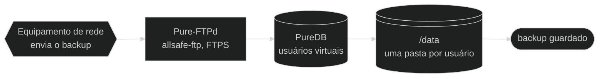

# 🏗️ Arquitetura — allsafe-ftp-stack

↩ [README do projeto](../README.md) · [Índice da documentação](README.md)

## 💡 Em poucas palavras

A stack tem três containers: o servidor FTP, o painel web que administra os usuários dele e o nginx, a porta de entrada do painel. Quatro "gavetas" sobrevivem a reinícios: uma para os arquivos enviados, uma para a lista de usuários, uma para o certificado do FTP e uma para o certificado e o histórico do painel. Uma quinta pasta, refeita a cada subida, liga o nginx ao painel. O usuário opera pelo painel ou pelo host, com scripts; os equipamentos de rede conectam pela porta do FTP e enviam o backup.

<!-- diagrama: diagramas/visao-geral-diagrama.mmd -->


<sub>Nível 1 · Diagrama · [fonte](diagramas/)</sub>

**Sequência:** Equipamento de rede ➜ Pure-FTPd (`allsafe-ftp`) ➜ PureDB ➜ `/data` ➜ backup guardado

---

<details>
<summary>Sumário — clique para expandir</summary>

[Mapa da arquitetura](#mapa) · [Componentes](#componentes) · [Volumes](#volumes) · [Rede](#rede) · [Modelo da subida](#subida) · [Opções do `pure-ftpd`](#flags-do-pure-ftpd) · [Healthcheck](#healthcheck) · [Endurecimento](#endurecimento-resumo)

</details>

---

<a name="mapa"></a>

## 🗺️ Mapa da arquitetura

Os três containers, as pastas do host e quem fala com quem, na ordem em que as coisas acontecem.

<details>
<summary>Mapa da arquitetura, com a sequência escrita — clique para expandir</summary>

<!-- diagrama: diagramas/arquitetura-mapa.mmd -->
```mermaid
%%{init: {"theme": "dark"}}%%
flowchart LR
    subgraph USO["Quem usa"]
        operador@{ shape: person, label: "Usuário<br>opera a stack" }
        equip@{ shape: hex, label: "Equipamento de rede<br>cliente FTP" }
    end
    subgraph HOST["Host"]
        scripts@{ shape: console, label: "deploy.sh<br>manage-user.sh" }
        env@{ shape: doc, label: ".env<br>configuração e limites" }
        segredo@{ shape: doc, label: ".secrets<br>senha do FTP, hash do painel" }
    end
    subgraph CONTAINERS["Containers · rede allsafe-ftp-network"]
        nginx@{ shape: rect, label: "nginx<br>allsafe-ftp-nginx, 8443/tcp" }
        painel@{ shape: rect, label: "Painel web<br>allsafe-ftp-painel, soquete Unix" }
        ftp@{ shape: rect, label: "Pure-FTPd<br>allsafe-ftp, 2121/tcp" }
        logs@{ shape: docs, label: "log CLF<br>stdout" }
    end
    subgraph VOLUMES["Volumes"]
        vnginx@{ shape: lin-cyl, label: "DATA_DIR/nginx<br>/nginx, soquete e cópia do certificado" }
        vpainel@{ shape: lin-cyl, label: "DATA_DIR/painel<br>/painel, certificado e auditoria" }
        vauth@{ shape: cyl, label: "DATA_DIR/auth<br>/auth, PureDB" }
        vcerts@{ shape: lin-cyl, label: "DATA_DIR/certs<br>/etc/ssl/private" }
        vdata@{ shape: lin-cyl, label: "DATA_DIR/dados<br>/data" }
    end
    subgraph RESULTADO["Resultado"]
        fim@{ shape: stadium, label: "backup guardado" }
    end

    operador -- "1 · ./deploy.sh" --> scripts
    scripts -- "2 · docker compose build e up -d --wait" --> ftp
    operador -- "3 · HTTPS, TCP 8443" --> nginx
    nginx -- "4 · repassa pelo soquete Unix" --> painel
    painel -- "5 · cria, troca a senha ou remove o usuário" --> vauth
    equip -- "6 · FTPS, TCP 21 para 2121" --> ftp
    ftp -- "7 · grava o arquivo, faixa passiva do perfil" --> vdata
    vdata -- "8 · arquivo no volume" --> fim
    scripts -. "cria, lê e grava o perfil" .-> env
    ftp -. "lê a senha na subida, só leitura" .-> segredo
    painel -. "lê o hash a cada entrada, só leitura" .-> segredo
    ftp -. "consulta os usuários" .-> vauth
    ftp -. "lê o certificado" .-> vcerts
    painel -. "grava certificado e auditoria" .-> vpainel
    painel -. "cria o soquete e copia o certificado" .-> vnginx
    nginx -. "lê, só leitura" .-> vnginx
    painel -. "cria a pasta do usuário" .-> vdata
    ftp -. "grava cada transferência" .-> logs
```

<sub>Nível 2 · Mapa · [fonte](diagramas/)</sub>

| Nº | De ➜ Para | O que acontece |
|---|---|---|
| 1 | Usuário ➜ `deploy.sh` | O usuário executa `./deploy.sh` no host |
| 2 | `deploy.sh` ➜ Pure-FTPd | O script valida a configuração, constrói as imagens (`docker compose build`), sobe os três containers (`up -d --wait`) e espera ficarem `healthy` |
| 3 | Usuário ➜ nginx | O usuário abre o painel por HTTPS em `8443/tcp`: quem atende é o nginx, que confere a rede de origem e a taxa de pedidos |
| 4 | nginx ➜ Painel web | O pedido aceito é repassado ao painel pelo soquete Unix, com o endereço do cliente |
| 5 | Painel web ➜ `DATA_DIR/auth` | O painel cria, troca a senha ou remove o usuário no PureDB |
| 6 | Equipamento de rede ➜ Pure-FTPd | O cliente conecta por FTPS em `21/tcp`, mapeada para `2121/tcp` |
| 7 | Pure-FTPd ➜ `DATA_DIR/dados` | O arquivo é gravado pelo canal passivo, na faixa do perfil (`30000-30049/tcp` no `small`) |
| 8 | `DATA_DIR/dados` ➜ backup guardado | O arquivo fica na pasta do usuário, no host |

**Apoio**

| Quem | Usa | Como |
|---|---|---|
| `deploy.sh` e `manage-user.sh` | `.env` | cria, lê e grava o perfil |
| Pure-FTPd | `.secrets` (`ftp-usuario-inicial-senha.txt`) | lê a senha na subida, somente leitura |
| Painel web | `.secrets` (`painel-admin-inicial-senha-hash.txt`) | lê o hash a cada entrada, somente leitura |
| Pure-FTPd | `DATA_DIR/auth` (PureDB) | consulta os usuários |
| Pure-FTPd | `DATA_DIR/certs` | lê o certificado |
| Painel web | `DATA_DIR/painel` | grava o certificado e a auditoria |
| Painel web | `DATA_DIR/nginx` | cria o soquete e copia o certificado, a cada subida |
| nginx | `DATA_DIR/nginx` | lê o soquete e o certificado, somente leitura |
| Painel web | `DATA_DIR/dados` | cria a pasta do usuário |
| Pure-FTPd | log CLF (`stdout`) | grava cada transferência |

</details>

---

<a name="componentes"></a>

## 🧩 Componentes

| Peça | Onde | Papel |
|---|---|---|
| Serviço `ftp` | [`compose.yaml`](../compose.yaml) | Container do servidor FTP (`allsafe-ftp`) |
| Serviço `painel` | [`compose.yaml`](../compose.yaml) | Container do painel web (`allsafe-ftp-painel`); só inicia depois de o `ftp` ficar `healthy` e não publica porta |
| Serviço `nginx` | [`compose.yaml`](../compose.yaml) | Container da frente web (`allsafe-ftp-nginx`), a única porta publicada do painel; só inicia depois de o `painel` ficar `healthy` e reinicia junto com ele |
| Imagens | [`Dockerfile`](../Dockerfile) | Três alvos sobre o mesmo `debian:trixie-slim` (Debian 13), fixado por digest. Alvo `ftp`: `pure-ftpd`, `pure-ftpd-common`, `openssl` e o entrypoint do FTP. Alvo `painel`: os mesmos pacotes, `python3` e o painel. Alvo `nginx`: só `nginx` e `openssl`, sem nada do FTP |
| Usuário do processo de dados | [`Dockerfile`](../Dockerfile) | `ftpdata`, uid e gid **10000**, shell `nologin`, sem home |
| Entrypoint | [`ftp/entrypoint.sh`](../ftp/entrypoint.sh), instalado como `/usr/local/sbin/allsafe-ftp-entrypoint` | Provisiona usuário e certificado e faz `exec` do `pure-ftpd` |
| Gestão de usuários | [`ftp/usuario.sh`](../ftp/usuario.sh), instalado nas imagens do FTP e do painel como `/usr/local/sbin/allsafe-ftp-user` | `add`, `passwd`, `del` e `list` no PureDB, chamado de fora por [`manage-user.sh`](../manage-user.sh) e, dentro do painel, pelo servidor web |
| Painel web | Módulos Python de [`painel/`](../painel/), em `/opt/painel`; o ponto de entrada é o [`painel/servidor.py`](../painel/servidor.py) | Servidor em Python, só com a biblioteca padrão e sem JavaScript: telas, sessão e auditoria, um assunto por módulo ([lista](painel.md#modulos)). Atende só o nginx, por soquete Unix |
| Entrypoint do painel | [`painel/entrypoint.sh`](../painel/entrypoint.sh), instalado como `/usr/local/sbin/allsafe-painel-entrypoint` | Confere a rede privada, gera o certificado, entrega a cópia dele ao nginx e faz `exec` do servidor |
| Frente web | [`nginx/nginx.conf.modelo`](../nginx/nginx.conf.modelo), [`nginx/cabecalhos.conf`](../nginx/cabecalhos.conf) e as páginas de erro de [`nginx/erro/`](../nginx/erro/) | nginx sem root: fecha o HTTPS, recusa quem está fora das redes permitidas, limita taxa de pedidos, conexões e tamanho do pedido, entrega os arquivos estáticos e repassa o resto ao painel |
| Arquivos estáticos | [`web/estilo.css`](../web/estilo.css), na imagem do nginx em `/usr/share/allsafe-nginx/web` | Aparência do painel. O nginx entrega direto, com os cabeçalhos de segurança de `cabecalhos.conf`, sem ocupar o painel |
| Entrypoint do nginx | [`nginx/entrypoint.sh`](../nginx/entrypoint.sh), instalado como `/usr/local/sbin/allsafe-nginx-entrypoint` | Confere a rede privada, gera a configuração a partir do modelo e faz `exec` do `nginx` |

O que cada script faz, com parâmetros e saída: [Scripts](scripts.md). Uso e proteções do painel: [Painel web](painel.md).

---

<a name="volumes"></a>

## 💽 Volumes

| Pasta no host | Monta em | Quem monta | Guarda |
|---|---|---|---|
| `DATA_DIR/dados` | `/data` | `ftp` e `painel` | Arquivos dos usuários: um diretório `chroot` por usuário (`/data/<usuario>`) |
| `DATA_DIR/auth` | `/auth` | `ftp` e `painel` | Base **PureDB**: `pureftpd.passwd` (texto, com o hash das senhas) e `pureftpd.pdb` (compilada), ambos `0600`; `ftp-cert.pem`, cópia do certificado do FTP **sem a chave**; `.lock`, a trava das alterações |
| `DATA_DIR/certs` | `/etc/ssl/private` | só `ftp` | `pure-ftpd.pem`: chave e certificado concatenados, `0600` |
| `DATA_DIR/painel` | `/painel` | só `painel` | `tls/painel-cert.pem`, `tls/painel-key.pem` (`0600`) e `auditoria.log` (`0600`); pasta `0700` |
| `DATA_DIR/nginx` | `/nginx` | `painel` (grava) e `nginx` (somente leitura) | `painel.sock`, o soquete Unix do painel, e `tls/`, a cópia do certificado e da chave (`0640`) para o nginx; pasta `0750`, do grupo `10001`. Refeita a cada subida |
| segredo `ftp_usuario_inicial_senha` (`SECRETS_DIR/ftp-usuario-inicial-senha.txt`) | `/run/secrets/ftp_usuario_inicial_senha` (somente leitura) | só `ftp` | Senha do usuário inicial |
| segredo `painel_admin_inicial_senha_hash` (`SECRETS_DIR/painel-admin-inicial-senha-hash.txt`) | `/run/secrets/painel_admin_inicial_senha_hash` (somente leitura) | só `painel` | Hash `scrypt` da senha do painel |

Cada serviço vê um único arquivo de `.secrets/`, e o `nginx` não vê nenhum. Além disso, o `ftp` e o `painel` têm dois `tmpfs`, `/run` (8 MiB) e `/tmp` (16 MiB), e o `nginx` tem `/run/nginx` (1 MiB) e `/tmp/nginx` (16 MiB), do usuário `10001`. Todos `noexec,nosuid,nodev`.

---

<a name="rede"></a>

## 🌐 Rede

- Rede bridge dedicada `allsafe-ftp-network`, sub-rede `172.29.1.0/29` (variável `FTP_SUBNET`), com os três containers.
- Publicações no host (veja [Configuração](configuracao.md#rede-e-portas) e [Painel web](configuracao.md#painel)):

| Publicação | Para quê |
|---|---|
| `FTP_BIND_IP:FTP_PORT` ➜ `2121/tcp` | canal de controle |
| `FTP_BIND_IP:<faixa passiva>` ➜ a mesma faixa no container | canal de dados, modo passivo, 1:1 (`30000-30049/tcp` no `small`, até `30000-31599/tcp` no `extended`) |
| `PAINEL_BIND_IP:PAINEL_PORT` ➜ `8443/tcp` do `nginx` | painel web, HTTPS |

- O painel não publica nem escuta porta: o nginx o alcança pelo soquete Unix da pasta `DATA_DIR/nginx`, sem passar pela rede.
- O painel não conversa com o FTP pela rede: os dois dividem as pastas `auth` e `dados`.
- Quem abre o painel pelo próprio servidor, em `127.0.0.1`, chega ao nginx com o endereço do gateway desta rede (`172.29.1.1`), que já está dentro das redes permitidas por padrão.
- Sem DNS reverso (`-H`): o `pure-ftpd` nunca resolve o IP do cliente.

---

<a name="subida"></a>

## 🔄 Modelo da subida

O que acontece entre o `./deploy.sh` e o container `healthy`.

<details>
<summary>Modelo da subida, com a sequência escrita — clique para expandir</summary>

<!-- diagrama: diagramas/subida-modelo.mmd -->
```mermaid
%%{init: {"theme": "dark"}}%%
flowchart LR
    subgraph OPERACAO["Operação"]
        operador@{ shape: person, label: "Usuário" }
        deploy@{ shape: console, label: "deploy.sh<br>instala em um comando" }
    end
    subgraph HOST["Host"]
        env@{ shape: doc, label: ".env<br>configuração e limites" }
        segredo@{ shape: doc, label: ".secrets<br>ftp-usuario-inicial-senha.txt" }
        compose@{ shape: rect, label: "Docker Compose<br>compose.yaml" }
    end
    subgraph CONTAINER["Container allsafe-ftp · raiz somente leitura"]
        entry@{ shape: rect, label: "entrypoint<br>allsafe-ftp-entrypoint" }
        valida@{ shape: diam, label: "variáveis<br>válidas?" }
        pw@{ shape: rect, label: "pure-pw<br>cria ou atualiza o usuário" }
        puredb@{ shape: cyl, label: "PureDB<br>/auth/pureftpd.pdb" }
        dados@{ shape: lin-cyl, label: "/data<br>pasta do usuário" }
        certq@{ shape: diam, label: "certificado<br>existe?" }
        gera@{ shape: rect, label: "openssl<br>autoassinado, 825 dias" }
        cert@{ shape: doc, label: "pure-ftpd.pem<br>/etc/ssl/private" }
        pure@{ shape: rect, label: "pure-ftpd<br>0.0.0.0, 2121" }
        saude@{ shape: rect, label: "healthcheck<br>saudação na porta 2121" }
    end
    subgraph RESULTADO["Resultado"]
        pronto@{ shape: stadium, label: "FTP pronto<br>healthy" }
        falha@{ shape: stadium, label: "FALHA no log<br>container não sobe" }
    end

    operador -- "1 · executa" --> deploy
    deploy -- "2 · docker compose build e up -d --wait" --> compose
    compose -- "3 · inicia o container" --> entry
    entry -- "4 · confere usuário, senha, faixa e TLS" --> valida
    valida -- "5a · sim" --> pw
    valida -- "5b · não" --> falha
    pw -- "6 · banco compilado" --> certq
    certq -- "7a · sim: reutiliza" --> pure
    certq -- "7b · não" --> gera
    gera -- "8 · certificado pronto" --> pure
    pure -- "9 · conferido a cada 20 s" --> saude
    saude -- "10 · servidor atende" --> pronto
    deploy -. "gera a senha se vazio, 0600" .-> segredo
    compose -. "lê" .-> env
    entry -. "lê, só leitura" .-> segredo
    entry -. "cria a pasta" .-> dados
    pw -. "grava" .-> puredb
    gera -. "grava" .-> cert
    pure -. "lê" .-> cert
    pure -. "consulta" .-> puredb
```

<sub>Nível 3 · Modelo · [fonte](diagramas/)</sub>

| Nº | De ➜ Para | O que acontece | Protocolo e porta | Regra |
|---|---|---|---|---|
| 1 | Usuário ➜ `deploy.sh` | Executa `./deploy.sh` | — | Sem `.env`, o script cria um a partir do exemplo e segue; antes de agir confere Docker, Compose e portas livres |
| 2 | `deploy.sh` ➜ Docker Compose | Roda `docker compose build` e `up -d --wait` com o `.env` | — | Antes roda `config --quiet`; configuração inválida não sobe |
| 3 | Docker Compose ➜ entrypoint | Inicia o container `allsafe-ftp` | — | Raiz somente leitura, `tini` como processo 1 |
| 4 | entrypoint ➜ variáveis válidas? | Confere usuário, senha, faixa passiva e modo TLS | — | Nome `^[a-z_][a-z0-9_-]{0,31}$`, senha de 12 ou mais, faixa entre `1024` e `65535`, TLS de `0` a `3` |
| 5a | variáveis válidas? ➜ `pure-pw` | Sim: cria (`useradd`) ou atualiza (`usermod`) o usuário inicial | — | Usuário virtual com uid e gid `ftpdata`, home `/data/<usuario>` |
| 5b | variáveis válidas? ➜ FALHA no log | Não: o entrypoint sai com `FALHA: <motivo>` | — | O container reinicia em laço até a correção |
| 6 | `pure-pw` ➜ certificado existe? | Compila o banco com `pure-pw mkdb` e segue | — | `pureftpd.passwd` e `pureftpd.pdb` ficam `0600` |
| 7a | certificado existe? ➜ `pure-ftpd` | Sim: reutiliza o `pure-ftpd.pem` | — | O certificado existente nunca é sobrescrito |
| 7b | certificado existe? ➜ `openssl` | Não: gera um autoassinado | — | RSA 3072, SHA-256, 825 dias, SAN `IP:` ou `DNS:` conforme `FTP_CERT_CN` |
| 8 | `openssl` ➜ `pure-ftpd` | Certificado pronto, `0600` | — | As variáveis de senha são apagadas (`unset`) antes do `exec` |
| 9 | `pure-ftpd` ➜ healthcheck | Porta de controle conferida a cada 20 s | TCP `2121` | `start_period` de 20 s, 5 tentativas |
| 10 | healthcheck ➜ FTP pronto | Saudação recebida: container `healthy` | — | Confere que o servidor atende, sem fazer login |

**Apoio**

| Quem | Usa | Como |
|---|---|---|
| `deploy.sh` | `.secrets/ftp-usuario-inicial-senha.txt` | gera a senha se o arquivo estiver vazio, `0600` |
| Docker Compose | `.env` | lê |
| entrypoint | `.secrets/ftp-usuario-inicial-senha.txt` | lê, somente leitura |
| entrypoint | `/data` | cria a pasta do usuário |
| `pure-pw` | PureDB (`/auth/pureftpd.pdb`) | grava |
| `openssl` | `pure-ftpd.pem` | grava |
| `pure-ftpd` | `pure-ftpd.pem` | lê |
| `pure-ftpd` | PureDB | consulta |

</details>

Nas subidas seguintes o usuário inicial é **atualizado** (`usermod`) e o certificado existente é **mantido**. Com o FTP `healthy`, o Compose inicia o painel e, com o painel `healthy`, o nginx: o que cada entrypoint confere está em [Scripts](scripts.md#painel-entrypoint), nas seções do painel e do [nginx](scripts.md#nginx-entrypoint). Nos modos `0` e `1` de `FTP_TLS_MODE`, o entrypoint do FTP grava um `AVISO` no log antes de subir: [Segurança](seguranca.md#ftp-sem-tls).

<details>
<summary>Detalhe técnico — quem é o processo 1</summary>

Com `init: true` no [`compose.yaml`](../compose.yaml), o processo 1 do container é o `tini` (`docker-init`). Ele inicia o entrypoint, que termina com `exec /usr/sbin/pure-ftpd`: o `pure-ftpd` toma o lugar do entrypoint e fica como filho direto do `tini`, que repassa os sinais e recolhe processos órfãos.

Ao terminar, o entrypoint escreve no log: `FTP pronto em 2121/tcp; TLS=<modo>; passivo=<inicio>-<fim>`.

</details>

---

<a name="flags-do-pure-ftpd"></a>

## 🚩 Opções do `pure-ftpd`

Linha final do [`ftp/entrypoint.sh`](../ftp/entrypoint.sh):

| Opção | Efeito |
|---|---|
| `-A` | `chroot` de **todos** os usuários no próprio diretório |
| `-E` | Proíbe login anônimo |
| `-H` | Não resolve DNS reverso do cliente |
| `-j` | Cria o diretório home do usuário se não existir |
| `-R` | Proíbe `chmod` pelo cliente |
| `-c <n>` | Máximo de clientes simultâneos (`FTP_MAX_CLIENTS`) |
| `-C <n>` | Máximo de clientes por IP (`FTP_MAX_CLIENTS_PER_IP`) |
| `-I 15` | Tempo máximo de ociosidade: 15 minutos |
| `-L 10000:8` | Limite de `ls`: 10000 arquivos, profundidade 8 |
| `-u 10000` | UID mínimo autorizado a logar (bloqueia contas de sistema) |
| `-U 133:022` | `umask`: 133 para arquivos, 022 para diretórios |
| `-l puredb:/auth/pureftpd.pdb` | Backend de autenticação |
| `-p INICIO:FIM` | Faixa de portas passivas |
| `-P <ip>` | IP anunciado no `PASV` (`FTP_PASSIVE_IP`) |
| `-S 0.0.0.0,2121` | Escuta na porta 2121 (não privilegiada) |
| `-Y <modo>` | Política TLS (`FTP_TLS_MODE`): veja [Configuração](configuracao.md#tls) |
| `-O clf:/dev/stdout` | Log de acesso em formato CLF no `stdout` |

---

<a name="healthcheck"></a>

## 🩺 Healthcheck

```yaml
test: ["CMD", "/usr/local/sbin/allsafe-ftp-saude"]
interval: 20s   timeout: 6s   retries: 5   start_period: 20s
```

Abre a porta de controle (`2121`), de dentro do container, e espera a saudação do servidor: um `pure-ftpd` vivo que não atende deixa de contar como saudável, e o container passa a `unhealthy` depois de cinco verificações seguidas sem resposta. Servidor no limite de conexões (`421`) conta como atendendo. O teste não faz login: veja [`ftp/saude.sh`](scripts.md#ftp-saude). Para conferir também o usuário no PureDB, use `./scripts/validate.sh --runtime`: veja [Scripts](scripts.md#validate).

O painel tem o dele, que pede `/saude` pelo soquete Unix, do jeito que o nginx faz:

```yaml
test: ["CMD", "python3", "/opt/painel/servidor.py", "--saude"]
interval: 20s   timeout: 8s   retries: 5   start_period: 20s
```

E o nginx, que abre uma conexão TLS de verdade na própria porta e pede `/saude`: só fica `healthy` se o caminho inteiro (nginx, soquete e painel) responder.

```yaml
test: ["CMD", "/usr/local/sbin/allsafe-nginx-saude"]
interval: 20s   timeout: 8s   retries: 5   start_period: 20s
```

---

<a name="endurecimento-resumo"></a>

## 🧱 Endurecimento

| Medida | Onde |
|---|---|
| Raiz somente leitura | `read_only: true` |
| Sem privilégios além do necessário | `cap_drop: ALL`; o `ftp` recebe só as capabilities que o `pure-ftpd` usa (chroot, troca de uid e gid, `nice`), o `painel`, só três (`CHOWN`, `DAC_OVERRIDE`, `FOWNER`), e o `nginx`, nenhuma |
| Frente web sem root | o `nginx` roda como uid e gid `10001` (`user: "10001:10001"`) e escuta em porta alta |
| Uma porta só para o painel | só o `nginx` publica porta; o `painel` atende por soquete Unix |
| Sem controle do Docker | nenhum container monta o socket do Docker |
| Sem ganho de privilégio | `no-new-privileges: true` |
| Limites de recurso | `pids_limit`, `mem_limit`, `cpus`, `ulimits.nofile` |
| Log com rotação | `logging: local`, 10 MB × 3 |

Justificativa de cada diretiva e de cada `cap_add`: [Segurança](seguranca.md#hardening-do-compose-yaml-linha-a-linha).

---

⬅️ [Perfis](perfis.md) · 🏠 [Documentação](README.md) · ➡️ [Segurança](seguranca.md)
