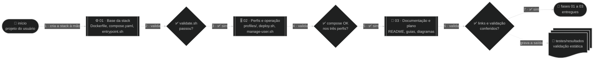
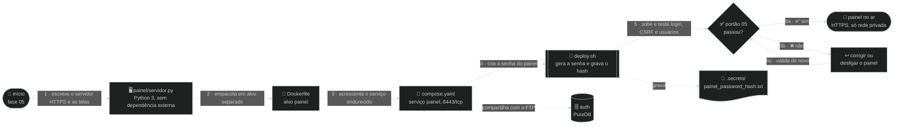

# 🗺️ Plano mestre — allsafe-ftp-stack

Levar a stack de FTP para backup de equipamentos ao padrão de engenharia e dar a ela um painel web seguro: o que já está pronto, o que falta e em que ordem.

↩ [README do projeto](../../README.md) · [📚 Índice da documentação](../README.md) · [📄 PROGRESSO](PROGRESSO.md)

```mermaid
%%{init: {"theme": "dark"}}%%
flowchart LR
    inicio@{ shape: stadium, label: "🚀 início" }
    feito@{ shape: subproc, label: "✅ 01 a 03 · Entregue<br>stack, perfis, documentação" }
    subgraph EXEC["🧱 Fases a executar, uma emendada na outra"]
        f4@{ shape: subproc, label: "💽 04 · Pastas fixas,<br>segredos e rede privada" }
        f5@{ shape: subproc, label: "🖥️ 05 · Painel<br>web seguro" }
        f6@{ shape: subproc, label: "🚀 06 · Instalação<br>em um comando" }
        f7@{ shape: subproc, label: "🧪 07 · Testes<br>automatizados" }
        f8@{ shape: subproc, label: "♻️ 08 · Backup<br>e restauração" }
        f9@{ shape: subproc, label: "📖 09 · Documentação<br>final e capturas" }
    end
    fim@{ shape: stadium, label: "🏁 stack no ar<br>testada e documentada" }
    volta@{ shape: rect, label: "↩️ corrigir ou<br>desfazer a fase" }

    inicio -- "1 · já existe" --> feito
    feito -- "2 · commit e push do plano" --> f4
    f4 -- "3 · ✅ portão 04" --> f5
    f5 -- "4 · ✅ portão 05" --> f6
    f6 -- "5 · ✅ portão 06" --> f7
    f7 -- "6 · ✅ portão 07" --> f8
    f8 -- "7 · ✅ portão 08" --> f9
    f9 -- "8 · ✅ portão 09" --> fim
    EXEC -- "❌ portão reprovado" --> volta
```

<!-- diagrama: diagramas/plano-geral-mapa.mmd -->


<sub>📐 Nível 2 · Mapa · 🔍 aproximar e mover: controles no canto do diagrama · 📁 [fonte e SVG](diagramas/)</sub>

**🧭 Sequência**

| Nº | De ➜ Para | O que acontece |
|---|---|---|
| 1 | 🚀 início ➜ ✅ 01 a 03 · Entregue | A stack, os perfis e a documentação já existem |
| 2 | ✅ 01 a 03 ➜ 💽 04 · Pastas fixas, segredos e rede privada | Commit e push deste plano; a execução começa em seguida |
| 3 | 💽 04 ➜ 🖥️ 05 · Painel web seguro | Portão 04 aprovado |
| 4 | 🖥️ 05 ➜ 🚀 06 · Instalação em um comando | Portão 05 aprovado |
| 5 | 🚀 06 ➜ 🧪 07 · Testes automatizados | Portão 06 aprovado |
| 6 | 🧪 07 ➜ ♻️ 08 · Backup e restauração | Portão 07 aprovado |
| 7 | ♻️ 08 ➜ 📖 09 · Documentação final e capturas | Portão 08 aprovado |
| 8 | 📖 09 ➜ 🏁 stack no ar, testada e documentada | Portão 09 aprovado: plano concluído |
| ❌ | 🧱 qualquer fase ➜ ↩️ corrigir ou desfazer a fase | Portão reprovado: a fase não avança |

> ⚠️ **Estado deste plano:** as fases 01 a 03 estão entregues. As fases 04 a 09 foram **mandadas executar pelo usuário em 2026-10-04**, uma emendada na outra. O ponto exato de retomada está no [📄 PROGRESSO](PROGRESSO.md).

> 🧱 **Uso só em rede privada.** Esta stack é para rede interna: FTP e painel escutam **apenas em IP privado**, atrás de firewall, e nunca são publicados na internet. A regra vale para o plano inteiro e é imposta por código na [fase 04](#fase-04).

---

<details>
<summary>🧭 Sumário — clique para expandir</summary>

[🎯 Objetivo](#objetivo) · [📏 Tamanho](#tamanho) · [🧩 Situação atual (ANTES)](#situacao-atual) · [💡 Solução](#solucao) · [🏗️ Arquitetura (DEPOIS)](#arquitetura-depois) · [🧱 Rede privada e firewall](#rede-privada) · [🔑 Segredos](#segredos) · [🖥️ Painel web](#painel) · [🧱 Fases](#fases) · [🧪 Testes](#testes) · [🏷️ Versões](#versoes) · [🛠️ Tecnologias](#tecnologias) · [🔐 Segurança, ⚡ desempenho e 📈 crescimento](#seguranca-desempenho-crescimento) · [🚨 Riscos e rollback](#riscos-e-rollback) · [✅ Validação final](#validacao-final) · [🔧 Registro de mudanças](#registro-de-mudancas) · [📌 Pendências](#pendencias)

</details>

---

<a name="objetivo"></a>

## 🎯 Objetivo

Ter um servidor FTP para backup de equipamentos de rede que qualquer pessoa instala com um comando, administra por um painel web seguro, com os dados guardados em pasta conhecida, as senhas fora do `.env`, testado de forma automática, com backup e restauração prontos e com a documentação igual ao sistema real.

| Item | Descrição |
|---|---|
| Problema | A stack funciona, mas a instalação pede duas execuções, os dados ficam em volumes nomeados fora das pastas fixas, a senha pode ir no `.env`, nada impede publicar o serviço em IP público, os usuários só são administrados pelo terminal, não há teste automatizado de transferência e o backup é um comando manual |
| Resultado esperado | Instalação em um comando; dados em `/home/carlos/code/data/allsafe-ftp-stack/`; senhas e hash só em `.secrets/`; bind recusado fora de IP privado; painel web em HTTPS com senha; testes com resultado datado; backup e restauração por script; documentação com fotos reais do painel |
| Fora do escopo | Trocar o Pure-FTPd por outro servidor; SFTP (é outra stack: `allsafe-sftp-stack`); publicar a stack na internet; alterar o firewall do host (o plano só documenta as regras); mais de um administrador no painel |

---

<a name="tamanho"></a>

## 📏 Tamanho

**🟡 Médio.** Dois serviços no mesmo host, com ordem de dependência entre as mudanças: as pastas fixas e os segredos (04) mudam o `compose.yaml` em que o painel (05) entra, que a instalação em um comando (06) sobe, que os testes (07) exercitam, que o backup (08) copia e que a documentação (09) fotografa. Há dados a preservar em quem já tem a stack instalada (migração dos volumes nomeados). Não há migração neste host, nem vários hosts, nem arquitetura nova: por isso não é 🔴.

Consequência: as fases são **seções deste plano mestre**, sem plano filho, e o andamento fica no [📄 PROGRESSO](PROGRESSO.md).

---

<a name="situacao-atual"></a>

## 🧩 Situação atual (ANTES)

<!-- diagrama: diagramas/arquitetura-antes-mapa.mmd -->
```mermaid
%%{init: {"theme": "dark"}}%%
flowchart LR
    subgraph USO["👤 Quem usa"]
        operador@{ shape: person, label: "👤 Usuário<br>opera a stack" }
        equip@{ shape: hex, label: "📡 Equipamento de rede<br>cliente FTP" }
    end
    subgraph HOST["🖥️ Host"]
        deploy@{ shape: console, label: "⌨️ deploy.sh<br>para e pede edição do .env" }
        ftp@{ shape: rect, label: "⚙️ Pure-FTPd<br>allsafe-ftp, nomes fixos" }
        tmp@{ shape: doc, label: "🧹 /tmp<br>coleta de logs" }
        bkp@{ shape: doc, label: "♻️ tar.gz manual<br>na pasta atual" }
    end
    subgraph VOLUMES["💽 Volumes nomeados · /var/lib/docker/volumes"]
        vdata@{ shape: lin-cyl, label: "💽 allsafe-ftp-data<br>/data" }
        vauth@{ shape: cyl, label: "🗄️ allsafe-ftp-auth<br>/auth, PureDB" }
        vcerts@{ shape: lin-cyl, label: "💽 allsafe-ftp-certs<br>/etc/ssl/private" }
    end
    subgraph RESULTADO["🏁 Resultado"]
        fim@{ shape: stadium, label: "🏁 backup guardado<br>sem teste automatizado" }
    end

    operador -- "1 · ./deploy.sh, duas execuções" --> deploy
    deploy -- "2 · docker compose up -d --build" --> ftp
    equip -- "3 · FTPS, TCP 21 para 2121" --> ftp
    ftp -- "4 · grava o arquivo" --> vdata
    vdata -- "5 · arquivo no volume" --> fim
    ftp -. "consulta os usuários" .-> vauth
    ftp -. "lê o certificado" .-> vcerts
    vdata -. "cópia manual com alpine tar" .-> bkp
    ftp -. "logs coletados à mão" .-> tmp
```

<sub>📐 Nível 2 · Mapa · 🔍 aproximar e mover: controles no canto do diagrama · 📁 [fonte e SVG](diagramas/)</sub>

**🧭 Sequência**

| Nº | De ➜ Para | O que acontece |
|---|---|---|
| 1 | 👤 Usuário ➜ ⌨️ `deploy.sh` | Roda `./deploy.sh` duas vezes: a primeira só cria o `.env` e para, pedindo edição |
| 2 | ⌨️ `deploy.sh` ➜ ⚙️ Pure-FTPd (`allsafe-ftp`) | `docker compose up -d --build`, com nomes fixos de container, volumes e rede |
| 3 | 📡 Equipamento de rede ➜ ⚙️ Pure-FTPd | Conecta por FTPS, TCP 21 no host para 2121 no container |
| 4 | ⚙️ Pure-FTPd ➜ 💽 `allsafe-ftp-data` | Grava o arquivo no volume nomeado |
| 5 | 💽 `allsafe-ftp-data` ➜ 🏁 backup guardado | O arquivo fica no volume, sem teste automatizado que comprove o caminho |

**🧷 Apoio**

| Quem | Usa | Como |
|---|---|---|
| ⚙️ Pure-FTPd | 🗄️ `allsafe-ftp-auth` | Consulta os usuários no PureDB |
| ⚙️ Pure-FTPd | 💽 `allsafe-ftp-certs` | Lê o certificado TLS |
| 💽 `allsafe-ftp-data` | ♻️ `tar.gz` na pasta atual | Cópia manual com `alpine tar` |
| ⚙️ Pure-FTPd | 🧹 `/tmp` | Logs coletados à mão para diagnóstico |

O que foi verificado no repositório e neste host (2026-10-04):

| Ponto | Estado |
|---|---|
| Código da stack | [`Dockerfile`](../../Dockerfile), [`compose.yaml`](../../compose.yaml), [`deploy.sh`](../../deploy.sh), [`manage-user.sh`](../../manage-user.sh), [`scripts/`](../../scripts/) e [`profiles/`](../../profiles/), todos do commit `4e865df` (2026-09-11) |
| Dados | Três volumes nomeados (`allsafe-ftp-data`, `allsafe-ftp-auth`, `allsafe-ftp-certs`), em `/var/lib/docker/volumes` |
| Segredos | Senha do usuário inicial em `.secrets/ftp_password.txt`, mas o `.env` ainda aceita `FTP_PASSWORD` em texto; a pasta inteira é montada no container |
| Exposição | `FTP_BIND_IP` aceita qualquer endereço, inclusive `0.0.0.0` e IP público |
| Administração | Só pelo terminal, com [`manage-user.sh`](../../manage-user.sh) |
| Instalação | Duas execuções do `deploy.sh`; não espera `healthy`; não tem opção de remoção |
| Testes | Só [`scripts/validate.sh`](../../scripts/validate.sh): sintaxe e `compose config`; nenhum teste de login, envio ou download |
| Backup | Comando manual documentado; sem script, sem destino fixo |
| Instalação neste host | **Não existe**: nenhum container, volume ou rede `allsafe-ftp` |
| Pastas fixas | `/home/carlos/code/data` e `backups` ainda sem a subpasta `allsafe-ftp-stack` |

---

<a name="solucao"></a>

## 💡 Solução

Sete decisões, cada uma com as alternativas comparadas. Prioridade: simplicidade, estabilidade, segurança, desempenho, manutenção e facilidade de diagnóstico.

| Decisão | Alternativa A | Alternativa B | Escolha e motivo |
|---|---|---|---|
| Onde ficam os dados | Manter volumes nomeados e fazer o backup lendo o volume | _Bind mount_ nas pastas fixas (`DATA_DIR`) | **B.** O dado fica em caminho conhecido, o backup é uma cópia de pasta e o diagnóstico não depende do Docker. Custo: cuidar de dono e permissão das pastas |
| Como instalar | Manter as duas etapas (criar `.env`, editar, rodar de novo) | Um comando com padrões seguros (`127.0.0.1`) | **B.** Sem edição a stack já sobe fechada no `localhost`; abrir para a rede interna é uma decisão posterior e explícita |
| Como testar | Cliente no host (`curl --ssl-reqd`) | Container cliente efêmero | **A.** O `curl` já está no host e testa o caminho real pela porta publicada; o container cliente fica como reserva se faltar recurso no `curl` |
| Onde ficam as senhas | No `.env`, junto das variáveis | Em `.secrets/`, um arquivo por segredo, entregue por `secrets:` do Compose | **B.** O `.env` fica só com o que se ajusta; cada serviço enxerga apenas o segredo dele, somente leitura; o que só precisa ser conferido é guardado como hash |
| Como garantir a rede privada | Só avisar na documentação | Avisar **e** recusar por código IP público e `0.0.0.0` | **B.** Aviso sozinho não impede o erro; a recusa no `deploy.sh` e no container fecha o caminho mesmo com `docker compose up` direto |
| Que painel web usar | Painel pronto de terceiro | Painel próprio, mínimo, em Python só com a biblioteca padrão | **B.** Os painéis prontos para Pure-FTPd pedem PHP e banco de dados e trazem superfície de ataque que a stack não precisa. O próprio faz só o necessário, não tem dependência externa para atualizar e cabe em um arquivo auditável |
| Como o painel altera os usuários | Socket do Docker dentro do painel, para executar comandos no container do FTP | Pasta `auth` compartilhada e o mesmo script `allsafe-ftp-user` | **B.** O socket do Docker equivale a acesso de root no host. Com a pasta compartilhada o painel só alcança o PureDB e as pastas dos usuários, e a regra de usuário e senha fica em um lugar só |

---

<a name="arquitetura-depois"></a>

## 🏗️ Arquitetura (DEPOIS)

<!-- diagrama: diagramas/arquitetura-depois-mapa.mmd -->
```mermaid
%%{init: {"theme": "dark"}}%%
flowchart LR
    subgraph USO["👤 Quem usa · só rede privada"]
        operador@{ shape: person, label: "👤 Usuário<br>opera a stack" }
        equip@{ shape: hex, label: "📡 Equipamento de rede<br>cliente FTP" }
    end
    subgraph BORDA["🧱 Proteção"]
        fw@{ shape: hex, label: "🧱 Firewall do host<br>só origens internas" }
    end
    subgraph HOST["🖥️ Host · bind só em IP privado"]
        deploy@{ shape: console, label: "⌨️ deploy.sh<br>um comando, espera healthy" }
        ftp@{ shape: rect, label: "⚙️ Pure-FTPd<br>allsafe-ftp · 21/tcp" }
        painel@{ shape: rect, label: "🖥️ Painel web<br>allsafe-ftp-painel · 8443/tcp HTTPS" }
        segredos@{ shape: doc, label: "🔑 .secrets/<br>senhas e hash, 0600" }
    end
    subgraph PASTAS["💽 Pastas fixas · /home/carlos/code"]
        dados@{ shape: lin-cyl, label: "💽 data/allsafe-ftp-stack/dados<br>/data" }
        auth@{ shape: cyl, label: "🗄️ data/allsafe-ftp-stack/auth<br>/auth, PureDB" }
        certs@{ shape: lin-cyl, label: "💽 data/allsafe-ftp-stack/certs<br>certificado do FTP" }
        pdados@{ shape: lin-cyl, label: "💽 data/allsafe-ftp-stack/painel<br>certificado e auditoria" }
        bkp@{ shape: folder, label: "♻️ backups/allsafe-ftp-stack<br>cópias datadas" }
        tmp@{ shape: folder, label: "🧹 tmp/allsafe-ftp-stack<br>instância de teste" }
    end
    subgraph RESULTADO["🏁 Resultado"]
        fim@{ shape: stadium, label: "🏁 backup guardado<br>testado e restaurável" }
    end

    operador -- "1 · ./deploy.sh, uma execução" --> deploy
    deploy -- "2 · sobe os dois serviços e espera healthy" --> ftp
    operador -- "3 · HTTPS com senha, pelo navegador" --> fw
    equip -- "4 · FTPS, TCP 21" --> fw
    fw -- "5 · libera só rede interna" --> ftp
    fw -- "6 · libera só rede interna" --> painel
    painel -- "7 · cria, troca senha e remove usuário" --> auth
    ftp -- "8 · grava o arquivo" --> dados
    dados -- "9 · arquivo na pasta fixa" --> fim
    ftp -. "consulta os usuários" .-> auth
    ftp -. "lê o certificado" .-> certs
    ftp -. "lê a senha inicial" .-> segredos
    painel -. "lê só o hash da senha" .-> segredos
    painel -. "grava certificado e auditoria" .-> pdados
    painel -. "lê o uso de cada pasta" .-> dados
    deploy -. "backup.sh copia dados, auth e painel" .-> bkp
    deploy -. "testar.sh sobe e remove a instância" .-> tmp
```

<sub>📐 Nível 2 · Mapa · 🔍 aproximar e mover: controles no canto do diagrama · 📁 [fonte e SVG](diagramas/)</sub>

**🧭 Sequência**

| Nº | De ➜ Para | O que acontece |
|---|---|---|
| 1 | 👤 Usuário ➜ ⌨️ `deploy.sh` | Roda `./deploy.sh` uma vez |
| 2 | ⌨️ `deploy.sh` ➜ ⚙️ Pure-FTPd (`allsafe-ftp`) | Sobe os dois serviços e espera `healthy` |
| 3 | 👤 Usuário ➜ 🧱 Firewall do host | Abre o painel pelo navegador, em HTTPS, com senha |
| 4 | 📡 Equipamento de rede ➜ 🧱 Firewall do host | Conecta por FTPS, TCP 21 |
| 5 | 🧱 Firewall do host ➜ ⚙️ Pure-FTPd | Libera só a rede interna |
| 6 | 🧱 Firewall do host ➜ 🖥️ Painel web (`allsafe-ftp-painel`) | Libera só a rede interna |
| 7 | 🖥️ Painel web ➜ 🗄️ `data/allsafe-ftp-stack/auth` | Cria usuário, troca senha e remove usuário no PureDB |
| 8 | ⚙️ Pure-FTPd ➜ 💽 `data/allsafe-ftp-stack/dados` | Grava o arquivo na pasta fixa |
| 9 | 💽 `data/allsafe-ftp-stack/dados` ➜ 🏁 backup guardado | O arquivo fica na pasta fixa, testado e restaurável |

**🧷 Apoio**

| Quem | Usa | Como |
|---|---|---|
| ⚙️ Pure-FTPd | 🗄️ `data/allsafe-ftp-stack/auth` | Consulta os usuários no PureDB |
| ⚙️ Pure-FTPd | 💽 `data/allsafe-ftp-stack/certs` | Lê o certificado TLS do FTP |
| ⚙️ Pure-FTPd | 🔑 `.secrets/` | Lê a senha do usuário inicial |
| 🖥️ Painel web | 🔑 `.secrets/` | Lê só o hash da senha do painel |
| 🖥️ Painel web | 💽 `data/allsafe-ftp-stack/painel` | Grava o certificado do painel e a auditoria |
| 🖥️ Painel web | 💽 `data/allsafe-ftp-stack/dados` | Lê o uso de cada pasta |
| ⌨️ `deploy.sh` (`scripts/backup.sh`) | ♻️ `backups/allsafe-ftp-stack` | Copia `dados`, `auth`, `certs` e `painel`, com data e hora no nome |
| ⌨️ `deploy.sh` (`scripts/testar.sh`) | 🧹 `tmp/allsafe-ftp-stack` | Sobe e remove a instância de teste |

Caminhos previstos, todos configuráveis no `.env`:

| Variável | Valor | Conteúdo |
|---|---|---|
| `DATA_DIR` | `/home/carlos/code/data/allsafe-ftp-stack` | `dados/`, `auth/`, `certs/` e `painel/`, uma subpasta por volume |
| `BACKUP_DIR` | `/home/carlos/code/backups/allsafe-ftp-stack` | Cópias com `AAAAMMDD-HHMMSS` no nome |
| `TEMP_DIR` | `/home/carlos/code/tmp/allsafe-ftp-stack` | Instância de teste, coletas de diagnóstico |
| `SECRETS_DIR` | `./.secrets` | Um arquivo por segredo; só muda na instância de teste |

A arquitetura **de hoje** continua descrita em [🏗️ doc/arquitetura.md](../arquitetura.md); ela é reescrita na [fase 09](#fase-09), depois que tudo existir de verdade.

---

<a name="rede-privada"></a>

## 🧱 Rede privada e firewall

Esta stack **não é para a internet**. FTP é um protocolo antigo, e o painel administra os usuários dele: os dois só podem ser alcançados de dentro da rede interna.

| Camada | O que garante | Onde |
|---|---|---|
| Padrão fechado | Sem edição, FTP e painel escutam só em `127.0.0.1` | `.env.example` |
| Recusa por código | `FTP_BIND_IP`, `FTP_PUBLIC_IP` e `PAINEL_BIND_IP` só são aceitos em `127.0.0.0/8`, `10.0.0.0/8`, `172.16.0.0/12` e `192.168.0.0/16`; `0.0.0.0` e IP público fazem a instalação e o container pararem com mensagem clara | `scripts/rede-privada.sh`, usado pelo `deploy.sh` e pelos dois entrypoints |
| Origem conferida no painel | O painel recusa cliente fora de `PAINEL_REDES_PERMITIDAS` (que só aceita redes privadas) e cabeçalho `Host` que não seja IP privado, `localhost` ou o nome configurado | `painel/servidor.py` |
| Firewall do host | Libera as portas só para as redes internas que precisam; o Docker publica portas por fora das cadeias comuns, por isso a regra vai na cadeia `DOCKER-USER` | Documentado em `doc/seguranca.md`, com exemplo em nftables e iptables. **O plano não altera o firewall do host**: quem aplica é o usuário |
| Firewall de borda | Nenhum redirecionamento de porta da internet para o host | Responsabilidade de quem opera a rede |

A faixa `100.64.0.0/10` (CGNAT) e endereços IPv6 ficam de fora de propósito: a stack publica só em IPv4 privado.

---

<a name="segredos"></a>

## 🔑 Segredos

Regra do projeto: o `.env` guarda só variável que se ajusta. Senha, hash, token e chave ficam em `.secrets/`, um arquivo por segredo, pasta `0700`, arquivo `0600`, fora do Git e da imagem.

| Arquivo | O que é | Forma | Quem lê |
|---|---|---|---|
| `.secrets/ftp_password.txt` | Senha do usuário FTP inicial | Texto, gerado com `openssl rand -base64 36` | Só o serviço `ftp`, em `/run/secrets/ftp_password`, somente leitura |
| `.secrets/painel_password.txt` | Senha inicial do painel | Texto, gerado com `openssl rand -base64 36` | Ninguém: fica só no host, para o usuário copiar para um cofre e apagar |
| `.secrets/painel_password_hash.txt` | Conferência da senha do painel | Hash scrypt com sal | Só o serviço `painel`, em `/run/secrets/painel_password_hash`, somente leitura |

- **Por que a senha do FTP inicial fica em texto:** o entrypoint precisa do valor para criar o usuário no PureDB e o operador precisa dele para configurar o equipamento. Dentro da stack ela vira hash no PureDB; no host, a proteção é o modo `0600` na pasta `0700`. Cifrar o arquivo com `age` ou `sops` exigiria uma segunda chave no mesmo host, sem ganho real para uma instalação de um host só.
- **Senhas dos demais usuários FTP:** nunca são gravadas em arquivo. Existem só como hash no PureDB (`DATA_DIR/auth`).
- **Certificados e chaves TLS** são gerados pelos próprios serviços e ficam no volume de cada um (`DATA_DIR/certs` e `DATA_DIR/painel/tls`), com modo `0600`, fora do repositório.
- **Sessão do painel:** o token fica só na memória do processo; reiniciar o painel encerra todas as sessões.
- O `deploy.sh` recusa um `.env` que ainda traga `FTP_PASSWORD` preenchido e diz como migrar.

---

<a name="painel"></a>

## 🖥️ Painel web

Um serviço pequeno, `allsafe-ftp-painel`, no mesmo `compose.yaml`. Serve para ver o estado do FTP e administrar os usuários sem terminal.

| Aba | O que mostra | O que faz |
|---|---|---|
| 📊 Visão geral | Estado do FTP, validade do certificado, quantidade de usuários, espaço usado | Só leitura |
| 👥 Usuários | Lista dos usuários, pasta, uso e último envio | Novo usuário, trocar senha, remover (com tela de confirmação; os arquivos são preservados) |
| 🔐 Segurança | Lista de conferência: bind privado, modo TLS, validade dos certificados, lembrete do firewall | Só leitura |
| 📜 Atividade | Auditoria do painel: quem entrou, de onde, o que mudou | Só leitura |

<details>
<summary>🔬 Detalhe técnico — como o painel é protegido</summary>

| Controle | Como |
|---|---|
| Transporte | HTTPS obrigatório, TLS 1.2 ou superior, certificado próprio gerado na primeira subida com o IP de bind, `localhost` e `127.0.0.1` nos nomes alternativos; não há porta HTTP |
| Login | Uma senha de administrador, conferida contra hash scrypt, com comparação em tempo constante |
| Tentativas | Cinco falhas por IP em quinze minutos bloqueiam novas tentativas daquele IP até a janela passar |
| Sessão | Token aleatório em cookie `__Host-` com `Secure`, `HttpOnly` e `SameSite=Strict`; expira com 15 minutos sem uso (`PAINEL_SESSAO_MINUTOS`) e, de qualquer forma, em 8 horas |
| Formulários | Token CSRF em todo envio e conferência do cabeçalho `Origin` |
| Navegador | Sem JavaScript; política de conteúdo `default-src 'none'`, `frame-ancestors 'none'`, `nosniff`, `no-referrer`, HSTS e `no-store` |
| Origem | Cliente fora de `PAINEL_REDES_PERMITIDAS` e `Host` inesperado recebem recusa antes de qualquer tela |
| Entrada | Corpo limitado, tempo limite por conexão, nome de usuário validado pela mesma regra do FTP, senha mínima de 12 caracteres ou senha forte gerada e mostrada uma única vez |
| Container | Raiz somente leitura, `cap_drop: ALL` com o mínimo de volta, `no-new-privileges`, limites de memória, CPU e processos, **sem socket do Docker** |
| Auditoria | Cada entrada, falha e alteração vai para `DATA_DIR/painel/auditoria.log`, sem senha nem token |
| Dependências | Só a biblioteca padrão do Python 3 do Debian 12; nada baixado da internet em tempo de execução |

Limite conhecido e aceito: o certificado é próprio, então o navegador avisa na primeira visita. O guia mostra como conferir a impressão digital e como trocar por um certificado da autoridade interna.

</details>

---

<a name="fases"></a>

## 🧱 Fases

| Nº | Fase | O que entrega | Depende de | Status | Link |
|---|---|---|---|---|---|
| 01 | Base da stack | Imagem, Compose endurecido, entrypoint, usuários virtuais, FTPS | — | ✅ Concluído | [fase 01](#fase-01) |
| 02 | Perfis e operação | `profiles/`, `deploy.sh --size`, `manage-user.sh`, `validate.sh`, sub-rede configurável | 01 | ✅ Concluído | [fase 02](#fase-02) |
| 03 | Documentação e plano no padrão | README, guias, diagramas, este plano, `VERSION`, `CHANGELOG.md` | 02 | ✅ Concluído | [fase 03](#fase-03) |
| 04 | Pastas fixas, segredos e rede privada | _Bind mount_ em `DATA_DIR`, nomes configuráveis, senhas só em `.secrets/`, recusa de IP público | 03 | ✅ Concluído | [fase 04](#fase-04) |
| 05 | Painel web seguro | Serviço `painel` em HTTPS, com login, quatro abas e auditoria | 04 | ⏳ A fazer | [fase 05](#fase-05) |
| 06 | Instalação em um comando | `deploy.sh` idempotente, espera `healthy`, `--remover`, perfil gravado no `.env` | 05 | ⏳ A fazer | [fase 06](#fase-06) |
| 07 | Testes automatizados | `scripts/testar.sh` e casos de teste, segurança e rede, do FTP e do painel | 06 | ⏳ A fazer | [fase 07](#fase-07) |
| 08 | Backup e restauração | `scripts/backup.sh`, `scripts/restaurar.sh`, healthcheck funcional | 07 | ⏳ A fazer | [fase 08](#fase-08) |
| 09 | Documentação final e capturas | Stack definitiva no ar, fotos reais do painel, guias e diagramas iguais ao sistema | 08 | ⏳ A fazer | [fase 09](#fase-09) |

Toda fase a executar segue o mesmo caminho:

<!-- diagrama: diagramas/fase-execucao-mapa.mmd -->
```mermaid
%%{init: {"theme": "dark"}}%%
flowchart LR
    subgraph IA["🤖 IA"]
        inicio@{ shape: stadium, label: "🚀 próximo passo<br>do PROGRESSO" }
        ler@{ shape: rect, label: "📖 ler a seção da fase<br>e os arquivos citados" }
        exec@{ shape: console, label: "⌨️ executar<br>os passos" }
        portao@{ shape: diam, label: "✅ portão<br>passou?" }
        corrige@{ shape: rect, label: "↩️ corrigir<br>ou desfazer" }
        registra@{ shape: rect, label: "📝 registrar<br>o resultado" }
        progresso@{ shape: doc, label: "📄 PROGRESSO.md" }
        resultados@{ shape: docs, label: "🧪 resultados datados<br>testes, seguranca, rede" }
        publica@{ shape: subproc, label: "🌿 commit,<br>push e PR" }
    end
    subgraph FIM["🏁 Resultado"]
        fim@{ shape: stadium, label: "🏁 fase concluída<br>segue para a próxima" }
        bloqueio@{ shape: person, label: "👤 Usuário recebe o<br>bloqueio e o que falta" }
    end

    inicio -- "1 · abrir" --> ler
    ler -- "2 · executar" --> exec
    exec -- "3 · validar" --> portao
    portao -- "4a · ✅ sim" --> registra
    registra -- "5 · publicar" --> publica
    publica -- "6 · concluir" --> fim
    portao -- "4b · ❌ não" --> corrige
    corrige -- "4c · corrigido: validar de novo" --> portao
    corrige -- "4d · persistiu: parar" --> bloqueio
    registra -. "grava status e data" .-> progresso
    registra -. "salva a saída dos testes" .-> resultados
```

<sub>📐 Nível 2 · Mapa · 🔍 aproximar e mover: controles no canto do diagrama · 📁 [fonte e SVG](diagramas/)</sub>

**🧭 Sequência**

| Nº | De ➜ Para | O que acontece |
|---|---|---|
| 1 | 🚀 próximo passo do PROGRESSO ➜ 📖 ler a seção da fase | Abre a fase indicada e os arquivos que ela cita |
| 2 | 📖 ler ➜ ⌨️ executar os passos | Executa na ordem escrita |
| 3 | ⌨️ executar ➜ ✅ portão passou? | Roda a validação da fase |
| 4a | ✅ portão ➜ 📝 registrar o resultado | Passou: grava o resultado |
| 4b | ✅ portão ➜ ↩️ corrigir ou desfazer | Não passou: corrige ou aplica o rollback |
| 4c | ↩️ corrigir ➜ ✅ portão | Corrigido: valida de novo |
| 4d | ↩️ corrigir ➜ 👤 Usuário | Persistiu: para e informa o bloqueio e o que falta |
| 5 | 📝 registrar ➜ 🌿 commit, push e PR | Publica a fase |
| 6 | 🌿 commit, push e PR ➜ 🏁 fase concluída | Segue para a próxima |

**🧷 Apoio**

| Quem | Usa | Como |
|---|---|---|
| 📝 registrar o resultado | 📄 `PROGRESSO.md` | Grava status e data |
| 📝 registrar o resultado | 🧪 resultados datados (`testes/`, `seguranca/`, `rede/`) | Salva a saída dos testes |

---

<a name="fase-01"></a>

### ✅ Fases 01 a 03 · Entregues

<!-- diagrama: diagramas/01-03-entregue-fluxograma.mmd -->


<sub>📐 Fluxograma · 🔍 aproximar e mover: controles no canto do diagrama · 📁 [fonte e SVG](diagramas/)</sub>

**🧭 Sequência**

| Nº | De ➜ Para | O que acontece |
|---|---|---|
| 1 | 🚀 início ➜ ⚙️ 01 · Base da stack | O usuário cria a stack à mão: `Dockerfile`, `compose.yaml`, `entrypoint.sh` |
| 2 | ⚙️ 01 ➜ ✅ `validate.sh` passou? | Valida a base |
| 3 | ✅ `validate.sh` ➜ 🎚️ 02 · Perfis e operação | Passou: entram `profiles/`, `deploy.sh` e `manage-user.sh` |
| 4 | 🎚️ 02 ➜ ✅ compose OK nos três perfis? | Valida os perfis |
| 5 | ✅ compose OK ➜ 📖 03 · Documentação e plano | Passou: README, guias e diagramas |
| 6 | 📖 03 ➜ ✅ links e validação conferidos? | Valida a documentação |
| 7 | ✅ links e validação ➜ 🏁 fases 01 a 03 entregues | Passou |

**🧷 Apoio**

| Quem | Usa | Como |
|---|---|---|
| ✅ links e validação conferidos | 🧪 `testes/resultados` | Grava a saída da validação estática |

As três são anteriores ao padrão atual de plano; ficam registradas com o que foi entregue e a evidência.

#### ✅ Fase 01 · Base da stack

| Item | Conteúdo |
|---|---|
| Objetivo | Um servidor FTP dedicado, com FTPS obrigatório, usuários virtuais e container endurecido |
| Quem fez | O usuário, à mão, sem IA |
| Entregue | [`Dockerfile`](../../Dockerfile) (Debian 12 fixado por digest, Pure-FTPd), [`compose.yaml`](../../compose.yaml) (`read_only`, `cap_drop: ALL`, limites, healthcheck), [`scripts/entrypoint.sh`](../../scripts/entrypoint.sh), [`scripts/ftp-user.sh`](../../scripts/ftp-user.sh), senha em `.secrets/` |
| Evidência | Commit `4e865df` (2026-09-11) |
| Portão | `./scripts/validate.sh` responde `Validacao FTP concluida.` — [resultado](testes/README.md) |

<a name="fase-02"></a>

#### ✅ Fase 02 · Perfis e operação

| Item | Conteúdo |
|---|---|
| Objetivo | Dimensionar a stack por porte e operar sem decorar comandos do Docker |
| Entregue | [`profiles/`](../../profiles/) (`small`, `medium`, `large`), [`deploy.sh`](../../deploy.sh) com `--size` e `--check-only`, [`manage-user.sh`](../../manage-user.sh), [`scripts/validate.sh`](../../scripts/validate.sh), sub-rede Docker configurável (`FTP_SUBNET`) |
| Evidência | Commits `4e865df` (2026-09-11) e `98b96f5` (2026-09-25) |
| Portão | `compose OK` com os três perfis — [resultado](testes/README.md) |

<a name="fase-03"></a>

#### ✅ Fase 03 · Documentação e plano no padrão

| Item | Conteúdo |
|---|---|
| Objetivo | Documentação em dois níveis, diagramas nos três níveis, plano com fases e progresso, versão e changelog |
| Entregue | README da raiz, [índice](../README.md) e nove guias reescritos; diagramas em `doc/diagramas/` e `doc/planos/diagramas/`; este plano, o [PROGRESSO](PROGRESSO.md) e as pastas de teste; `VERSION` e `CHANGELOG.md` |
| Não alterado | Nenhum arquivo de código da stack: só documentação |
| Portão | Links e âncoras conferidos; `./scripts/validate.sh` ainda responde OK; nenhum segredo nos arquivos |

---

<a name="fase-04"></a>

### ✅ Fase 04 · Pastas fixas, segredos e rede privada

**Objetivo:** tirar os dados dos volumes nomeados, tirar a senha do `.env`, permitir duas instâncias no mesmo host sem colisão de nomes e impedir, por código, que a stack escute em IP público.

```mermaid
%%{init: {"theme": "dark"}}%%
flowchart LR
    inicio@{ shape: stadium, label: "🚀 início<br>fase 04" }
    env@{ shape: doc, label: "📄 .env.example<br>DATA_DIR, BACKUP_DIR, TEMP_DIR e nomes" }
    segredos@{ shape: doc, label: "🔑 .secrets/<br>um arquivo por segredo" }
    compose@{ shape: rect, label: "🐳 compose.yaml<br>bind mount e secrets" }
    rede@{ shape: subproc, label: "🧱 scripts/rede-privada.sh<br>recusa IP público" }
    portao@{ shape: diam, label: "✅ portão 04<br>passou?" }
    fim@{ shape: stadium, label: "🏁 dados em pasta fixa<br>bind só em IP privado" }
    volta@{ shape: rect, label: "↩️ corrigir ou<br>git revert" }
    pastas@{ shape: lin-cyl, label: "💽 data/allsafe-ftp-stack<br>dados, auth, certs" }

    inicio -- "1 · acrescenta as variáveis de pasta e de nome" --> env
    env -- "2 · tira a senha do .env" --> segredos
    segredos -- "3 · troca volume nomeado por bind mount" --> compose
    compose -- "4 · valida os IPs de bind e o anunciado" --> rede
    rede -- "5 · sobe uma instância de teste" --> portao
    portao -- "6a · ✅ sim" --> fim
    portao -- "6b · ❌ não" --> volta
    volta -- "6c · valida de novo" --> portao
    compose -. "grava em" .-> pastas
```

<!-- diagrama: diagramas/04-pastas-segredos-rede-fluxograma.mmd -->


<sub>📐 Fluxograma · 🔍 aproximar e mover: controles no canto do diagrama · 📁 [fonte e SVG](diagramas/)</sub>

**🧭 Sequência**

| Nº | De ➜ Para | O que acontece |
|---|---|---|
| 1 | 🚀 início ➜ 📄 `.env.example` | Acrescenta as variáveis de pasta e de nome |
| 2 | 📄 `.env.example` ➜ 🔑 `.secrets/` | Tira a senha do `.env`: um arquivo por segredo |
| 3 | 🔑 `.secrets/` ➜ 🐳 `compose.yaml` | Troca volume nomeado por _bind mount_ e a pasta montada por `secrets:` |
| 4 | 🐳 `compose.yaml` ➜ 🧱 `scripts/rede-privada.sh` | Valida os IPs de bind e o anunciado; recusa IP público |
| 5 | 🧱 `scripts/rede-privada.sh` ➜ ✅ portão 04 | Sobe uma instância de teste |
| 6a | ✅ portão 04 ➜ 🏁 dados em pasta fixa, bind só em IP privado | Passou |
| 6b | ✅ portão 04 ➜ ↩️ corrigir ou `git revert` | Não passou |
| 6c | ↩️ corrigir ➜ ✅ portão 04 | Valida de novo |

**🧷 Apoio**

| Quem | Usa | Como |
|---|---|---|
| 🐳 `compose.yaml` | 💽 `data/allsafe-ftp-stack` | Grava em `dados`, `auth` e `certs` |

**Pré-requisitos:** `/home/carlos/code/data` e `/home/carlos/code/tmp` graváveis; portas da instância de teste livres.

**Passos:**

1. Acrescentar ao [`.env.example`](../../.env.example): `DATA_DIR`, `BACKUP_DIR`, `TEMP_DIR`, `SECRETS_DIR`, `STACK_NAME`, `FTP_CONTAINER_NAME` e `FTP_NETWORK_NAME`, com os valores atuais como padrão. Retirar `FTP_PASSWORD` e `FTP_PASSWORD_FILE`.
2. No [`compose.yaml`](../../compose.yaml): `name: ${STACK_NAME}`; os três volumes nomeados viram _bind mount_ (`${DATA_DIR}/dados:/data`, `${DATA_DIR}/auth:/auth`, `${DATA_DIR}/certs:/etc/ssl/private`); a montagem de `./.secrets` inteira vira `secrets:` por arquivo, e o serviço `ftp` passa a ver só `/run/secrets/ftp_password`.
3. No [`scripts/entrypoint.sh`](../../scripts/entrypoint.sh): ler a senha só de `/run/secrets/ftp_password`; deixar de aceitar senha por variável de ambiente.
4. Criar `scripts/rede-privada.sh` com a função `ip_privado` e usá-la no `deploy.sh` e no entrypoint para `FTP_BIND_IP` e `FTP_PUBLIC_IP`.
5. No [`deploy.sh`](../../deploy.sh): criar `DATA_DIR` e `.secrets/` (`0700`), gerar a senha com `openssl rand -base64 36` (`0600`) e recusar `.env` com `FTP_PASSWORD` preenchido, dizendo como migrar.
6. `.gitignore` e `.dockerignore`: `.secrets/*` (menos o `.gitkeep`) e `*.pdf`.
7. Escrever o roteiro de migração para quem já tem os volumes nomeados: parar a stack, copiar cada volume para a subpasta, subir e conferir; os volumes antigos só são removidos por decisão do usuário.
8. Atualizar [configuração](../configuracao.md), [segredos](../segredos.md), [segurança](../seguranca.md), [operação](../operacao.md) e [solução de problemas](../solucao-de-problemas.md) (coleta em `TEMP_DIR`, não em `/tmp`).

**Portão de validação:**

| Verificação | Resultado esperado |
|---|---|
| `./scripts/validate.sh` | `Validacao FTP concluida.` com os três perfis |
| Subir uma instância de teste com `DATA_DIR` em `TEMP_DIR` | Container `healthy`; `dados/`, `auth/` e `certs/` criados na pasta indicada |
| `docker volume ls` | Nenhum volume nomeado novo criado pela stack |
| `docker exec … ls /run/secrets` | Só `ftp_password`; nenhuma variável de ambiente com senha no container |
| `FTP_BIND_IP=0.0.0.0` e `FTP_BIND_IP=8.8.8.8` | `deploy.sh` para com erro; com `docker compose up` direto, o container para com erro |
| `.env` com `FTP_PASSWORD` preenchido | `deploy.sh` recusa e explica a migração |

**Resultado:** ✅ aprovado em 2026-10-04 — [saída do portão](testes/resultados/20261004-080025-portao-fase-04.md), com o teste do roteiro de migração.

**Rollback:** `git revert` do commit da fase; não há instalação anterior neste host e, em quem tem, os volumes nomeados continuam intactos, porque a migração copia e não move.

---

<a name="fase-05"></a>

### ⏳ Fase 05 · Painel web seguro

**Objetivo:** administrar a stack pelo navegador, em HTTPS, com senha, sem dar ao painel mais acesso do que ele precisa. O desenho está em [🖥️ Painel web](#painel).

<!-- diagrama: diagramas/05-painel-fluxograma.mmd -->


<sub>📐 Fluxograma · 🔍 aproximar e mover: controles no canto do diagrama · 📁 [fonte e SVG](diagramas/)</sub>

**🧭 Sequência**

| Nº | De ➜ Para | O que acontece |
|---|---|---|
| 1 | 🚀 início ➜ 🖥️ `painel/servidor.py` | Escreve o servidor HTTPS e as telas |
| 2 | 🖥️ `painel/servidor.py` ➜ 🐳 `Dockerfile` (alvo `painel`) | Empacota em alvo separado do FTP |
| 3 | 🐳 `Dockerfile` ➜ 🐳 `compose.yaml` (serviço `painel`) | Acrescenta o serviço endurecido, em 8443/tcp |
| 4 | 🐳 `compose.yaml` ➜ 🔑 `deploy.sh` | Cria a senha do painel e grava o hash |
| 5 | 🔑 `deploy.sh` ➜ ✅ portão 05 | Sobe e testa login, CSRF e usuários |
| 6a | ✅ portão 05 ➜ 🏁 painel no ar, HTTPS, só rede privada | Passou |
| 6b | ✅ portão 05 ➜ ↩️ corrigir ou desligar o painel | Não passou |
| 6c | ↩️ corrigir ➜ ✅ portão 05 | Valida de novo |

**🧷 Apoio**

| Quem | Usa | Como |
|---|---|---|
| 🔑 `deploy.sh` | 🔑 `.secrets/painel_password_hash.txt` | Grava o hash scrypt |
| 🐳 `compose.yaml` (serviço `painel`) | 🗄️ `auth` (PureDB) | Compartilha com o FTP |

**Pré-requisitos:** fase 04 aprovada.

**Passos:**

1. Criar `painel/servidor.py` (servidor HTTPS, sessão, CSRF, limite de tentativas, cabeçalhos, auditoria) e `painel/estilo.css`, só com a biblioteca padrão do Python 3 e sem JavaScript.
2. Telas: entrada, 📊 Visão geral, 👥 Usuários (novo, trocar senha, remover com confirmação), 🔐 Segurança e 📜 Atividade.
3. Alterar usuários chamando o mesmo `allsafe-ftp-user` do FTP, com a senha pela entrada padrão; nenhuma regra duplicada.
4. No [`Dockerfile`](../../Dockerfile): alvos `ftp` e `painel` sobre a mesma base; o `painel` acrescenta só o `python3`.
5. No [`compose.yaml`](../../compose.yaml): serviço `painel` com `read_only`, `cap_drop: ALL` e o mínimo de volta, `no-new-privileges`, limites, healthcheck em `/saude`, porta `${PAINEL_BIND_IP}:${PAINEL_PORT}:8443`, `secrets:` só com o hash, e as pastas `auth`, `dados` e `painel`.
6. `scripts/painel-entrypoint.sh`: valida `PAINEL_BIND_IP` e `PAINEL_REDES_PERMITIDAS` com `rede-privada.sh`, gera o certificado na primeira subida e inicia o servidor.
7. No `deploy.sh`: gerar a senha inicial do painel e o hash scrypt (calculado dentro do próprio container, para não exigir Python no host).
8. Criar `scripts/painel-senha.sh`, para trocar a senha do painel, e documentar em [segredos](../segredos.md).
9. Variáveis novas no `.env.example`: `PAINEL_IMAGE`, `PAINEL_CONTAINER_NAME`, `PAINEL_BIND_IP=127.0.0.1`, `PAINEL_PORT=8443`, `PAINEL_REDES_PERMITIDAS`, `PAINEL_SESSAO_MINUTOS=15`, `PAINEL_CERT_CN` e os limites de recurso.

**Portão de validação:**

| Verificação | Resultado esperado |
|---|---|
| `docker compose ps` | `ftp` e `painel` `healthy` |
| Acesso sem sessão a qualquer aba | Redireciona para a entrada; nada é mostrado |
| Entrada com senha errada, seis vezes | A sexta é recusada pelo limite, mesmo com a senha certa |
| Entrada com a senha certa | Sessão criada; cookie com `Secure`, `HttpOnly`, `SameSite=Strict` |
| `POST` sem token CSRF ou com `Origin` de outro endereço | Recusado, nada é alterado |
| Criar usuário pelo painel e entrar por FTPS com ele | Login e envio funcionam, sem reiniciar o FTP |
| Trocar a senha e remover o usuário | A senha antiga deixa de valer; removido, o login é recusado e os arquivos continuam na pasta |
| Cabeçalhos de resposta | CSP, `X-Frame-Options`, `nosniff`, HSTS e `no-store` presentes |
| `docker inspect` do painel | Sem socket do Docker; raiz somente leitura; só o hash em `/run/secrets` |
| `PAINEL_BIND_IP=0.0.0.0` | Recusado pelo `deploy.sh` e pelo container |
| `auditoria.log` | Registra entradas, falhas e alterações, sem senha nem token |

**Rollback:** `git revert` do commit da fase; o serviço `ftp` não depende do painel e continua funcionando. Para desligar só o painel sem desfazer nada: `docker compose stop painel`.

---

<a name="fase-06"></a>

### ⏳ Fase 06 · Instalação em um comando

**Objetivo:** `./deploy.sh` instala do zero em uma execução, sem perguntas, e pode ser repetido sem efeito colateral.

<!-- diagrama: diagramas/06-instalacao-fluxograma.mmd -->
```mermaid
%%{init: {"theme": "dark"}}%%
flowchart LR
    inicio@{ shape: stadium, label: "🚀 início<br>fase 06" }
    requisitos@{ shape: subproc, label: "🔎 deploy.sh<br>confere Docker, portas e IP privado" }
    prepara@{ shape: subproc, label: "🧰 deploy.sh<br>cria .env, segredos e pastas" }
    sobe@{ shape: subproc, label: "🐳 deploy.sh<br>docker compose up e espera healthy" }
    remover@{ shape: console, label: "⌨️ deploy.sh --remover<br>derruba, preserva os dados" }
    portao@{ shape: diam, label: "✅ portão 06<br>passou?" }
    fim@{ shape: stadium, label: "🏁 instalação<br>em um comando" }
    volta@{ shape: rect, label: "↩️ corrigir ou<br>git revert" }
    env@{ shape: doc, label: "📄 .env<br>com o perfil aplicado" }

    inicio -- "1 · confere antes de agir" --> requisitos
    requisitos -- "2 · prepara sem perguntar" --> prepara
    prepara -- "3 · sobe e espera" --> sobe
    sobe -- "4 · acrescenta a remoção" --> remover
    remover -- "5 · instala do zero, duas vezes" --> portao
    portao -- "6a · ✅ sim" --> fim
    portao -- "6b · ❌ não" --> volta
    volta -- "6c · valida de novo" --> portao
    prepara -. "grava o perfil em" .-> env
```

<sub>📐 Fluxograma · 🔍 aproximar e mover: controles no canto do diagrama · 📁 [fonte e SVG](diagramas/)</sub>

**🧭 Sequência**

| Nº | De ➜ Para | O que acontece |
|---|---|---|
| 1 | 🚀 início ➜ 🔎 `deploy.sh` (confere Docker, portas e IP privado) | Confere antes de agir |
| 2 | 🔎 `deploy.sh` ➜ 🧰 `deploy.sh` (cria `.env`, segredos e pastas) | Prepara sem perguntar |
| 3 | 🧰 `deploy.sh` ➜ 🐳 `deploy.sh` (`docker compose up` e espera `healthy`) | Sobe e espera |
| 4 | 🐳 `deploy.sh` ➜ ⌨️ `deploy.sh --remover` | Acrescenta a remoção, que preserva os dados |
| 5 | ⌨️ `deploy.sh --remover` ➜ ✅ portão 06 | Instala do zero, duas vezes |
| 6a | ✅ portão 06 ➜ 🏁 instalação em um comando | Passou |
| 6b | ✅ portão 06 ➜ ↩️ corrigir ou `git revert` | Não passou |
| 6c | ↩️ corrigir ➜ ✅ portão 06 | Valida de novo |

**🧷 Apoio**

| Quem | Usa | Como |
|---|---|---|
| 🧰 `deploy.sh` | 📄 `.env` | Grava nele as chaves do perfil escolhido |

**Pré-requisitos:** fase 05 aprovada.

**Passos:**

1. O `deploy.sh` cria o `.env` a partir do exemplo e **segue**, em vez de parar pedindo edição; os padrões ficam em `127.0.0.1`.
2. Conferir os requisitos antes de subir (Docker, Compose, portas livres, IPs privados) e falhar com mensagem clara.
3. Criar as pastas de `DATA_DIR` e os segredos, se faltarem; nunca regravar um segredo que já existe.
4. Aplicar o perfil copiando as chaves de `profiles/<perfil>.env` para o `.env`, para que `docker compose up -d` direto mantenha os limites.
5. Esperar o `healthy` dos dois serviços e só então informar endereços, usuário e **onde** estão as senhas (sem mostrá-las).
6. Acrescentar `--remover` (derruba; com `--apagar-dados`, apaga também `DATA_DIR`) e `--atualizar` (reconstrói a imagem sem cache dos pacotes).
7. Atualizar README (instalação por um comando), [instalação](../instalacao.md), [scripts](../scripts.md) e [perfis](../perfis.md).

**Portão de validação:**

| Verificação | Resultado esperado |
|---|---|
| `./deploy.sh` em pasta limpa | Termina com os dois serviços `healthy`, em uma execução, sem perguntas |
| `./deploy.sh` de novo | Nada é recriado sem necessidade; senhas e dados não mudam |
| `./deploy.sh --size medium` seguido de `docker compose up -d` | Os limites continuam os do perfil `medium` |
| Saída do `deploy.sh` | Nenhuma senha na tela |
| `./deploy.sh --remover` | Containers e rede removidos; dados e segredos preservados |

**Rollback:** `git revert` do commit da fase; o `deploy.sh` anterior volta a funcionar com o `.env` já criado.

---

<a name="fase-07"></a>

### ⏳ Fase 07 · Testes automatizados

**Objetivo:** provar por execução, com resultado datado, que a stack e o painel fazem o que a documentação diz.

<!-- diagrama: diagramas/07-testes-fluxograma.mmd -->
```mermaid
%%{init: {"theme": "dark"}}%%
flowchart LR
    inicio@{ shape: stadium, label: "🚀 início<br>fase 07" }
    instancia@{ shape: subproc, label: "🧪 scripts/testar.sh<br>sobe a instância isolada" }
    funcional@{ shape: rect, label: "🧪 Funcionais<br>login, envio, download, usuários" }
    seguranca@{ shape: rect, label: "🔐 Segurança<br>sem TLS, chroot, painel, IP público" }
    rede@{ shape: rect, label: "🌐 Rede<br>bind, faixa passiva, limites" }
    portao@{ shape: diam, label: "✅ portão 07<br>tudo aprovado?" }
    limpa@{ shape: subproc, label: "🧹 scripts/testar.sh<br>remove a instância de teste" }
    fim@{ shape: stadium, label: "🏁 stack provada<br>por execução" }
    volta@{ shape: rect, label: "↩️ corrigir a stack<br>ou o teste" }
    resultados@{ shape: docs, label: "🧪 resultados datados<br>testes, seguranca, rede" }
    tmp@{ shape: folder, label: "🧹 tmp/allsafe-ftp-stack<br>dados da instância de teste" }

    inicio -- "1 · sobe em portas e nomes próprios" --> instancia
    instancia -- "2 · roda os casos funcionais" --> funcional
    funcional -- "3 · roda os casos de segurança" --> seguranca
    seguranca -- "4 · roda os casos de rede" --> rede
    rede -- "5 · confere o resultado" --> portao
    portao -- "6a · ✅ sim" --> limpa
    limpa -- "7 · conclui" --> fim
    portao -- "6b · ❌ não" --> volta
    volta -- "6c · roda de novo" --> instancia
    rede -. "grava a saída, sem segredo" .-> resultados
    instancia -. "usa" .-> tmp
```

<sub>📐 Fluxograma · 🔍 aproximar e mover: controles no canto do diagrama · 📁 [fonte e SVG](diagramas/)</sub>

**🧭 Sequência**

| Nº | De ➜ Para | O que acontece |
|---|---|---|
| 1 | 🚀 início ➜ 🧪 `scripts/testar.sh` (sobe a instância isolada) | Sobe em portas e nomes próprios |
| 2 | 🧪 `scripts/testar.sh` ➜ 🧪 Funcionais | Login, envio, download, usuários |
| 3 | 🧪 Funcionais ➜ 🔐 Segurança | Sem TLS, `chroot`, painel, IP público |
| 4 | 🔐 Segurança ➜ 🌐 Rede | Bind, faixa passiva, limites |
| 5 | 🌐 Rede ➜ ✅ portão 07 | Confere o resultado |
| 6a | ✅ portão 07 ➜ 🧹 `scripts/testar.sh` (remove a instância de teste) | Tudo aprovado |
| 7 | 🧹 `scripts/testar.sh` ➜ 🏁 stack provada por execução | Conclui |
| 6b | ✅ portão 07 ➜ ↩️ corrigir a stack ou o teste | Algo falhou |
| 6c | ↩️ corrigir ➜ 🧪 `scripts/testar.sh` | Roda de novo |

**🧷 Apoio**

| Quem | Usa | Como |
|---|---|---|
| 🌐 Rede | 🧪 resultados datados (`testes/`, `seguranca/`, `rede/`) | Grava a saída, sem segredo |
| 🧪 `scripts/testar.sh` | 🧹 `tmp/allsafe-ftp-stack` | Guarda os dados da instância de teste |

**Pré-requisitos:** fase 06 aprovada; `curl` com suporte a FTPS no host.

**Passos:**

1. Criar `scripts/testar.sh`, que sobe uma instância isolada (`STACK_NAME=allsafe-ftp-teste`, portas, sub-rede, `DATA_DIR` e `SECRETS_DIR` próprios, tudo em `TEMP_DIR`), roda os casos e a remove.
2. Implementar os casos de [🧪 testes](testes/README.md), [🔐 segurança](seguranca/README.md) e [🌐 rede](rede/README.md), do FTP e do painel.
3. Corrigir o `validate.sh --runtime` para ler `FTP_USER` do `.env`.
4. Gravar cada execução em `resultados/AAAAMMDD-HHMMSS-<o-que>.md`, sem senha, token nem chave.

**Portão de validação:**

| Verificação | Resultado esperado |
|---|---|
| `./scripts/testar.sh` | Todos os casos aprovados e instância de teste removida |
| Resultados | Um arquivo datado por tipo de teste, com a saída real |
| Segredos | Nenhuma senha, token ou chave nos resultados |
| Instância definitiva | Não é tocada pelos testes |

**Rollback:** remover a instância de teste e a pasta em `TEMP_DIR`; os testes não tocam na instância definitiva.

---

<a name="fase-08"></a>

### ⏳ Fase 08 · Backup e restauração

**Objetivo:** recuperar a stack inteira a partir de uma cópia.

<!-- diagrama: diagramas/08-backup-fluxograma.mmd -->
```mermaid
%%{init: {"theme": "dark"}}%%
flowchart LR
    inicio@{ shape: stadium, label: "🚀 início<br>fase 08" }
    backup@{ shape: console, label: "♻️ scripts/backup.sh<br>copia dados, auth, certs e painel" }
    restaurar@{ shape: console, label: "♻️ scripts/restaurar.sh<br>restaura uma cópia escolhida" }
    saude@{ shape: rect, label: "🐳 compose.yaml<br>healthcheck pela porta de controle" }
    ciclo@{ shape: subproc, label: "🧪 scripts/testar.sh<br>envia, copia, apaga, restaura, compara" }
    portao@{ shape: diam, label: "✅ portão 08<br>sha256 igual?" }
    fim@{ shape: stadium, label: "🏁 stack recuperável<br>a partir de uma cópia" }
    volta@{ shape: rect, label: "↩️ corrigir ou<br>git revert" }
    bkp@{ shape: folder, label: "♻️ backups/allsafe-ftp-stack<br>AAAAMMDD-HHMMSS" }

    inicio -- "1 · escreve a cópia" --> backup
    backup -- "2 · escreve a restauração" --> restaurar
    restaurar -- "3 · troca o healthcheck" --> saude
    saude -- "4 · testa o ciclo completo" --> ciclo
    ciclo -- "5 · compara o arquivo" --> portao
    portao -- "6a · ✅ sim" --> fim
    portao -- "6b · ❌ não" --> volta
    volta -- "6c · testa de novo" --> ciclo
    backup -. "grava em" .-> bkp
```

<sub>📐 Fluxograma · 🔍 aproximar e mover: controles no canto do diagrama · 📁 [fonte e SVG](diagramas/)</sub>

**🧭 Sequência**

| Nº | De ➜ Para | O que acontece |
|---|---|---|
| 1 | 🚀 início ➜ ♻️ `scripts/backup.sh` | Escreve a cópia de `dados`, `auth`, `certs` e `painel` |
| 2 | ♻️ `scripts/backup.sh` ➜ ♻️ `scripts/restaurar.sh` | Escreve a restauração de uma cópia escolhida |
| 3 | ♻️ `scripts/restaurar.sh` ➜ 🐳 `compose.yaml` | Troca o healthcheck para a porta de controle |
| 4 | 🐳 `compose.yaml` ➜ 🧪 `scripts/testar.sh` | Testa o ciclo: envia, copia, apaga, restaura, compara |
| 5 | 🧪 `scripts/testar.sh` ➜ ✅ portão 08 | Compara o arquivo |
| 6a | ✅ portão 08 ➜ 🏁 stack recuperável a partir de uma cópia | `sha256` igual |
| 6b | ✅ portão 08 ➜ ↩️ corrigir ou `git revert` | Diferente |
| 6c | ↩️ corrigir ➜ 🧪 `scripts/testar.sh` | Testa de novo |

**🧷 Apoio**

| Quem | Usa | Como |
|---|---|---|
| ♻️ `scripts/backup.sh` | ♻️ `backups/allsafe-ftp-stack` | Grava a cópia com `AAAAMMDD-HHMMSS` no nome |

**Pré-requisitos:** fase 07 aprovada.

**Passos:**

1. Criar `scripts/backup.sh`: copia `dados/`, `auth/`, `certs/` e `painel/` para `BACKUP_DIR`, com `AAAAMMDD-HHMMSS` no nome. A leitura é feita por um container, porque `auth/` pertence ao `root`. Os segredos de `.secrets/` **não** entram na cópia: a documentação diz como guardá-los à parte.
2. Criar `scripts/restaurar.sh`: restaura uma cópia escolhida, com a stack parada, e guarda antes uma cópia do estado atual.
3. Testar o ciclo completo dentro do `testar.sh`: enviar arquivo, fazer backup, apagar, restaurar, baixar e comparar.
4. Trocar o healthcheck do FTP de `pidof` por uma verificação da porta de controle (espera a resposta `220`).
5. Retirar `NET_BIND_SERVICE` se o teste confirmar que não é necessária, já que o serviço escuta em `2121`.
6. Manter `FTP_TLS_MODE=2` como padrão e documentar o modo `3`: mudar o padrão depende de teste com os equipamentos reais.

**Portão de validação:**

| Verificação | Resultado esperado |
|---|---|
| Ciclo de backup e restauração | O arquivo restaurado é idêntico ao enviado (mesmo `sha256sum`) e o usuário continua entrando |
| Healthcheck | Fica `unhealthy` se a porta de controle parar de responder |
| `./scripts/testar.sh` | Continua aprovado depois das mudanças |

**Rollback:** `git revert` do commit da fase; a cópia feita antes da restauração fica em `BACKUP_DIR`.

---

<a name="fase-09"></a>

### ⏳ Fase 09 · Documentação final e capturas

**Objetivo:** subir a stack definitiva neste host e deixar a documentação igual ao sistema real, com as fotos do painel.

<!-- diagrama: diagramas/09-documentacao-fluxograma.mmd -->
```mermaid
%%{init: {"theme": "dark"}}%%
flowchart LR
    inicio@{ shape: stadium, label: "🚀 início<br>fase 09" }
    sobe@{ shape: subproc, label: "🐳 deploy.sh<br>stack definitiva no ar" }
    capturas@{ shape: subproc, label: "📸 Playwright<br>captura cada aba e cada menu" }
    guias@{ shape: docs, label: "📖 README e guias de doc/<br>painel, rede privada, backup" }
    diagramas@{ shape: docs, label: "📐 diagramas<br>com zoom e movimento" }
    portao@{ shape: diam, label: "✅ portão 09<br>doc igual ao sistema?" }
    fim@{ shape: stadium, label: "🏁 plano concluído<br>pergunta do fim" }
    volta@{ shape: rect, label: "↩️ corrigir<br>a documentação" }
    abas@{ shape: folder, label: "📸 doc/imagens<br>principal e abas" }
    menus@{ shape: folder, label: "🖥️ doc/aplicacao/imagens<br>menu por menu" }

    inicio -- "1 · instala a stack definitiva" --> sobe
    sobe -- "2 · fotografa o painel real" --> capturas
    capturas -- "3 · reescreve os guias" --> guias
    guias -- "4 · refaz os diagramas" --> diagramas
    diagramas -- "5 · confere links, fotos e segredos" --> portao
    portao -- "6a · ✅ sim" --> fim
    portao -- "6b · ❌ não" --> volta
    volta -- "6c · confere de novo" --> portao
    capturas -. "grava" .-> abas
    capturas -. "grava" .-> menus
```

<sub>📐 Fluxograma · 🔍 aproximar e mover: controles no canto do diagrama · 📁 [fonte e SVG](diagramas/)</sub>

**🧭 Sequência**

| Nº | De ➜ Para | O que acontece |
|---|---|---|
| 1 | 🚀 início ➜ 🐳 `deploy.sh` | Instala a stack definitiva |
| 2 | 🐳 `deploy.sh` ➜ 📸 Playwright | Fotografa o painel real: cada aba e cada menu |
| 3 | 📸 Playwright ➜ 📖 README e guias de `doc/` | Reescreve os guias: painel, rede privada, backup |
| 4 | 📖 README e guias ➜ 📐 diagramas | Refaz os diagramas, com zoom e movimento |
| 5 | 📐 diagramas ➜ ✅ portão 09 | Confere links, fotos e segredos |
| 6a | ✅ portão 09 ➜ 🏁 plano concluído, pergunta do fim | Documentação igual ao sistema |
| 6b | ✅ portão 09 ➜ ↩️ corrigir a documentação | Algo não bate |
| 6c | ↩️ corrigir ➜ ✅ portão 09 | Confere de novo |

**🧷 Apoio**

| Quem | Usa | Como |
|---|---|---|
| 📸 Playwright | 📸 `doc/imagens` | Grava a foto principal e uma por aba |
| 📸 Playwright | 🖥️ `doc/aplicacao/imagens` | Grava as fotos menu por menu |

**Pré-requisitos:** fase 08 aprovada; portas `21` e `8443` livres em `127.0.0.1` neste host.

**Passos:**

1. `./deploy.sh` com os padrões: FTP em `127.0.0.1:21`, faixa passiva do perfil `small`, painel em `127.0.0.1:8443`.
2. Capturas reais com Playwright, 1440×900, com usuários de exemplo e **nenhum segredo na tela**: a principal e uma por aba em `doc/imagens/`; menu por menu em `doc/aplicacao/imagens/`.
3. Escrever `doc/aplicacao/README.md`, o guia do painel menu por menu, e `doc/backup.md`.
4. README da raiz: imagem principal, galeria das abas, instalação por um comando, aviso de rede privada, fluxograma e arquitetura com o painel, tecnologias com versão conferida, portas, estrutura.
5. Reescrever [arquitetura](../arquitetura.md), [segurança](../seguranca.md) (com as regras de firewall de exemplo), [configuração](../configuracao.md), [operação](../operacao.md) e os diagramas de `doc/diagramas/`.
6. Atualizar `CHANGELOG.md`, a tabela de fases, a tabela de testes e o `PROGRESSO.md`.
7. Limpar o que for temporário em `TEMP_DIR` e fazer a pergunta do fim.

**Portão de validação:**

| Verificação | Resultado esperado |
|---|---|
| Links e âncoras de todos os `.md` | Nenhum quebrado; a documentação liga só para este plano mestre |
| Fotos | Reais, sem segredo, todas usadas; fotos de menu só em `doc/aplicacao/imagens/` |
| Diagramas | Sem cor, com sequência escrita, abrindo com zoom e movimento; iguais ao `compose.yaml` |
| Tecnologias e portas | Iguais ao que está rodando |
| Busca por segredo no repositório | Nenhuma senha, token, hash ou chave versionado |
| `./scripts/validate.sh` e `./scripts/testar.sh` | Aprovados |

**Rollback:** `git revert` dos commits de documentação; a stack não muda nesta fase.

---

<a name="testes"></a>

## 🧪 Testes

| Tipo | Pasta | Última execução | Resultado | Link |
|---|---|---|---|---|
| Funcional e de validação | `testes/` | 2026-10-04 06:30 | ✅ validação estática aprovada; casos de transferência e do painel ⏳ a fazer (fase 07) | [testes](testes/README.md) |
| Segurança | `seguranca/` | — | ⏳ a fazer (fase 07) | [segurança](seguranca/README.md) |
| Rede | `rede/` | — | ⏳ a fazer (fase 07) | [rede](rede/README.md) |

Só a validação **estática** foi executada até aqui. Cada fase tem o próprio portão; os casos completos, com resultado datado, são da fase 07.

---

<a name="tecnologias"></a>

## 🛠️ Tecnologias

Versões conferidas neste host e na imagem em 2026-10-04.

| Tecnologia | Versão | Uso |
|---|---|---|
| Docker Engine | 29.8.2 | Execução dos containers |
| Docker Compose | 5.5.1 | Orquestração da stack |
| Debian | 12 (bookworm-slim, fixado por digest) | Base das duas imagens |
| Pure-FTPd | 1.0.50 | Servidor FTP |
| Python | 3.11 (pacote `python3` do Debian 12; a versão exata é registrada na fase 05) | Painel web, só biblioteca padrão |
| OpenSSL | 3.0 | Certificados e TLS |
| tini | 0.19.0 | Processo 1 dos containers |
| Bash | 5.2 | Scripts |
| curl | 8.14.1 | Cliente dos testes (fase 07) |
| Playwright | 1.63.0 (`playwright-core`, com o Chrome do host) | Capturas do painel (fase 09); não faz parte da stack |

Ferramentas ausentes neste host: `lftp` e `shellcheck`. Nenhuma é obrigatória para o plano.

---

<a name="seguranca-desempenho-crescimento"></a>

## 🔐 Segurança, ⚡ desempenho e 📈 crescimento

| Aspecto | Hoje | O que o plano muda |
|---|---|---|
| 🔐 Segurança | FTPS obrigatório no login, `chroot`, container endurecido, senha fora do Git e da imagem ([guia](../seguranca.md)) | Recusa de IP público e senhas só em `.secrets/` (04); painel com HTTPS, hash scrypt, sessão curta, CSRF e auditoria (05); testes de recusa (07); healthcheck funcional (08) |
| ⚡ Desempenho | Limites de sessão, memória, CPU e processos por perfil ([guia](../perfis.md)) | Painel com limites próprios e leitura de uso com teto e cache (05); teste do limite de sessões (07) |
| 📈 Crescimento | Três perfis; faixa passiva 1:1 com o host | Nomes configuráveis para mais de uma instância (04); perfil gravado no `.env` (06) |

---

<a name="riscos-e-rollback"></a>

## 🚨 Riscos e rollback

| Nº | Risco | Fase | Mitigação | Rollback |
|---|---|---|---|---|
| 1 | _Bind mount_ cria arquivos de `root` e do uid `10000` dentro da pasta do usuário | 04 | Subpastas com dono e modo definidos; backup e remoção feitos por container, sem `sudo` | Voltar aos volumes nomeados (`git revert`) |
| 2 | Migração de volume perde dados | 04 | Copiar, nunca mover; conferir antes de remover o volume antigo; backup em `BACKUP_DIR` | Os volumes antigos permanecem até ordem do usuário |
| 3 | Nomes fixos colidem entre a instância de teste e a definitiva | 04 e 07 | Nomes, portas, sub-rede e pastas próprios na instância de teste | Remover a instância de teste |
| 4 | Painel vira porta de entrada para o host | 05 | Sem socket do Docker, raiz somente leitura, capacidades mínimas, só as pastas da stack, bind e origem só em rede privada | `docker compose stop painel`; o FTP segue funcionando |
| 5 | Senha do painel fraca ou vazada | 05 | Senha gerada, só o hash scrypt no container, limite de tentativas, sessão curta, auditoria | `scripts/painel-senha.sh` troca a senha e derruba as sessões |
| 6 | Painel e FTP gravam o PureDB ao mesmo tempo | 05 | Só o painel e o `manage-user.sh` gravam, pelo mesmo script; o `pure-pw mkdb` troca o arquivo de forma atômica; o FTP só lê | Refazer o índice com `pure-pw mkdb` |
| 7 | Instalação sem edição sobe com configuração que o usuário não queria | 06 | Padrão em `127.0.0.1`: nada fica acessível pela rede sem decisão explícita | `./deploy.sh --remover` |
| 8 | Alguém publica a stack na internet | 04 | Recusa por código de `0.0.0.0` e de IP público; aviso no README e no guia; regras de firewall documentadas | — |
| 9 | Healthcheck funcional gera falso `unhealthy` | 08 | Tempo de espera e tentativas folgados; teste na fase | Voltar ao `pidof` |
| 10 | Captura de tela expõe dado sensível | 09 | Usuários de exemplo; senha gerada nunca fotografada; conferência a olho de cada imagem | Refazer a captura |

---

<a name="validacao-final"></a>

## ✅ Validação final

O plano só está concluído quando tudo abaixo for verdade:

- [ ] `./deploy.sh` instala do zero em uma execução e termina com os dois serviços `healthy`
- [ ] FTP e painel recusam bind fora de IP privado
- [ ] Painel em HTTPS, com login, CSRF, limite de tentativas e auditoria comprovados por teste
- [ ] Nenhuma senha no `.env`; segredos só em `.secrets/`, com `0600`
- [ ] Dados em `DATA_DIR`, backups em `BACKUP_DIR`, temporários em `TEMP_DIR` e já limpos
- [ ] `./scripts/testar.sh` aprovado, com resultados datados em `testes/`, `seguranca/` e `rede/`
- [ ] Ciclo de backup e restauração comprovado
- [ ] Fotos reais do painel na documentação; documentação e diagramas iguais ao sistema real, com links conferidos
- [ ] `CHANGELOG.md` atualizado
- [ ] Nenhum dado sensível em documento, resultado ou imagem
- [ ] Pergunta do fim feita: deixar no ar ou derrubar e remover tudo

---

<a name="registro-de-mudancas"></a>

## 🔧 Registro de mudanças

| Data | Mudança | Motivo |
|---|---|---|
| 2026-10-04 | Plano criado, com as fases 01 a 03 registradas como entregues e 04 a 07 a fazer | Aplicação do padrão de documentação e plano |
| 2026-10-04 | Créditos revistos: usuário (idealização, direção, projeto inicial, código e Docker), Claude (evolução) e projetos oficiais com licença, origem e fonte | Determinação do usuário |
| 2026-10-04 | Tabela dos modos TLS corrigida: o modo `2` exige TLS no login e aceita dados sem criptografia se o cliente pedir | Conferência com a documentação oficial do Pure-FTPd |
| 2026-10-04 | Referências a `dev/README.md` e `dev/install.sh` retiradas da documentação | Os arquivos não existem no repositório |
| 2026-10-04 | Caminho `08-time/allsafe-ntp-nts-stack` trocado por `allsafe-ntp-nts-stack` | O caminho era da pasta local, não do projeto |
| 2026-10-04 | Documentado que o processo 1 do container é o `tini` | Com `init: true`, o entrypoint não é o processo 1 |
| 2026-10-04 | **Plano refeito:** painel web seguro entra no escopo (fase 05); a fase 04 passa a cobrir também segredos e rede privada; fases renumeradas até a 09; "produção" sai da fase de backup e vira a regra de rede privada | Ordem do usuário: interface web segura, uso só em IP privado atrás de firewall, executar o plano e a stack |
| 2026-10-04 | Senhas saem do `.env` e ficam só em `.secrets/`; o painel guarda só o hash | Regra do usuário: `.env` só para variável ajustável; senha, token e chave sempre em `.secrets/`, cifrados sempre que possível |
| 2026-10-04 | Diagramas com link para abrir com zoom e movimento; um fluxograma por fase; plano sem imagem da aplicação | Padrão de diagramas e de planos atualizado pelo usuário |
| 2026-10-04 | Diagramas passam a entrar nos `.md` como bloco Mermaid, direto do `.mmd`, com fundo escuro e os controles de zoom do próprio diagrama; SVG só na pasta | Ordem do usuário: a imagem ficava com fundo branco e sem zoom nem movimento |
| 2026-10-04 | A versão passa a avançar a cada publicação, com tag; sequência até a `1.0.0` registrada | Ordem do usuário: a versão tem de aparecer no repositório e subir a cada commit e push |
| 2026-10-04 | Cada versão ganha uma **Release** no GitHub, normal e não pré-lançamento, com a mais nova marcada como a mais recente; descrição e tópicos do repositório aplicados | Ordem do usuário: a página do repositório tem de mostrar o número da versão, não a contagem de tags. Com pré-lançamento o GitHub não elege a versão mais recente |
| 2026-10-04 | Fase 04 concluída: `CGNAT` (`100.64.0.0/10`) também é recusado; a faixa passiva da instância de teste vem do perfil até a fase 06 | Achados do portão |

Achados no código, com a fase que resolve cada um:

| Achado | Onde | Fase que resolve |
|---|---|---|
| Senha aceita por variável `FTP_PASSWORD` no `.env` | [`compose.yaml`](../../compose.yaml), [`scripts/entrypoint.sh`](../../scripts/entrypoint.sh) | 04 |
| A pasta `.secrets/` inteira é montada no container | [`compose.yaml`](../../compose.yaml) | 04 |
| Padrão de `FTP_PASSWORD_FILE` difere entre o exemplo (caminho) e o Compose (vazio) | [`compose.yaml`](../../compose.yaml) | 04 (a variável deixa de existir) |
| `FTP_BIND_IP` aceita `0.0.0.0` e IP público | [`deploy.sh`](../../deploy.sh) | 04 |
| `docker compose up -d` sem o arquivo do perfil devolve os limites aos do `.env` | [`deploy.sh`](../../deploy.sh) | 06 |
| `build --pull` não troca a base fixada por digest e reaproveita a camada dos pacotes | [`Dockerfile`](../../Dockerfile) | 06 |
| `validate.sh --runtime` usa `FTP_USER` do shell, não do `.env` | [`scripts/validate.sh`](../../scripts/validate.sh) | 07 |
| Healthcheck testa só a existência do processo | [`compose.yaml`](../../compose.yaml) | 08 |
| `NET_BIND_SERVICE` concedida com o serviço em porta não privilegiada | [`compose.yaml`](../../compose.yaml) | 08 |

---

<a name="versoes"></a>

## 🏷️ Versões

A versão avança **a cada publicação** (commit e push): o `VERSION`, o `CHANGELOG.md` e a tag `vX.Y.Z` mudam juntos. `0.x` é a construção; **`1.0.0` é a primeira versão pronta para produção** e abre a linha de longo prazo `1.x`, em que correção vira `1.0.1`, novidade vira `1.1.0` e só uma quebra de compatibilidade abre a `2.0.0`.

| Versão | O que entrega | Fase | Situação |
|---|---|---|---|
| `0.1.0` | Servidor FTP, perfis e operação pelo terminal | 01 a 03 | ✅ Publicada |
| `0.1.1` | Documentação e plano refeitos; diagramas com fundo escuro, zoom e movimento | 03 | ✅ Publicada |
| `0.2.0` | Pastas fixas, segredos só em `.secrets/` e recusa de IP público | 04 | ✅ Publicada |
| `0.3.0` | Painel web seguro | 05 | ⏳ A fazer |
| `0.4.0` | Instalação em um comando | 06 | ⏳ A fazer |
| `0.5.0` | Testes automatizados | 07 | ⏳ A fazer |
| `0.6.0` | Backup e restauração | 08 | ⏳ A fazer |
| **`1.0.0`** | **Pronta para produção em rede privada**: stack no ar, testada e documentada | 09 | ⏳ A fazer |

Uma correção entre duas fases sobe o último número (`0.2.1`, por exemplo) e não muda a sequência. A tag é criada com `git`; a Release do GitHub é criada com o `gh`, que só as IAs usam e só com autorização do usuário.

---

<a name="pendencias"></a>

## 📌 Pendências

Dependem do usuário e **não travam a execução**:

| Nº | Pendência | O que fazer |
|---|---|---|
| 1 | Firewall do host | Aplicar as regras de exemplo de `doc/seguranca.md` na cadeia `DOCKER-USER`, quando a stack for aberta para a rede interna. O plano só documenta |
| 2 | Release no GitHub | ✅ Resolvida em 2026-10-04: o usuário autorizou o `gh` com a credencial que o Git já usa, só na hora do comando. Cada versão publicada ganha a Release dela, com o trecho do changelog |
| 3 | Licença | Não há arquivo `LICENSE`; a escolha é do usuário |
| 4 | Descrição e tópicos do repositório | ✅ Aplicados em 2026-10-04. A descrição passa a citar o painel web na `0.3.0`, com o comando abaixo |
| 5 | Links externos | Confirmar os links dos projetos oficiais citados nos créditos do README |
| 6 | Remoto `empresa` | Está atrás de `origin`; o envio depende de ordem |
| 7 | PDF | A documentação e o plano viram PDF só a pedido, em dois arquivos separados, fora do Git |
| 8 | Teste com os equipamentos reais | Só com eles dá para decidir se `FTP_TLS_MODE=3` pode virar o padrão |

Descrição e tópicos, na forma final:

```bash
gh repo edit CarlosSuporteISP/allsafe-ftp-stack \
  --description "Servidor FTP dedicado (Pure-FTPd) com FTPS, usuários virtuais, chroot e painel web seguro, para backup de equipamentos em rede privada." \
  --add-topic docker --add-topic docker-compose --add-topic ftp --add-topic ftps \
  --add-topic pure-ftpd --add-topic backup --add-topic isp --add-topic self-hosted
```

---

⬅️ [README do projeto](../../README.md) · 🏠 [Documentação](../README.md) · ➡️ [📄 PROGRESSO](PROGRESSO.md)
