# 🗺️ Plano mestre — allsafe-ftp-stack

Levar a stack de FTP para backup de equipamentos ao padrão de engenharia: o que já está pronto, o que falta e em que ordem.

↩ [README do projeto](../../README.md) · [📚 Índice da documentação](../README.md) · [📄 PROGRESSO](PROGRESSO.md)

<picture>
  <source media="(prefers-color-scheme: dark)" srcset="diagramas/plano-geral-mapa-escuro.svg">
  
</picture>

<sub>📐 Nível 2 · Mapa · fonte: [plano-geral-mapa.mmd](diagramas/plano-geral-mapa.mmd)</sub>

**🧭 Sequência**

| Nº | De ➜ Para | O que acontece |
|---|---|---|
| 1 | 🚀 início ➜ ✅ 01 a 03 · Entregue | A stack, os perfis e a documentação já existem |
| 2 | ✅ 01 a 03 ➜ 💽 04 · Pastas fixas e instância isolada | Só começa com a ordem do usuário |
| 3 | 💽 04 ➜ ✅ portão 04 | Valida a fase 04 |
| 4 | ✅ portão 04 ➜ 🚀 05 · Instalação em um comando | Portão aprovado, segue |
| 5 | 🚀 05 ➜ ✅ portão 05 | Valida a fase 05 |
| 6 | ✅ portão 05 ➜ 🧪 06 · Testes automatizados | Portão aprovado, segue |
| 7 | 🧪 06 ➜ ✅ portão 06 | Valida a fase 06 |
| 8 | ✅ portão 06 ➜ ♻️ 07 · Backup e produção | Portão aprovado, segue |
| 9 | ♻️ 07 ➜ ✅ portão 07 | Valida a fase 07 |
| 10 | ✅ portão 07 ➜ 🏁 stack no padrão | Plano concluído |
| ❌ | ✅ qualquer portão ➜ ↩️ corrigir ou desfazer a fase | Portão reprovado: a fase não avança |

> ⚠️ **Estado deste plano:** as fases 01 a 03 estão entregues. As fases 04 a 07 estão **escritas e não executadas**: nenhuma delas começa sem a ordem do usuário. O ponto exato de retomada está no [📄 PROGRESSO](PROGRESSO.md).

---

<details>
<summary>🧭 Sumário — clique para expandir</summary>

[🎯 Objetivo](#objetivo) · [📏 Tamanho](#tamanho) · [🧩 Situação atual (ANTES)](#situacao-atual) · [💡 Solução](#solucao) · [🏗️ Arquitetura (DEPOIS)](#arquitetura-depois) · [🧱 Fases](#fases) · [🧪 Testes](#testes) · [🛠️ Tecnologias](#tecnologias) · [🔐 Segurança, ⚡ desempenho e 📈 crescimento](#seguranca-desempenho-crescimento) · [🚨 Riscos e rollback](#riscos-e-rollback) · [✅ Validação final](#validacao-final) · [🔧 Registro de mudanças](#registro-de-mudancas) · [📌 Pendências](#pendencias)

</details>

---

<a name="objetivo"></a>

## 🎯 Objetivo

Ter um servidor FTP para backup de equipamentos de rede que qualquer pessoa instala com um comando, com os dados guardados em pasta conhecida, testado de forma automática, com backup e restauração prontos e com a documentação igual ao sistema real.

| Item | Descrição |
|---|---|
| Problema | A stack funciona, mas a instalação pede duas execuções, os dados ficam em volumes nomeados fora das pastas fixas, não há teste automatizado de transferência e o backup é um comando manual |
| Resultado esperado | Instalação em um comando, dados em `/home/carlos/code/data/allsafe-ftp-stack/`, testes com resultado datado, backup e restauração por script e guia de produção |
| Fora do escopo | Trocar o Pure-FTPd por outro servidor, painel web, SFTP (é outra stack: `allsafe-sftp-stack`) |

---

<a name="tamanho"></a>

## 📏 Tamanho

**🟡 Médio.** Um serviço só, mas com ordem de dependência entre as mudanças: as pastas fixas (04) mudam o `compose.yaml` que a instalação em um comando (05) sobe, que os testes (06) exercitam, que o backup (07) copia. Há dados a preservar em quem já tem a stack instalada (migração dos volumes nomeados). Cabe em uma sessão por fase.

Consequência: as fases são **seções deste plano mestre**, sem plano filho, e o andamento fica no [📄 PROGRESSO](PROGRESSO.md).

---

<a name="situacao-atual"></a>

## 🧩 Situação atual (ANTES)

<picture>
  <source media="(prefers-color-scheme: dark)" srcset="diagramas/arquitetura-antes-mapa-escuro.svg">
  
</picture>

<sub>📐 Nível 2 · Mapa · fonte: [arquitetura-antes-mapa.mmd](diagramas/arquitetura-antes-mapa.mmd)</sub>

**🧭 Sequência**

| Nº | De ➜ Para | O que acontece |
|---|---|---|
| 1 | 👤 Usuário ➜ ⌨️ `deploy.sh` | Roda `./deploy.sh` duas vezes: a primeira só cria o `.env` e para, pedindo edição |
| 2 | ⌨️ `deploy.sh` ➜ ⚙️ Pure-FTPd (`allsafe-ftp`) | `docker compose up -d --build`, com nomes fixos de container, volumes e rede |
| 3 | 📡 Equipamento de rede ➜ ⚙️ Pure-FTPd | Conecta por FTPS, TCP 21 no host para 2121 no container |
| 4 | ⚙️ Pure-FTPd ➜ 💽 `allsafe-ftp-data` | Grava o arquivo no volume nomeado |
| 5 | 💽 `allsafe-ftp-data` ➜ 🏁 backup guardado | O arquivo fica no volume, sem teste automatizado que comprove o caminho |

**🧷 Apoio**

| Quem | Usa | Como |
|---|---|---|
| ⚙️ Pure-FTPd | 🗄️ `allsafe-ftp-auth` | Consulta os usuários no PureDB |
| ⚙️ Pure-FTPd | 💽 `allsafe-ftp-certs` | Lê o certificado TLS |
| 💽 `allsafe-ftp-data` | ♻️ `tar.gz` na pasta atual | Cópia manual com `alpine tar` |
| ⚙️ Pure-FTPd | 🧹 `/tmp` | Logs coletados à mão para diagnóstico |

O que foi verificado no repositório e neste host (2026-10-04):

| Ponto | Estado |
|---|---|
| Código da stack | [`Dockerfile`](../../Dockerfile), [`compose.yaml`](../../compose.yaml), [`deploy.sh`](../../deploy.sh), [`manage-user.sh`](../../manage-user.sh), [`scripts/`](../../scripts/) e [`profiles/`](../../profiles/), todos do commit `4e865df` (2026-09-11) |
| Dados | Três volumes nomeados (`allsafe-ftp-data`, `allsafe-ftp-auth`, `allsafe-ftp-certs`), em `/var/lib/docker/volumes` |
| Instalação | Duas execuções do `deploy.sh`; não espera `healthy`; não tem opção de remoção |
| Testes | Só [`scripts/validate.sh`](../../scripts/validate.sh): sintaxe e `compose config`; nenhum teste de login, envio ou download |
| Backup | Comando manual documentado; sem script, sem destino fixo |
| Versão | Sem `VERSION` e sem `CHANGELOG.md` até a fase 03 |
| Instalação neste host | **Não existe**: nenhum container, volume ou rede `allsafe-ftp` |
| Pastas fixas | `/home/carlos/code/data`, `backups` e `tmp` ainda sem a subpasta `allsafe-ftp-stack` |

---

<a name="solucao"></a>

## 💡 Solução

Três decisões, cada uma com as alternativas comparadas.

| Decisão | Alternativa A | Alternativa B | Escolha e motivo |
|---|---|---|---|
| Onde ficam os dados | Manter volumes nomeados e fazer o backup lendo o volume | _Bind mount_ nas pastas fixas (`DATA_DIR`) | **B.** O dado fica em caminho conhecido, o backup é uma cópia de pasta e o diagnóstico não depende do Docker. Custo: cuidar de dono e permissão das pastas |
| Como instalar | Manter as duas etapas (criar `.env`, editar, rodar de novo) | Um comando com padrões seguros (`127.0.0.1`) | **B.** Sem edição a stack já sobe fechada no `localhost`; expor é uma decisão posterior e explícita |
| Como testar | Cliente no host (`curl --ssl-reqd`) | Container cliente efêmero | **A**, com `lftp` como alternativa. O `curl` já está no host e testa o caminho real pela porta publicada; o container cliente fica como reserva se faltar recurso no `curl` |

---

<a name="arquitetura-depois"></a>

## 🏗️ Arquitetura (DEPOIS)

<picture>
  <source media="(prefers-color-scheme: dark)" srcset="diagramas/arquitetura-depois-mapa-escuro.svg">
  
</picture>

<sub>📐 Nível 2 · Mapa · fonte: [arquitetura-depois-mapa.mmd](diagramas/arquitetura-depois-mapa.mmd)</sub>

**🧭 Sequência**

| Nº | De ➜ Para | O que acontece |
|---|---|---|
| 1 | 👤 Usuário ➜ ⌨️ `deploy.sh` | Roda `./deploy.sh` uma vez |
| 2 | ⌨️ `deploy.sh` ➜ ⚙️ Pure-FTPd (`allsafe-ftp`) | Sobe a stack e espera `healthy`; o nome do container é configurável |
| 3 | 📡 Equipamento de rede ➜ ⚙️ Pure-FTPd | Conecta por FTPS, TCP 21 no host para 2121 no container |
| 4 | ⚙️ Pure-FTPd ➜ 💽 `data/allsafe-ftp-stack/dados` | Grava o arquivo na pasta fixa |
| 5 | 💽 `data/allsafe-ftp-stack/dados` ➜ 🏁 backup guardado | O arquivo fica na pasta fixa, testado e restaurável |

**🧷 Apoio**

| Quem | Usa | Como |
|---|---|---|
| ⚙️ Pure-FTPd | 🗄️ `data/allsafe-ftp-stack/auth` | Consulta os usuários no PureDB |
| ⚙️ Pure-FTPd | 💽 `data/allsafe-ftp-stack/certs` | Lê o certificado TLS |
| ♻️ `scripts/backup.sh` e `restaurar.sh` | ♻️ `backups/allsafe-ftp-stack` | Copia `dados` e `auth`, com data e hora no nome |
| 🧪 `scripts/testar.sh` | 🧹 `tmp/allsafe-ftp-stack` | Sobe e remove a instância de teste |

Caminhos previstos, todos configuráveis no `.env`:

| Variável | Valor | Conteúdo |
|---|---|---|
| `DATA_DIR` | `/home/carlos/code/data/allsafe-ftp-stack` | `dados/`, `auth/` e `certs/`, uma subpasta por volume |
| `BACKUP_DIR` | `/home/carlos/code/backups/allsafe-ftp-stack` | Cópias com `AAAAMMDD-HHMMSS` no nome |
| `TEMP_DIR` | `/home/carlos/code/tmp/allsafe-ftp-stack` | Instância de teste, coletas de diagnóstico |

A arquitetura **de hoje** continua descrita em [🏗️ doc/arquitetura.md](../arquitetura.md); ela só muda quando a fase correspondente for executada.

---

<a name="fases"></a>

## 🧱 Fases

| Nº | Fase | O que entrega | Depende de | Status | Link |
|---|---|---|---|---|---|
| 01 | Base da stack | Imagem, Compose endurecido, entrypoint, usuários virtuais, FTPS | — | ✅ Concluído | [fase 01](#fase-01) |
| 02 | Perfis e operação | `profiles/`, `deploy.sh --size`, `manage-user.sh`, `validate.sh`, sub-rede configurável | 01 | ✅ Concluído | [fase 02](#fase-02) |
| 03 | Documentação e plano no padrão | README, guias, diagramas, este plano, `VERSION`, `CHANGELOG.md` | 02 | ✅ Concluído | [fase 03](#fase-03) |
| 04 | Pastas fixas e instância isolada | _Bind mount_ em `DATA_DIR`, nomes configuráveis, roteiro de migração | 03 e ordem do usuário | ⏳ A fazer | [fase 04](#fase-04) |
| 05 | Instalação em um comando | `deploy.sh` idempotente, espera `healthy`, `--remover`, perfil guardado | 04 | ⏳ A fazer | [fase 05](#fase-05) |
| 06 | Testes automatizados | `scripts/testar.sh` e casos de teste, segurança e rede | 05 | ⏳ A fazer | [fase 06](#fase-06) |
| 07 | Backup, restauração e produção | `scripts/backup.sh`, `scripts/restaurar.sh`, `doc/producao.md` | 06 | ⏳ A fazer | [fase 07](#fase-07) |

> ⚠️ As fases 04 a 07 são **proposta da IA**, montada a partir da diferença entre a stack e o padrão. O usuário pode reordenar, cortar ou acrescentar antes de mandar executar.

Toda fase a executar segue o mesmo caminho:

<picture>
  <source media="(prefers-color-scheme: dark)" srcset="diagramas/fase-execucao-mapa-escuro.svg">
  
</picture>

<sub>📐 Nível 2 · Mapa · fonte: [fase-execucao-mapa.mmd](diagramas/fase-execucao-mapa.mmd)</sub>

**🧭 Sequência**

| Nº | De ➜ Para | O que acontece |
|---|---|---|
| 1 | 🚀 próximo passo do PROGRESSO ➜ 📖 ler a seção da fase | Abre a fase indicada e os arquivos que ela cita |
| 2 | 📖 ler ➜ ⌨️ executar os passos | Executa na ordem escrita |
| 3 | ⌨️ executar ➜ ✅ portão passou? | Roda a validação da fase |
| 4a | ✅ portão ➜ 📝 registrar o resultado | Passou: grava o resultado |
| 4b | ✅ portão ➜ ↩️ corrigir ou desfazer | Não passou: corrige ou aplica o rollback |
| 4c | ↩️ corrigir ➜ ✅ portão | Corrigido: valida de novo |
| 4d | ↩️ corrigir ➜ 👤 Usuário | Persistiu: para e informa o bloqueio e o que falta |
| 5 | 📝 registrar ➜ 🌿 commit, push e PR | Publica a fase |
| 6 | 🌿 commit, push e PR ➜ 🏁 fase concluída | Segue para a próxima |

**🧷 Apoio**

| Quem | Usa | Como |
|---|---|---|
| 📝 registrar o resultado | 📄 `PROGRESSO.md` | Grava status e data |
| 📝 registrar o resultado | 🧪 resultados datados (`testes/`, `seguranca/`, `rede/`) | Salva a saída dos testes |

---

<a name="fase-01"></a>

### ✅ Fase 01 · Base da stack

| Item | Conteúdo |
|---|---|
| Objetivo | Um servidor FTP dedicado, com FTPS obrigatório, usuários virtuais e container endurecido |
| Quem fez | O usuário, à mão, sem IA |
| Entregue | [`Dockerfile`](../../Dockerfile) (Debian 12 fixado por digest, Pure-FTPd), [`compose.yaml`](../../compose.yaml) (`read_only`, `cap_drop: ALL`, limites, healthcheck), [`scripts/entrypoint.sh`](../../scripts/entrypoint.sh), [`scripts/ftp-user.sh`](../../scripts/ftp-user.sh), senha em `.secrets/` |
| Evidência | Commit `4e865df` (2026-09-11) |
| Portão | `./scripts/validate.sh` responde `Validacao FTP concluida.` — [resultado](testes/README.md) |

<a name="fase-02"></a>

### ✅ Fase 02 · Perfis e operação

| Item | Conteúdo |
|---|---|
| Objetivo | Dimensionar a stack por porte e operar sem decorar comandos do Docker |
| Entregue | [`profiles/`](../../profiles/) (`small`, `medium`, `large`), [`deploy.sh`](../../deploy.sh) com `--size` e `--check-only`, [`manage-user.sh`](../../manage-user.sh), [`scripts/validate.sh`](../../scripts/validate.sh), sub-rede Docker configurável (`FTP_SUBNET`) |
| Evidência | Commits `4e865df` (2026-09-11) e `98b96f5` (2026-09-25) |
| Portão | `compose OK` com os três perfis — [resultado](testes/README.md) |

<a name="fase-03"></a>

### ✅ Fase 03 · Documentação e plano no padrão

| Item | Conteúdo |
|---|---|
| Objetivo | Documentação em dois níveis, diagramas nos três níveis, plano com fases e progresso, versão e changelog |
| Entregue | README da raiz, [índice](../README.md) e nove guias reescritos; 11 diagramas em `doc/diagramas/` e 4 em `doc/planos/diagramas/`; este plano, o [PROGRESSO](PROGRESSO.md) e as pastas de teste; `VERSION` e `CHANGELOG.md` |
| Não alterado | Nenhum arquivo de código da stack: só documentação |
| Portão | Links e âncoras conferidos; `./scripts/validate.sh` ainda responde OK; nenhum segredo nos arquivos |
| Pendente | Capturas de tela não se aplicam: a stack não tem interface gráfica |

---

<a name="fase-04"></a>

### ⏳ Fase 04 · Pastas fixas e instância isolada

**Objetivo:** tirar os dados dos volumes nomeados e permitir duas instâncias no mesmo host (a definitiva e a de teste) sem colisão de nomes.

**Pré-requisitos:** ordem do usuário; `/home/carlos/code/data` e `/home/carlos/code/tmp` graváveis.

**Passos:**

1. Acrescentar `DATA_DIR`, `BACKUP_DIR` e `TEMP_DIR` ao [`.env.example`](../../.env.example), com os caminhos da [arquitetura](#arquitetura-depois).
2. Trocar no [`compose.yaml`](../../compose.yaml) os três volumes nomeados por _bind mount_: `${DATA_DIR}/dados:/data`, `${DATA_DIR}/auth:/auth`, `${DATA_DIR}/certs:/etc/ssl/private`.
3. Tornar configuráveis o nome do container, o nome do projeto Compose e o nome da rede (`FTP_CONTAINER_NAME`, `COMPOSE_PROJECT_NAME`, `FTP_NETWORK_NAME`), mantendo os valores atuais como padrão.
4. Criar as subpastas com dono e modo corretos antes da subida (`auth` e `certs` com `root` e `0750`; `dados` acessível ao uid `10000`).
5. Escrever o roteiro de migração para quem já tem os volumes nomeados: parar a stack, copiar cada volume para a subpasta, subir e conferir; os volumes antigos só são removidos por decisão do usuário.
6. Trocar, em [🚨 Solução de problemas](../solucao-de-problemas.md), a coleta em `/tmp` por `TEMP_DIR`.
7. Atualizar README, [configuração](../configuracao.md), [arquitetura](../arquitetura.md), [operação](../operacao.md) e os diagramas afetados.

**Portão de validação:**

| Verificação | Resultado esperado |
|---|---|
| `./scripts/validate.sh` | `Validacao FTP concluida.` com os três perfis |
| Subir uma instância de teste com `DATA_DIR` em `TEMP_DIR` | Container `healthy`; `dados/`, `auth/` e `certs/` criados na pasta indicada |
| `docker volume ls` | Nenhum volume nomeado novo criado pela stack |
| Duas instâncias com nomes diferentes no mesmo host | As duas sobem sem conflito de nome nem de porta |

**Rollback:** `git revert` do commit da fase; os volumes nomeados antigos continuam intactos, porque a migração copia e não move.

---

<a name="fase-05"></a>

### ⏳ Fase 05 · Instalação em um comando

**Objetivo:** `./deploy.sh` instala do zero em uma execução, sem perguntas, e pode ser repetido sem efeito colateral.

**Pré-requisitos:** fase 04 aprovada.

**Passos:**

1. O `deploy.sh` cria o `.env` a partir do exemplo e **segue**, em vez de parar pedindo edição; os padrões ficam em `127.0.0.1`.
2. Conferir os requisitos antes de subir (Docker, Compose, portas livres) e falhar com mensagem clara.
3. Criar as pastas de `DATA_DIR` e a senha inicial, se faltarem.
4. Esperar o `healthy` e só então informar endereço, usuário e onde está a senha (sem mostrá-la).
5. Guardar o perfil em uso, para que uma recriação posterior não volte aos limites do `.env`.
6. Acrescentar `--remover` (derruba e, com confirmação explícita por parâmetro, apaga os dados) e a atualização da imagem com `--pull`.
7. Atualizar README (instalação por um comando), [instalação](../instalacao.md), [scripts](../scripts.md) e [perfis](../perfis.md).

**Portão de validação:**

| Verificação | Resultado esperado |
|---|---|
| `./deploy.sh` em pasta limpa | Termina com o container `healthy`, em uma execução, sem perguntas |
| `./deploy.sh` de novo | Nada é recriado sem necessidade; a senha e os dados não mudam |
| `./deploy.sh --size medium` seguido de recriação | Os limites continuam os do perfil `medium` |
| `./deploy.sh --remover` | Container e rede removidos; dados preservados sem o parâmetro de exclusão |

**Rollback:** `git revert` do commit da fase; o `deploy.sh` anterior volta a funcionar com o `.env` já criado.

---

<a name="fase-06"></a>

### ⏳ Fase 06 · Testes automatizados

**Objetivo:** provar por execução, com resultado datado, que a stack faz o que a documentação diz.

**Pré-requisitos:** fase 05 aprovada; `curl` com suporte a FTPS no host.

**Passos:**

1. Criar `scripts/testar.sh`, que sobe uma instância isolada em `TEMP_DIR`, roda os casos e a remove.
2. Implementar os casos de [🧪 testes](testes/README.md), [🔐 segurança](seguranca/README.md) e [🌐 rede](rede/README.md).
3. Corrigir o `validate.sh --runtime` para ler `FTP_USER` do `.env`.
4. Gravar cada execução em `resultados/AAAAMMDD-HHMMSS-<o-que>.md`, sem senha nem chave.
5. Ao terminar, fazer a pergunta do fim: deixar a instância no ar ou derrubar e remover tudo.

**Portão de validação:**

| Verificação | Resultado esperado |
|---|---|
| `./scripts/testar.sh` | Todos os casos aprovados e instância de teste removida |
| Resultados | Um arquivo datado por tipo de teste, com a saída real |
| Segredos | Nenhuma senha, token ou chave nos resultados |

**Rollback:** remover a instância de teste e a pasta em `TEMP_DIR`; os testes não tocam na instância definitiva.

---

<a name="fase-07"></a>

### ⏳ Fase 07 · Backup, restauração e produção

**Objetivo:** recuperar a stack inteira a partir de uma cópia e ter um roteiro claro para colocá-la em produção.

**Pré-requisitos:** fase 06 aprovada.

**Passos:**

1. Criar `scripts/backup.sh`: copia `dados/` e `auth/` para `BACKUP_DIR`, com `AAAAMMDD-HHMMSS` no nome.
2. Criar `scripts/restaurar.sh`: restaura uma cópia escolhida, com a stack parada.
3. Testar o ciclo completo: enviar arquivo, fazer backup, apagar, restaurar, baixar e comparar.
4. Escrever `doc/producao.md`: IP dedicado, firewall, certificado real, `fail2ban`, rotina de backup.
5. Trocar o healthcheck de `pidof` por uma verificação funcional da porta de controle.
6. Rever a necessidade de `NET_BIND_SERVICE`, já que o serviço escuta em `2121`.
7. Avaliar `FTP_TLS_MODE=3` como padrão, testando com os equipamentos reais do usuário.

**Portão de validação:**

| Verificação | Resultado esperado |
|---|---|
| Ciclo de backup e restauração | O arquivo restaurado é idêntico ao enviado (mesmo `sha256sum`) e o usuário continua entrando |
| Healthcheck | Fica `unhealthy` se a porta de controle parar de responder |
| `./scripts/testar.sh` | Continua aprovado depois das mudanças |

**Rollback:** `git revert` do commit da fase; a cópia feita antes da restauração fica em `BACKUP_DIR`.

---

<a name="testes"></a>

## 🧪 Testes

| Tipo | Pasta | Última execução | Resultado | Link |
|---|---|---|---|---|
| Funcional e de validação | `testes/` | 2026-10-04 06:30 | ✅ validação estática aprovada; casos de transferência ⏳ a fazer (fase 06) | [testes](testes/README.md) |
| Segurança | `seguranca/` | — | ⏳ a fazer (fase 06) | [segurança](seguranca/README.md) |
| Rede | `rede/` | — | ⏳ a fazer (fase 06) | [rede](rede/README.md) |

Só a validação **estática** foi executada. Nenhum teste com o servidor no ar foi feito: a stack não está instalada neste host e este plano ainda não foi executado.

---

<a name="tecnologias"></a>

## 🛠️ Tecnologias

Versões conferidas neste host e na imagem em 2026-10-04.

| Tecnologia | Versão | Uso |
|---|---|---|
| Docker Engine | 29.8.2 | Execução do container |
| Docker Compose | 5.5.1 | Orquestração da stack |
| Debian | 12 (bookworm-slim, fixado por digest) | Base da imagem |
| Pure-FTPd | 1.0.50 | Servidor FTP |
| OpenSSL | 3.0 | Certificado e TLS |
| tini | 0.19.0 | Processo 1 do container |
| Bash | 5.2 | Scripts |
| curl | 8.14.1 | Cliente dos testes (fase 06) |

Ferramentas ausentes neste host, relevantes para as próximas fases: `lftp` e `shellcheck`.

---

<a name="seguranca-desempenho-crescimento"></a>

## 🔐 Segurança, ⚡ desempenho e 📈 crescimento

| Aspecto | Hoje | O que o plano muda |
|---|---|---|
| 🔐 Segurança | FTPS obrigatório no login, `chroot`, container endurecido, senha fora do Git e da imagem ([guia](../seguranca.md)) | Testes de recusa sem TLS e de `chroot` (06); avaliação do modo TLS `3` e do healthcheck funcional (07) |
| ⚡ Desempenho | Limites de sessão, memória, CPU e processos por perfil ([guia](../perfis.md)) | Teste do limite de sessões (06) |
| 📈 Crescimento | Três perfis; faixa passiva 1:1 com o host | Perfil guardado na instalação (05); nomes configuráveis para mais de uma instância (04) |

---

<a name="riscos-e-rollback"></a>

## 🚨 Riscos e rollback

| Nº | Risco | Fase | Mitigação | Rollback |
|---|---|---|---|---|
| 1 | _Bind mount_ cria arquivos de `root` e do uid `10000` dentro da pasta do usuário | 04 | Criar as subpastas com dono e modo definidos; documentar que a remoção pede `sudo` | Voltar aos volumes nomeados (`git revert`) |
| 2 | Migração de volume perde dados | 04 | Copiar, nunca mover; conferir antes de remover o volume antigo; backup em `BACKUP_DIR` | Os volumes antigos permanecem até ordem do usuário |
| 3 | Nomes fixos colidem entre a instância de teste e a definitiva | 04 e 06 | Nomes configuráveis e portas diferentes na instância de teste | Remover a instância de teste |
| 4 | Instalação sem edição sobe com configuração que o usuário não queria | 05 | Padrão em `127.0.0.1`: nada fica exposto sem decisão explícita | `./deploy.sh --remover` |
| 5 | Modo TLS `3` quebra equipamento que não envia `PROT P` | 07 | Só avaliar; mudar o padrão depende de teste com os equipamentos reais | Voltar `FTP_TLS_MODE=2` |
| 6 | Healthcheck funcional gera falso `unhealthy` | 07 | Tempo de espera e tentativas folgados; teste na fase | Voltar ao `pidof` |

---

<a name="validacao-final"></a>

## ✅ Validação final

O plano só está concluído quando tudo abaixo for verdade:

- [ ] `./deploy.sh` instala do zero em uma execução e termina `healthy`
- [ ] Dados em `DATA_DIR`, backups em `BACKUP_DIR`, temporários em `TEMP_DIR` e já limpos
- [ ] `./scripts/testar.sh` aprovado, com resultados datados em `testes/`, `seguranca/` e `rede/`
- [ ] Ciclo de backup e restauração comprovado
- [ ] Documentação e diagramas iguais ao sistema real, com links conferidos
- [ ] `VERSION` e `CHANGELOG.md` atualizados
- [ ] Nenhum dado sensível em documento, resultado ou imagem
- [ ] Pergunta do fim feita: deixar no ar ou derrubar e remover tudo

---

<a name="registro-de-mudancas"></a>

## 🔧 Registro de mudanças

| Data | Mudança | Motivo |
|---|---|---|
| 2026-10-04 | Plano criado, com as fases 01 a 03 registradas como entregues e 04 a 07 a fazer | Aplicação do padrão de documentação e plano; execução só com ordem do usuário |
| 2026-10-04 | Créditos revistos: usuário (idealização, direção, projeto inicial, código e Docker), Claude (evolução) e projetos oficiais com licença, origem e fonte | Determinação do usuário |
| 2026-10-04 | Tabela dos modos TLS corrigida: o modo `2` exige TLS no login e aceita dados sem criptografia se o cliente pedir | Conferência com a documentação oficial do Pure-FTPd |
| 2026-10-04 | Referências a `dev/README.md` e `dev/install.sh` retiradas da documentação | Os arquivos não existem no repositório |
| 2026-10-04 | Caminho `08-time/allsafe-ntp-nts-stack` trocado por `allsafe-ntp-nts-stack` | O caminho era da pasta local, não do projeto |
| 2026-10-04 | Documentado que o processo 1 do container é o `tini` | Com `init: true`, o entrypoint não é o processo 1 |

Achados registrados para as próximas fases, **sem alteração de código nesta entrega**:

| Achado | Onde | Fase que resolve |
|---|---|---|
| `validate.sh --runtime` usa `FTP_USER` do shell, não do `.env` | [`scripts/validate.sh`](../../scripts/validate.sh) | 06 |
| `docker compose up -d` sem o arquivo do perfil devolve os limites aos do `.env` | [`deploy.sh`](../../deploy.sh) | 05 |
| `build --pull` não troca a base fixada por digest e reaproveita a camada dos pacotes | [`Dockerfile`](../../Dockerfile) | 05 |
| Padrão de `FTP_PASSWORD_FILE` difere entre o exemplo (caminho) e o Compose (vazio) | [`compose.yaml`](../../compose.yaml) | 05 |
| Healthcheck testa só a existência do processo | [`compose.yaml`](../../compose.yaml) | 07 |
| `NET_BIND_SERVICE` concedida com o serviço em porta não privilegiada | [`compose.yaml`](../../compose.yaml) | 07 |

---

<a name="pendencias"></a>

## 📌 Pendências

Dependem do usuário:

| Nº | Pendência | O que fazer |
|---|---|---|
| 1 | Ordem para executar a fase 04 | Mandar executar; até lá o plano fica parado |
| 2 | Ajuste das fases 04 a 07 | Confirmar, reordenar ou cortar a proposta |
| 3 | Versão, tag e release | A versão está em `0.1.0`, sem tag. Criar a tag `v0.1.0` só por ordem |
| 4 | Licença | Não há arquivo `LICENSE`; a escolha é do usuário |
| 5 | Descrição e tópicos do repositório | Aplicar o comando abaixo, com o `gh` autenticado |
| 6 | Links externos | Confirmar os links dos projetos oficiais citados nos créditos do README |
| 7 | Remoto `empresa` | Está 3 commits atrás de `origin/main`; o envio depende de ordem |
| 8 | Capturas de tela | Não se aplicam: a stack não tem interface gráfica |

Descrição e tópicos propostos:

```bash
gh repo edit CarlosSuporteISP/allsafe-ftp-stack \
  --description "Servidor FTP dedicado (Pure-FTPd) com usuários virtuais, chroot e FTPS obrigatório para backup de equipamentos." \
  --add-topic docker --add-topic docker-compose --add-topic ftp --add-topic ftps \
  --add-topic pure-ftpd --add-topic backup --add-topic isp --add-topic self-hosted
```

---

⬅️ [README do projeto](../../README.md) · 🏠 [Documentação](../README.md) · ➡️ [📄 PROGRESSO](PROGRESSO.md)
