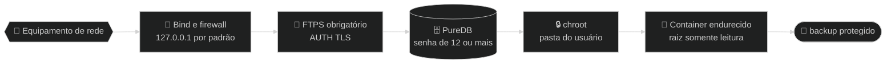

# 🔐 Segurança — allsafe-ftp-stack

↩ [README do projeto](../README.md) · [📚 Índice da documentação](README.md)

## 💡 Em poucas palavras

O backup de um equipamento de rede traz senhas e a configuração inteira da rede, então o caminho até o servidor é protegido em camadas: a porta só escuta no IP escolhido, a conexão tem de ser criptografada, cada usuário fica preso na própria pasta e o container roda com o mínimo de permissões. Se uma camada falhar, as outras continuam valendo. O painel web segue a mesma ideia: só HTTPS, só rede interna, uma senha forte e sessão curta.

<!-- diagrama: diagramas/seguranca-diagrama.mmd -->


<sub>📐 Nível 1 · Diagrama · 🔍 aproximar e mover: controles no canto do diagrama · 📁 [fonte](diagramas/)</sub>

**🧭 Sequência:** 📡 Equipamento de rede ➜ 🚪 Bind e firewall ➜ 🔐 FTPS obrigatório ➜ 🗄️ PureDB (senha de 12 ou mais) ➜ 🔒 chroot ➜ 🐳 Container endurecido ➜ 🏁 backup protegido

---

<details>
<summary>🧭 Sumário — clique para expandir</summary>

[🧱 Só em rede privada](#rede-privada) · [🏭 Antes de produção](#o-que-endurecer-antes-de-producao) · [🎯 Modelo de ameaça](#modelo-de-ameaca) · [🌐 Superfície exposta](#superficie-exposta) · [🖥️ Proteções do painel](#painel) · [🧱 Endurecimento do `compose.yaml`](#hardening-do-compose-yaml-linha-a-linha) · [🔑 Gestão de segredos](#gestao-de-segredos)

</details>

---

<a name="rede-privada"></a>

## 🧱 Só em rede privada, atrás de firewall

> ⚠️ **Esta stack não é para a internet.** FTP é um protocolo antigo, o que passa por ele aqui são configurações inteiras de rede, e o painel web administra os usuários. Use **apenas em rede interna**, com IP privado, atrás de firewall.

| Regra | O que fazer |
|---|---|
| IP privado | `FTP_BIND_IP`, `FTP_PUBLIC_IP` e `PAINEL_BIND_IP` só em `10.0.0.0/8`, `172.16.0.0/12`, `192.168.0.0/16` ou `127.0.0.1`. Nunca `0.0.0.0`, nunca IP público |
| Firewall do host | Liberar a porta de controle e a faixa passiva **só** para as redes internas que enviam backup, e a porta do painel **só** para as máquinas de quem administra; o resto é descartado |
| Redes do painel | `PAINEL_REDES_PERMITIDAS` reduzida à rede de administração; a lista só aceita rede privada |
| Firewall de borda | Nenhum redirecionamento de porta da internet para este host |
| Acesso de fora | Se alguém de fora precisar chegar, é por VPN até a rede interna, não abrindo a porta |

<details>
<summary>🔬 Detalhe técnico — firewall com Docker</summary>

O Docker publica as portas por regras próprias de NAT, **antes** das cadeias `INPUT` do host: uma regra comum de `ufw` ou de `INPUT` não bloqueia porta publicada por container. A cadeia certa é a `DOCKER-USER`, e a porta de destino tem de ser conferida pela conexão original, porque ali o destino já foi trocado para a porta do container.

Exemplo com `iptables`, liberando só a rede de gerência `10.10.0.0/24` na interface `eth0` (troque pelos valores reais):

```bash
iptables -I DOCKER-USER -i eth0 -p tcp -m conntrack --ctdir ORIGINAL --ctorigdstport 21 ! -s 10.10.0.0/24 -j DROP
iptables -I DOCKER-USER -i eth0 -p tcp -m conntrack --ctdir ORIGINAL --ctorigdstport 30000:30049 ! -s 10.10.0.0/24 -j DROP
iptables -I DOCKER-USER -i eth0 -p tcp -m conntrack --ctdir ORIGINAL --ctorigdstport 8443 ! -s 10.10.0.0/24 -j DROP
```

**Resultado esperado:** de uma máquina fora de `10.10.0.0/24`, as portas `21/tcp` e `8443/tcp` não respondem; de dentro, o login por FTPS e o painel funcionam.

> 📌 O exemplo **não foi aplicado nem testado neste projeto**: o firewall do host é de quem opera o servidor. Teste em janela de manutenção e torne a regra persistente com a ferramenta da sua distribuição.

Além do firewall, o `deploy.sh` e os containers **recusam por código** bind, IP anunciado e rede permitida fora de IP privado: veja [🌐 Rede e portas](configuracao.md#rede-e-portas) e [🖥️ Painel web](configuracao.md#painel).

</details>

---

<a name="o-que-endurecer-antes-de-producao"></a>

## 🏭 Antes de produção

1. **Certificado real** no lugar do autoassinado: [🧰 Operação](operacao.md#certificado-real-de-producao).
2. `FTP_BIND_IP` com o IP **privado** dedicado e **regra no firewall** do host liberando só as origens de backup: [🧱 rede privada](#rede-privada).
3. **Painel:** trocar a senha inicial ([🔑 Segredos](segredos.md#senha-do-painel)), reduzir `PAINEL_REDES_PERMITIDAS` à rede de administração e liberar a porta do painel no firewall só para ela. Em `PAINEL_BIND_IP=127.0.0.1` o painel só abre no próprio servidor.
4. `fail2ban` no host lendo o log CLF do container (`docker logs allsafe-ftp`).
5. Rever `FTP_MAX_CLIENTS` e a faixa passiva conforme o número real de equipamentos: [🎚️ Perfis](perfis.md).
6. Backup de `DATA_DIR/dados` e `DATA_DIR/auth`: [🧰 Operação](operacao.md#backup-dos-volumes).
7. Avaliar `FTP_TLS_MODE=3`, que obriga a criptografia também do arquivo: [⚙️ Configuração](configuracao.md#tls).
8. Considerar SFTP (`allsafe-sftp-stack`) onde o equipamento suportar: canal único, sem faixa passiva.

**Resultado esperado:** `./deploy.sh --size <perfil> --check-only` responde `OK` com os valores de produção e, de fora da rede de gerência, as portas `21/tcp` e a do painel não respondem.

---

<a name="modelo-de-ameaca"></a>

## 🎯 Modelo de ameaça

| Nº | Ameaça | Mitigação nesta stack |
|---|---|---|
| 1 | Captura de credenciais em trânsito | FTPS **obrigatório** (`FTP_TLS_MODE=2`): sem TLS não há login, então usuário e senha sempre trafegam criptografados |
| 2 | Exposição acidental na internet | Bind em `127.0.0.1` por padrão; produção usa **um IP privado dedicado**, com firewall no host e sem redirecionamento de porta da borda |
| 3 | Fuga do diretório do usuário (_path traversal_) | `chroot` de todos (`-A`); cada usuário preso em `/data/<usuario>` |
| 4 | Uso de contas do sistema para login | Usuários **virtuais** em PureDB e `-u 10000` (UID mínimo). Sem anônimo (`-E`) |
| 5 | Escalonamento a partir do container | `read_only`, `cap_drop: ALL`, `no-new-privileges`, `tmpfs` com `noexec` |
| 6 | Abuso de recursos ou negação de serviço local | `-c` e `-C` (limites de sessão), `pids_limit`, `mem_limit`, `cpus`, `ulimits` |
| 7 | Vazamento de segredo pelo Git ou pela imagem | Senha em `.secrets/*.txt` (ignorado pelo Git) e `.dockerignore`; nunca em `ENV` da imagem. Veja [🔑 Segredos](segredos.md) |
| 8 | Enumeração por DNS reverso ou _fingerprint_ | `-H` (sem resolução reversa) |
| 9 | Adivinhação da senha do painel | Senha inicial de 48 caracteres, guardada só como hash `scrypt`; cinco erros em 15 minutos bloqueiam o endereço (`429`) |
| 10 | Ação forjada no painel (CSRF, _clickjacking_) | Token CSRF por sessão, conferência do `Origin`, cookie `SameSite=Strict`, `frame-ancestors 'none'` e `X-Frame-Options: DENY` |
| 11 | Roubo da sessão do painel | Só HTTPS (TLS 1.2 ou mais novo); cookie `__Host-` com `Secure` e `HttpOnly`; sessão presa ao endereço do cliente, 15 minutos sem uso e teto de 8 horas |
| 12 | Painel exposto fora da rede interna | Bind só em IP privado, lista de redes permitidas e conferência do `Host`; o `deploy.sh` e o container recusam valor público |
| 13 | Painel comprometido atingir o host | Sem socket do Docker, raiz somente leitura, três capabilities, só a biblioteca padrão do Python e nenhum JavaScript |

> ⚠️ **Limite da ameaça nº 1:** no modo `2`, o conteúdo do arquivo só é criptografado se o cliente pedir proteção do canal de dados (`PROT P`). Um equipamento que negocia TLS no login e envia os dados sem proteção é aceito. Só o modo `3` recusa esse caso. A troca do padrão está registrada no plano do projeto.

**Fora de escopo:** proteção de rede (faça ACL no host ou na borda), limitação de tentativas de força bruta **no FTP** (use `fail2ban` no host lendo os logs CLF; o painel tem limite próprio) e antivírus de conteúdo.

---

<a name="superficie-exposta"></a>

## 🌐 Superfície exposta

| Porta | Quem deve alcançar |
|---|---|
| `FTP_PORT` (controle) | Só as sub-redes de gerência dos equipamentos que fazem backup |
| `30000-30049` (dados, passivo) | As mesmas origens da porta de controle |
| `PAINEL_PORT` (painel, HTTPS) | Só as máquinas de quem administra a stack |

Todo o resto fica interno aos containers. A gestão dos usuários é pelo [painel](painel.md) ou por linha de comando, com [`manage-user.sh`](../manage-user.sh).

---

<a name="painel"></a>

## 🖥️ Proteções do painel

| Proteção | Como funciona |
|---|---|
| Só rede interna | Recusa o cliente fora de `PAINEL_REDES_PERMITIDAS` com `403`, antes de qualquer tela, e o pedido com `Host` que não seja IP privado, `localhost` ou o `PAINEL_CERT_CN` com `400` |
| Só HTTPS | Não responde a HTTP puro; aceita TLS 1.2 ou mais novo |
| Uma senha, só como hash | `scrypt` em `.secrets/painel_password_hash.txt`; o container nunca vê a senha em texto |
| Limite de tentativas | Cinco senhas erradas em 15 minutos bloqueiam o endereço do cliente |
| Sessão curta | 15 minutos sem uso (`PAINEL_SESSAO_MINUTOS`) e teto de 8 horas; presa ao endereço do cliente; encerrada em `🚪 Sair` e quando o painel reinicia |
| Formulário protegido | Token CSRF por sessão e conferência do `Origin` em todo envio |
| Página fechada | Sem JavaScript, sem conteúdo de terceiros, sem ser embutida em outra página (`Content-Security-Policy`) |
| Auditoria | Cada entrada, saída e mudança de usuário vai para `DATA_DIR/painel/auditoria.log`, sem senha |
| Usuário inicial preservado | O `FTP_USER` não pode ser alterado nem removido pelo painel |

O que cada proteção significa na prática e o fluxograma da decisão: [🖥️ Painel web](painel.md#protecoes).

> 📌 Tudo acima foi conferido no portão de validação da versão `0.3.0`, em instância de teste. O firewall do host continua sendo de quem opera o servidor.

---

<a name="hardening-do-compose-yaml-linha-a-linha"></a>

## 🧱 Endurecimento do `compose.yaml`

Os dois containers sobem sem `privileged`, sem `docker.sock` e sem `network_mode: host`. O detalhe de cada linha do [`compose.yaml`](../compose.yaml) está abaixo.

<details>
<summary>🔬 Detalhe técnico — cada diretiva e o motivo</summary>

| Diretiva | Por quê |
|---|---|
| `read_only: true` | Raiz imutável; só os volumes e `tmpfs` são graváveis |
| `tmpfs: /run, /tmp` com `noexec,nosuid,nodev` | Áreas temporárias sem execução de binário nem `setuid` |
| `cap_drop: [ALL]` | Zera privilégios e devolve só o mínimo (tabela seguinte) |
| `security_opt: [no-new-privileges:true]` | Impede ganho de privilégio por `setuid` ou `setgid` depois do início |
| `pids_limit` | Barreira contra _fork bomb_ |
| `mem_limit` e `cpus` | Contém o consumo; evita afetar vizinhos no host |
| `ulimits.nofile` | Teto de descritores de arquivo |
| `init: true` | `tini` como processo 1: recolhe processos zumbis e repassa os sinais |
| `stop_grace_period: 20s` | Deixa transferências em curso terminarem no `down` |
| `logging: local` (10 MB × 3) | Log rotacionado, sem encher o disco |
| `restart: unless-stopped` | Volta depois de reiniciar o host, respeita `stop` manual |

</details>

<details>
<summary>🔬 Detalhe técnico — <code>cap_add</code>: por que cada uma</summary>

O `pure-ftpd` sobe como `root`, aplica `chroot` e **troca** para um usuário sem privilégio por sessão. Isso exige:

| Capability | Uso |
|---|---|
| `SYS_CHROOT` | `chroot()` de cada sessão |
| `SETUID` e `SETGID` | Descer para o uid e gid do usuário virtual |
| `CHOWN` e `FOWNER` | Ajustar dono e permissão dos diretórios criados (`-j`) |
| `DAC_OVERRIDE` e `DAC_READ_SEARCH` | Ler e gravar nos diretórios dos usuários independentemente do bit de permissão |
| `NET_BIND_SERVICE` | Reservada; o serviço escuta em `2121` (não privilegiada), mas a capability cobre cenários com o FTP interno em porta abaixo de `1024` |
| `SYS_NICE` | Prioridade de I/O das transferências |
| `AUDIT_WRITE` | Registro de login (PAM e utmp) sem erro |

Nenhuma delas permite montar sistema de arquivos, carregar módulo, usar `ptrace` ou acessar `/dev`.

</details>

<details>
<summary>🔬 Detalhe técnico — o serviço <code>painel</code></summary>

O painel usa as mesmas diretivas do `ftp` (`read_only`, `tmpfs`, `cap_drop: [ALL]`, `no-new-privileges`, `init`, `logging`), com limites menores: `192M` de memória, `0.5` CPU e `64` processos. Só inicia depois de o `ftp` ficar `healthy`.

| Capability | Uso |
|---|---|
| `CHOWN` | Entregar ao `ftpdata` a pasta do usuário criado e ajustar o dono de `/painel` |
| `FOWNER` | Ajustar a permissão da pasta do usuário depois de entregue ao `ftpdata` |
| `DAC_OVERRIDE` | Ler o tamanho das pastas dos usuários, que pertencem ao `ftpdata` com modo `0750` |

O painel **não** tem `SYS_CHROOT`, `SETUID`, `SETGID` nem `NET_BIND_SERVICE`: escuta em `8443`, porta não privilegiada. Não monta `DATA_DIR/certs`: a chave privada do FTP fica fora do alcance dele. Para mostrar a impressão digital, lê `ftp-cert.pem`, a cópia **sem a chave** que o entrypoint do FTP grava em `DATA_DIR/auth`.

</details>

---

<a name="gestao-de-segredos"></a>

## 🔑 Gestão de segredos

- Senha do usuário inicial: `.secrets/ftp_password.txt`, `chmod 600`, entregue **só** ao serviço `ftp` como o segredo `/run/secrets/ftp_password`, somente leitura. O `.env` não guarda senha. Veja [🔑 Segredos](segredos.md).
- Senha do painel: só o hash `scrypt`, em `.secrets/painel_password_hash.txt`, entregue **só** ao serviço `painel` como `/run/secrets/painel_password_hash`. A senha inicial em texto (`painel_password.txt`) fica no host e é apagada na primeira troca.
- [`.gitignore`](../.gitignore): `.env` e `.secrets/*.txt` (mantém só `.secrets/.gitkeep`, para a pasta existir no clone).
- [`.dockerignore`](../.dockerignore): `.env`, `.env.example`, `.git`, `.gitignore`, `.secrets`, `doc`, `profiles`, `README.md`, `deploy.sh` e `manage-user.sh`. `*.pdf` também fica fora. Chegam ao build o `Dockerfile`, o `compose.yaml`, o `CHANGELOG.md`, o `VERSION` e as pastas `scripts/` e `painel/`, e o `Dockerfile` copia só os scripts, o painel e o `VERSION`; nada de segredo entra na imagem.
- O [`entrypoint.sh`](../scripts/entrypoint.sh) recusa senha em variável de ambiente e faz `unset` da variável interna da senha antes do `exec`. O [`painel-entrypoint.sh`](../scripts/painel-entrypoint.sh) recusa `PAINEL_PASSWORD` e `PAINEL_PASSWORD_HASH`.

---

⬅️ [🏗️ Arquitetura](arquitetura.md) · 🏠 [Documentação](README.md) · ➡️ [🔑 Segredos](segredos.md)
