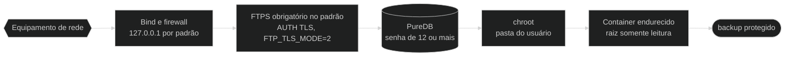
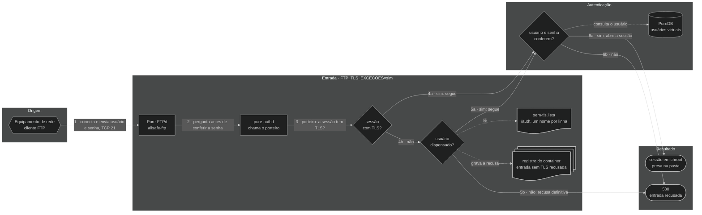

# 🔐 Segurança — allsafe-ftp-stack

↩ [README do projeto](../README.md) · [Índice da documentação](README.md)

## 💡 Em poucas palavras

O backup de um equipamento de rede traz senhas e a configuração inteira da rede, então o caminho até o servidor é protegido em camadas: a porta só escuta no IP escolhido, a conexão tem de ser criptografada (a exceção, para equipamento antigo, é ligada à mão e fica avisada), cada usuário fica preso na própria pasta e o container roda com o mínimo de permissões. Se uma camada falhar, as outras continuam valendo. O painel web segue a mesma ideia: fica atrás de um nginx, só HTTPS, só rede interna, usuário e senha para cada administrador e sessão curta.

<!-- diagrama: diagramas/seguranca-diagrama.mmd -->


<sub>Nível 1 · Diagrama · [fonte](diagramas/)</sub>

**Sequência:** Equipamento de rede ➜ Bind e firewall ➜ FTPS obrigatório no padrão (`FTP_TLS_MODE=2`) ➜ PureDB (senha de 12 ou mais) ➜ chroot ➜ Container endurecido ➜ backup protegido

---

<details>
<summary>Sumário — clique para expandir</summary>

[Só em rede privada](#rede-privada) · [IP público](#ip-publico) · [FTP sem TLS](#ftp-sem-tls) · [TLS por usuário](#tls-por-usuario) · [Antes de produção](#o-que-endurecer-antes-de-producao) · [Modelo de ameaça](#modelo-de-ameaca) · [Superfície exposta](#superficie-exposta) · [Proteções do painel](#painel) · [Sem senha, senha aleatória, exaustão e acesso direto ao cadastro](#sem-senha-e-exaustao) · [Custo das senhas do FTP](#custo-das-senhas) · [Contato de segurança e robôs de busca](#contato-de-seguranca) · [Conformidade com as RFCs](#conformidade-rfc) · [Endurecimento do `compose.yaml`](#hardening-do-compose-yaml-linha-a-linha) · [Gestão de segredos](#gestao-de-segredos)

</details>

---

<a name="rede-privada"></a>

## 🧱 Só em rede privada, atrás de firewall

> ⚠️ **Esta stack não é para a internet.** FTP é um protocolo antigo, o que passa por ele aqui são configurações inteiras de rede, e o painel web administra os usuários. Use **apenas em rede interna**, com IP privado, atrás de firewall. Endereço público só entra por uma opção explícita, com alerta: [IP público](#ip-publico).

| Regra | O que fazer |
|---|---|
| IP privado | `FTP_BIND_IP`, `FTP_PASSIVE_IP` e `PAINEL_BIND_IP` só em `10.0.0.0/8`, `172.16.0.0/12`, `192.168.0.0/16` ou `127.0.0.1`. `0.0.0.0` é sempre recusado; IP público, só com a [opção própria](#ip-publico) |
| Firewall do host | Liberar a porta de controle e a faixa passiva **só** para as redes internas que enviam backup, e a porta do painel **só** para as máquinas de quem administra; o resto é descartado |
| Redes do painel | `PAINEL_REDES_PERMITIDAS` reduzida à rede de administração; por padrão, a lista só aceita rede privada |
| Firewall de borda | Nenhum redirecionamento de porta da internet para este host |
| Acesso de fora | Se alguém de fora precisar chegar, é por VPN até a rede interna, não abrindo a porta |

<details>
<summary>Detalhe técnico — firewall com Docker</summary>

O Docker publica as portas por regras próprias de NAT, **antes** das cadeias `INPUT` do host: uma regra comum de `ufw` ou de `INPUT` não bloqueia porta publicada por container. A cadeia certa é a `DOCKER-USER`, e a porta de destino tem de ser conferida pela conexão original, porque ali o destino já foi trocado para a porta do container.

Exemplo com `iptables`, liberando só a rede de gerência `10.10.0.0/24` na interface `eth0` (troque pelos valores reais):

```bash
iptables -I DOCKER-USER -i eth0 -p tcp -m conntrack --ctdir ORIGINAL --ctorigdstport 21 ! -s 10.10.0.0/24 -j DROP
iptables -I DOCKER-USER -i eth0 -p tcp -m conntrack --ctdir ORIGINAL --ctorigdstport 30000:30049 ! -s 10.10.0.0/24 -j DROP
iptables -I DOCKER-USER -i eth0 -p tcp -m conntrack --ctdir ORIGINAL --ctorigdstport 8443 ! -s 10.10.0.0/24 -j DROP
```

**Resultado esperado:** de uma máquina fora de `10.10.0.0/24`, as portas `21/tcp` e `8443/tcp` não respondem; de dentro, o login por FTPS e o painel funcionam.

> O exemplo **não foi aplicado nem testado neste projeto**: o firewall do host é de quem opera o servidor. Teste em janela de manutenção e torne a regra persistente com a ferramenta da sua distribuição.

Além do firewall, o `deploy.sh` e os containers **recusam por código**, por padrão, bind, IP anunciado e rede permitida fora de IP privado: veja [Rede e portas](configuracao.md#rede-e-portas) e [Painel web](configuracao.md#painel).

</details>

---

<a name="ip-publico"></a>

## 🌐 IP público: só por escolha, com firewall

> ⚠️ **Alerta: ligar esta opção põe o FTP e o painel na internet.** Servidor exposto é varrido e recebe tentativa de senha o tempo todo, e por esta stack passam configurações inteiras de rede. O padrão, `REDE_PERMITIR_IP_PUBLICO=nao`, recusa qualquer endereço público. Ligue só quando não houver como chegar por rede interna ou por VPN, e **só com firewall no servidor**. Sem firewall, o risco é de quem ligou a opção.

A opção existe para o servidor que só tem endereço público, como uma VPS, e para o equipamento que chega por um endereço fora das faixas privadas, como o do CGNAT (`100.64.0.0/10`).

**Antes de ligar, nesta ordem:**

1. **Firewall no servidor**, na cadeia `DOCKER-USER`, liberando a porta de controle, a faixa passiva e a porta do painel **só** para os endereços dos equipamentos e de quem administra. O exemplo está em [rede privada](#rede-privada): troque a rede de gerência pelos endereços reais.
2. **TLS obrigatório:** `FTP_TLS_MODE` em `2` ou `3`. Com a opção ligada, `0` e `1` são recusados.
3. **Senhas geradas**, nunca escolhidas: as que o `deploy.sh` cria e as que o painel gera.
4. **`PAINEL_REDES_PERMITIDAS` reduzida** às redes de quem administra, uma a uma.
5. No `.env`, `REDE_PERMITIR_IP_PUBLICO=sim` e os endereços; depois, confira e aplique:

```bash
./deploy.sh --check-only
./deploy.sh
```

**Resultado esperado:** o `--check-only` termina com `OK: perfil '<perfil>', endereço público aceito, recursos do servidor e compose validados; nada foi alterado.`, seguido do `ALERTA: REDE_PERMITIR_IP_PUBLICO=sim: a stack aceita endereço público.` O `deploy.sh` sobe os três containers e fecha com o mesmo `ALERTA`, que também fica no registro de cada container e no painel: na tela de entrada, no rodapé e na linha **Endereço público** da aba Segurança.

| Com a opção ligada | O que acontece |
|---|---|
| IP público em `FTP_BIND_IP`, `FTP_PASSIVE_IP`, `PAINEL_BIND_IP` e `PAINEL_CERT_CN` | Aceito, se for IPv4 de servidor (primeiro octeto de `1` a `223`) |
| Rede pública em `PAINEL_REDES_PERMITIDAS` | Aceita, com prefixo de `/8` a `/32` |
| `0.0.0.0`, multicast e endereços reservados | Recusados: o endereço é sempre escolhido, nunca "todos" |
| Rede mais larga que `/8`, como `0.0.0.0/0` | Recusada |
| `FTP_TLS_MODE` em `0` ou `1` | Recusado |
| Valor diferente de `nao` e de `sim` | Recusado antes de qualquer outra conferência |

<details>
<summary>Detalhe técnico — onde a opção é conferida</summary>

- A variável chega aos três containers pelo [`compose.yaml`](../compose.yaml) e é lida pelas mesmas funções de [`scripts/rede-privada.sh`](../scripts/rede-privada.sh) no [`deploy.sh`](../deploy.sh) e nos três entrypoints: `conferir_opcao_ip_publico`, `exigir_ip`, `exigir_rede` e `aviso_ip_publico`. O painel confere de novo em [`painel/config.py`](../painel/config.py).
- Valor fora de `nao` e de `sim` para tudo com `FALHA: REDE_PERMITIR_IP_PUBLICO deve ser 'nao' ou 'sim'`: nenhum valor é tratado como `sim` por aproximação.
- Com a opção ligada, o painel aceita ser aberto por qualquer endereço IPv4 digitado no lugar do nome; por nome, continua valendo só `localhost` e o `PAINEL_CERT_CN`.
- O limite de tentativas de senha, a sessão curta e os limites de pedidos do nginx continuam valendo, mas não substituem o firewall: reduzem a velocidade do ataque, não a exposição.
- As recusas e o alerta são conferidos pela [bateria de testes](scripts.md#testar); as mensagens estão em [Solução de problemas](solucao-de-problemas.md#o-container-nao-sobe).

</details>

---

<a name="ftp-sem-tls"></a>

## ⚠️ FTP sem TLS: só para equipamento antigo

> ⚠️ **O padrão desta stack é TLS obrigatório (`FTP_TLS_MODE=2`). Os modos `0` e `1` desligam essa proteção.** Eles existem só porque há equipamento de rede antigo que não fala TLS e, sem isso, não conseguiria enviar o backup. Com eles, usuário, senha e arquivo passam em **texto puro**: quem estiver no caminho da rede lê tudo.

| Modo | O que acontece | O que fica exposto |
|---|---|---|
| `FTP_TLS_MODE=0` | O servidor **não oferece TLS**. Todo cliente entra em texto puro; quem exige TLS não consegue conectar | Usuário, senha e conteúdo de **todos** os backups, de todos os equipamentos |
| `FTP_TLS_MODE=1` | O TLS é **opcional**. Quem pede TLS usa; quem não pede entra em texto puro | Usuário, senha e backup de quem entra sem TLS. Nada obriga os demais a usar TLS: um equipamento mal configurado passa a enviar em texto puro sem ninguém notar |

O backup de um equipamento de rede costuma trazer senhas, comunidades SNMP e chaves. Com a senha do FTP capturada, o invasor também lê e sobrescreve os backups daquele usuário.

**Só use se todas as condições abaixo forem verdadeiras:**

1. O equipamento realmente não fala TLS: confirme no manual ou com o teste de [Solução de problemas](solucao-de-problemas.md#ftp-sem-tls).
2. O tráfego fica em **rede interna isolada** (rede de gerência), sem passar por rede de usuário, Wi-Fi, internet ou enlace de terceiro sem VPN.
3. O **firewall** libera a porta de controle e a faixa passiva **só para os IPs desses equipamentos**: [rede privada](#rede-privada).
4. Cada equipamento antigo tem **usuário e senha só dele**, não usados em nenhum outro lugar. O `chroot` limita o estrago à pasta daquele usuário.
5. Há data para voltar ao `2`: quando o equipamento for trocado ou atualizado, o modo volta e as senhas que passaram em texto puro são trocadas.

Há quatro caminhos para o equipamento que não fala TLS. Prefira de cima para baixo:

| Caminho | Quem entra sem TLS | O que os demais arriscam |
|---|---|---|
| Segunda instância só para os equipamentos antigos, com a principal em `2`: [Configuração](configuracao.md#pastas-e-nomes) | Só os usuários da segunda instância | Nada: a principal recusa a sessão sem TLS antes de a senha ser enviada |
| Exceção por usuário (`FTP_TLS_EXCECOES=sim`): [TLS por usuário](#tls-por-usuario) | Só os usuários que um administrador dispensar | Um equipamento de usuário não dispensado, configurado sem TLS por engano, manda a senha em texto puro antes de ser recusado; a recusa fica no registro |
| `FTP_TLS_MODE=1` | Qualquer usuário cujo equipamento não peça TLS | Nada obriga ninguém a usar TLS |
| `FTP_TLS_MODE=0` | Todos | Não há TLS para ninguém |

A exceção por usuário é o caminho mais simples quando são poucos equipamentos antigos: fica tudo em uma instalação só, com um painel só.

Para ligar o modo `1` ou o `0`, edite `FTP_TLS_MODE` no `.env` e reaplique:

```bash
./deploy.sh
```

**Resultado esperado:** o resumo traz `FTP:    127.0.0.1:21, SEM TLS (texto puro), modo passivo 30000-30049` (ou `TLS explícito opcional (aceita texto puro)` no modo `1`) e termina com o aviso:

```text
AVISO: FTP_TLS_MODE=0: o FTP está SEM criptografia. Senhas e arquivos passam em texto puro e podem ser
       lidos por quem estiver na mesma rede. Use só para equipamento antigo sem suporte a TLS, em rede interna
       isolada, com o firewall liberando só esses equipamentos, e volte para FTP_TLS_MODE=2 assim que puder.
```

A stack não deixa o modo passar despercebido. Enquanto ele estiver ligado, o alerta aparece em:

| Onde | O que aparece |
|---|---|
| Fim do `./deploy.sh` e do `./deploy.sh --check-only` | O `AVISO` de três linhas acima |
| Resumo do `./deploy.sh` | `SEM TLS (texto puro)` ou `TLS explícito opcional (aceita texto puro)` na linha do FTP |
| Registro do container (`docker compose logs ftp`) | A cada subida: `AVISO: FTP_TLS_MODE=0, FTP sem TLS: senhas e arquivos trafegam em texto puro. Só para equipamento sem suporte a TLS, em rede interna isolada.` |
| Painel, telas Visão geral e Segurança | Faixa de alerta no topo e o item `TLS do FTP` marcado com |

O aviso informa, não bloqueia: a decisão é de quem opera o servidor. O painel web **não** é afetado por esta variável e continua só em HTTPS.

<details>
<summary>Detalhe técnico — o que muda no Pure-FTPd</summary>

`FTP_TLS_MODE` é repassada à opção `-Y` do `pure-ftpd`. Com `-Y 0`, o servidor não anuncia `AUTH TLS` e o comando é recusado; com `-Y 1`, aceita as duas formas; com `-Y 2`, recusa a sessão em texto puro com `421-Sorry, cleartext sessions and weak ciphers are not accepted on this server.`; com `-Y 3`, exige também `PROT P` no canal de dados.

O certificado do FTP é gerado em qualquer modo, e as demais camadas continuam valendo: bind em IP privado, usuários virtuais, `chroot`, limites de sessão e container endurecido. O que se perde é o sigilo e a integridade do que trafega.

Um valor fora de `0` a `3` é recusado duas vezes: pelo [`deploy.sh`](../deploy.sh), antes de qualquer alteração, e pelo [`ftp/entrypoint.sh`](../ftp/entrypoint.sh), com `FALHA: FTP_TLS_MODE deve ser 0, 1, 2 ou 3`.

</details>

---

<a name="tls-por-usuario"></a>

## 🔓 TLS por usuário

Com `FTP_TLS_EXCECOES=sim`, o servidor continua exigindo TLS de todos, menos dos usuários que um administrador dispensar, um a um. Serve para o servidor em que um ou dois equipamentos antigos não falam TLS e os demais falam. O padrão é `nao`: ninguém é dispensado.

> ⚠️ **O usuário dispensado manda senha e arquivo em texto puro**, como nos modos `0` e `1`. Valem para ele as cinco condições de [FTP sem TLS](#ftp-sem-tls): equipamento que não fala TLS, rede interna isolada, firewall liberando só ele, usuário e senha só dele e data para acabar.

1. No `.env`, mantenha `FTP_TLS_MODE=2` e `REDE_PERMITIR_IP_PUBLICO=nao` e defina `FTP_TLS_EXCECOES=sim`.
2. Reaplique:

   ```bash
   ./deploy.sh
   ```

3. No painel, abra Usuários ➜ **Dispensar TLS** na linha do usuário do equipamento antigo e confirme. Pelo terminal, o mesmo:

   ```bash
   ./manage-user.sh tls-dispensar <usuario>
   ```

**Resultado esperado:** o resumo do `./deploy.sh` traz `TLS explícito obrigatório no login, com exceção por usuário` na linha do FTP; o usuário dispensado entra sem TLS na entrada seguinte, sem reiniciar nada; os demais, sem TLS, recebem `530` e continuam entrando com TLS.

Para voltar a exigir o TLS de um usuário: Usuários ➜ **Exigir TLS**, ou `./manage-user.sh tls-exigir <usuario>`, e troque a senha dele, que passou em texto puro. Para desligar a exceção inteira: `FTP_TLS_EXCECOES=nao` e `./deploy.sh`.

| Situação | O que acontece |
|---|---|
| Usuário dispensado, sem TLS | Entra, preso na pasta dele, como qualquer outro |
| Usuário dispensado, com TLS | Entra: a dispensa permite a entrada sem TLS, não proíbe o TLS |
| Usuário não dispensado, sem TLS | `530`, com a senha certa ou errada, e a recusa vai para o registro do container |
| Usuário removido e criado de novo com o mesmo nome | Não herda a dispensa: volta a ser obrigado a usar TLS |
| O processo que consulta a lista para de responder | O container do FTP encerra e o Docker o sobe de novo; enquanto isso, ninguém entra |
| `FTP_TLS_EXCECOES` volta para `nao` | Ninguém entra sem TLS; a lista dos dispensados fica guardada e volta a valer se a opção for ligada de novo |

> ⚠️ **Limite:** com a exceção ligada, o servidor só sabe quem é o usuário depois de receber o nome, então aceita o começo da conversa sem TLS de qualquer um. Um equipamento de usuário **não dispensado** que esteja configurado sem TLS manda a senha em texto puro antes de receber o `530`. A entrada é recusada e o registro traz o usuário e a origem: troque essa senha e corrija o equipamento. Com `nao`, o padrão, a sessão sem TLS é recusada antes de a senha ser enviada.

Enquanto a exceção estiver ligada, ela aparece em:

| Onde | O que aparece |
|---|---|
| Fim do `./deploy.sh` e do `./deploy.sh --check-only` | `AVISO: FTP_TLS_EXCECOES=sim: os usuários marcados na aba Usuários do painel entram SEM TLS, com senha e arquivos em texto puro` e as linhas seguintes |
| Resumo do `./deploy.sh` | `com exceção por usuário` na linha do FTP |
| Registro do container (`docker compose logs ftp`) | A cada subida, o `AVISO` com a quantidade de usuários dispensados; a cada recusa, `porteiro: entrada sem TLS recusada: usuario=<nome> origem=<ip> (a senha enviada passou em texto puro: troque-a)` |
| Painel, aba Usuários | A coluna **TLS**, com `obrigatório` ou `sem TLS` em cada linha |
| Painel, abas Visão geral e Segurança | Com pelo menos um usuário dispensado, a faixa de alerta no topo, com a quantidade e os nomes; na aba Segurança, o item `TLS do FTP` |
| Painel, aba Atividade | `Usuário dispensado do TLS` e `Usuário volta a exigir TLS`, com o administrador que fez |

<details>
<summary>Fluxograma da entrada com a exceção ligada, com a sequência escrita — clique para expandir</summary>

<!-- diagrama: diagramas/tls-por-usuario-fluxograma.mmd -->


<sub>Nível 2 · Mapa · [fonte](diagramas/)</sub>

| Nº | De ➜ Para | O que acontece |
|---|---|---|
| 1 | Equipamento de rede ➜ Pure-FTPd | O equipamento conecta na porta `21/tcp` e envia usuário e senha, com ou sem TLS |
| 2 | Pure-FTPd ➜ pure-authd | Antes de conferir a senha, o servidor pergunta ao `pure-authd` se a entrada pode seguir |
| 3 | pure-authd ➜ sessão com TLS? | O `pure-authd` chama o porteiro (`allsafe-ftp-porteiro-tls`), que olha se a sessão está criptografada |
| 4a | sessão com TLS? ➜ usuário e senha conferem? | Sim: segue para a conferência da senha, qualquer que seja o usuário |
| 4b | sessão com TLS? ➜ usuário dispensado? | Não: o porteiro procura o nome na lista dos dispensados |
| 5a | usuário dispensado? ➜ usuário e senha conferem? | Sim: segue para a conferência da senha |
| 5b | usuário dispensado? ➜ 530 | Não: recusa definitiva, com a senha certa ou errada |
| 6a | usuário e senha conferem? ➜ sessão em chroot | Sim: a sessão abre, presa na pasta do usuário |
| 6b | usuário e senha conferem? ➜ 530 | Não: `530 Login authentication failed` |

**Apoio**

| Quem | Usa | Como |
|---|---|---|
| usuário dispensado? | `sem-tls.lista` (`DATA_DIR/auth`) | lê a cada entrada |
| usuário dispensado? | registro do container | grava a recusa, com o usuário e a origem, sem a senha |
| usuário e senha conferem? | PureDB | consulta o usuário |

</details>

<details>
<summary>Detalhe técnico — como a exceção é aplicada</summary>

- **Dois processos:** com `sim`, o [`ftp/entrypoint.sh`](../ftp/entrypoint.sh) sobe o `pure-authd -s /run/pure-authd.sock -r /usr/local/sbin/allsafe-ftp-porteiro-tls` e o `pure-ftpd` com `-l extauth:/run/pure-authd.sock -l puredb:/auth/pureftpd.pdb -Y 1`. O `-Y 1` faz o servidor aceitar sessão com e sem TLS; quem decide a entrada sem TLS é o porteiro.
- **O porteiro não confere senha:** o [`ftp/porteiro-tls.sh`](../ftp/porteiro-tls.sh) responde `auth_ok:0` ("não é comigo") quando a sessão tem TLS ou quando o nome está na lista, e o `pure-ftpd` segue para o PureDB, que confere a senha como sempre. Nos outros casos responde `auth_ok:-1`, a recusa definitiva. A senha chega a ele em variável de ambiente e não é lida, gravada nem registrada.
- **A lista:** `/auth/sem-tls.lista` (`DATA_DIR/auth` no host), `0600`, do `root`, um nome por linha. Só o `allsafe-ftp-user` grava, com a mesma trava do cadastro de usuários e por troca de nome do arquivo, para o porteiro nunca ler a lista pela metade. É lida a cada entrada: a mudança vale na entrada seguinte, sem reiniciar.
- **Falha fechada:** sem o `pure-authd`, o `pure-ftpd` cairia direto no PureDB e aceitaria todos sem TLS. Por isso o entrypoint vigia os dois processos: se um sair, escreve `FALHA: o pure-authd saiu: o container encerra para ninguém entrar sem a conferência do TLS por usuário` (ou `o pure-ftpd saiu`), encerra com código `1`, e o `restart: unless-stopped` sobe o container de novo, com os dois. O healthcheck só responde saudável com o soquete do `pure-authd` aberto.
- **Combinações recusadas** pelo [`deploy.sh`](../deploy.sh) e pelos containers do FTP e do painel: valor fora de `nao` e de `sim`; `sim` com `FTP_TLS_MODE` diferente de `2`; `sim` com `REDE_PERMITIR_IP_PUBLICO=sim`.
- **Quem altera a lista:** só um administrador, pelo painel, com token CSRF e origem conferidos, ou quem tem acesso ao Docker do servidor, pelo `manage-user.sh`. Para o usuário do FTP que entra no painel, a tela responde `404`. Com a exceção desligada, a tela também responde `404`.
- O painel confere a senha do usuário do FTP em TLS, pela rede interna da stack, com ou sem a exceção: a dispensa não muda a [entrada dele no painel](painel.md#usuario-ftp).
- As recusas, a queda do `pure-authd` e as combinações são conferidas pela [bateria de testes](scripts.md#testar).

</details>

---

<a name="o-que-endurecer-antes-de-producao"></a>

## 🏭 Antes de produção

1. **Certificado real** no lugar do autoassinado: [Operação](operacao.md#certificado-real-de-producao).
2. `FTP_BIND_IP` com o IP **privado** dedicado e **regra no firewall** do host liberando só as origens de backup: [rede privada](#rede-privada).
3. **Painel:** trocar a senha inicial ([Segredos](segredos.md#senha-do-painel)), reduzir `PAINEL_REDES_PERMITIDAS` à rede de administração e liberar a porta do painel no firewall só para ela. Em `PAINEL_BIND_IP=127.0.0.1` o painel só abre no próprio servidor.
4. `fail2ban` no host lendo o log CLF do container (`docker logs allsafe-ftp`).
5. Rever `FTP_MAX_CLIENTS` e a faixa passiva conforme o número real de equipamentos: [Perfis](perfis.md). Depois de mudar o porte, ou de atualizar uma instalação anterior à `0.18.1`, trocar a senha dos usuários que a aba Segurança lista em `Custo das senhas do FTP`: [Custo das senhas do FTP](#custo-das-senhas).
6. Cópia de segurança agendada e levada para fora do servidor: [Backup e restauração](backup.md#automatica).
7. Conferir que `FTP_TLS_MODE` está em `2` ou `3`. Se um equipamento antigo não falar TLS, siga antes [FTP sem TLS](#ftp-sem-tls) e prefira dispensar só o usuário dele: [TLS por usuário](#tls-por-usuario).
8. Avaliar `FTP_TLS_MODE=3`, que obriga a criptografia também do arquivo: [Configuração](configuracao.md#tls).
9. Considerar SFTP (`allsafe-sftp-stack`) onde o equipamento suportar: canal único, sem faixa passiva.

**Resultado esperado:** `./deploy.sh --size <perfil> --check-only` responde `OK` com os valores de produção e, de fora da rede de gerência, as portas `21/tcp` e a do painel não respondem.

---

<a name="modelo-de-ameaca"></a>

## 🎯 Modelo de ameaça

| Nº | Ameaça | Mitigação nesta stack |
|---|---|---|
| 1 | Captura de credenciais em trânsito | FTPS **obrigatório** no padrão (`FTP_TLS_MODE=2`): sem TLS não há login, então usuário e senha sempre trafegam criptografados. Os modos `0` e `1` abrem mão desta proteção para todos, e a exceção por usuário, só para os usuários dispensados: [FTP sem TLS](#ftp-sem-tls) |
| 2 | Exposição acidental na internet | Bind em `127.0.0.1` por padrão; produção usa **um IP privado dedicado**, com firewall no host e sem redirecionamento de porta da borda |
| 3 | Fuga do diretório do usuário (_path traversal_) | `chroot` de todos (`-A`); cada usuário preso na pasta do cadastro, `/data/<usuario>` ou a pasta escolhida na criação |
| 4 | Uso de contas do sistema para login | Usuários **virtuais** em PureDB e `-u 10000` (UID mínimo). Sem anônimo (`-E`) |
| 5 | Escalonamento a partir do container | `read_only`, `cap_drop: ALL`, `no-new-privileges`, `tmpfs` com `noexec` |
| 6 | Abuso de recursos ou negação de serviço local | `-c` e `-C` (limites de sessão), `pids_limit`, `mem_limit`, `cpus`, `ulimits` e o custo da senha do FTP proporcional ao porte |
| 7 | Vazamento de segredo pelo Git ou pela imagem | Senha em `.secrets/*.txt` (ignorado pelo Git) e `.dockerignore`; nunca em `ENV` da imagem. Veja [Segredos](segredos.md) |
| 8 | Enumeração por DNS reverso ou _fingerprint_ | `-H` (sem resolução reversa) |
| 9 | Adivinhação do usuário e da senha do painel | Senha inicial de 48 caracteres, guardada só como hash `scrypt`; a recusa é a mesma para usuário que não existe e para senha errada; cinco erros em 15 minutos bloqueiam o endereço (`429`); antes disso, o nginx limita os pedidos por endereço |
| 10 | Ação forjada no painel (CSRF, _clickjacking_) | Token CSRF por sessão, conferência do `Origin`, cookie `SameSite=Strict`, `frame-ancestors 'none'` e `X-Frame-Options: DENY` |
| 11 | Roubo da sessão do painel | Só HTTPS, fechado no nginx (TLS 1.2 ou 1.3); cookie `__Host-` com `Secure` e `HttpOnly`; sessão presa ao endereço do cliente, 15 minutos sem uso e teto de 8 horas |
| 12 | Painel exposto fora da rede interna | Bind só em IP privado; lista de redes permitidas aplicada pelo nginx e conferida de novo pelo painel; conferência do `Host`; o `deploy.sh` e os containers recusam valor público, a não ser com `REDE_PERMITIR_IP_PUBLICO=sim` |
| 13 | Painel comprometido atingir o host | Sem socket do Docker, raiz somente leitura, três capabilities, só a biblioteca padrão do Python e nenhum JavaScript |
| 14 | Enxurrada de pedidos ou pedido malformado no painel | O nginx recebe primeiro: 20 pedidos por segundo por endereço (rajada de 40), 16 conexões por endereço, pedido de até 16 KiB e prazos de 15 s. O que passa disso recebe `429`, `413` ou `400` sem chegar ao painel |
| 15 | Falha no servidor web exposto | O painel não publica porta nem escuta na rede: só o nginx fica exposto, e ele roda sem root, sem nenhuma capability, com raiz somente leitura, enxergando só `DATA_DIR/nginx` em leitura, sem a senha e sem o hash |
| 16 | Leitura de arquivo fora das pastas dos usuários pela aba Arquivos (_path traversal_, link simbólico) | Caminho conferido parte por parte e aberto em relação à pasta dos dados, só para leitura e sem seguir link simbólico; `..`, caminho absoluto e byte nulo recebem `400`. O banco de usuários, os certificados e o arquivo de administradores ficam em outras pastas, fora do alcance da aba |
| 17 | Arquivo enviado por um equipamento ser executado no navegador de quem administra | Todo download sai como `application/octet-stream` com `Content-Disposition: attachment`, `nosniff` e a `Content-Security-Policy` sem script: o navegador salva, não abre |
| 18 | Pasta de usuário ou pasta nova apontar para fora da pasta dos dados | A pasta tem regra fechada (até 4 níveis, sem `..`, sem barra no início, sem nível começando por ponto), é conferida nível por nível e recusada se passar por link simbólico ou por arquivo; a pasta nova é criada em relação à pasta já aberta, sem seguir link. O painel só cria pasta vazia: não envia, não renomeia e não apaga |
| 19 | Um equipamento alcançar o backup de outro por pasta dividida | O padrão é uma pasta por usuário. Pasta igual, ou uma dentro da outra, só existe por escolha de quem administra, com alerta no cadastro, a marca **dividida** na lista e a linha `Aviso:` no `manage-user.sh` |
| 20 | Usuário do FTP alcançar a administração do painel ou os arquivos de outro usuário | A sessão dele tem tabela de rotas própria, só com a tela Meus arquivos, o download e a saída: tela e formulário de administração respondem `404` e ficam na auditoria (`recusa_papel`). A raiz dele é a pasta do cadastro, e o caminho pedido passa pelas mesmas conferências da aba Arquivos. A sessão acaba quando a senha ou a pasta dele muda, quando ele é removido e quando um administrador passa a ter o mesmo nome |
| 21 | Adivinhação da senha de um usuário do FTP pela tela do painel | Quem confere a senha é o servidor FTP, que atrasa cada recusa de 3 a 6 segundos; cinco erros em 15 minutos bloqueiam o endereço (`429`); só entra quem está nas redes permitidas do painel; nome que também é de administrador só vale com a senha de administrador. `PAINEL_ACESSO_USUARIOS_FTP=nao` desliga esta entrada |
| 22 | Entrada sem TLS de quem não foi dispensado, com a exceção por usuário ligada | A decisão vem antes da conferência da senha: sem TLS só segue o nome que está na lista gravada pelo administrador, e os demais recebem `530` com a senha certa ou errada, com a recusa no registro. Se o processo que consulta a lista parar, o container do FTP encerra em vez de aceitar todos. A opção só liga sobre `FTP_TLS_MODE=2`, nunca com endereço público aceito, e só um administrador altera a lista: [TLS por usuário](#tls-por-usuario) |
| 23 | Leitura do cadastro das senhas sem passar pela entrada (pela web, pelo FTP, por outro container, pelo host) | O cadastro do FTP e o dos administradores guardam só hash (`argon2id` e `scrypt`), em pastas do `root` com modo `0750` e `0700`, fora das pastas dos usuários e fora do que o nginx enxerga; nenhuma rota do painel entrega esses arquivos e nenhuma tela mostra hash; o `chroot` não deixa o usuário do FTP chegar a eles: [o que a bateria tenta](#sem-senha-e-exaustao) |
| 24 | Rajada de senhas erradas no FTP para segurar a entrada de quem tem a senha | Custo do hash proporcional ao porte (`pure-pw -C FTP_MAX_CLIENTS`), limite de sessões por endereço e espera de 3 a 6 segundos em cada recusa: [Custo das senhas do FTP](#custo-das-senhas) |
| 25 | Apagar ou renomear, pelo painel, o que está fora das pastas dos dados, ou apagar backup com um navegador esquecido aberto ou por pedido forjado | O caminho passa pelas mesmas conferências da leitura (`400` para `..`, caminho absoluto e byte nulo; `403` por dentro de link simbólico) e a ação é feita em relação à pasta já aberta. O apagamento não segue link: o link sai, o destino fica. Renomear não muda o item de pasta nem substitui outro. Apagar pede a caixa de confirmação e a senha atual do administrador, além da sessão, do token do formulário e do `Origin`; a senha errada conta para o bloqueio do endereço. A pasta de um usuário do FTP só sai junto com ele. O usuário do FTP não tem essas rotas (`404`) |

> ⚠️ **Limite da ameaça nº 1:** no modo `2`, o conteúdo do arquivo só é criptografado se o cliente pedir proteção do canal de dados (`PROT P`). Um equipamento que negocia TLS no login e envia os dados sem proteção é aceito. Só o modo `3` recusa esse caso. A troca do padrão está registrada no plano do projeto.

> ⚠️ **Limite da ameaça nº 22:** com a exceção ligada, o equipamento de um usuário não dispensado que esteja configurado sem TLS manda a senha em texto puro antes de ser recusado. A stack recusa a entrada e registra o usuário e a origem; a senha tem de ser trocada.

**Fora de escopo:** proteção de rede (faça ACL no host ou na borda), limitação de tentativas de força bruta **no FTP** (use `fail2ban` no host lendo os logs CLF; o painel tem limite próprio) e antivírus de conteúdo.

---

<a name="superficie-exposta"></a>

## 🌐 Superfície exposta

| Porta | Quem deve alcançar |
|---|---|
| `FTP_PORT` (controle) | Só as sub-redes de gerência dos equipamentos que fazem backup |
| Faixa passiva (dados): `30000-30049` no `small`, até `31599` no `extended` | As mesmas origens da porta de controle |
| `PAINEL_PORT` (painel, HTTPS, publicada pelo nginx) | Só as máquinas de quem administra a stack |

Todo o resto fica interno aos containers. O painel não publica porta: quem atende na `PAINEL_PORT` é o nginx. Na `PAINEL_PORT`, o que responde sem usuário e senha é só a tela de entrada, o estilo, a logo e o ícone, o `/saude`, o `/robots.txt` e, quando configurado, o `/.well-known/security.txt`: [Contato de segurança e robôs de busca](#contato-de-seguranca). A gestão dos usuários é pelo [painel](painel.md) ou por linha de comando, com [`manage-user.sh`](../manage-user.sh).

---

<a name="painel"></a>

## 🖥️ Proteções do painel

| Proteção | Como funciona |
|---|---|
| nginx na frente | Só o nginx publica a porta do painel. Ele fecha o HTTPS, confere a rede e a taxa de pedidos e repassa ao painel por um soquete interno; o painel não escuta em porta de rede |
| Só rede interna | O nginx recusa o cliente fora de `PAINEL_REDES_PERMITIDAS` com `403`, antes de chegar ao painel; o painel confere de novo e recusa com `400` o pedido com `Host` que não seja IP privado, `localhost` ou o `PAINEL_CERT_CN` (com `REDE_PERMITIR_IP_PUBLICO=sim`, qualquer endereço IPv4) |
| Só HTTPS | TLS 1.2 ou 1.3. HTTP puro na porta do painel recebe `400` (`pedido não aceito`), sem nenhuma tela |
| Limite de pedidos | 20 pedidos por segundo por endereço, com rajada de 40, e 16 conexões por endereço; acima disso, `429`. Pedido maior que 16 KiB recebe `413` |
| Usuário e senha por administrador | Cada administrador entra com o próprio nome; a senha fica só como hash `scrypt`, em `DATA_DIR/painel/administradores` (`0600`, do `root`); o container nunca vê a senha inicial em texto |
| Entrada que não revela nomes | Usuário que não existe e senha errada recebem a mesma resposta, depois da mesma conta; o nome digitado não vai para a auditoria nem para os logs |
| Limite de tentativas | Cinco erros em 15 minutos, somando entrada recusada, de administrador ou de usuário do FTP, e senha atual recusada, bloqueiam o endereço do cliente, mesmo para a senha certa |
| Usuário do FTP só na pasta dele | Com `PAINEL_ACESSO_USUARIOS_FTP=sim`, o usuário do FTP entra com o nome e a senha do FTP, conferidos pelo próprio servidor FTP na rede interna da stack, em TLS e com o certificado conferido. Ele só navega e baixa na pasta do cadastro: não ganha nada que já não tenha por FTP, e perde o envio e a remoção. Com `FTP_TLS_MODE=0`, essa conferência vai em texto puro, sem sair da rede interna da stack |
| Alteração de administrador confirmada | Criar, trocar senha, trocar nome e remover pedem a senha atual de quem está na sessão; as sessões do administrador alterado são encerradas; ninguém remove a própria conta |
| Sessão curta | 15 minutos sem uso (`PAINEL_SESSAO_MINUTOS`) e teto de 8 horas; presa ao endereço do cliente; encerrada em `🚪 Sair` e quando o painel reinicia |
| Formulário protegido | Token CSRF por sessão e conferência do `Origin` em todo envio; `Referrer-Policy: same-origin` para o navegador informar a origem só ao próprio painel |
| Página fechada | Sem JavaScript, sem conteúdo de terceiros, sem ser embutida em outra página (`Content-Security-Policy`) |
| Arquivos sem envio | A aba Arquivos lê, cria pasta vazia, renomeia e apaga, só dentro de `DATA_DIR/dados`, e não recebe arquivo: caminho que tenta sair da pasta recebe `400`, link simbólico não é seguido (`403`) e o arquivo sai sempre como anexo, nunca aberto no navegador. No máximo 8 downloads ao mesmo tempo, 2 por usuário do FTP, para as telas continuarem respondendo |
| Apagamento confirmado e contido | Apagar arquivo, pasta ou a pasta junto com o usuário pede a caixa de confirmação e a senha atual de quem está na sessão. A pasta é esvaziada pelo descritor dela, sem seguir link simbólico; um pedido apaga até 50.000 itens ou trabalha 20 segundos, e só um apagamento corre por vez, para as telas continuarem respondendo. Pasta de usuário do FTP, ou com a de um usuário dentro, não é renomeada nem apagada pela aba Arquivos (`409`); a remoção do usuário com a pasta é recusada quando outro usuário a alcança |
| Auditoria | Cada entrada, saída, download de arquivo, troca de nome, apagamento e mudança de usuário ou de administrador vai para `DATA_DIR/painel/auditoria.log`, com quem fez, administrador ou usuário do FTP, e sem senha |
| Usuário inicial preservado | O `FTP_USER` não pode ser removido pelo painel. A senha e a pasta dele são trocadas como as dos demais |
| Troca de pasta contida | A pasta nova passa pelas mesmas regras da criação: fica dentro de `DATA_DIR/dados`, link simbólico e arquivo no caminho são recusados (`400`), e nenhum arquivo é movido nem apagado. Só o administrador troca, com sessão e token do formulário |

O que cada proteção significa na prática e o fluxograma da decisão: [Painel web](painel.md#protecoes).

> Tudo acima foi conferido nos portões de validação das versões `0.3.0` (painel), `0.5.0` (nginx na frente), `0.12.0` (administradores), `0.13.0` (aba Arquivos), `0.14.0` (pastas), `0.15.0` (entrada do usuário do FTP), `0.16.0` (TLS por usuário), `0.17.0` (logo e ícone entregues pelo nginx), `0.18.0` (`robots.txt` e `security.txt`), `0.18.1` (sem senha, senha aleatória, exaustão e acesso direto ao cadastro), `0.19.0` (edição de usuário) e `0.20.0` (renomear e apagar pelo painel), em instância de teste. O firewall do host continua sendo de quem opera o servidor.

---

<a name="sem-senha-e-exaustao"></a>

## 🧪 Sem senha, senha aleatória, exaustão e acesso direto ao cadastro

Quatro perguntas que a bateria de segurança responde a cada versão, em instância de teste:

| Pergunta | O que a bateria tenta | O que acontece |
|---|---|---|
| Abre alguma coisa sem senha? | Todas as rotas do painel, sem cookie e com cookie de sessão inventado, e os comandos do FTP antes do login, com e sem TLS, com senha vazia e sem senha | O painel responde `303` para a tela de entrada, com corpo vazio, e nada é criado. O FTP responde `530` a todo comando. Sem senha só respondem a tela de entrada, o estilo, a logo e o ícone, o `/saude`, o `/robots.txt` e, quando configurado, o `/.well-known/security.txt` |
| Abre com senha aleatória? | Senhas sorteadas no FTP e no painel, com nome de administrador, de usuário do FTP e nome que não existe | Nenhuma entra. No painel, o quinto erro em 15 minutos bloqueia o endereço (`429`), inclusive para a senha certa, e a recusa bloqueada não gasta conferência de senha. No FTP, cada recusa custa de 3 a 6 segundos de espera e uma das sessões que o endereço pode abrir |
| Dá para derrubar por exaustão? | Senhas erradas ao mesmo tempo até o limite de sessões do endereço, 300 pedidos em rajada, 300 conexões paradas, conexões que mandam o pedido pela metade, 60 conexões de FTP de uma vez, pedidos grandes e malformados | Os três containers continuam `healthy`, sem reinício. O nginx recusa o excesso com `429`, fecha a conexão parada em 15 segundos e devolve `413`, `414`, `400`, `431`, `405` ou `501` ao pedido fora da regra. O FTP aceita as sessões do limite por endereço e recusa as demais com `421`. Quem tem a senha certa continua entrando durante a rajada |
| Dá para ler o cadastro das senhas sem passar pela entrada? | Os arquivos do cadastro, dos segredos, do `.env`, do Git e da chave do TLS pedidos pela web, sem sessão e com sessão de administrador; os mesmos arquivos pedidos por FTP por um usuário com a senha certa; a leitura pelos outros containers e por um usuário comum do host | Pela web, `303`, `404` ou `400`, e nenhuma tela mostra hash. Pelo FTP, `550`: o usuário não sai da pasta dele. O nginx não enxerga o cadastro, o painel não publica porta, e as pastas do cadastro são do `root`, fechadas para os outros usuários do host |

**Resultado esperado:** `./tests/testar.sh` termina com `Bateria aprovada`, e o resultado da bateria de segurança traz os casos 69 a 80 aprovados, com o que foi medido em cada um. Os casos estão em [`tests/etapas/18-seguranca-ampliada.sh`](../tests/etapas/18-seguranca-ampliada.sh).

<a name="custo-das-senhas"></a>

### Custo das senhas do FTP

A senha de cada usuário do FTP fica gravada como hash `argon2id`. Quanto mais caro o hash, mais tempo leva para testar senhas quem conseguir uma cópia do cadastro, e mais processador o servidor gasta a cada entrada. O `pure-pw` divide a memória da conta pelo número de sessões que o servidor aceita ao mesmo tempo, e a stack passa a ele o `FTP_MAX_CLIENTS` do porte:

| Porte | `FTP_MAX_CLIENTS` | Memória por conferência de senha |
|---|---|---|
| `small` | `50` | 1310 KiB |
| `medium` | `120` | 546 KiB |
| `large` | `300` | 218 KiB |
| `xlarge` | `600` | 109 KiB |
| `extended` | `1200` | 54 KiB |

A senha já gravada não muda de custo sozinha: o custo do porte vale quando ela é trocada. A aba Segurança do painel traz o item `Custo das senhas do FTP`, com os usuários que ainda estão com um custo maior que o atual. Para acertar, troque a senha de cada um na aba Usuários ou com `./manage-user.sh passwd`. A referência é o custo do porte atual, calculado de `FTP_MAX_CLIENTS`.

**Resultado esperado:** na aba Segurança, o item `Custo das senhas do FTP` com `Todas as senhas estão gravadas com o custo do porte atual`.

<details>
<summary>Detalhe técnico — a conta e o que foi medido</summary>

- **Conta:** `pure-pw useradd` e `pure-pw passwd` recebem `-C FTP_MAX_CLIENTS`. A memória do `argon2id` fica em `65536 / FTP_MAX_CLIENTS` KiB, e o número de passadas é escolhido pelo `pure-pw` a cada gravação, pelo tempo que o hash leva naquele momento: por isso ele varia de um usuário para outro. Na máquina de teste, a conferência ficou entre meio segundo e um segundo em todos os portes.
- **Sem a opção**, o `pure-pw` supõe 8 sessões: 8192 KiB e cerca de 3 segundos de processador por conferência. Era assim até a `0.18.0`. Na máquina de teste, 7 senhas erradas ao mesmo tempo, de um só endereço, seguravam por cerca de 50 segundos a entrada de quem tinha a senha certa; com o custo do porte `small`, cerca de 8 segundos.
- **Onde é aplicado:** no [`ftp/entrypoint.sh`](../ftp/entrypoint.sh), para o usuário inicial, e no [`ftp/usuario.sh`](../ftp/usuario.sh), para os usuários criados ou alterados pelo painel e pelo `manage-user.sh`. O serviço `painel` recebe o mesmo `FTP_MAX_CLIENTS` do serviço `ftp` e o repassa ao comando que grava a senha.
- **Aviso do painel:** a aba Segurança lê só o parâmetro de memória de cada linha do cadastro e compara com o do porte, `65536 / FTP_MAX_CLIENTS` KiB, com o mínimo de 8; o hash não sai do arquivo nem aparece na tela.

</details>

> ⚠️ **Limite — menos memória nos portes maiores:** quanto mais sessões o servidor aceita, menos memória cada hash usa, e mais barato fica testar senhas para quem tiver uma cópia do cadastro. O que protege é o cadastro fora de alcance (`0600`, do `root`) e a senha gerada, de 12 caracteres ou mais.

> ⚠️ **Limite — o nome que existe demora mais para ser recusado:** o `pure-ftpd` só confere a senha quando o nome está no cadastro. A espera sorteada antes da recusa, de 3 a 6 segundos, encobre boa parte da diferença, mas quem repete a medida muitas vezes pode chegar a saber se um nome existe. O FTP também não bloqueia endereço por tentativa: libere a porta, no firewall do host, só para os endereços dos equipamentos.

---

<a name="contato-de-seguranca"></a>

## 📮 Contato de segurança e robôs de busca

Dois endereços do painel seguem convenções da web e respondem sem usuário e senha, só para as redes de `PAINEL_REDES_PERMITIDAS`:

| Endereço | O que entrega | Quem entrega | Norma |
|---|---|---|---|
| `/robots.txt` | `User-agent: *` e `Disallow: /`: nada do painel é para indexar | nginx, arquivo [`web/robots.txt`](../web/robots.txt) | RFC 9309 |
| `/.well-known/security.txt` | O e-mail de `SEGURANCA_CONTATO_EMAIL`, a validade e o idioma; `404` com a variável vazia | painel, a cada pedido | RFC 9116 e RFC 8615 |

O `robots.txt` é um pedido, não uma barreira: quem protege o painel é a rede permitida, a senha e a sessão. Ele existe para o buscador que alcançar o endereço, em instalação com IP público, não guardar a tela de entrada; as telas saem também com `noindex, nofollow`.

O `security.txt` diz para quem avisar de uma falha. Como preencher: [Configuração](configuracao.md#contato-de-seguranca). Para quem avisar, o que mandar e quais versões recebem correção: [Política de segurança](../SECURITY.md).

> ⚠️ **Com `REDE_PERMITIR_IP_PUBLICO=sim`, preencha o contato.** Servidor na internet é varrido por pesquisador e por ferramenta automática; sem o arquivo, quem acha uma falha não tem para onde escrever. A aba Segurança do painel mostra o item em alerta enquanto a variável estiver vazia.

<details>
<summary>Detalhe técnico — o que os dois endereços não entregam</summary>

- **Só os dois nomes:** a lista de `/.well-known/`, outro nome dentro dela, `/security.txt` na raiz, o nome em maiúsculas, com sufixo ou com `..` não entregam arquivo: sem sessão, a resposta é a ida para `/entrar` ou `400`.
- **Só leitura:** `POST`, `PUT` e `DELETE` nos dois endereços são recusados, e o envio recusado ao `security.txt` fica na auditoria como origem recusada.
- **As mesmas conferências de sempre:** cliente fora das redes permitidas recebe `403` do nginx, e `Host` que o painel não aceita recebe `400`, antes de qualquer conteúdo.
- **Nada além do contato:** o `security.txt` tem três linhas, sem versão, nome da stack nem caminho; o valor da variável é conferido na instalação e na subida, e quebra de linha, `%`, `<` e `>` são recusados.
- **Sem cookie e sem cache guardado:** o `robots.txt` sai com os cabeçalhos de segurança do nginx e `Cache-Control: no-cache`; o `security.txt`, com os do painel e `Cache-Control: no-store`.
- **Fora da auditoria:** a leitura dos dois não entra em `auditoria.log`; o `robots.txt` nem chega ao painel.

</details>

---

<a name="conformidade-rfc"></a>

## 📚 Conformidade com as RFCs

As RFCs são as normas públicas dos protocolos da internet. A tabela diz o que a stack faz de cada uma. Na coluna Situação, `Atende` é o comportamento medido na instância de teste ou fixado no código e `Parcial` é a norma seguida com um limite conhecido.

| Norma | Assunto | O que a stack faz | Situação |
|---|---|---|---|
| RFC 959 | FTP | Pure-FTPd com usuários virtuais; entrada anônima desligada (`-E`) | Atende |
| RFC 2228 e RFC 4217 | FTP sobre TLS | `AUTH TLS`, `PBSZ` e `PROT` no canal de controle e no de dados; com `FTP_TLS_MODE=2`, o padrão, a entrada sem TLS é recusada | Atende |
| RFC 2389 | Lista de recursos do FTP | `FEAT` devolve os recursos do servidor | Atende |
| RFC 2428 | Modo passivo e ativo estendidos | `EPSV` e `EPRT`, além de `PASV` | Atende |
| RFC 3659 | Extensões do FTP | `MDTM`, `SIZE`, `REST STREAM`, `MLST`, `MLSD` e `TVFS` | Atende |
| RFC 2640 | Nomes de arquivo em UTF-8 no FTP | `UTF8` anunciado no `FEAT` | Atende |
| RFC 8446 e RFC 5246 | TLS 1.3 e TLS 1.2 | O FTP e o painel aceitam só essas duas versões | Atende |
| RFC 8996 | TLS 1.0 e 1.1 fora de uso | As duas versões são recusadas pelo FTP e pelo painel | Atende |
| RFC 5280 | Certificado X.509 | Certificados autoassinados com nome alternativo (`subjectAltName`), SHA-256 e 825 dias: RSA de 3072 bits no FTP, curva P-256 no painel | Atende |
| RFC 9110 | Semântica do HTTP | `GET`, `HEAD` e `POST` atendidos; `303` depois de cada formulário enviado; `411` para envio sem tamanho; `405` ou `501` para os outros métodos | Atende |
| RFC 9110, seção 9.1 | Métodos que todo servidor atende | A norma pede `GET` e `HEAD`: os dois são atendidos em todos os endereços, e o `HEAD` traz o código e os cabeçalhos do `GET`, sem o corpo | Atende |
| RFC 9112 | HTTP/1.1 | O nginx fala HTTP/1.1 com o navegador e com o painel; toda resposta do painel sai com `Content-Length` e `Connection: close` | Atende |
| RFC 6585 | Código `429` | Resposta para quem passa do limite de pedidos ou de tentativas de entrada | Atende |
| RFC 6797 | HTTPS obrigatório (HSTS) | `Strict-Transport-Security: max-age=31536000` em toda resposta; não existe porta HTTP, e HTTP puro na porta do painel recebe `400` | Atende |
| RFC 6265 | Cookie | Um só cookie, `__Host-sessao`, com `Secure`, `HttpOnly`, `Path=/` e sem `Domain`; o `SameSite=Strict` e o prefixo `__Host-` vêm da revisão da norma, ainda em rascunho | Atende |
| RFC 6454 | Origem do pedido | O `Origin` de todo envio tem de ser o endereço do próprio painel; sem `Origin`, vale o `Referer` | Atende |
| RFC 7034 | Página embutida em outra | `X-Frame-Options: DENY` | Atende |
| RFC 6266 e RFC 8187 | Nome do arquivo no download | `Content-Disposition: attachment`, com o nome em ASCII e em UTF-8 | Atende |
| RFC 9116 e RFC 8615 | Contato de segurança | `/.well-known/security.txt` com `Contact`, `Expires` e `Preferred-Languages` | Atende |
| RFC 9309 | Robôs de busca | `/robots.txt` com `User-agent: *` e `Disallow: /` | Atende |
| RFC 9106 | Hash de senha Argon2 | Senha do FTP em `argon2id`, com a memória do porte, abaixo da que a norma recomenda | Parcial |
| RFC 7914 | Hash de senha scrypt | Senha de administrador em `scrypt`, com `N=32768`, `r=8`, `p=1`, 32 MiB por conferência e sal de 16 bytes | Atende |
| RFC 1918 | Endereços privados | A stack só publica em `10.0.0.0/8`, `172.16.0.0/12`, `192.168.0.0/16` e `127.0.0.0/8`, salvo com `REDE_PERMITIR_IP_PUBLICO=sim` | Atende |
| RFC 5737 | Endereços de documentação | Os testes de IP público usam só as faixas reservadas para exemplo, que não pertencem a ninguém | Atende |

Onde cada ponto é explicado: [FTP sem TLS](#ftp-sem-tls), [Proteções do painel](#painel), [Custo das senhas do FTP](#custo-das-senhas), [Contato de segurança e robôs de busca](#contato-de-seguranca) e [Só em rede privada](#rede-privada).

> ⚠️ **Certificado autoassinado:** os dois certificados nascem na instalação e não vêm de uma autoridade certificadora. O cliente FTP e o navegador avisam na primeira conexão: confira a impressão digital, mostrada na aba Segurança do painel, antes de aceitar. O navegador só passa a obedecer ao HSTS depois que o certificado é aceito como confiável.

<details>
<summary>Detalhe técnico — o que foi medido e o que fica fora das RFCs</summary>

Medido em 2026-10-05, em instância de teste, na versão `0.18.4`; os métodos, na `0.18.5`:

- **`FEAT` do FTP, depois do `AUTH TLS`:** `UTF8`, `EPRT`, `IDLE`, `MDTM`, `SIZE`, `MFMT`, `REST STREAM`, `MLST`, `MLSD`, `PRET`, `AUTH TLS`, `PBSZ`, `PROT`, `TVFS`, `ESTA`, `PASV` e `EPSV`. A saudação traz `[privsep] [TLS]` e `No anonymous login`.
- **Versões de TLS:** `openssl s_client` com TLS 1.0 e com TLS 1.1 não fecha a conexão, no FTP nem no painel. Com TLS 1.2, o painel fechou com `ECDHE-ECDSA-AES256-GCM-SHA384` e o FTP com `ECDHE-RSA-CHACHA20-POLY1305`; com TLS 1.3, os dois com `TLS_AES_256_GCM_SHA384`.
- **Métodos:** nas telas do painel e no `security.txt`, `GET` e `HEAD` respondem `200`, o `HEAD` com o `Content-Length` do `GET` e nenhum corpo, e `OPTIONS`, `PUT`, `DELETE` e `PATCH` respondem `501`. No `robots.txt` e no `estilo.css`, entregues pelo nginx, `GET` e `HEAD` respondem `200` e os outros, `405`. `TRACE` responde `405` em todos. O `HEAD` de um arquivo, na aba Arquivos e na tela Meus arquivos, traz o tamanho e o nome e não conta como download.
- **`security.txt` e `robots.txt`:** os dois respondem `200` sem sessão; o primeiro sai como `text/plain; charset=utf-8`, com três linhas.
- **Argon2:** a RFC 9106 recomenda 64 MiB ou mais de memória por hash. O `pure-pw` usa de 54 KiB a 1310 KiB, conforme o porte, para o servidor aguentar muitas entradas ao mesmo tempo: a conta está em [Custo das senhas do FTP](#custo-das-senhas).

Cabeçalhos de segurança que não vêm de RFC, e sim das normas do navegador (W3C e WHATWG): `Content-Security-Policy`, `Permissions-Policy`, `Cross-Origin-Opener-Policy`, `Cross-Origin-Resource-Policy`, `Referrer-Policy` e `X-Content-Type-Options`. Todos saem em toda resposta do painel: [Proteções do painel](#painel).

</details>

---

<a name="hardening-do-compose-yaml-linha-a-linha"></a>

## 🧱 Endurecimento do `compose.yaml`

Os três containers sobem sem `privileged`, sem `docker.sock` e sem `network_mode: host`. O detalhe de cada linha do [`compose.yaml`](../compose.yaml) está abaixo.

<details>
<summary>Detalhe técnico — cada diretiva e o motivo</summary>

| Diretiva | Por quê |
|---|---|
| `read_only: true` | Raiz imutável; só os volumes e `tmpfs` são graváveis |
| `tmpfs: /run, /tmp` com `noexec,nosuid,nodev` | Áreas temporárias sem execução de binário nem `setuid` |
| `cap_drop: [ALL]` | Zera privilégios e devolve só o mínimo (tabela seguinte) |
| `security_opt: [no-new-privileges:true]` | Impede ganho de privilégio por `setuid` ou `setgid` depois do início |
| `pids_limit` | Barreira contra _fork bomb_ |
| `mem_limit` e `cpus` | Contém o consumo; evita afetar vizinhos no host |
| `ulimits.nofile` | Teto de descritores de arquivo |
| `init: true` | `tini` como processo 1: recolhe processos zumbis e repassa os sinais |
| `stop_grace_period: 20s` | Deixa transferências em curso terminarem no `down` |
| `logging: local` (10 MB × 3) | Log rotacionado, sem encher o disco |
| `restart: unless-stopped` | Volta depois de reiniciar o host, respeita `stop` manual |

</details>

<details>
<summary>Detalhe técnico — <code>cap_add</code>: por que cada uma</summary>

O `pure-ftpd` sobe como `root`, aplica `chroot` e **troca** para um usuário sem privilégio por sessão. Isso exige:

| Capability | Uso |
|---|---|
| `SYS_CHROOT` | `chroot()` de cada sessão |
| `SETUID` e `SETGID` | Descer para o uid e gid do usuário virtual |
| `CHOWN` e `FOWNER` | Ajustar dono e permissão dos diretórios criados (`-j`) |
| `DAC_OVERRIDE` e `DAC_READ_SEARCH` | Ler e gravar nos diretórios dos usuários independentemente do bit de permissão |
| `NET_BIND_SERVICE` | Exigida pelo `pure-ftpd` na partida, mesmo com o serviço em `2121` (porta não privilegiada): sem ela o servidor encerra e o container não sobe |
| `SYS_NICE` | Prioridade de I/O das transferências |
| `AUDIT_WRITE` | Registro de login (PAM e utmp) sem erro |

Nenhuma delas permite montar sistema de arquivos, carregar módulo, usar `ptrace` ou acessar `/dev`.

</details>

<details>
<summary>Detalhe técnico — o serviço <code>painel</code></summary>

O painel usa as mesmas diretivas do `ftp` (`read_only`, `tmpfs`, `cap_drop: [ALL]`, `no-new-privileges`, `init`, `logging`), com limites menores: `192M` de memória, `0.5` CPU e `64` processos. Só inicia depois de o `ftp` ficar `healthy`.

| Capability | Uso |
|---|---|
| `CHOWN` | Entregar ao `ftpdata` a pasta do usuário criado e ajustar o dono de `/painel` |
| `FOWNER` | Ajustar a permissão da pasta do usuário depois de entregue ao `ftpdata` |
| `DAC_OVERRIDE` | Ler o tamanho das pastas dos usuários e os arquivos da aba Arquivos, que pertencem ao `ftpdata` com modo `0750`, e renomear e apagar dentro delas |

O painel **não** tem `SYS_CHROOT`, `SETUID`, `SETGID` nem `NET_BIND_SERVICE`, e **não escuta em porta de rede**: atende por um soquete Unix, `/nginx/painel.sock`, que só o root do container e o grupo do nginx abrem (`0660`, dono `0:10001`). O endereço do cliente vem do nginx, em `X-Real-IP`; pedido que chegue ao soquete sem esse cabeçalho, com dois ou com valor que não é IP recebe `400`. Monta `DATA_DIR/dados` com escrita, porque é ele que cria a pasta de cada usuário novo e a pasta pedida na aba Arquivos; a aba abre tudo só para leitura, e a única rota que grava cria uma pasta vazia: nenhuma envia, renomeia ou apaga. Não monta `DATA_DIR/certs`: a chave privada do FTP fica fora do alcance dele. Para mostrar a impressão digital, lê `ftp-cert.pem`, a cópia **sem a chave** que o entrypoint do FTP grava em `DATA_DIR/auth`.

</details>

<details>
<summary>Detalhe técnico — o serviço <code>nginx</code></summary>

O nginx é o único container que publica a porta do painel, e por isso é o mais fechado dos três. Só inicia depois de o `painel` ficar `healthy`.

| Diretiva | Valor | Por quê |
|---|---|---|
| `user` | `10001:10001` | O processo nunca é root: o entrypoint para com `FALHA: o nginx desta stack não roda como root` se for |
| `cap_drop` | `ALL`, sem `cap_add` | Nenhuma capability. A porta interna é a `8443`, não privilegiada |
| `read_only` e `tmpfs` | raiz imutável; `/run/nginx` e `/tmp/nginx` em memória | A configuração é gerada a cada subida em `/run/nginx`, a partir de [`nginx/nginx.conf.modelo`](../nginx/nginx.conf.modelo) |
| Volume | `DATA_DIR/nginx` em `/nginx`, **somente leitura** | É tudo o que ele enxerga: o soquete do painel e a cópia do certificado |
| Limites | `64M` de memória, `0.5` CPU, `32` processos | Um servidor web pequeno não precisa de mais |
| Ambiente | só `TZ` e `PAINEL_REDES_PERMITIDAS` | Não recebe senha, hash nem segredo do Compose |

O que a configuração fixa: TLS 1.2 e 1.3 com cifras ECDHE; só as redes de `PAINEL_REDES_PERMITIDAS`, depois `deny all`; 20 pedidos por segundo por endereço, com rajada de 40; 16 conexões por endereço; pedido de até 16 KiB; prazos de 15 s; `server_tokens off`. O endereço do cliente segue para o painel em `X-Real-IP`, sempre sobrescrito pelo nginx; `X-Forwarded-For` e `Forwarded` vindos do cliente são apagados.

O nginx registra só o que ele mesmo recusa, no formato `ip método caminho código`, sem a consulta da URL e sem cabeçalho: nenhum cookie e nenhuma senha chegam ao registro.

</details>

---

<a name="gestao-de-segredos"></a>

## 🔑 Gestão de segredos

- Senha do usuário inicial: `.secrets/ftp-usuario-inicial-senha.txt`, `chmod 600`, entregue **só** ao serviço `ftp` como o segredo `/run/secrets/ftp_usuario_inicial_senha`, somente leitura. O `.env` não guarda senha. Veja [Segredos](segredos.md).
- Senhas do painel: só o hash `scrypt` de cada administrador, em `DATA_DIR/painel/administradores` (`0600`, do `root`). O hash da senha inicial, em `.secrets/painel-admin-inicial-senha-hash.txt`, é entregue **só** ao serviço `painel` como `/run/secrets/painel_admin_inicial_senha_hash` e serve para criar o primeiro administrador. A senha inicial em texto (`painel-admin-inicial-senha.txt`) fica no host, nunca é montada em container e deve ser apagada depois da troca.
- Chave do certificado do painel: gerada em `DATA_DIR/painel/tls` e copiada a cada subida para `DATA_DIR/nginx/tls`, que o nginx monta somente leitura (chave `0640`, grupo `10001`; pasta `0750`). Veja [Segredos](segredos.md).
- [`.gitignore`](../.gitignore): `.env` e `.secrets/*.txt` (mantém só `.secrets/.gitkeep`, para a pasta existir no clone).
- [`.dockerignore`](../.dockerignore): `.env`, `.env.example`, `.git`, `.gitignore`, `.secrets`, `doc`, `profiles`, `README.md`, `deploy.sh` e `manage-user.sh`. `*.pdf` também fica fora. Chegam ao build o `Dockerfile`, o `compose.yaml`, o `CHANGELOG.md`, o `VERSION` e as pastas `scripts/`, `painel/` e `nginx/`, e o `Dockerfile` copia só os scripts, o painel, a configuração do nginx e o `VERSION`; nada de segredo entra na imagem.
- O [`ftp/entrypoint.sh`](../ftp/entrypoint.sh) recusa senha em variável de ambiente e faz `unset` da variável interna da senha antes do `exec`. O [`painel/entrypoint.sh`](../painel/entrypoint.sh) recusa `PAINEL_PASSWORD` e `PAINEL_PASSWORD_HASH`.

---

⬅️ [Arquitetura](arquitetura.md) · 🏠 [Documentação](README.md) · ➡️ [Segredos](segredos.md)
