# 🔐 Segurança — allsafe-ftp-stack

↩ [README do projeto](../README.md) · [📚 Índice da documentação](README.md)

## 💡 Em poucas palavras

O backup de um equipamento de rede traz senhas e a configuração inteira da rede, então o caminho até o servidor é protegido em camadas: a porta só escuta no IP escolhido, a conexão tem de ser criptografada, cada usuário fica preso na própria pasta e o container roda com o mínimo de permissões. Se uma camada falhar, as outras continuam valendo.

<picture>
  <source media="(prefers-color-scheme: dark)" srcset="diagramas/seguranca-diagrama-escuro.svg">
  
</picture>

📐 Nível 1 · Diagrama · fonte: [seguranca-diagrama.mmd](diagramas/seguranca-diagrama.mmd)

**🧭 Sequência:** 📡 Equipamento de rede ➜ 🚪 Bind e firewall ➜ 🔐 FTPS obrigatório ➜ 🗄️ PureDB (senha de 12 ou mais) ➜ 🔒 chroot ➜ 🐳 Container endurecido ➜ 🏁 backup protegido

---

🧭 Sumário — clique para expandir

[🏭 Antes de produção](#o-que-endurecer-antes-de-producao) · [🎯 Modelo de ameaça](#modelo-de-ameaca) · [🌐 Superfície exposta](#superficie-exposta) · [🧱 Endurecimento do `compose.yaml`](#hardening-do-compose-yaml-linha-a-linha) · [🔑 Gestão de segredos](#gestao-de-segredos)

---

## 🏭 Antes de produção

1. **Certificado real** no lugar do autoassinado: [🧰 Operação](operacao.md#certificado-real-de-producao).
2. `FTP_BIND_IP` com o IP dedicado e **ACL no firewall** do host para as origens de backup.
3. `fail2ban` no host lendo o log CLF do container (`docker logs allsafe-ftp`).
4. Rever `FTP_MAX_CLIENTS` e a faixa passiva conforme o número real de equipamentos: [🎚️ Perfis](perfis.md).
5. Backup dos volumes `allsafe-ftp-data` e `allsafe-ftp-auth`: [🧰 Operação](operacao.md#backup-dos-volumes).
6. Avaliar `FTP_TLS_MODE=3`, que obriga a criptografia também do arquivo: [⚙️ Configuração](configuracao.md#tls).
7. Considerar SFTP (`allsafe-sftp-stack`) onde o equipamento suportar: canal único, sem faixa passiva.

**Resultado esperado:** `./deploy.sh --size <perfil> --check-only` responde `OK` com os valores de produção e, de fora da rede de gerência, a porta `21/tcp` não responde.

---

## 🎯 Modelo de ameaça

| Nº | Ameaça | Mitigação nesta stack |
|---|---|---|
| 1 | Captura de credenciais em trânsito | FTPS **obrigatório** (`FTP_TLS_MODE=2`): sem TLS não há login, então usuário e senha sempre trafegam criptografados |
| 2 | Exposição acidental na internet | Bind em `127.0.0.1` por padrão; produção usa **um IP dedicado** com ACL ou firewall no host |
| 3 | Fuga do diretório do usuário (_path traversal_) | `chroot` de todos (`-A`); cada usuário preso em `/data/<usuario>` |
| 4 | Uso de contas do sistema para login | Usuários **virtuais** em PureDB e `-u 10000` (UID mínimo). Sem anônimo (`-E`) |
| 5 | Escalonamento a partir do container | `read_only`, `cap_drop: ALL`, `no-new-privileges`, `tmpfs` com `noexec` |
| 6 | Abuso de recursos ou negação de serviço local | `-c` e `-C` (limites de sessão), `pids_limit`, `mem_limit`, `cpus`, `ulimits` |
| 7 | Vazamento de segredo pelo Git ou pela imagem | Senha em `.secrets/*.txt` (ignorado pelo Git) e `.dockerignore`; nunca em `ENV` da imagem. Veja [🔑 Segredos](segredos.md) |
| 8 | Enumeração por DNS reverso ou _fingerprint_ | `-H` (sem resolução reversa) |

> ⚠️ **Limite da ameaça nº 1:** no modo `2`, o conteúdo do arquivo só é criptografado se o cliente pedir proteção do canal de dados (`PROT P`). Um equipamento que negocia TLS no login e envia os dados sem proteção é aceito. Só o modo `3` recusa esse caso. A troca do padrão está registrada no plano do projeto.

**Fora de escopo:** proteção de rede (faça ACL no host ou na borda), limitação de tentativas de força bruta (use `fail2ban` no host lendo os logs CLF) e antivírus de conteúdo.

---

## 🌐 Superfície exposta

| Porta | Quem deve alcançar |
|---|---|
| `FTP_PORT` (controle) | Só as sub-redes de gerência dos equipamentos que fazem backup |
| `30000-30049` (dados, passivo) | As mesmas origens da porta de controle |

Todo o resto fica interno ao container. Painel de administração **não existe**: a gestão é por linha de comando, com [`manage-user.sh`](../manage-user.sh).

---

## 🧱 Endurecimento do `compose.yaml`

O container sobe sem `privileged`, sem `docker.sock` e sem `network_mode: host`. O detalhe de cada linha do [`compose.yaml`](../compose.yaml) está abaixo.

🔬 Detalhe técnico — cada diretiva e o motivo

| Diretiva | Por quê |
|---|---|
| `read_only: true` | Raiz imutável; só os volumes e `tmpfs` são graváveis |
| `tmpfs: /run, /tmp` com `noexec,nosuid,nodev` | Áreas temporárias sem execução de binário nem `setuid` |
| `cap_drop: [ALL]` | Zera privilégios e devolve só o mínimo (tabela seguinte) |
| `security_opt: [no-new-privileges:true]` | Impede ganho de privilégio por `setuid` ou `setgid` depois do início |
| `pids_limit` | Barreira contra _fork bomb_ |
| `mem_limit` e `cpus` | Contém o consumo; evita afetar vizinhos no host |
| `ulimits.nofile` | Teto de descritores de arquivo |
| `init: true` | `tini` como processo 1: recolhe processos zumbis e repassa os sinais |
| `stop_grace_period: 20s` | Deixa transferências em curso terminarem no `down` |
| `logging: local` (10 MB × 3) | Log rotacionado, sem encher o disco |
| `restart: unless-stopped` | Volta depois de reiniciar o host, respeita `stop` manual |

🔬 Detalhe técnico — <code>cap_add</code>: por que cada uma

O `pure-ftpd` sobe como `root`, aplica `chroot` e **troca** para um usuário sem privilégio por sessão. Isso exige:

| Capability | Uso |
|---|---|
| `SYS_CHROOT` | `chroot()` de cada sessão |
| `SETUID` e `SETGID` | Descer para o uid e gid do usuário virtual |
| `CHOWN` e `FOWNER` | Ajustar dono e permissão dos diretórios criados (`-j`) |
| `DAC_OVERRIDE` e `DAC_READ_SEARCH` | Ler e gravar nos diretórios dos usuários independentemente do bit de permissão |
| `NET_BIND_SERVICE` | Reservada; o serviço escuta em `2121` (não privilegiada), mas a capability cobre cenários com o FTP interno em porta abaixo de `1024` |
| `SYS_NICE` | Prioridade de I/O das transferências |
| `AUDIT_WRITE` | Registro de login (PAM e utmp) sem erro |

Nenhuma delas permite montar sistema de arquivos, carregar módulo, usar `ptrace` ou acessar `/dev`.

---

## 🔑 Gestão de segredos

- Senha do usuário inicial: `.secrets/ftp_password.txt`, `chmod 600`, montado **somente leitura** em `/run/.secrets/`. Veja [🔑 Segredos](segredos.md).
- [`.gitignore`](../.gitignore): `.env` e `.secrets/*.txt` (mantém só `.secrets/.gitkeep`, para a pasta existir no clone).
- [`.dockerignore`](../.dockerignore): `.env`, `.env.example`, `.git`, `.gitignore`, `.secrets`, `doc`, `profiles`, `README.md`, `deploy.sh` e `manage-user.sh`. Só o `Dockerfile` e a pasta `scripts/` chegam ao build; nada de segredo entra na imagem.
- O [`entrypoint.sh`](../scripts/entrypoint.sh) faz `unset` de `FTP_PASSWORD` e da variável interna da senha antes do `exec`.

---

⬅️ [🏗️ Arquitetura](arquitetura.md) · 🏠 [Documentação](README.md) · ➡️ [🔑 Segredos](segredos.md)
